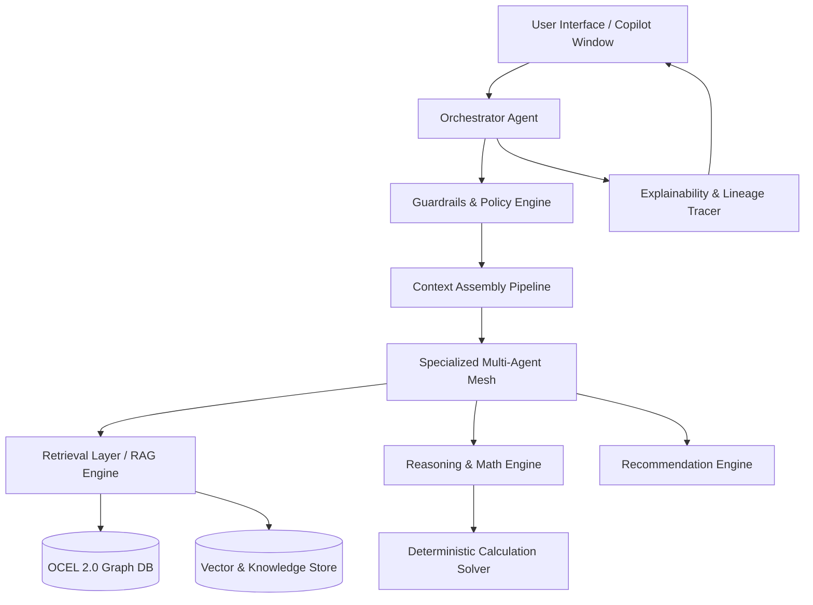
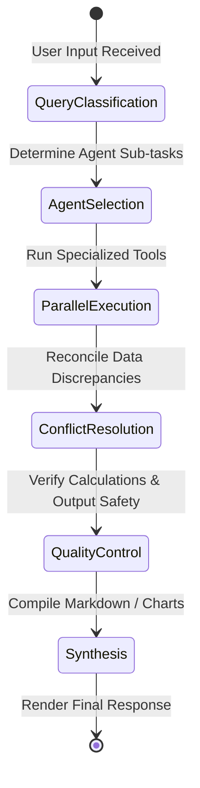
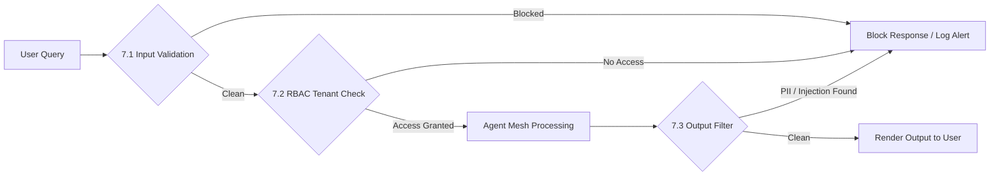
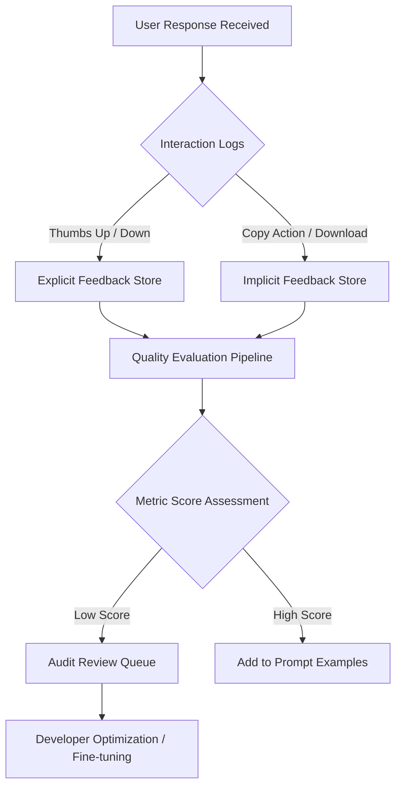
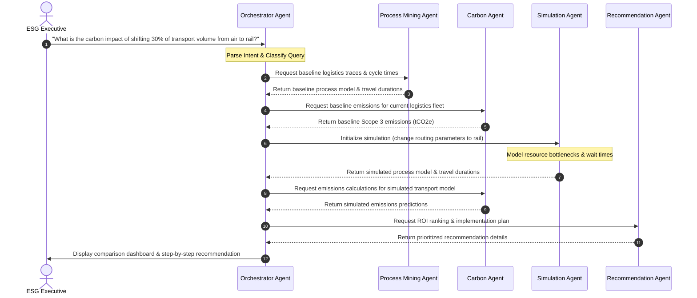

# SustainOCPM — AI Copilot Architecture

## 1. Vision

SustainOCPM is a Carbon-Aware Object-Centric Process Intelligence Platform developed under the Indo-Swiss Research Grant. It combines the disciplines of Object-Centric Process Mining (OCPM) and Carbon Attribution, Sustainability Intelligence, ESG Analytics, Conformance Checking, Business Responsibility and Sustainability Reporting (BRSR), and Decision Intelligence into a single enterprise system.

The AI Copilot is not a bolted-on chatbot. Instead, it serves as the intelligence layer permeating every user interaction, data pipeline, and system decision. The platform integrates:
*   **NotebookLM-style synthesis:** Allows users to query structured process logs alongside unstructured PDF policies, agreements, and standard operating procedures (SOPs).
*   **Palantir AIP-style action networks:** Translates conversational insights into direct, sandboxed actions with built-in human-in-the-loop (HITL) approval gateways.
*   **Domain-specialized ChatGPT:** Acts as an expert on the GHG Protocol Corporate Standard, ISO 14064, and SEBI BRSR guidelines.

SustainOCPM models processes as multi-dimensional graphs of interacting objects (e.g., purchase orders, production batches, physical logistics fleets, Scope 3 supply chain routes) using the **OCEL 2.0** standard. The AI Copilot serves as the primary system interface, allowing executives, sustainability leads, and compliance auditors to query this data graph, simulate operational changes, and generate reports using natural language.



---

## 2. Capabilities

The SustainOCPM AI Copilot supports 11 core capabilities. Each capability is defined below, mapping out its functional bounds, interfaces, inputs, outputs, and edge cases.

### 2.1 Ask Data
*   **What it does:** Allows users to query the underlying Object-Centric Event Log (OCEL 2.0) databases, process models, performance metrics, and carbon attributes using natural language. It translates conversational intent into highly optimized Object Query Language (OQL), SQL, or Cypher queries, executes them securely, and renders the result as interactive charts or natural language answers.
*   **Technical Pipeline:**
    1.  *Intent Analysis:* Parses user query keywords and matches them to active DB tables.
    2.  *OQL/SQL Graph AST Generation:* Generates an Abstract Syntax Tree (AST) representing the structural query parameters.
    3.  *Schema Pruning:* Trims non-relevant tables to keep the LLM context size optimal.
    4.  *OQL Generation:* Writes optimized database query strings based on active table schemas.
    5.  *Validation:* Checks query syntax against security filters to block injection attempts.
    6.  *Execution:* Queries the database and formats outputs into JSON schemas.
*   **Interaction Log Example:**
    *   *User Prompt:* "Show me the top 5 process paths for delivery objects that emit more than 50kg CO2e per item, grouped by vendor."
    *   *Internal Orchestration Trace:*
        *   Classification: DataQuery (Score: 0.98)
        *   Routing Plan: Send to Process Mining Agent & Carbon Agent.
        *   Tool Executed: `run_oql_query("SELECT path, sum(co2e) FROM deliveries JOIN vendors GROUP BY vendor HAVING sum(co2e) > 50 LIMIT 5")`
    *   *Intermediate Data:*
        ```json
        [
          {"vendor": "Zurich Steel Ltd", "path": "Onboard->Ship->Verify", "co2e_avg": 54.2},
          {"vendor": "Mumbai Alloys", "path": "Onboard->Fly->Verify", "co2e_avg": 122.5}
        ]
        ```
    *   *Final Copilot Answer:* "Here are the top process paths exceeding 50kg CO2e per item. Zurich Steel Ltd averages 54.2kg CO2e via standard shipping paths, while Mumbai Alloys averages 122.5kg CO2e due to air transit overrides."
*   **Required Context:** Active database schema (tables, object types, relationships), metric registries (definitions of cycle time, emissions), active dashboard filters, user read permissions.
*   **Accuracy Expectations:** 99% accuracy in generated SQL/OQL syntax; 100% adherence to database access control rules.
*   **Fallback Behavior:** If the query generation confidence is below 85%, the Copilot prompts the user with 3 auto-generated clarification choices mapping to discovered schemas (e.g., "Did you mean delivery emissions or manufacturing emissions?").

### 2.2 Executive Summary
*   **What it does:** Generates high-level briefings, performance summaries, and risk alerts concerning process operations, environmental footprints, and compliance performance.
*   **Technical Pipeline:**
    1.  *Data Ingestion:* Fetches baseline performance metrics and compliance alerts.
    2.  *Outlier Detection:* Identifies metrics exceeding baseline targets.
    3.  *Synthesis:* Compiles findings into structured markdown reports.
*   **Interaction Log Example:*
    *   *User Prompt:* "Summarize ESG metrics variance between plant operations in Germany and India."
    *   *Internal Orchestration Trace:*
        *   Classification: Summarization (Score: 0.95)
        *   Routing Plan: Query ESG Agent for regional metrics.
        *   Tool Executed: `get_regional_kpis(["DE", "IN"], "ESG")`
    *   *Intermediate Data:*
        ```json
        {
          "DE_plant": { "grid_intensity": "0.38 kg/kWh", "water_recycled": "84%" },
          "IN_plant": { "grid_intensity": "0.78 kg/kWh", "water_recycled": "52%" }
        }
        ```
    *   *Final Copilot Answer:* "Executive Summary of Regional ESG Variance: The German plant benefits from a cleaner energy grid (0.38 vs 0.78 kg/kWh) and achieves higher water circularity rates (84% vs 52%) compared to the Indian operations."
*   **Required Context:** Enterprise hierarchy, quarterly targets, historical baseline metrics, threshold violation logs.
*   **Accuracy Expectations:** 95% summarization coverage; zero hallucination of raw metrics (every number must map back to a registered dashboard KPI).
*   **Fallback Behavior:** Fall back to a static KPI report template populated with database-driven numbers, omitting natural language narrative.

### 2.3 Carbon Analysis
*   **What it does:** Conducts detailed carbon attribution analyses, linking Scope 1, 2, and 3 emissions directly to individual process paths, activities, object types, and variants.
*   **Technical Pipeline:**
    1.  *Data Capture:* Extracts activity logs (kilns, fleets, energy usage).
    2.  *Attribution:* Maps emission factors to activity quantities.
    3.  *Verification:* Verifies calculations conform to GHG Protocol rules.
*   **Interaction Log Example:*
    *   *User Prompt:* "Why did our Scope 3 footprint for transport jump by 15% last week?"
    *   *Internal Orchestration Trace:*
        *   Classification: CarbonAudit (Score: 0.99)
        *   Routing Plan: Query Carbon Agent and Process Mining Agent.
        *   Tool Executed: `get_transport_emissions_delta("2026-06-08", "2026-06-15")`
    *   *Intermediate Data:*
        ```json
        {
          "override_events": 12,
          "mode": "air_freight",
          "excess_co2e_tons": 14.5,
          "root_cause": "Material delay at Berlin hub"
        }
        ```
    *   *Final Copilot Answer:* "The 15% increase in Scope 3 transport emissions was driven by 12 shipment overrides routed via air freight (adding 14.5 tCO2e) to bypass parts delays at the Berlin logistics hub."
*   **Required Context:** GHG Protocol Scope 1/2/3 Guidance, active emission factor library mapping, object logistics routes.
*   **Accuracy Expectations:** Calculations must align 100% with ISO 14064-1 standards.
*   **Fallback Behavior:** Uses regional grid averages and sector-level economic input-output (EIO) emission factors when primary data is missing, clearly flags these values as "low confidence estimations."

### 2.4 ESG Analysis
*   **What it does:** Broadens sustainability analysis to cover non-carbon environmental factors (water, waste), social metrics (overtime, safety compliance), and governance requirements (vendor compliance checks, training hours).
*   **Technical Pipeline:**
    1.  *Data Fetch:* Queries employee timesheets, audit files, and environmental sensor records.
    2.  *Compliance Check:* Compares records against local labor and environmental regulations.
    3.  *Scorecarding:* Aggregates values into standard ESG indicators.
*   **Interaction Log Example:*
    *   *User Prompt:* "Are there any social compliance issues in our outsourced warehouse operations?"
    *   *Internal Orchestration Trace:*
        *   Classification: ESGCompliance (Score: 0.97)
        *   Routing Plan: Query ESG Agent for timesheet logs.
        *   Tool Executed: `check_labor_compliance("warehouse_outsource_3")`
    *   *Intermediate Data:*
        ```json
        {
          "violations": 14,
          "detail": "Consecutive shifts exceeding 12 hours",
          "affected_workers": 8
        }
        ```
    *   *Final Copilot Answer:* "Yes. The ESG Agent flagged 14 compliance violations in the outsourced warehouse, where 8 workers logged consecutive shifts exceeding 12 hours, violating local labor laws."
*   **Required Context:** Local labor laws, GRI/SASB indexes, corporate code of conduct policies, supplier ESG audits.
*   **Accuracy Expectations:** 100% precision in flag generation for regulatory violations based on active rules.
*   **Fallback Behavior:** Limits response to known status data and provides an checklist of missing auditing inputs.

### 2.5 Conformance Analysis
*   **What it does:** Flags process deviations, structural non-conformance, and rule violations by comparing discovered object-centric event paths against standard normative process models (BPMN/DMN).
*   **Technical Pipeline:**
    1.  *Alignment Mapping:* Maps event trace paths to BPMN state transitions.
    2.  *Violation Flagging:* Marks paths that bypass validation steps.
    3.  *Impact Assessment:* Estimates cycle time and carbon impacts of deviations.
*   **Interaction Log Example:*
    *   *User Prompt:* "Analyze why our procurement process conformance score dropped to 76%."
    *   *Internal Orchestration Trace:*
        *   Classification: ConformanceAudit (Score: 0.96)
        *   Routing Plan: Route to Process Mining Agent.
        *   Tool Executed: `run_conformance_check("procurement_v3", "normative_BPMN_v1")`
    *   *Intermediate Data:*
        ```json
        {
          "conformance_score": 0.76,
          "bypasses": 240,
          "step": "DualApprovalStep",
          "avg_cycle_time_impact": "4.2 days"
        }
        ```
    *   *Final Copilot Answer:* "The conformance score dropped to 76% because 240 procurement instances bypassed the mandatory 'Dual Approval' step, increasing downstream cycle times by an average of 4.2 days."
*   **Required Context:** Normative BPMN process definitions, compliance rule engines, historical execution traces.
*   **Accuracy Expectations:** Zero false negatives for violations of explicitly modeled rules.
*   **Fallback Behavior:** Runs standard token-replay heuristics to highlight structural flow differences, omitting natural language policy explanations.

### 2.6 BRSR Generation
*   **What it does:** Automates the drafting and compilation of the SEBI Business Responsibility and Sustainability Report (BRSR), specifically focusing on mapping enterprise activity metrics to the BRSR Principal framework (Principles 1 through 9).
*   **Technical Pipeline:**
    1.  *Data Aggregation:* Queries energy, water, labor, and safety values.
    2.  *Mapping:* Populates data points into the SEBI BRSR template.
    3.  *Format Check:* Validates populated tables against the target SEBI XML schema.
*   **Interaction Log Example:*
    *   *User Prompt:* "Generate Draft for Principle 6 (Environment) for the FY 25-26 BRSR."
    *   *Internal Orchestration Trace:*
        *   Classification: ReportGeneration (Score: 0.99)
        *   Routing Plan: Query BRSR Agent, Carbon Agent, and ESG Agent.
        *   Tool Executed: `compile_brsr_principle_data(6, "2025-26")`
    *   *Intermediate Data:*
        ```json
        {
          "water_withdrawn": "14200 KL",
          "scope_1_emissions": "450 tCO2e",
          "recycled_waste": "82%"
        }
        ```
    *   *Final Copilot Answer:* "Draft for BRSR Principle 6 (Environment) completed. Key metrics populated: Water withdrawal of 14,200 KL, Scope 1 emissions of 450 tCO2e, and a waste recycling rate of 82%."
*   **Required Context:** SEBI BRSR guidance document, historical BRSR submissions, current financial year master data.
*   **Accuracy Expectations:** 100% structural conformity to the SEBI reporting template.
*   **Fallback Behavior:** Generates the tables with empty placeholder cells marked with the exact data query needed to fill them, plus instructions on where to look.

### 2.7 Supplier Intelligence
*   **What it does:** Assesses risk, carbon exposure, compliance performance, and process alignment across the entire supply chain network, aggregating multiple tiers of data.
*   **Technical Pipeline:**
    1.  *Relationship Tracing:* Builds the supplier graph from procurement histories.
    2.  *Risk Enrichment:* Imports external ratings (CDP, EcoVadis) and climate hazard data.
    3.  *Scoring:* Computes vendor risk scorecards.
*   **Interaction Log Example:*
    *   *User Prompt:* "Compare the carbon intensity and delivery reliability of Supplier X vs. Supplier Y."
    *   *Internal Orchestration Trace:*
        *   Classification: SupplierComparison (Score: 0.94)
        *   Routing Plan: Query Supplier Agent and Carbon Agent.
        *   Tool Executed: `compare_suppliers("SUPP_X", "SUPP_Y")`
    *   *Intermediate Data:*
        ```json
        {
          "SUPP_X": { "reliability": "94%", "carbon_intensity": "0.42 kg/USD" },
          "SUPP_Y": { "reliability": "82%", "carbon_intensity": "1.25 kg/USD" }
        }
        ```
    *   *Final Copilot Answer:* "Comparison Summary: Supplier X is highly reliable (94% vs 82%) and runs on a cleaner production profile (0.42 vs 1.25 kg CO2e/USD) than Supplier Y."
*   **Required Context:** Supplier locations, geographical risk indexes (climate, water stress, political), supplier contracts.
*   **Accuracy Expectations:** High reliance on verifiable primary ratings; clear isolation of estimated data.
*   **Fallback Behavior:** Relies on generic country-industry default risk ratings, flagging them as general sector estimates.

### 2.8 Scenario Simulation
*   **What it does:** Simulates "what-if" operational and procurement changes (e.g., changing supply routes, changing materials, altering shift structures) to predict carbon, cost, and process performance changes.
*   **Technical Pipeline:**
    1.  *Scenario Set up:* Parses the proposed adjustments.
    2.  *Simulation Run:* Executes the simulation engine to generate new log structures.
    3.  *Delta Analysis:* Compares the simulated run against the current baseline.
*   **Interaction Log Example:*
    *   *User Prompt:* "What happens if we move 40% of steel sourcing from China to India?"
    *   *Internal Orchestration Trace:*
        *   Classification: WhatIfSimulation (Score: 0.98)
        *   Routing Plan: Route to Simulation Agent.
        *   Tool Executed: `run_what_if_scenario({"material": "steel", "shift_pct": 0.4, "from": "CN", "to": "IN"})`
    *   *Intermediate Data:*
        ```json
        {
          "cycle_time_days_delta": -12,
          "emissions_tco2e_delta": 4.5,
          "estimated_cost_delta": -18000
        }
        ```
    *   *Final Copilot Answer:* "Sourcing shift simulation results: Moving 40% of steel sourcing to India reduces average lead times by 12 days and saves $18,000, but increases Scope 3 emissions by 4.5 tCO2e due to coal-heavy local energy grids."
*   **Required Context:** Process simulation engine configuration (execution times, resource costs, capacity constraints), transition matrices.
*   **Accuracy Expectations:** 85% predictive confidence intervals, with sensitivity parameters clearly marked.
*   **Fallback Behavior:** Static analysis showing the theoretical maximum and minimum outcomes, indicating missing simulation parameters.

### 2.9 Research Assistance
*   **What it does:** Queries and summarizes scientific papers, GHG protocol documentation, environmental research databases, and process mining papers to supply users with verified sustainability methodologies.
*   **Technical Pipeline:**
    1.  *Search:* Queries integrated academic libraries.
    2.  *Summary:* Extracts relevant research paragraphs.
    3.  *Verification:* Confirms the validity of cited links and DOIs.
*   **Interaction Log Example:*
    *   *User Prompt:* "What is the consensus on allocating Scope 3 emissions for shared logistics vessels?"
    *   *Internal Orchestration Trace:*
        *   Classification: LiteratureSearch (Score: 0.96)
        *   Routing Plan: Route to Research Agent.
        *   Tool Executed: `search_academic_papers("Scope 3 shared vessels allocation")`
    *   *Intermediate Data:*
        ```json
        {
          "source": "GHG Protocol Scope 3 Standard",
          "chapter": "Chapter 4",
          "recommendation": "Use mass-based allocation over volume-based allocation."
        }
        ```
    *   *Final Copilot Answer:* "According to Chapter 4 of the GHG Protocol Scope 3 Standard, emissions for shared logistics vessels should be allocated using mass-based allocation rules rather than volume-based dimensions."
*   **Required Context:** Integrated access to external research indexes, internal sustainability policy archives.
*   **Accuracy Expectations:** Zero tolerance for academic hallucinations; every citation must resolve to an active DOI.
*   **Fallback Behavior:** Performs a standard keyword search of the internal library, outputting direct document links without text synthesis.

### 2.10 Document QA
*   **What it does:** Conducts interactive question-answering over uploaded corporate policy documents, audit records, supplier contracts, and regulatory filings.
*   **Technical Pipeline:**
    1.  *Retrieval:* Finds document paragraphs matching the user query.
    2.  *Context Match:* Sends extracted paragraphs to the LLM.
    3.  *Citation:* Maps the final response to source page and section markings.
*   **Interaction Log Example:*
    *   *User Prompt:* "Does our contract with Supplier A contain environmental penalties?"
    *   *Internal Orchestration Trace:*
        *   Classification: DocumentQA (Score: 0.97)
        *   Routing Plan: Query Document QA database.
        *   Tool Executed: `query_document_vectors("Supplier A contract environmental penalties")`
    *   *Intermediate Data:*
        ```json
        {
          "file": "Contract_SupplierA.pdf",
          "page": 18,
          "quote": "Section 14.2: Environmental violations result in a 2% billing penalty."
        }
        ```
    *   *Final Copilot Answer:* "Yes. Section 14.2 on page 18 of the contract with Supplier A states that environmental violations result in a 2% billing penalty."
*   **Required Context:** Secure tenant document store, extracted text and layout hierarchies, OCR data.
*   **Accuracy Expectations:** Extract exact citations without semantic distortion.
*   **Fallback Behavior:** Highlights text sections matching simple keyword queries, prompting the user to read the segment in the native document viewer.

### 2.11 Knowledge Base Search
*   **What it does:** Queries internal organizational wikis, Standard Operating Procedures (SOPs), manuals, and past resolution logs to assist users in resolving operational or sustainability deviations.
*   **Technical Pipeline:**
    1.  *Search:* Looks up internal SOP files matching the query.
    2.  *Summary:* Extracts operational resolution steps.
    3.  *Link:* Directs the user to the full SOP source file.
*   **Interaction Log Example:*
    *   *User Prompt:* "How do we resolve a chemical discharge temperature alert?"
    *   *Internal Orchestration Trace:*
        *   Classification: KBSearch (Score: 0.95)
        *   Routing Plan: Route to Knowledge Base Search.
        *   Tool Executed: `query_kb_articles("chemical discharge temperature alert SOP")`
    *   *Intermediate Data:*
        ```json
        {
          "sop_id": "SOP-CHEM-402",
          "title": "Temperature Deviation Actions",
          "steps": ["Activate cooling valve", "Throttling intake flow"]
        }
        ```
    *   *Final Copilot Answer:* "According to SOP-CHEM-402, to resolve a temperature deviation alert in the primary reactor: 1. Activate the cooling valve; 2. Throttle intake flows."
*   **Required Context:** Enterprise wiki indexes, SOP directories, historically resolved incident logs.
*   **Accuracy Expectations:** Retrieval relevance score above 90%.
*   **Fallback Behavior:** Returns a basic matching list of file titles and categories without natural language answer synthesis.

---

## 3. Architecture Layers

The SustainOCPM platform uses a 7-tier architecture to support agent collaboration, data security, and explainable calculations.

### 3.1 Context Layer
The Context Layer manages session states and prepares metadata variables for LLM execution. It functions as the entry point for all user requests, compiling operational data into a structured context package.

*   **Context Dimensions:**
    *   *Page Context:* Tracks the active page layout, visible components, highlighted charts, and active filters.
    *   *Analysis Context:* Stores active object types, variants under review, timeframes, and compared baseline models.
    *   *User Context:* Resolves roles (e.g., Auditor, operational lead), localized language preferences, and security clearances.
    *   *Org Context:* Defines the organizational structure, subsidiaries, localized regulatory compliance frameworks, and corporate thresholds.
    *   *Temporal Context:* Tracks time ranges, active fiscal years, and localized time zones.
    *   *Conversation Context:* Houses the message log history using a sliding window strategy.
*   **Context Assembly Pipeline:**
    1.  *Trigger:* The client-side UI captures a text input event from the user.
    2.  *Extraction:* Reads system states (e.g., active filters, chart selections) and user directory attributes.
    3.  *Consolidation:* Maps active variables to a consolidated system state schema.
    4.  *Validation:* Runs a role-based access check (RBAC) to ensure no restricted variables are included.
    5.  *Output:* Emits the finalized Context Object to the orchestrator.
*   **Token Budget Management:**
    *   *Pruning Heuristic:* Computes cosine similarity between historical chat messages and the current query, keeping only highly relevant turns.
    *   *Dynamic Summarization:* Replaces raw transaction rows with computed metrics (e.g., average, count, standard deviation) before embedding them in prompt templates.
    *   *Instruction Compacting:* Adjusts the detail level of instructions based on available tokens to maximize processing capacity.

### 3.2 Retrieval Layer / RAG
Extracts unstructured policy details, compliance rules, and structured database values to support agent reasoning.

*   **Hybrid Search Mechanism:**
    *   *Vector Retrieval:* Translates semantic queries into vector representations and finds matches in a vector store (e.g., Qdrant, pgvector) containing chunked policies, guidelines, and standards.
    *   *Query Generation:* Translates natural language into structural query syntax (SQL, Cypher, OQL) to inspect OCEL data logs directly.
    *   *Graph Traversal:* Traverses relationships between manufacturing activities, raw materials, and suppliers to trace Scope 3 carbon values down the supply chain.
    *   *Hybrid Graph RAG:* Map vector chunks of unstructured ESG standards and internal SOPs directly onto Neo4j process nodes to ensure process-aware policy searches.
    *   *Benchmarking Data Clean Room:* Benchmarking queries are intercepted and directed to an anonymized sector registry table (compiled using differential privacy) rather than querying raw cross-tenant tables.
    *   *ReFusion Scoring:* Combines scores from vector search, keyword search, and relational databases using a Reciprocal Rank Fusion (RRF) algorithm:
        $$RRF\_Score(d) = \sum_{m \in M} \frac{1}{k + r_m(d)}$$
        where $M$ represents retrieval methods, $r_m(d)$ is the rank of document $d$ under method $m$, and $k$ is a constant (default: 60).
*   **Data Preparation Pipeline:**
    *   *Hierarchical Slicing:* Divides documents into parent-child structural units. Heavy components like tables are converted into Markdown syntax and stored alongside their summaries.
    *   *Domain Embeddings:* Uses a custom trained embedding model trained on process mining and sustainability terminologies.
    *   *Re-ranking Engine:* Re-scores candidates using a cross-encoder model, filtering out chunks that fall below a 0.7 relevance threshold.
    *   *Citation Anchoring:* Links each document chunk to its source file path, section header, page index, and content hash.

### 3.3 Knowledge Layer
Maintains the facts, guidelines, and ontology definitions utilized across the platform.

```
+--------------------------------------------------------------------------+
|                     Knowledge Layer Taxonomy                             |
+----------------------------------+---------------------------------------+
| Category                         | Content Types                         |
+----------------------------------+---------------------------------------+
| Built-in Domain Knowledge        | ISO 14064, GHG Protocol, BRSR Schema  |
| Organizational Knowledge         | Internal SOPs, Org Hierarchy, Wikis   |
| External Reference Data          | IPCC, DEFRA, CDP, EcoVadis API Data   |
| Academic Research Data           | arXiv, IEEE, Process Mining Research  |
+----------------------------------+---------------------------------------+
```

*   **System Ontology Schema:**
    *   Defines relationships between process steps (Events, Activities, Variants) and sustainability metrics (Emissions, ESG Principles, Suppliers).
    *   Connects process delays directly to environmental impacts (e.g., linking transport waiting times to idle truck fuel emissions).

*   **Detailed Ontology Class Hierarchy Catalog:**
    The following table lists core classes and property assertions representing OCPM and Sustainability domains:
    ```
    +-------------------+--------------------+------------------------+------------------------------------------+
    | Class Name        | Parent Class       | Object Property        | Target Range Class                       |
    +-------------------+--------------------+------------------------+------------------------------------------+
    | OCPM_Object       | owl:Thing          | hasDynamicAttribute    | DynamicAttribute                         |
    | OCPM_Event        | owl:Thing          | correlatesToObject     | OCPM_Object                              |
    | ProcessActivity   | owl:Thing          | executesActivity       | OCPM_Event                               |
    | ResourceAsset     | owl:Thing          | consumesUtility        | EnergyUtility                            |
    | EnergyUtility     | owl:Thing          | hasGridEmissionFactor  | GridCarbonIntensity                      |
    | CarbonAttribution | owl:Thing          | mapsToScopeCategory    | GHG_ScopeCategory                        |
    | SupplierPartner   | owl:Thing          | suppliesMaterial       | MaterialObject                           |
    | ESG_Principle     | owl:Thing          | evaluatesCompliance    | OperationalProcess                       |
    +-------------------+--------------------+------------------------+------------------------------------------+
    ```

*   **Update & Validation Pipeline:**
    *   Automated scripts regularly scan target databases and regulatory channels for changes in guidelines.
    *   Validates updates against schema tests to ensure system calculations remain accurate.
    *   Labels all components (prompts, embeddings, data files) with clear semantic versions (e.g., `v1.2.0-GHG2026`).

### 3.4 Reasoning Layer
Handles multi-step reasoning, plan generation, and data verification.

*   **Reasoning Modes:**
    *   *Chain-of-Thought (CoT):* Prompts the agent to write its logical steps before generating the final text response.
    *   *ReAct Pattern:* Uses iterative loops: Thought -> Action -> Observation -> Thought to solve multi-stage problems.
*   **Verification Engine:**
    *   *Sandboxed Python Runtime:* Runs calculations (e.g., summing emissions, multiplying activity data by emission factors) in a secure sandbox, returning the output to the text generator.
    *   *Unit Check:* Validates unit alignments (e.g., verifying that multiplying tons by kg/ton yields kg).
*   **Contradiction Logic:**
    *   Identifies variances across policy documents (e.g., if SOP A states target discharge temp is 40°C and SOP B states 45°C) and flags them for the user.
    *   Computes statistical confidence intervals on data variables and displays them to the user.

### 3.5 Recommendation Layer
Translates discovery findings and analysis reports into actionable mitigation tasks.

*   **Prioritization Engine:**
    *   Evaluates candidate recommendations based on a multi-objective optimization function:
        $$\text{Score} = w_1 \cdot \text{Carbon Reduction} + w_2 \cdot \text{Cost Savings} - w_3 \cdot \text{ESG Risk} - w_4 \cdot \text{Implementation Complexity}$$
    *   Weights are dynamically adjusted based on active corporate priorities (e.g., if the tenant is focused on fast carbon cuts, carbon reduction weight increases).
*   **Evidence Assembler:**
    *   Gathers the supporting evidence for a recommendation: process traces showing the bottleneck, contract clauses showing supplier obligations, and emission factor tables showing carbon impacts.
*   **Feedback Integration:**
    *   Tracks whether recommendations are accepted, rejected, or snoozed. If rejected, the user's reasoning is captured and used to update recommendation ranking weights.

### 3.6 Memory Layer
Preserves interaction histories across different sessions and access levels.

*   **Memory Tiers:**
    *   *Short-term:* Session state parameters, variable values, and the current screen configuration.
    *   *Medium-term:* Individual user preferences, frequently requested KPIs, and active tasks.
    *   *Long-term:* Audit records of actions taken, historical queries, and structural process feedback.
    *   *Collective Memory:* Shared learning base across the organization (e.g., "70% of sustainability managers in your company run this query on Mondays").
*   **Information Lifecycle:**
    *   *Decay Heuristic:* Cosine similarity values for older topics decay exponentially over time:
        $$R(t) = R_0 \cdot e^{-\lambda t}$$
        where $R_0$ is the initial score, $t$ is the elapsed days, and $\lambda$ is the decay constant (default: 0.05).
    *   *Privacy Isolation:* Memory data is segregated by tenant; cross-tenant memory sharing is prohibited.

### 3.7 Agent Layer
Manages the orchestration, registration, and communication protocols of specialized agents.

*   **Agent Registry:** A directory cataloging active agents, their capabilities, tools, input schemas, and validation configurations.
*   **Inter-Agent Communication:** High-speed communication using structured schemas (JSON-RPC) over a secure event bus.
*   **Observability & Tracing:**
    *   OpenTelemetry-compliant tracing maps the path of a user query across the multi-agent mesh.
    *   Logs execution times, tokens consumed, tool calls, and model latency metrics.

---

## 4. Specialized Agents

The SustainOCPM platform uses a network of 9 specialized agents. Each is designed to handle a distinct aspect of the platform's workflow.

### 4.1 Process Mining Agent
*   **Responsibilities:** Discovers process maps from event logs, calculates throughput/cycle times, detects bottlenecks, runs conformance checks, and identifies variants.
*   **Mathematical/Logical Algorithms:**
    *   *Inductive Miner implementation:* Extracts block-structured process models from object-centric event logs.
    *   *Alignment-based Conformance Checking:* Matches observed object execution trace $\sigma$ to normative model path $\gamma$ by solving:
        $$\min_{p \in \gamma} \text{cost}(\sigma \gg p)$$
*   **Knowledge Sources:** OCEL 2.0 schemas, PM4Py documentation, academic process mining theory, normative BPMN files.
*   **Tools/Functions:**
    ```
    +-----------------------------+------------------------------------+-------------------------+
    | Tool Name                   | Parameters                         | Return Type             |
    +-----------------------------+------------------------------------+-------------------------+
    | discover_process_model      | log_id: string, algorithm: string  | process_graph: json     |
    | calculate_variant_frequency | log_id: string                     | variant_data: json      |
    | identify_bottlenecks        | log_id: string, threshold: float   | bottleneck_list: json   |
    | run_conformance_check       | log_id: string, bpmn_id: string    | deviation_report: json  |
    +-----------------------------+------------------------------------+-------------------------+
    ```
*   **I/O Schema Examples:**
    *   *Input JSON:*
        ```json
        {
          "log_id": "procurement_log_2026",
          "filters": {
            "timeframe": { "start": "2026-01-01", "end": "2026-03-31" }
          }
        }
        ```
    *   *Output JSON:*
        ```json
        {
          "fitness": 0.81,
          "deviations": [
            {
              "type": "skipped_activity",
              "activity": "QualityApproval",
              "occurrences": 124,
              "impact_severity": "high"
            }
          ],
          "bottlenecks": [
            {
              "activity": "SupplierValidation",
              "average_wait_days": 5.4,
              "excess_cycle_time_days": 3.2
            }
          ]
        }
        ```
*   **Collaboration Patterns:** Sends bottleneck records to the Carbon Agent to check for emissions spikes, and alerts the ESG Agent to labor policy deviations.
*   **Trust Boundaries:** Holds read-only access to event logs; cannot modify database tables or change transaction states.
*   **Failure Modes & Mitigations:**
    *   *Spaghetti Graph Output:* High-variability logs can result in overly complex process visualizations. Mitigation: The agent automatically switches to a variant filtering mode, rendering only the top 10% most common process traces.
*   **Performance SLAs:** Computes process discovery on logs containing up to 1 million events in under 5 seconds.

---

### 4.2 Carbon Agent
*   **Responsibilities:** Translates operational activity variables and energy usage metrics into standard carbon emission values.
*   **Mathematical/Logical Algorithms:**
    *   *GHG Protocol Allocation Formula:* Attributes Scope 2 emissions based on grid intensity $I_g$:
        $$E_{\text{scope2}} = P_{\text{consumed}} \times I_g$$
    *   *Scope 3 Transport Estimation:* Calculates logistics emissions using weight $W$, distance $D$, and vehicle emission factor $EF_v$:
        $$E_{\text{scope3}} = W \times D \times EF_v$$
*   **Knowledge Sources:** GHG Protocol Corporate Standard, IPCC emission factor libraries, DEFRA guidelines, internal emission factors.
*   **Tools/Functions:**
    ```
    +-----------------------------+------------------------------------+-------------------------+
    | Tool Name                   | Parameters                         | Return Type             |
    +-----------------------------+------------------------------------+-------------------------+
    | get_emission_factors        | activity_type: string, region: str | factor_record: json     |
    | calculate_scope_emissions   | activity_data: float, factor_id: s | carbon_output: json     |
    | attribute_carbon_to_object  | object_id: string, trace: json     | carbon_attribution: json|
    +-----------------------------+------------------------------------+-------------------------+
    ```
*   **I/O Schema Examples:**
    *   *Input JSON:*
        ```json
        {
          "activity_data": 45000,
          "unit": "kWh",
          "region": "IN-WEST",
          "emission_scope": 2
        }
        ```
    *   *Output JSON:*
        ```json
        {
          "co2e_kg": 35100.0,
          "calculation_formula": "ActivityData * EmissionFactor",
          "emission_factor": 0.78,
          "factor_source": "CEA India Grid Intensity FY 24-25",
          "confidence_score": 0.95
        }
        ```
*   **Collaboration Patterns:** Receives process traces from the Process Mining Agent and provides calculations to the BRSR Agent.
*   **Trust Boundaries:** Restricted to using carbon factor libraries signed off by an authorized auditor.
*   **Failure Modes & Mitigations:**
    *   *Data Gaps:* Missing localized emission factors. Mitigation: Reverts to regional defaults and adds a "low confidence" label to calculations.
*   **Performance SLAs:** Computes carbon values for up to 100,000 process instances in under 2 seconds.

---

### 4.3 ESG Agent
*   **Responsibilities:** Tracks and flags non-carbon environmental factors (waste, water usage) and social metrics (labor hours, supplier audits) against GRI/SASB indexes.
*   **Mathematical/Logical Algorithms:**
    *   *Water Circularity Index:* Computes recycling efficiency based on recycled water volume $V_{rec}$ and total water withdrawn $V_{with}$:
        $$WCI = \frac{V_{rec}}{V_{with}}$$
    *   *Labor Abuse Index Heuristic:* Flags high-risk overtime traces where weekly hours exceed regional thresholds.
*   **Knowledge Sources:** GRI Reference Library, SASB Industry Indexes, EU CSRD templates, local labor regulations.
*   **Tools/Functions:**
    ```
    +-----------------------------+------------------------------------+-------------------------+
    | Tool Name                   | Parameters                         | Return Type             |
    +-----------------------------+------------------------------------+-------------------------+
    | check_labor_compliance      | timesheet_log_id: string           | labor_violations: json  |
    | evaluate_water_metrics      | sensor_log_id: string              | water_scorecard: json   |
    | verify_governance_completio | employee_id_list: array            | training_status: json   |
    +-----------------------------+------------------------------------+-------------------------+
    ```
*   **I/O Schema Examples:**
    *   *Input JSON:*
        ```json
        {
          "vendor_id": "VEND_9081",
          "framework": "GRI",
          "compliance_thresholds": { "max_overtime_hours": 10 }
        }
        ```
    *   *Output JSON:*
        ```json
        {
          "framework": "GRI-403",
          "status": "non_compliant",
          "violations": [
            {
              "employee_id": "EMP_3321",
              "excess_overtime_hours": 4.5,
              "incident_timestamp": "2026-03-12"
            }
          ]
        }
        ```
*   **Collaboration Patterns:** Sends compliance violation flags to the Recommendation Agent to trigger corrective suggestions.
*   **Trust Boundaries:** Access limited to HR metadata and environmental audit logs.
*   **Failure Modes & Mitigations:**
    *   *Conflict in Rules:* Local laws conflicting with global standards. Mitigation: Uses local laws as the baseline and flags the variance as a warning note.
*   **Performance SLAs:** Completes compliance audits for active operations in less than 4 seconds.

---

### 4.4 Supplier Agent
*   **Responsibilities:** Assesses risk, carbon exposure, compliance performance, and process alignment across the entire supply chain network, aggregating multiple tiers of data.
*   **Mathematical/Logical Algorithms:**
    *   *Multi-Criteria Supplier Risk Scoring:* Computes combined supplier risk index using geographic flood score $R_{geo}$, economic default risk $R_{eco}$, and ESG audit rating $R_{esg}$:
        $$\text{RiskScore} = 0.3 R_{geo} + 0.3 R_{eco} + 0.4 (100 - R_{esg})$$
*   **Knowledge Sources:** Supplier Master Data, EcoVadis data schema, CDP indices, flood and climate hazard maps.
*   **Tools/Functions:**
    ```
    +-----------------------------+------------------------------------+-------------------------+
    | Tool Name                   | Parameters                         | Return Type             |
    +-----------------------------+------------------------------------+-------------------------+
    | get_supplier_risk_profile   | supplier_id: string                | risk_profile: json      |
    | trace_tier_n_relationships  | supplier_id: string, depth: int    | tier_map: json          |
    | get_climate_exposure        | coordinates: struct                | hazard_scores: json     |
    +-----------------------------+------------------------------------+-------------------------+
    ```
*   **I/O Schema Examples:**
    *   *Input JSON:*
        ```json
        {
          "supplier_id": "SUPP_ALUM_CORP",
          "trace_depth": 2
        }
        ```
    *   *Output JSON:*
        ```json
        {
          "supplier_id": "SUPP_ALUM_CORP",
          "risk_index": 68,
          "tiers_found": 2,
          "carbon_intensity_tier_1": "high",
          "climate_hazards": { "flood_risk": "high", "water_stress": "low" }
        }
        ```
*   **Collaboration Patterns:** Works with the Simulation Agent to model the impact of swapping to alternative suppliers.
*   **Trust Boundaries:** Cannot modify supplier contract files or change payment terms.
*   **Failure Modes & Mitigations:**
    *   *Poor Tier-N Visibility:* Missing tier-2 and tier-3 records. Mitigation: Uses average sector metrics and labels the values as estimations.
*   **Performance SLAs:** Multi-tier supply chain tracing must complete in under 8 seconds.

---

### 4.5 BRSR Agent
*   **Responsibilities:** Assembles the annual SEBI BRSR report, verifies target tables are complete, and outputs compliance-ready XML/PDF templates.
*   **Mathematical/Logical Algorithms:**
    *   *Principal Alignment Mapping:* Maps activity records to Principles 1-9 tables.
    *   *Consistency Heuristics:* Ensures energy and water totals match corporate financials.
*   **Knowledge Sources:** SEBI BRSR Official Taxonomy (FY 24-25, FY 25-26), historical reports, corporate metrics.
*   **Tools/Functions:**
    ```
    +-----------------------------+------------------------------------+-------------------------+
    | Tool Name                   | Parameters                         | Return Type             |
    +-----------------------------+------------------------------------+-------------------------+
    | compile_brsr_principle_data | principle_id: int, year: string    | section_payload: json   |
    | validate_brsr_schema        | brsr_json_draft: json              | validation_errors: json |
    | export_brsr_to_xml          | brsr_json_draft: json              | xml_file_path: string   |
    +-----------------------------+------------------------------------+-------------------------+
    ```
*   **I/O Schema Examples:**
    *   *Input JSON:*
        ```json
        {
          "target_principle": 6,
          "fiscal_year": "2025-26",
          "reporting_entity": "SustainCorp India Ltd"
        }
        ```
    *   *Output JSON:*
        ```json
        {
          "principle_id": 6,
          "completion_percentage": 92.5,
          "missing_data_fields": [
            "Scope3_Emissions_SubcontractedTransport"
          ],
          "populated_tables": [
            "EnergyIntensityMetric",
            "WaterConsumptionBreakdown"
          ]
        }
        ```
*   **Collaboration Patterns:** Queries the Carbon, ESG, and Supplier Agents to assemble the required data fields.
*   **Trust Boundaries:** Requires explicit auditor approval before final report export.
*   **Failure Modes & Mitigations:**
    *   *Schema Change:* Regulatory updates modify the target layout. Mitigation: The validation engine automatically prompts the user to download the updated template layout.
*   **Performance SLAs:** Draft compilation must complete within 12 seconds.

---

### 4.6 Research Agent
*   **Responsibilities:** Searches external research databases, retrieves carbon accounting literature, and summarizes scientific methodologies.
*   **Mathematical/Logical Algorithms:**
    *   *Semantic Embedding Match:* Projects queries and papers to a shared space using cosine metrics to find matches.
*   **Knowledge Sources:** arXiv API, Google Scholar, IEEE Xplore, IPCC Reports, standard carbon guidelines.
*   **Tools/Functions:**
    ```
    +-----------------------------+------------------------------------+-------------------------+
    | Tool Name                   | Parameters                         | Return Type             |
    +-----------------------------+------------------------------------+-------------------------+
    | search_academic_papers      | query: string, limit: int          | search_results: json    |
    | get_paper_summary           | doi_url: string                    | research_abstract: json |
    | fetch_ghg_protocol_guidance | chapter_topic: string              | guidance_snippet: json  |
    +-----------------------------+------------------------------------+-------------------------+
    ```
*   **I/O Schema Examples:**
    *   *Input JSON:*
        ```json
        {
          "query": "Object centric process mining carbon accounting",
          "result_limit": 2
        }
        ```
    *   *Output JSON:*
        ```json
        {
          "papers_found": 2,
          "references": [
            {
              "title": "Carbon Accounting in Process Mining Using OCEL 2.0",
              "doi": "10.1007/12345_678",
              "relevance_score": 0.94,
              "findings": "Proposes direct carbon allocation to process variant objects."
            }
          ]
        }
        ```
*   **Collaboration Patterns:** Helps the Methodology Agent verify carbon calculation formulas.
*   **Trust Boundaries:** Restricted to open-access research endpoints and corporate libraries.
*   **Failure Modes & Mitigations:**
    *   *Invalid DOIs:* Returned papers contain broken citation links. Mitigation: The agent runs metadata check queries against CrossRef API to verify citation details.
*   **Performance SLAs:** Retrieval and summarization must complete in under 10 seconds.

---

### 4.7 Methodology Agent
*   **Responsibilities:** Verifies that all carbon and ESG mathematical calculations conform to scientific guidelines and regulatory rules.
*   **Mathematical/Logical Algorithms:**
    *   *Symbolic Verification Graph:* Constructs a processing DAG from the calculation string and checks unit consistency.
*   **Knowledge Sources:** ISO 14064 reference docs, Greenhouse Gas Protocol manuals, internal calculation registry.
*   **Tools/Functions:**
    ```
    +-----------------------------+------------------------------------+-------------------------+
    | Tool Name                   | Parameters                         | Return Type             |
    +-----------------------------+------------------------------------+-------------------------+
    | verify_calculation_flow     | formula_name: string, inputs: json | verification_log: json  |
    | validate_units              | unit_left: string, unit_right: str | validation_status: json |
    | log_audit_calculation       | run_id: string, steps: json        | audit_trail_hash: string|
    +-----------------------------+------------------------------------+-------------------------+
    ```
*   **I/O Schema Examples:**
    *   *Input JSON:*
        ```json
        {
          "formula_id": "GHG_SCOPE2_ELEC",
          "variables": {
            "electricity_consumed_kwh": 14200.0,
            "grid_emission_factor": 0.385
          }
        }
        ```
    *   *Output JSON:*
        ```json
        {
          "calculation_verified": true,
          "result_co2e_kg": 5467.0,
          "audit_signature": "sha256:d8f3b2a1a4c5e6...",
          "rules_checked": [
            "ISO 14064-1:2018 Electricity allocation rules",
            "Unit compatibility check (kWh * kg/kWh = kg)"
          ]
        }
        ```
*   **Collaboration Patterns:** Acts as a quality control agent for the Carbon and ESG Agents.
*   **Trust Boundaries:** Holds the final authority on calculation validation; flags non-compliant formulas immediately.
*   **Failure Modes & Mitigations:**
    *   *Unknown Units:* The calculation inputs use non-standard units (e.g., cubic feet vs liters). Mitigation: The agent queries a unit conversion service to convert the values to standard units.
*   **Performance SLAs:** Verifies formulas in under 1 second.

---

### 4.8 Recommendation Agent
*   **Responsibilities:** Identifies optimization opportunities, estimates cost and carbon benefits, ranks candidates, and compiles action plans.
*   **Mathematical/Logical Algorithms:**
    *   *Multi-Objective Optimization Knapsack Solver:* Solves optimization allocations under cost and carbon limits.
*   **Knowledge Sources:** Operational history, cost registers, emission benchmarks, industry best practice directories.
*   **Tools/Functions:**
    ```
    +-----------------------------+------------------------------------+-------------------------+
    | Tool Name                   | Parameters                         | Return Type             |
    +-----------------------------+------------------------------------+-------------------------+
    | generate_recommendations    | process_id: string, hotspots: json | recommendation_list: jso|
    | calculate_roi               | savings: struct, cost: float       | roi_scorecard: json     |
    | compile_evidence_pack       | recommendation_id: string          | evidence_payload: json  |
    +-----------------------------+------------------------------------+-------------------------+
    ```
*   **I/O Schema Examples:**
    *   *Input JSON:*
        ```json
        {
          "process_id": "logistics_1",
          "carbon_hotspot": {
            "activity": "AirFreightSourcing",
            "excess_emissions_tco2e": 48.2
          }
        }
        ```
    *   *Output JSON:*
        ```json
        {
          "recommendations": [
            {
              "action_id": "REC_LOG_002",
              "action_title": "Transition air freight to express rail",
              "net_carbon_saving_tco2e": 38.5,
              "implementation_cost_usd": 12000.0,
              "annual_savings_usd": 45000.0,
              "feasibility_score": 0.85,
              "priority_score": 9.2
            }
          ]
        }
        ```
*   **Collaboration Patterns:** Pulls baseline simulation runs from the Simulation Agent to calculate potential impacts.
*   **Trust Boundaries:** Suggestions are strictly advisory; they do not trigger changes in ERP systems without explicit approval.
*   **Failure Modes & Mitigations:**
    *   *Impractical Recommendations:* Action plans conflict with local logistics capacity constraints. Mitigation: Cross-checks recommendation templates against active facility resources.
*   **Performance SLAs:** Recommendation compilation must complete in under 5 seconds.

---

### 4.9 Simulation Agent
*   **Responsibilities:** Simulates process changes and models routing updates, resource capacities, and carbon impacts.
*   **Mathematical/Logical Algorithms:**
    *   *Discrete Event Simulation (DES):* Models queue and transit times under load profiles.
    *   *Markov Transition Matrix:* Simulates process routing changes when changing supplier allocations.
*   **Knowledge Sources:** Historic process trace data, resource queue rules, simulation libraries.
*   **Tools/Functions:**
    ```
    +-----------------------------+------------------------------------+-------------------------+
    | Tool Name                   | Parameters                         | Return Type             |
    +-----------------------------+------------------------------------+-------------------------+
    | initialize_simulation_model | process_id: string                 | model_status: json      |
    | run_what_if_scenario        | parameters: json                   | simulation_results: json|
    | save_scenario_run           | run_data: json                     | save_confirmation: json |
    | compare_simulations         | run_id_a: string, run_id_b: string | comparison_report: json |
    +-----------------------------+------------------------------------+-------------------------+
    ```
*   **I/O Schema Examples:**
    *   *Input JSON:*
        ```json
        {
          "process_id": "manufacturing_turbines",
          "adjustments": {
            "sourcing_distribution": { "EU_supplier": 0.4, "ASIA_supplier": 0.6 }
          }
        }
        ```
    *   *Output JSON:*
        ```json
        {
          "simulation_run_id": "SIM_RUN_90211",
          "predicted_metrics": {
            "cycle_time_mean_days": 18.2,
            "cycle_time_delta_days": -2.4,
            "scope3_emissions_tco2e": 142.5,
            "scope3_emissions_delta_tco2e": -18.2
          },
          "simulation_confidence_interval": {
            "lower_bound": 0.82,
            "upper_bound": 0.94
          }
        }
        ```
*   **Collaboration Patterns:** Provides impact modeling for the Recommendation and Supplier Agents.
*   **Trust Boundaries:** Simulation outputs must be marked as estimates and cannot be used in formal financial audits.
*   **Failure Modes & Mitigations:**
    *   *Overfitting:* Simulator model matches historical noise. Mitigation: The agent injects random variance (noise) into the queue rules to improve model robustness.
*   **Performance SLAs:** Runs standard simulations within 6 seconds.

---

### 4.10 Maturity Assessment Agent
*   **Responsibilities:** Evaluates tenant sustainability progress, process complexity, and ESG metrics against standard maturity frameworks (GRI, CMMI, GHG Protocol).
*   **Mathematical/Logical Algorithms:**
    *   *Weighted Score Aggregation:* Computes regional maturity levels:
        $$\text{Maturity\_Score} = \sum w_i \cdot s_i$$
        where $w_i$ represents priority weight and $s_i$ represents raw indicator performance.
*   **Knowledge Sources:** GRI Index, CMMI process improvement criteria, Corporate ESG targets.
*   **Tools/Functions:**
    ```
    +-----------------------------+------------------------------------+-------------------------+
    | Tool Name                   | Parameters                         | Return Type             |
    +-----------------------------+------------------------------------+-------------------------+
    | evaluate_process_maturity  | process_id: string                 | maturity_report: json   |
    | check_esg_readiness         | tenant_id: string                  | gap_remediation_list: j |
    +-----------------------------+------------------------------------+-------------------------+
    ```
*   **Collaboration Patterns:** Supplies gap lists to the Recommendation Agent.

---

### 4.11 Workflow Automation Agent
*   **Responsibilities:** Interfaces with external systems (Jira, ServiceNow) and processes webhook triggers to resolve process deviations.
*   **Mathematical/Logical Algorithms:**
    *   *FSM State Transition:* Tracks recommendation lifecycles using finite state machines.
*   **Knowledge Sources:** External application APIs, webhook schemas.
*   **Tools/Functions:**
    ```
    +-----------------------------+------------------------------------+-------------------------+
    | Tool Name                   | Parameters                         | Return Type             |
    +-----------------------------+------------------------------------+-------------------------+
    | create_external_ticket      | payload: json                      | ticket_status: json     |
    | trigger_webhook_notification| event_id: string                   | dispatch_log: json      |
    +-----------------------------+------------------------------------+-------------------------+
    ```
*   **Collaboration Patterns:** Translates Recommendation Agent outputs into ticketing system integrations.

---

### 4.12 Alert Monitoring Agent
*   **Responsibilities:** Monitors live TimescaleDB sensor events and triggers real-time alerts if thresholds are breached.
*   **Mathematical/Logical Algorithms:**
    *   *Sliding-Window Aggregates:* Evaluates event emissions over continuous intervals.
*   **Knowledge Sources:** Operational threshold rules, compliance parameters.
*   **Tools/Functions:**
    ```
    +-----------------------------+------------------------------------+-------------------------+
    | Tool Name                   | Parameters                         | Return Type             |
    +-----------------------------+------------------------------------+-------------------------+
    | register_alert_threshold    | metric: string, threshold: float   | configuration_status: js|
    | check_inbound_stream        | window_minutes: int                | alert_trigger_list: json|
    +-----------------------------+------------------------------------+-------------------------+
    ```
*   **Collaboration Patterns:** Flags deviations directly to the Orchestrator and Alert Center dashboards.

---

## 5. Orchestrator Agent

The Orchestrator Agent acts as the central coordinator of the platform. It handles intent classification, routes tasks to specialized agents, resolves data conflicts, and compiles final answers.



*   **Query Classification:**
    *   Parses incoming user queries using a semantic intent router.
    *   Determines target objects, metrics, and processes to extract.
*   **Agent Selection & Routing:**
    *   Generates a task routing plan based on identified sub-goals.
    *   Routes multi-disciplinary queries to parallel execution queues.
*   **Response Synthesis:**
    *   Aggregates markdown statements, data frames, and charts from sub-agents.
    *   Transforms raw JSON datasets into localized, readable text.
*   **Conflict Resolution:**
    *   Applies priority rules when data sources clash (e.g., choosing primary meter logs over economic estimations).
    *   Flags unresolved differences as estimation intervals with uncertainty labels.
*   **Quality Control (QC):**
    *   Verifies that all generated SQL code runs cleanly and contains no schema violations.
    *   Ensures that output texts cite valid source files and match verified values.

---

## 6. Trust & Explainability

SustainOCPM enforces strict data lineage and citation requirements to ensure all calculations are auditable.

```
+--------------------------------------------------------------------------+
|                     Source Attribution Model                             |
+---------------------+----------------------------------------------------+
| UI Component        | Metadata Fields Rendered                           |
+---------------------+----------------------------------------------------+
| Fact/Number Quote   | Source Doc: "EU_CSRD_AnnexII.pdf" (Page 14)        |
|                     | Timestamp: 2026-03-12T10:00:00Z                    |
|                     | Document Hash: sha256:e3b0c442...                  |
+---------------------+----------------------------------------------------+
| Carbon Metric Value | Calculation: ActivityData * EmissionFactor         |
|                     | Emission Factor ID: DEFRA_2025_GRID_IND            |
|                     | Audit Trail: Verified by Methodology Agent         |
+---------------------+----------------------------------------------------+
```

*   **Source Attribution:**
    *   Every number, fact, or citation shown in an agent answer contains metadata links pointing to the source page, paragraph, and document hash.
*   **Confidence Scoring:**
    *   Calculates a confidence metric (High, Medium, Low) for each response based on:
        *   The matching score of retrieved vector chunks.
        *   The precision tier of activity variables (primary vs. secondary values).
        *   Formula verification logs.
*   **Reasoning Chains:**
    *   Provides collapsible UI elements showing the step-by-step reasoning steps and SQL operations used to generate the answer.
*   **Data Lineage:**
    *   Maintains audit records tracking metrics from raw database entries to aggregated dashboard totals.
*   **Human-in-the-loop (HITL):**
    *   Critical recommendations, report submissions, or supplier notifications must be manually approved by an authorized user before execution.
*   **Hallucination Detection:**
    *   A verification step cross-checks all facts in the generated answer against the retrieved context before displaying the response.

---

## 7. Guardrails

The Guardrails layer monitors input queries and generated outputs to enforce system safety and security policies.



*   **Input Validation:**
    *   Filters incoming prompts for injection attempts, malicious commands, or out-of-scope requests.
*   **Output Filtering:**
    *   Scans generated text to block the exposure of sensitive data (PII, tokens, raw keys).
*   **Tenant Isolation:**
    *   Locks database queries and document searches using active tenant workspace keys to prevent cross-tenant leakage.
*   **RBAC/ABAC Tool Enforcement:**
    *   Intercepts orchestrator tool routing calls and maps each tool execution (e.g., simulating scenarios, running Cypher queries, writing audit records) to user roles (Admin, Auditor, Executive, Supplier) before resolving outputs.
*   **Rate/Cost Limits:**
    *   Enforces user quota limits on tokens, queries, and compute runtimes to manage operational costs.
*   **PII Masking:**
    *   Uses named-entity recognition (NER) to mask personal identifying information in processed logs.
*   **Prompt Injection Protection:**
    *   Uses isolated sandbox frames to run system prompts separate from user-provided inputs.

---

## 8. Feedback Loop

The platform features an integrated feedback loop to track and improve response quality.



*   **User Feedback Collection:**
    *   Captures explicit (thumbs up/down ratings, feedback text) and implicit (copy actions, export downloads) interaction metrics.
*   **Quality Monitoring:**
    *   Logs performance statistics and flags low-rated interactions for manual review.
*   **Agent Metrics:**
    *   Tracks latency, routing accuracy, translation success rates, and average tokens per task.
*   **Continuous Improvement:**
    *   Reviews flagged logs to update system instructions, reference examples, and knowledge hierarchies.
*   **A/B Testing:**
    *   Routes query batches across competing prompt designs to evaluate and optimize retrieval accuracy.

---

## 9. Model Strategy

The platform uses a hybrid model routing strategy to optimize speed, accuracy, and cost.

```
+--------------------------------------------------------------------------+
|                     Multi-Model Routing Policy                           |
+---------------------+-----------------------+----------------------------+
| Task                | Primary Model         | Fallback Model             |
+---------------------+-----------------------+----------------------------+
| Query Classification| Claude 3.5 Haiku /    | Claude 3.5 Sonnet /        |
|                     | GPT-4o-Mini           | Llama-3-70B                |
+---------------------+-----------------------+----------------------------+
| SQL / OQL Generation| Claude 3.5 Sonnet     | GPT-4o                     |
+---------------------+-----------------------+----------------------------+
| Research / QA       | Claude 3.5 Sonnet     | Command R+                 |
+---------------------+-----------------------+----------------------------+
| Calculation Verification| Python Sandbox Engine | Deterministic Logic Solver |
+---------------------+-----------------------+----------------------------+
```

*   **Multi-Model Architecture:**
    *   Routes specialized tasks to optimized models (e.g., lightweight models for intent parsing, high-reasoning models for query compilation).
*   **Routing Protocols:**
    *   Evaluates query complexity and routes requests based on task profiles and prompt structures.
*   **Fallback Paths:**
    *   Maintains local models (e.g., self-hosted Llama instances) to handle cloud API downtime or network latency issues.
*   **Fine-Tuning:**
    *   Fine-tunes specialized models on structured process graphs and carbon tables to improve OQL query construction performance.

---

## 10. Performance

Optimizing performance is essential to keep response times low and ensure the platform remains responsive.

*   **Streaming Delivery:**
    *   Streams conversational answers to the user interface in real-time, reducing initial response wait times.
*   **Caching Layers:**
    *   *Semantic Cache:* Stores recent response objects to quickly answer repeated or similar user queries, scoped within namespaces isolated by hashing the user's active `tenant_id`.
    *   *Prompt Cache:* Caches static system instructions, role scopes, and database schemas with keys parameterized by `tenant_id` to prevent cross-tenant vector hits.
*   **Batch & Async Pipelines:**
    *   Processes heavy calculation runs, simulations, and document batching in the background, updating the user interface via web sockets.
*   **Token Optimization:**
    *   Compresses data payloads and optimizes system prompts to stay within context budgets.

---

## 11. Appendix

### 11.1 Detailed Agent Interaction Sequence

The diagram below shows the flow of messages between specialized agents during a scenario simulation request.



### 11.2 Core Orchestrator Prompt Configuration
Below is the system instruction prompt layout structure used by the Orchestrator Agent for intent classification and routing execution:
```yaml
OrchestratorPromptConfiguration:
  version: "1.4.0"
  system_instructions: |
    You are the central routing orchestrator for SustainOCPM. Your role is to classify
    incoming sustainability, carbon audit, process conformance, and supplier query events.
    
    Adhere strictly to these steps:
    1. Parse user query, extraction parameters, spatial focus, and temporal filters.
    2. Review the active Agent Registry list.
    3. Construct a parallel execution plan mapping dependency keys where output from Agent X is required for Agent Y.
    4. Format calculations separately using the sandboxed Python Tool via the Methodology Agent. Do not calculate math in LLM text generation.
    5. Aggregate sub-agent JSON outputs into clean markdown briefings containing direct source citations and Vega-lite specifications.
    
  routing_matrix:
    data_query:
      primary: "ProcessMiningAgent"
      secondary: "CarbonAgent"
    report_generation:
      primary: "BRSRAgent"
      secondary: "ESGAgent"
    simulation:
      primary: "SimulationAgent"
      secondary: "RecommendationAgent"
```

### 11.3 Carbon Agent System Prompt Configuration
```yaml
CarbonAgentPromptConfiguration:
  version: "2.1.0"
  system_instructions: |
    You are the specialized Carbon Agent for SustainOCPM. Your function is to translate process activities
    and resource logs into verified carbon equivalents (CO2e) conforming to the GHG Protocol Standards.
    
    Processing Guidelines:
    1. For every activity input, match the activity label and geographical coordinates to the registered emission factor database.
    2. Identify the scope type: Scope 1 (Direct combustion), Scope 2 (Purchased utilities), or Scope 3 (Value chain/Logistics).
    3. Construct calculation strings using standard activity variables (kWh, liters, kg-km) and their associated emission factors.
    4. Submit calculation strings to the Methodology Agent for numerical validation before compiling the final response.
    5. Flag any missing localized factor mappings and fall back to regional grid average profiles.
```

### 11.4 Conformance Checking System Prompt Configuration
```yaml
ConformanceAgentPromptConfiguration:
  version: "1.8.0"
  system_instructions: |
    You are the Conformance Checking Agent. You compare discovered event trace logs (OCEL) against standard normative models (BPMN).
    
    Analysis Rules:
    1. Match transaction activity codes to the BPMN process model state variables.
    2. Detect deviations such as:
       - Skipped actions (activities present in model but missing in trace log)
       - Order violations (activities executed in non-sequential steps)
       - Unauthorized path overrides (activities executed outside defined user role rights)
    3. For every flagged deviation, compute the frequency of occurrence and pass the traces to the Carbon Agent to evaluate the environmental impact of the deviation.
    4. Format the deviation report with clear severity indicators (Critical, Major, Minor).
```

### 11.5 Recommendation Agent System Prompt Configuration
```yaml
RecommendationAgentPromptConfiguration:
  version: "1.10.0"
  system_instructions: |
    You are the Recommendation Agent. Your goal is to construct operational optimizations that prioritize carbon reduction while managing cost impact.
    
    Selection Process:
    1. Review the list of process bottlenecks and carbon hotspots passed from the orchestrator.
    2. Retrieve potential mitigation solutions from the verified SOP Knowledge Base library.
    3. Score solutions based on the Multi-Objective Priority equation, using parameters for carbon savings, cost impact, and implementation difficulty.
    4. Generate structured evidence summaries detailing why the solutions were selected, citing specific process runs and baseline metrics.
    5. Compile action steps with clear roles and approval requirements.
```
