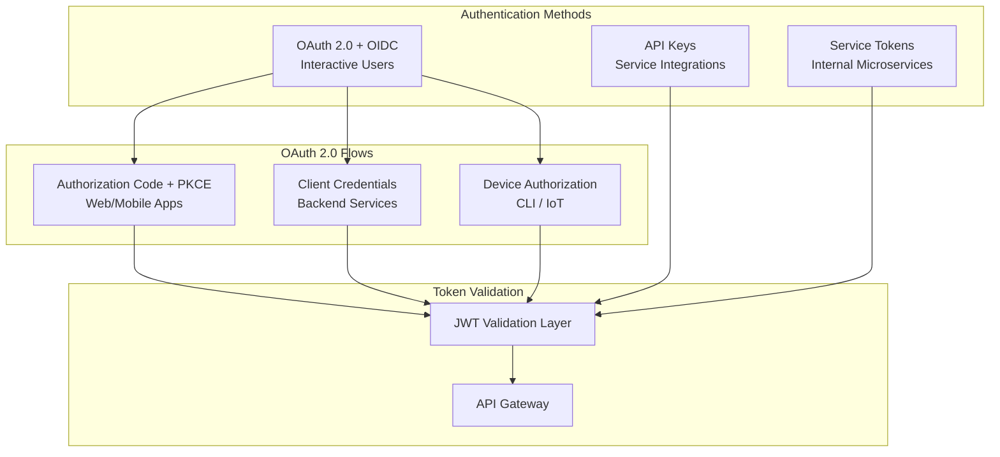
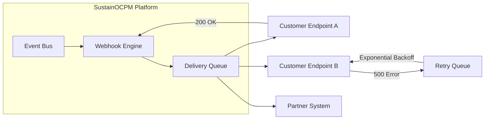
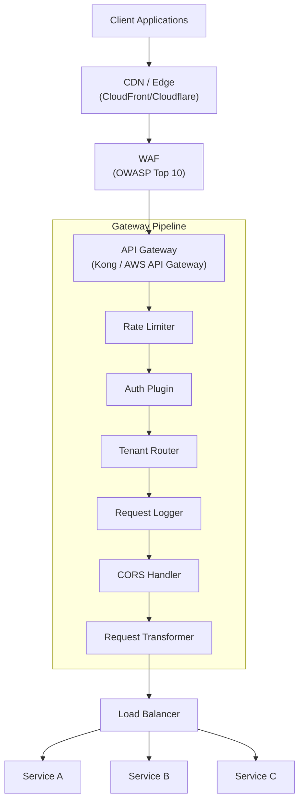
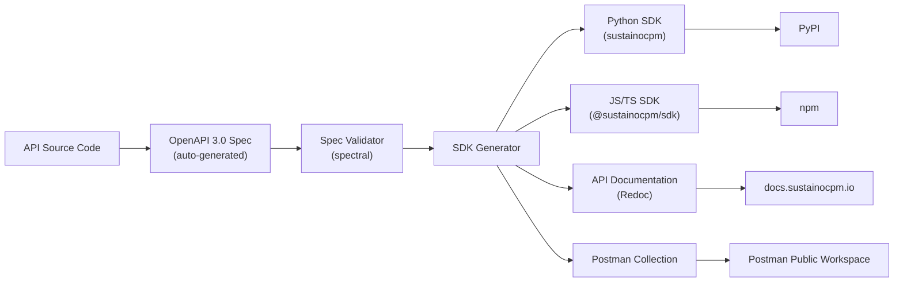

# SustainOCPM — API Architecture

> **Document ID**: SOCPM-ARCH-API-001
> **Version**: 1.0.0
> **Last Updated**: 2026-06-16
> **Status**: Approved — Engineering Reference
> **Classification**: Indo-Swiss Research Grant — Internal Technical Reference
> **Cross-References**: [AI_COPILOT_ARCHITECTURE.md](./AI_COPILOT_ARCHITECTURE.md) · [SYSTEM_ARCHITECTURE.md](./SYSTEM_ARCHITECTURE.md) · [DATA_ARCHITECTURE.md](./DATA_ARCHITECTURE.md)

---

## Table of Contents

1. [API Design Principles](#1-api-design-principles)
2. [Authentication & Authorization](#2-authentication--authorization)
3. [Core API Services](#3-core-api-services)
4. [Platform Services](#4-platform-services)
5. [Webhook Architecture](#5-webhook-architecture)
6. [API Gateway Configuration](#6-api-gateway-configuration)
7. [Error Handling](#7-error-handling)
8. [SDK Design](#8-sdk-design)

---

## 1. API Design Principles

### 1.1 Foundational Standards

SustainOCPM's API surface is the **primary integration plane** for all clients — the web frontend, mobile apps, partner systems, regulatory portals, and third-party integrations. Every design decision is governed by a strict set of principles that ensure consistency, predictability, and enterprise-grade resilience.

| Principle | Standard | Rationale |
|---|---|---|
| Protocol | HTTPS-only (TLS 1.3+) | Zero tolerance for unencrypted traffic |
| Data Format | JSON (application/json) | Universal interoperability |
| Specification | JSON:API v1.1 compliant | Consistent resource representation |
| Errors | RFC 7807 Problem Details | Machine-readable, structured error responses |
| Pagination | Cursor-based (opaque cursors) | Stable pagination under concurrent writes |
| Discoverability | HATEOAS links in every response | Self-documenting navigation |
| Idempotency | Client-supplied `Idempotency-Key` header | Safe retries for mutating operations |
| Versioning | URI path versioning (`/api/v1/`) | Explicit, visible, cacheable |
| Rate Limiting | Token bucket per tenant/tier | Fair usage and DDoS protection |
| Compression | gzip / br (Brotli) | Bandwidth optimization |
| Encoding | UTF-8 everywhere | Internationalization support |
| Date/Time | ISO 8601 with timezone (UTC default) | Unambiguous temporal data |
| Identifiers | UUIDv7 (time-sortable) | Globally unique, no collisions, sortable |

### 1.2 URI Design Conventions

```
https://api.sustainocpm.io/api/v1/{service}/{resource}
https://api.sustainocpm.io/api/v1/{service}/{resource}/{id}
https://api.sustainocpm.io/api/v1/{service}/{resource}/{id}/{sub-resource}
```

**Rules**:
- All URIs use lowercase kebab-case (`/carbon-footprints`, not `/carbonFootprints`)
- Resource names are always **plural** (`/analyses`, `/suppliers`, `/scenarios`)
- Sub-resources are nested max **two levels deep** to prevent URI complexity
- Query parameters use camelCase (`?startDate=`, `?includeArchived=`)
- Filter parameters follow the pattern `filter[field]=value`
- Sort parameters: `sort=field` (ascending), `sort=-field` (descending), comma-separated for multi-sort

### 1.3 Standard Request Headers

| Header | Required | Description |
|---|---|---|
| `Authorization` | Yes | Bearer token (JWT) or API key |
| `X-Tenant-ID` | Yes | Tenant isolation context |
| `X-Request-ID` | Yes | Client-generated trace ID (UUIDv4) |
| `Idempotency-Key` | POST/PUT/PATCH | Client-generated key for safe retries |
| `Accept` | Recommended | `application/json` (default) or `application/vnd.api+json` |
| `Content-Type` | Mutating requests | `application/json` |
| `Accept-Language` | Optional | Preferred response language (ISO 639-1) |
| `X-Correlation-ID` | Optional | Cross-service trace correlation |
| `If-None-Match` | Optional | ETag-based conditional GET |
| `X-Dry-Run` | Optional | `true` to validate without persisting |

### 1.4 Standard Response Envelope

Every successful response follows a consistent envelope:

```json
{
  "data": { ... },
  "meta": {
    "requestId": "550e8400-e29b-41d4-a716-446655440000",
    "timestamp": "2026-06-16T07:30:00Z",
    "version": "v1",
    "processingTimeMs": 142
  },
  "links": {
    "self": "/api/v1/analyses/abc-123",
    "related": {
      "conformance": "/api/v1/conformance/analyses/abc-123",
      "carbon": "/api/v1/carbon/analyses/abc-123"
    }
  },
  "included": [ ... ]
}
```

### 1.5 Cursor-Based Pagination

```json
{
  "data": [ ... ],
  "meta": {
    "pagination": {
      "totalCount": 1247,
      "pageSize": 50,
      "hasNextPage": true,
      "hasPreviousPage": true
    }
  },
  "links": {
    "self": "/api/v1/analyses?cursor=eyJpZCI6MTIzfQ&limit=50",
    "next": "/api/v1/analyses?cursor=eyJpZCI6MTczfQ&limit=50",
    "prev": "/api/v1/analyses?cursor=eyJpZCI6NzN9&limit=50&direction=prev",
    "first": "/api/v1/analyses?limit=50",
    "last": null
  }
}
```

- Cursors are **opaque, base64-encoded** strings. Clients must never parse them.
- Default page size: 50. Maximum: 200. Configurable per endpoint.
- `totalCount` is optional and may be omitted for expensive queries (indicated by `"totalCount": null`).

### 1.6 Idempotency

All `POST`, `PUT`, and `PATCH` requests **must** include an `Idempotency-Key` header. The server:

1. Checks if the key has been seen within the retention window (24 hours)
2. If seen: returns the **original response** (status code, body, headers) without re-executing
3. If not seen: executes the request, stores the response keyed by `Idempotency-Key`
4. Keys are scoped to the tenant + API key/user combination
5. Collisions on in-flight requests return `409 Conflict`

### 1.7 HATEOAS Links

Every response includes contextual navigation links:
- `self` — canonical URL of the current resource
- `related` — associated resources (e.g., analysis → conformance results)
- `actions` — available state transitions (e.g., `"submit"`, `"approve"`, `"archive"`)
- `parent` — parent resource in hierarchical relationships

### 1.8 Rate Limiting Headers

Every response includes rate limit metadata:

| Header | Description |
|---|---|
| `X-RateLimit-Limit` | Maximum requests per window |
| `X-RateLimit-Remaining` | Remaining requests in current window |
| `X-RateLimit-Reset` | UTC epoch seconds when the window resets |
| `Retry-After` | Seconds to wait (only on 429 responses) |

---

## 2. Authentication & Authorization

### 2.1 Authentication Mechanisms

SustainOCPM supports three authentication methods, each suited to different integration patterns:



#### 2.1.1 OAuth 2.0 + OpenID Connect

| Parameter | Value |
|---|---|
| Authorization Endpoint | `https://auth.sustainocpm.io/authorize` |
| Token Endpoint | `https://auth.sustainocpm.io/oauth/token` |
| UserInfo Endpoint | `https://auth.sustainocpm.io/userinfo` |
| JWKS Endpoint | `https://auth.sustainocpm.io/.well-known/jwks.json` |
| Discovery | `https://auth.sustainocpm.io/.well-known/openid-configuration` |
| Supported Flows | Authorization Code + PKCE, Client Credentials, Device Authorization |
| Token Lifetime | Access: 15 min, Refresh: 7 days (sliding), ID: 1 hour |
| MFA | Required for admin roles; TOTP, WebAuthn, SMS fallback |

#### 2.1.2 API Keys

- Prefixed format: `socpm_live_` (production) / `socpm_test_` (sandbox)
- Scoped to specific services and operations (read/write/admin)
- Per-key rate limits independent of user-level limits
- Key rotation: automated 90-day rotation with grace period
- Emergency revocation: immediate propagation via distributed cache invalidation

#### 2.1.3 JWT Structure

```json
{
  "iss": "https://auth.sustainocpm.io",
  "sub": "user_01HXYZ...",
  "aud": "https://api.sustainocpm.io",
  "exp": 1718528400,
  "iat": 1718527500,
  "tenant_id": "tenant_01HABC...",
  "org_id": "org_01HDEF...",
  "roles": ["analyst", "esg_manager"],
  "permissions": ["analyses:read", "carbon:write", "reports:generate"],
  "tier": "enterprise",
  "region": "ap-south-1"
}
```

### 2.2 Authorization Model

SustainOCPM uses **Attribute-Based Access Control (ABAC)** layered on top of **Role-Based Access Control (RBAC)**:

| Role | Permissions Summary |
|---|---|
| `viewer` | Read-only access to analyses, dashboards, reports |
| `analyst` | Create/edit analyses, run conformance checks, generate reports |
| `esg_manager` | Full ESG/BRSR management, supplier assessments, carbon calculations |
| `admin` | Tenant administration, user management, API key management |
| `auditor` | Read-only access with full audit trail visibility |
| `api_service` | Programmatic access scoped to specific service operations |
| `super_admin` | Platform-level administration (SustainOCPM operations team only) |

### 2.3 Permission Scopes

Permissions follow the format `{service}:{action}` with optional resource qualifiers:

| Scope | Description |
|---|---|
| `analyses:read` | View analyses and results |
| `analyses:write` | Create, update, delete analyses |
| `carbon:calculate` | Trigger carbon footprint calculations |
| `carbon:certify` | Approve carbon calculations for reporting |
| `esg:manage` | Full ESG metric management |
| `reports:generate` | Generate BRSR and ESG reports |
| `reports:submit` | Submit reports to regulatory bodies |
| `suppliers:assess` | Conduct supplier sustainability assessments |
| `copilot:query` | Use AI Copilot for data queries |
| `copilot:admin` | Configure Copilot behavior and guardrails |
| `admin:users` | Manage users and roles |
| `admin:tenant` | Tenant-level configuration |
| `audit:read` | Access audit logs |
| `webhooks:manage` | Configure webhook subscriptions |

### 2.4 Rate Limit Tiers

| Tier | Requests/min | Burst | Concurrent | Monthly Quota |
|---|---|---|---|---|
| Free | 60 | 10 | 5 | 10,000 |
| Starter | 300 | 50 | 20 | 100,000 |
| Professional | 1,000 | 200 | 50 | 1,000,000 |
| Enterprise | 5,000 | 1,000 | 200 | Unlimited |
| Internal | 10,000 | 2,000 | 500 | Unlimited |

> [!NOTE]
> Copilot endpoints have separate, lower rate limits due to LLM cost: Free=10/min, Starter=30/min, Professional=100/min, Enterprise=500/min.

---

## 3. Core API Services

### 3.1 Analysis Service

**Purpose**: Manages the entire lifecycle of Object-Centric Process Mining analyses — from OCEL 2.0 event log ingestion through discovery, enhancement, and result retrieval.

**Base Path**: `/api/v1/analyses`
**Dependencies**: Data Ingestion Service, Storage Service, OCEL Parser, Process Discovery Engine
**Rate Limit**: Standard tier limits
**Caching**: Results cached for 5 min (ETag-based); discovered models cached for 1 hour

#### Endpoints

| # | Method | Path | Description |
|---|---|---|---|
| 1 | `POST` | `/analyses` | Create a new analysis from an uploaded OCEL 2.0 event log or data source connection |
| 2 | `GET` | `/analyses` | List all analyses for the tenant with filtering, sorting, and pagination |
| 3 | `GET` | `/analyses/{id}` | Get full analysis details including status, configuration, and summary statistics |
| 4 | `PATCH` | `/analyses/{id}` | Update analysis metadata (name, description, tags, sharing settings) |
| 5 | `DELETE` | `/analyses/{id}` | Soft-delete an analysis (recoverable for 30 days) |
| 6 | `POST` | `/analyses/{id}/execute` | Trigger analysis execution (discovery, enhancement, metrics computation) |
| 7 | `GET` | `/analyses/{id}/status` | Poll execution status (queued, running, completed, failed) with progress percentage |
| 8 | `GET` | `/analyses/{id}/process-model` | Retrieve the discovered Object-Centric Petri Net (OC-PN) or BPMN model |
| 9 | `GET` | `/analyses/{id}/object-types` | List all discovered object types with cardinality and relationship statistics |
| 10 | `GET` | `/analyses/{id}/object-types/{typeId}/objects` | List individual objects of a specific type with lifecycle details |
| 11 | `GET` | `/analyses/{id}/variants` | Get process variants with frequency, performance, and object involvement |
| 12 | `GET` | `/analyses/{id}/activities` | List all activities with execution statistics (frequency, duration, waiting time) |
| 13 | `GET` | `/analyses/{id}/events` | Paginated access to raw events with full object associations |
| 14 | `GET` | `/analyses/{id}/metrics` | Computed KPIs: throughput time, waiting time, rework rate, object interaction density |
| 15 | `GET` | `/analyses/{id}/object-graph` | Object interaction graph showing relationships between object types |
| 16 | `POST` | `/analyses/{id}/filter` | Apply dynamic filters (time range, object types, activities, attributes) and return filtered results |
| 17 | `POST` | `/analyses/{id}/compare` | Compare two analysis snapshots or variants side-by-side |
| 18 | `POST` | `/analyses/{id}/clone` | Deep-clone an analysis with its configuration for iterative exploration |
| 19 | `GET` | `/analyses/{id}/exports/{format}` | Export analysis results (OCEL 2.0 JSON/XML, CSV, BPMN 2.0, PNG/SVG) |
| 20 | `POST` | `/analyses/{id}/share` | Configure sharing permissions (users, roles, external links) |

**Detailed Endpoint: POST `/analyses`**

```
Request:
  Headers: Authorization, X-Tenant-ID, Idempotency-Key, Content-Type
  Body:
    {
      "name": "Q1 2026 Manufacturing Process",
      "description": "Analysis of order-to-delivery process",
      "source": {
        "type": "ocel_upload" | "data_connection" | "existing_log",
        "connectionId": "conn_01H...",        // for data_connection
        "logId": "log_01H...",                // for existing_log
        "uploadRef": "upload_01H..."          // for ocel_upload
      },
      "configuration": {
        "discoveryAlgorithm": "oc_petri_net" | "oc_dfg" | "oc_bpmn",
        "objectTypes": ["order", "item", "delivery", "invoice"],
        "activityFilter": { "minFrequency": 5 },
        "timeRange": { "start": "2026-01-01T00:00:00Z", "end": "2026-03-31T23:59:59Z" },
        "enableCarbonAttribution": true,
        "enableConformanceCheck": false,
        "samplingRate": 1.0
      },
      "tags": ["manufacturing", "q1-2026"],
      "autoExecute": true
    }

Response (201 Created):
    {
      "data": {
        "id": "analysis_01HXYZ...",
        "type": "analysis",
        "attributes": {
          "name": "Q1 2026 Manufacturing Process",
          "status": "queued",
          "createdAt": "2026-06-16T07:30:00Z",
          "createdBy": "user_01HXYZ...",
          "estimatedCompletionMinutes": 12
        }
      },
      "links": {
        "self": "/api/v1/analyses/analysis_01HXYZ...",
        "status": "/api/v1/analyses/analysis_01HXYZ.../status",
        "cancel": "/api/v1/analyses/analysis_01HXYZ.../cancel"
      }
    }

Status Codes: 201 Created, 400 Bad Request, 401 Unauthorized, 403 Forbidden,
              409 Conflict (duplicate idempotency key), 413 Payload Too Large,
              422 Unprocessable Entity, 429 Too Many Requests, 503 Service Unavailable

Query Parameters (GET /analyses):
  - filter[status]: queued|running|completed|failed|archived
  - filter[createdAfter]: ISO 8601 datetime
  - filter[createdBefore]: ISO 8601 datetime
  - filter[tags]: comma-separated tags
  - filter[objectTypes]: comma-separated object type names
  - sort: createdAt|-createdAt|name|-name|status
  - cursor: opaque pagination cursor
  - limit: 1-200 (default 50)
  - include: process-model,metrics,object-types (eager loading)
```

**Failure Modes**:
- OCEL parsing failure → 422 with detailed validation errors per line/element
- Discovery engine timeout → 504 with partial results available flag
- Storage quota exceeded → 507 Insufficient Storage
- Concurrent execution limit reached → 429 with queue position

---

### 3.2 Conformance Service

**Purpose**: Compares discovered process models against normative/reference models to identify deviations, constraint violations, and compliance gaps. Supports token-based replay, alignment-based conformance, and rule-based checking.

**Base Path**: `/api/v1/conformance`
**Dependencies**: Analysis Service, Process Model Repository, Rule Engine
**Rate Limit**: Standard tier limits (computation-heavy endpoints have 50% reduced limits)
**Caching**: Check results cached for 15 min; rule definitions cached for 1 hour

#### Endpoints

| # | Method | Path | Description |
|---|---|---|---|
| 1 | `POST` | `/conformance/checks` | Create and execute a conformance check against a reference model |
| 2 | `GET` | `/conformance/checks` | List all conformance checks with status and summary metrics |
| 3 | `GET` | `/conformance/checks/{id}` | Get full conformance check results including fitness, precision, generalization |
| 4 | `GET` | `/conformance/checks/{id}/deviations` | List all detected deviations with severity, affected objects, and remediation hints |
| 5 | `GET` | `/conformance/checks/{id}/alignments` | Get trace alignments showing synchronous moves, log moves, and model moves |
| 6 | `POST` | `/conformance/reference-models` | Upload or define a normative/reference process model (BPMN 2.0, OC-PN, Declare) |
| 7 | `GET` | `/conformance/reference-models` | List available reference models |
| 8 | `GET` | `/conformance/reference-models/{id}` | Get reference model details |
| 9 | `PATCH` | `/conformance/reference-models/{id}` | Update reference model metadata or constraints |
| 10 | `DELETE` | `/conformance/reference-models/{id}` | Archive a reference model |
| 11 | `POST` | `/conformance/rules` | Define custom conformance rules (temporal, resource, data, object-interaction) |
| 12 | `GET` | `/conformance/rules` | List conformance rules with activation status |
| 13 | `GET` | `/conformance/checks/{id}/rule-violations` | Get violations of custom rules with evidence traces |
| 14 | `POST` | `/conformance/checks/{id}/impact-analysis` | Analyze the carbon/cost/time impact of detected deviations |
| 15 | `GET` | `/conformance/checks/{id}/trends` | Conformance fitness trends over time (daily/weekly/monthly) |

**Detailed Endpoint: POST `/conformance/checks`**

```
Request Body:
  {
    "analysisId": "analysis_01HXYZ...",
    "referenceModelId": "refmodel_01HABC...",
    "method": "alignment" | "token_replay" | "rule_based" | "hybrid",
    "configuration": {
      "costFunction": {
        "logMove": 1,
        "modelMove": 1,
        "synchronousMove": 0
      },
      "objectTypes": ["order", "item"],
      "timeWindow": { "start": "2026-01-01T00:00:00Z", "end": "2026-03-31T23:59:59Z" },
      "includeImpactAnalysis": true,
      "deviationSeverityThreshold": "low" | "medium" | "high"
    },
    "rules": [
      {
        "type": "temporal",
        "name": "max-cycle-time",
        "constraint": "activity('Approve Order') BEFORE activity('Ship Order') WITHIN 48h"
      },
      {
        "type": "resource",
        "name": "segregation-of-duties",
        "constraint": "activity('Create PO').resource != activity('Approve PO').resource"
      }
    ]
  }

Response (201 Created):
  {
    "data": {
      "id": "check_01HXYZ...",
      "type": "conformance_check",
      "attributes": {
        "status": "running",
        "method": "alignment",
        "estimatedCompletionSeconds": 45
      }
    }
  }

Status Codes: 201, 400, 401, 403, 404 (analysis/model not found),
              422 (invalid rules), 429, 503
```

**Failure Modes**:
- Reference model incompatible with analysis object types → 422 with mapping suggestions
- Alignment computation timeout (>5 min) → 504 with partial results and a resumption token
- Insufficient trace data for statistical significance → 200 with warning in meta

---

### 3.3 Carbon Service

**Purpose**: Manages carbon footprint calculations, emission factor databases, Scope 1/2/3 attribution to process steps and objects, carbon intensity metrics, and reduction tracking.

**Base Path**: `/api/v1/carbon`
**Dependencies**: Analysis Service, Emission Factor Database, Energy Data Providers, Supplier Service
**Rate Limit**: Standard tier limits; calculation endpoints at 50% reduced limits
**Caching**: Emission factors cached for 24 hours; calculations cached for 1 hour

#### Endpoints

| # | Method | Path | Description |
|---|---|---|---|
| 1 | `POST` | `/carbon/calculations` | Trigger a carbon footprint calculation for an analysis |
| 2 | `GET` | `/carbon/calculations` | List all carbon calculations with summary metrics |
| 3 | `GET` | `/carbon/calculations/{id}` | Get detailed carbon calculation results |
| 4 | `GET` | `/carbon/calculations/{id}/by-scope` | Breakdown by Scope 1, 2, 3 with sub-categories |
| 5 | `GET` | `/carbon/calculations/{id}/by-activity` | Carbon attribution per process activity |
| 6 | `GET` | `/carbon/calculations/{id}/by-object` | Carbon attribution per object type and individual object |
| 7 | `GET` | `/carbon/calculations/{id}/by-variant` | Carbon footprint per process variant |
| 8 | `GET` | `/carbon/calculations/{id}/hotspots` | Top carbon hotspots ranked by emission intensity |
| 9 | `POST` | `/carbon/emission-factors` | Create custom emission factors for organization-specific activities |
| 10 | `GET` | `/carbon/emission-factors` | Search emission factor databases (DEFRA, EPA, IPCC, ecoinvent, custom) |
| 11 | `GET` | `/carbon/emission-factors/{id}` | Get emission factor details with source, uncertainty, and applicability |
| 12 | `PATCH` | `/carbon/emission-factors/{id}` | Update custom emission factor values or metadata |
| 13 | `POST` | `/carbon/intensity-metrics` | Calculate carbon intensity metrics (per unit, per revenue, per FTE) |
| 14 | `GET` | `/carbon/trends` | Carbon emission trends over time with decomposition analysis |
| 15 | `POST` | `/carbon/reduction-targets` | Set carbon reduction targets (SBTi-aligned, custom) |
| 16 | `GET` | `/carbon/reduction-targets` | List active reduction targets with progress tracking |
| 17 | `POST` | `/carbon/what-if` | Run what-if scenarios for carbon reduction strategies |
| 18 | `GET` | `/carbon/benchmarks` | Industry benchmarks for carbon intensity by sector/region |
| 19 | `POST` | `/carbon/certify` | Submit carbon calculation for internal approval/certification |
| 20 | `GET` | `/carbon/audit-trail/{calculationId}` | Full audit trail of a carbon calculation (inputs, factors, methodology) |

**Detailed Endpoint: POST `/carbon/calculations`**

```
Request Body:
  {
    "analysisId": "analysis_01HXYZ...",
    "name": "Q1 2026 Manufacturing Carbon Footprint",
    "methodology": "ghg_protocol" | "iso_14064" | "pef" | "custom",
    "configuration": {
      "scopes": ["scope_1", "scope_2_location", "scope_2_market", "scope_3"],
      "scope3Categories": [1, 4, 6, 9, 11],
      "emissionFactorSources": ["defra_2025", "epa_2025", "custom"],
      "allocationMethod": "physical" | "economic" | "hybrid",
      "activityMapping": [
        {
          "activityName": "Machine Operation",
          "emissionFactorId": "ef_01H...",
          "dataSource": "iot_sensor",
          "unit": "kWh"
        },
        {
          "activityName": "Transportation",
          "emissionFactorId": "ef_02H...",
          "dataSource": "logistics_erp",
          "unit": "tkm"
        }
      ],
      "uncertaintyAnalysis": true,
      "gwpTimeframe": "100yr" | "20yr"
    },
    "reportingPeriod": {
      "start": "2026-01-01",
      "end": "2026-03-31"
    }
  }

Response (201 Created):
  {
    "data": {
      "id": "calc_01HXYZ...",
      "type": "carbon_calculation",
      "attributes": {
        "status": "processing",
        "totalEmissions": null,
        "estimatedCompletionMinutes": 8
      }
    }
  }

Status Codes: 201, 400, 401, 403, 404, 422 (missing emission factor mappings),
              429, 503
```

**Failure Modes**:
- Missing emission factor for an activity → 422 with list of unmapped activities
- Energy data provider API unavailable → partial calculation with `dataQuality: "estimated"` flags
- Allocation method produces negative values → 422 with detailed allocation error

---

### 3.4 ESG Service

**Purpose**: Manages Environmental, Social, and Governance metrics collection, scoring, framework mapping (GRI, SASB, TCFD, CDP, EU CSRD), materiality assessments, and ESG performance tracking.

**Base Path**: `/api/v1/esg`
**Dependencies**: Carbon Service, Supplier Service, Data Ingestion Service, Reporting Service
**Rate Limit**: Standard tier limits
**Caching**: Framework definitions cached for 24 hours; scores cached for 30 min

#### Endpoints

| # | Method | Path | Description |
|---|---|---|---|
| 1 | `POST` | `/esg/assessments` | Create a new ESG assessment for a reporting period |
| 2 | `GET` | `/esg/assessments` | List ESG assessments with filtering by period, status, framework |
| 3 | `GET` | `/esg/assessments/{id}` | Get full ESG assessment with all pillar scores |
| 4 | `PATCH` | `/esg/assessments/{id}` | Update assessment data points or metadata |
| 5 | `GET` | `/esg/assessments/{id}/environmental` | Environmental pillar details (emissions, energy, water, waste, biodiversity) |
| 6 | `GET` | `/esg/assessments/{id}/social` | Social pillar details (labor, health & safety, diversity, community, human rights) |
| 7 | `GET` | `/esg/assessments/{id}/governance` | Governance pillar details (board, ethics, compliance, risk, transparency) |
| 8 | `POST` | `/esg/metrics` | Record an ESG metric data point with evidence and source |
| 9 | `GET` | `/esg/metrics` | List ESG metrics with filtering by pillar, category, period |
| 10 | `GET` | `/esg/metrics/{id}` | Get metric details with historical values and trend |
| 11 | `GET` | `/esg/frameworks` | List supported ESG frameworks with coverage metrics |
| 12 | `GET` | `/esg/frameworks/{frameworkId}/indicators` | List all indicators for a specific framework |
| 13 | `POST` | `/esg/materiality` | Conduct a materiality assessment (double materiality for EU CSRD) |
| 14 | `GET` | `/esg/materiality/{id}` | Get materiality matrix with stakeholder impacts |
| 15 | `GET` | `/esg/scores/history` | Historical ESG scores with trend analysis |
| 16 | `POST` | `/esg/gap-analysis` | Identify gaps between current metrics and framework requirements |
| 17 | `GET` | `/esg/data-quality` | Data quality assessment across all ESG metrics |
| 18 | `POST` | `/esg/targets` | Set ESG improvement targets |
| 19 | `GET` | `/esg/peer-comparison` | Peer company ESG comparison (industry benchmarks) |

**Query Parameters (GET `/esg/metrics`)**:
```
filter[pillar]=environmental|social|governance
filter[category]=emissions|energy|water|waste|labor|safety|diversity|board|ethics
filter[framework]=gri|sasb|tcfd|cdp|csrd|brsr
filter[period]=2026-Q1
filter[dataQuality]=verified|estimated|pending
sort=metricName|-updatedAt|dataQuality
include=evidence,history,frameworkMapping
```

**Failure Modes**:
- Incomplete data for framework compliance → 200 with `completeness` percentage and missing indicators list
- Framework version mismatch → 422 with migration guidance
- Peer comparison data unavailable for sector → 404 with nearest available sector

---

### 3.5 Supplier Service

**Purpose**: Manages supplier sustainability profiles, risk assessments, performance scoring, supply chain carbon tracking, and collaborative improvement programs.

**Base Path**: `/api/v1/suppliers`
**Dependencies**: Carbon Service, ESG Service, External Data Providers (CDP, EcoVadis)
**Rate Limit**: Standard tier limits
**Caching**: Supplier profiles cached for 15 min; risk scores cached for 1 hour

#### Endpoints

| # | Method | Path | Description |
|---|---|---|---|
| 1 | `POST` | `/suppliers` | Register a new supplier with sustainability profile |
| 2 | `GET` | `/suppliers` | List suppliers with filtering by risk, tier, category, region |
| 3 | `GET` | `/suppliers/{id}` | Get full supplier profile with sustainability scores |
| 4 | `PATCH` | `/suppliers/{id}` | Update supplier information and sustainability data |
| 5 | `DELETE` | `/suppliers/{id}` | Deactivate supplier (preserve historical data) |
| 6 | `POST` | `/suppliers/{id}/assessments` | Create a sustainability assessment for a supplier |
| 7 | `GET` | `/suppliers/{id}/assessments` | List all assessments for a supplier |
| 8 | `GET` | `/suppliers/{id}/assessments/{assessmentId}` | Get assessment details with scores and evidence |
| 9 | `GET` | `/suppliers/{id}/carbon-footprint` | Supplier's Scope 3 contribution to the organization |
| 10 | `GET` | `/suppliers/{id}/risk-score` | Current risk score with contributing factors |
| 11 | `POST` | `/suppliers/{id}/questionnaires` | Send a sustainability questionnaire to supplier |
| 12 | `GET` | `/suppliers/{id}/questionnaires/{qId}` | Get questionnaire responses and validation status |
| 13 | `GET` | `/suppliers/{id}/improvement-plan` | Get supplier improvement plan with milestones |
| 14 | `POST` | `/suppliers/{id}/improvement-plan` | Create improvement plan with targets and timelines |
| 15 | `GET` | `/suppliers/risk-heatmap` | Aggregate risk heatmap across all suppliers (region × category) |
| 16 | `GET` | `/suppliers/rankings` | Ranked list of suppliers by sustainability performance |
| 17 | `POST` | `/suppliers/bulk-import` | Bulk import supplier data from CSV/Excel |
| 18 | `GET` | `/suppliers/{id}/certifications` | List supplier sustainability certifications (ISO 14001, SA8000, etc.) |

**Failure Modes**:
- External data provider (EcoVadis/CDP) API timeout → cached data with `dataFreshness` indicator
- Questionnaire delivery failure → retry with exponential backoff, fallback to email notification
- Duplicate supplier detection → 409 Conflict with merge suggestions

---

### 3.6 Reporting Service

**Purpose**: Generates, manages, and distributes regulatory and internal sustainability reports including BRSR (SEBI), GRI, SASB, TCFD, CDP, EU CSRD, and custom formats.

**Base Path**: `/api/v1/reports`
**Dependencies**: ESG Service, Carbon Service, Analysis Service, Supplier Service, Template Engine
**Rate Limit**: Report generation at 25% of standard limits (resource-intensive); read operations at full limits
**Caching**: Generated reports cached until underlying data changes; templates cached for 24 hours

#### Endpoints

| # | Method | Path | Description |
|---|---|---|---|
| 1 | `POST` | `/reports` | Create and generate a new report |
| 2 | `GET` | `/reports` | List all reports with filtering by type, status, period |
| 3 | `GET` | `/reports/{id}` | Get report metadata and generation status |
| 4 | `GET` | `/reports/{id}/content` | Get rendered report content (HTML/JSON) |
| 5 | `GET` | `/reports/{id}/download` | Download report in specified format (PDF, XLSX, DOCX, XBRL) |
| 6 | `PATCH` | `/reports/{id}` | Update report metadata or trigger regeneration |
| 7 | `DELETE` | `/reports/{id}` | Archive a report (regulatory reports preserved per retention policy) |
| 8 | `POST` | `/reports/{id}/review` | Submit report for review workflow |
| 9 | `POST` | `/reports/{id}/approve` | Approve report (requires `reports:submit` permission) |
| 10 | `POST` | `/reports/{id}/submit` | Submit report to regulatory body (BRSR → SEBI, CDP → CDP portal) |
| 11 | `GET` | `/reports/{id}/submission-status` | Check regulatory submission status |
| 12 | `GET` | `/reports/templates` | List available report templates |
| 13 | `GET` | `/reports/templates/{templateId}` | Get template details with required data points |
| 14 | `POST` | `/reports/templates` | Create custom report template |
| 15 | `GET` | `/reports/{id}/data-readiness` | Check if all required data is available for report generation |
| 16 | `POST` | `/reports/{id}/sections/{sectionId}/override` | Override auto-generated content in a specific section |
| 17 | `GET` | `/reports/{id}/audit-trail` | Report generation audit trail (data sources, calculations, overrides) |
| 18 | `POST` | `/reports/{id}/share` | Share report with external stakeholders via secure link |
| 19 | `GET` | `/reports/{id}/comments` | Get review comments on the report |
| 20 | `POST` | `/reports/{id}/comments` | Add review comment to a report section |

**Report Types**:
| Type | Framework | Output Formats | Regulatory Body |
|---|---|---|---|
| `brsr` | SEBI BRSR | PDF, XLSX, XBRL | SEBI (India) |
| `brsr_core` | SEBI BRSR Core | PDF, XLSX | SEBI (India) |
| `gri` | GRI Standards 2021 | PDF, HTML | GRI |
| `sasb` | SASB Standards | PDF, XLSX | ISSB/IFRS |
| `tcfd` | TCFD Recommendations | PDF | FSB |
| `cdp` | CDP Questionnaire | XML, PDF | CDP |
| `csrd` | EU CSRD / ESRS | PDF, XBRL | EFRAG |
| `custom` | Custom Template | PDF, DOCX, HTML | Internal |
| `executive_summary` | Internal | PDF, PPTX | Board |

**Failure Modes**:
- Insufficient data for mandatory report fields → 422 with `missingFields` array
- Template rendering engine failure → 503 with fallback to basic template
- Regulatory submission portal unavailable → queued with retry and user notification
- PDF generation timeout (large reports) → async generation with webhook notification

---

### 3.7 Methodology Service

**Purpose**: Manages carbon accounting methodologies, calculation standards, allocation rules, and emission factor selection criteria. Ensures methodological consistency and auditability.

**Base Path**: `/api/v1/methodologies`
**Dependencies**: Carbon Service, Knowledge Base Service
**Rate Limit**: Standard tier limits
**Caching**: Methodology definitions cached for 24 hours; standard references cached for 7 days

#### Endpoints

| # | Method | Path | Description |
|---|---|---|---|
| 1 | `GET` | `/methodologies` | List all available methodologies with version and applicability |
| 2 | `GET` | `/methodologies/{id}` | Get full methodology definition with calculation steps |
| 3 | `POST` | `/methodologies` | Create a custom methodology (extends a base standard) |
| 4 | `PATCH` | `/methodologies/{id}` | Update custom methodology parameters |
| 5 | `GET` | `/methodologies/{id}/versions` | List all versions of a methodology |
| 6 | `GET` | `/methodologies/{id}/versions/{version}` | Get a specific version (for audit/comparison) |
| 7 | `POST` | `/methodologies/{id}/validate` | Validate a methodology against recognized standards |
| 8 | `GET` | `/methodologies/{id}/applicability` | Check applicability to specific industries, scopes, and regions |
| 9 | `GET` | `/methodologies/standards` | List recognized standards (GHG Protocol, ISO 14064, PEF, etc.) |
| 10 | `GET` | `/methodologies/standards/{standardId}` | Get standard details with chapter references |
| 11 | `POST` | `/methodologies/{id}/compare` | Compare two methodologies showing differences in approach |
| 12 | `GET` | `/methodologies/{id}/audit-requirements` | List audit and documentation requirements for a methodology |

**Failure Modes**:
- Standard update available but not yet integrated → 200 with `updateAvailable` flag
- Custom methodology conflicts with base standard → 422 with specific conflict details

---

### 3.8 Recommendation Service

**Purpose**: Generates, prioritizes, and tracks sustainability improvement recommendations based on process mining insights, carbon analysis, ESG gaps, and industry best practices.

**Base Path**: `/api/v1/recommendations`
**Dependencies**: Analysis Service, Carbon Service, ESG Service, Conformance Service, AI Copilot Service
**Rate Limit**: Generation endpoints at 50% of standard limits (AI-dependent); read at full limits
**Caching**: Recommendations cached for 30 min; priority scores recomputed on data change

#### Endpoints

| # | Method | Path | Description |
|---|---|---|---|
| 1 | `POST` | `/recommendations/generate` | Generate recommendations for an analysis or assessment |
| 2 | `GET` | `/recommendations` | List all recommendations with filtering and priority sorting |
| 3 | `GET` | `/recommendations/{id}` | Get full recommendation with rationale, evidence, and projected impact |
| 4 | `PATCH` | `/recommendations/{id}` | Update recommendation status (accepted, rejected, in-progress, completed) |
| 5 | `POST` | `/recommendations/{id}/feedback` | Provide feedback on recommendation quality and applicability |
| 6 | `GET` | `/recommendations/by-category` | Recommendations grouped by category (process, carbon, esg, supplier) |
| 7 | `GET` | `/recommendations/impact-summary` | Aggregate projected impact if all accepted recommendations implemented |
| 8 | `POST` | `/recommendations/{id}/action-plan` | Generate a detailed action plan for implementing a recommendation |
| 9 | `GET` | `/recommendations/{id}/similar` | Find similar recommendations from other analyses or organizations |
| 10 | `GET` | `/recommendations/effectiveness` | Track recommendation effectiveness over time (planned vs actual impact) |
| 11 | `POST` | `/recommendations/prioritize` | Re-prioritize recommendations with custom weights (cost, impact, effort, risk) |

**Recommendation Structure**:
```json
{
  "id": "rec_01HXYZ...",
  "title": "Consolidate low-volume shipments to reduce transportation emissions",
  "category": "carbon_reduction",
  "priority": "high",
  "confidence": 0.87,
  "source": "process_variant_analysis",
  "impact": {
    "carbonReductionTonsCO2e": 142.5,
    "costSavingsUSD": 28000,
    "processTimeReductionHours": 34,
    "implementationEffort": "medium",
    "paybackMonths": 4
  },
  "evidence": [
    { "type": "variant_comparison", "ref": "/api/v1/analyses/abc/variants?compare=v1,v5" },
    { "type": "benchmark", "ref": "/api/v1/benchmarks/transportation-consolidation" }
  ],
  "rationale": "Process variant V5 shows 23% lower transportation emissions by consolidating shipments...",
  "prerequisites": ["Logistics management system integration"],
  "risks": ["Potential delivery delays for urgent orders"],
  "status": "pending"
}
```

**Failure Modes**:
- Insufficient data for high-confidence recommendations → lower confidence scores with explanation
- AI model unavailable → rule-based recommendations only with `source: "rule_engine"` flag

---

### 3.9 Benchmark Service

**Purpose**: Provides industry benchmarks, peer comparisons, and best-in-class reference points for carbon intensity, ESG scores, process efficiency, and sustainability maturity.

**Base Path**: `/api/v1/benchmarks`
**Dependencies**: External Benchmark Databases, ESG Service, Carbon Service
**Rate Limit**: Standard tier limits
**Caching**: Benchmark data cached for 24 hours (updated daily from external sources)

#### Endpoints

| # | Method | Path | Description |
|---|---|---|---|
| 1 | `GET` | `/benchmarks` | List available benchmark categories |
| 2 | `GET` | `/benchmarks/carbon-intensity` | Industry carbon intensity benchmarks by sector and region |
| 3 | `GET` | `/benchmarks/esg-scores` | Industry ESG score distributions by framework |
| 4 | `GET` | `/benchmarks/process-efficiency` | Process efficiency benchmarks (cycle time, throughput, rework rate) |
| 5 | `POST` | `/benchmarks/compare` | Compare organization metrics against industry benchmarks |
| 6 | `GET` | `/benchmarks/compare/{comparisonId}` | Get comparison results with percentile rankings |
| 7 | `GET` | `/benchmarks/trends` | Benchmark trend data (how industry averages evolve) |
| 8 | `GET` | `/benchmarks/best-practices` | Best-in-class practices by category and industry |
| 9 | `GET` | `/benchmarks/maturity-model` | Sustainability maturity model assessment criteria |
| 10 | `POST` | `/benchmarks/maturity-assessment` | Assess organization against maturity model |

**Query Parameters (GET `/benchmarks/carbon-intensity`)**:
```
filter[sector]=manufacturing|automotive|chemicals|pharma|technology|energy
filter[region]=global|asia-pacific|europe|north-america|india
filter[scope]=scope_1|scope_2|scope_3|total
filter[metric]=per_revenue|per_unit|per_fte|absolute
filter[year]=2025|2026
```

**Failure Modes**:
- Sector not covered in benchmark database → 404 with nearest available sector suggestions
- Data too old (>12 months) → 200 with `dataAge` warning in meta

---

### 3.10 Copilot Service

**Purpose**: Provides the AI Copilot interface for natural language queries, contextual insights, automated analysis, and intelligent assistance across all SustainOCPM capabilities.

**Base Path**: `/api/v1/copilot`
**Dependencies**: All Core Services, LLM Gateway, RAG Pipeline, Knowledge Base, Agent Orchestrator
**Rate Limit**: Dedicated Copilot tier limits (separate from standard API limits)
**Caching**: Query results cached per conversation context (5 min TTL); knowledge base embeddings cached indefinitely

> [!IMPORTANT]
> The Copilot Service is the API surface for the full AI architecture described in [AI_COPILOT_ARCHITECTURE.md](./AI_COPILOT_ARCHITECTURE.md). This section covers the HTTP API; the referenced document covers internal architecture.

#### Endpoints

| # | Method | Path | Description |
|---|---|---|---|
| 1 | `POST` | `/copilot/query` | Submit a natural language query with context |
| 2 | `POST` | `/copilot/query/stream` | Submit a query with Server-Sent Events (SSE) streaming response |
| 3 | `GET` | `/copilot/conversations` | List conversation history |
| 4 | `GET` | `/copilot/conversations/{id}` | Get full conversation with all turns |
| 5 | `DELETE` | `/copilot/conversations/{id}` | Delete a conversation |
| 6 | `POST` | `/copilot/conversations/{id}/feedback` | Provide feedback on conversation quality |
| 7 | `POST` | `/copilot/summarize` | Generate an executive summary for an analysis or report |
| 8 | `POST` | `/copilot/explain` | Explain a specific finding, metric, or deviation in plain language |
| 9 | `POST` | `/copilot/suggest` | Get contextual suggestions based on current user activity |
| 10 | `POST` | `/copilot/translate` | Translate technical findings into stakeholder-appropriate language |
| 11 | `GET` | `/copilot/capabilities` | List available Copilot capabilities and their status |
| 12 | `POST` | `/copilot/document-qa` | Ask questions about uploaded documents (PDFs, reports) |
| 13 | `POST` | `/copilot/generate-report-section` | AI-generate a specific report section with cited data |
| 14 | `GET` | `/copilot/usage` | Get Copilot usage metrics (queries, tokens, cost) for the tenant |
| 15 | `POST` | `/copilot/agents/{agentId}/invoke` | Directly invoke a specialized agent (process, carbon, ESG, etc.) |

**Detailed Endpoint: POST `/copilot/query/stream`**

```
Request Body:
  {
    "query": "What are the top 3 carbon hotspots in our Q1 manufacturing process and how do they compare to last quarter?",
    "conversationId": "conv_01HXYZ...",
    "context": {
      "currentPage": "carbon-dashboard",
      "activeAnalysisId": "analysis_01HXYZ...",
      "selectedObjectTypes": ["order", "item"],
      "timeRange": { "start": "2026-01-01", "end": "2026-03-31" }
    },
    "preferences": {
      "responseFormat": "detailed" | "concise" | "executive",
      "includeVisualizations": true,
      "includeSources": true,
      "language": "en"
    }
  }

Response (200 OK, SSE Stream):
  event: metadata
  data: {"queryId":"q_01H...","agents":["carbon_agent","process_agent"],"estimatedTokens":850}

  event: reasoning
  data: {"step":"Analyzing carbon calculations for Q1 2026...","progress":0.2}

  event: content
  data: {"delta":"Based on your Q1 2026 manufacturing analysis, the top 3 carbon hotspots are:\n\n"}

  event: content
  data: {"delta":"1. **Machine Operation (CNC Milling)** — 342 tCO2e (28% of total)..."}

  event: source
  data: {"ref":"/api/v1/carbon/calculations/calc_01H.../hotspots","label":"Carbon Hotspot Analysis","confidence":0.94}

  event: visualization
  data: {"type":"bar_chart","title":"Top Carbon Hotspots — Q1 vs Q4","data":{...}}

  event: done
  data: {"totalTokens":847,"sources":3,"confidence":0.91,"agentsUsed":["carbon_agent"]}

Status Codes: 200 (streaming), 400, 401, 403, 429 (copilot rate limit), 503 (LLM unavailable)
```

**Failure Modes**:
- LLM provider timeout → fallback to smaller/faster model with degradation notice
- RAG retrieval returns no relevant context → honest "I don't have enough data" response
- Token budget exceeded → truncated response with continuation prompt
- Prompt injection detected → 400 with sanitized error (no detail leakage)

---

### 3.11 Knowledge Base Service

**Purpose**: Manages the organization's sustainability knowledge base — documents, research papers, methodology guides, regulatory updates, and curated expertise that powers the RAG pipeline.

**Base Path**: `/api/v1/knowledge`
**Dependencies**: Vector Store (Qdrant/Pinecone), Document Processing Pipeline, Embedding Model
**Rate Limit**: Standard tier limits; document ingestion at 25% (processing-intensive)
**Caching**: Search results cached for 5 min; document metadata cached for 1 hour

#### Endpoints

| # | Method | Path | Description |
|---|---|---|---|
| 1 | `POST` | `/knowledge/documents` | Upload and ingest a document into the knowledge base |
| 2 | `GET` | `/knowledge/documents` | List documents with filtering by type, category, status |
| 3 | `GET` | `/knowledge/documents/{id}` | Get document metadata and processing status |
| 4 | `DELETE` | `/knowledge/documents/{id}` | Remove document and its embeddings from the knowledge base |
| 5 | `POST` | `/knowledge/search` | Semantic search across the knowledge base |
| 6 | `GET` | `/knowledge/categories` | List knowledge base categories and their document counts |
| 7 | `POST` | `/knowledge/collections` | Create a curated collection of documents |
| 8 | `GET` | `/knowledge/collections` | List collections |
| 9 | `GET` | `/knowledge/collections/{id}` | Get collection details with document list |
| 10 | `POST` | `/knowledge/feedback` | Provide feedback on search result relevance |

**Failure Modes**:
- Document format not supported → 415 Unsupported Media Type with supported formats list
- Embedding model unavailable → queued processing with status "pending_embedding"
- Vector store capacity exceeded → 507 with cleanup recommendations

---

### 3.12 Alert Service

**Purpose**: Manages real-time alerts, threshold monitoring, anomaly detection notifications, and escalation workflows across all sustainability dimensions.

**Base Path**: `/api/v1/alerts`
**Dependencies**: All Core Services (event sources), Notification Service, User Preferences
**Rate Limit**: Standard tier limits; alert creation at full limits
**Caching**: Active alert rules cached for 5 min; alert history queryable without cache

#### Endpoints

| # | Method | Path | Description |
|---|---|---|---|
| 1 | `POST` | `/alerts/rules` | Create an alert rule (threshold, anomaly, trend, compliance) |
| 2 | `GET` | `/alerts/rules` | List all alert rules with activation status |
| 3 | `GET` | `/alerts/rules/{id}` | Get rule details with trigger history |
| 4 | `PATCH` | `/alerts/rules/{id}` | Update alert rule configuration |
| 5 | `DELETE` | `/alerts/rules/{id}` | Deactivate an alert rule |
| 6 | `GET` | `/alerts` | List triggered alerts with filtering by severity, status, category |
| 7 | `GET` | `/alerts/{id}` | Get alert details with context and recommended actions |
| 8 | `PATCH` | `/alerts/{id}` | Update alert status (acknowledged, investigating, resolved, false_positive) |
| 9 | `POST` | `/alerts/{id}/escalate` | Escalate alert to next tier or external notification |
| 10 | `GET` | `/alerts/summary` | Alert summary dashboard data (counts by severity, category, trend) |
| 11 | `POST` | `/alerts/test` | Test an alert rule by simulating a trigger condition |
| 12 | `GET` | `/alerts/channels` | List configured notification channels (email, Slack, Teams, webhook) |
| 13 | `POST` | `/alerts/channels` | Configure a notification channel |

**Alert Rule Types**:
| Type | Description | Example |
|---|---|---|
| `threshold` | Static threshold breach | Carbon intensity > 50 tCO2e/M$ revenue |
| `anomaly` | Statistical anomaly detection | Unusual spike in energy consumption |
| `trend` | Trend deviation alert | ESG score declining for 3 consecutive periods |
| `compliance` | Regulatory deadline or gap | BRSR submission deadline in 30 days |
| `conformance` | Process deviation detected | Conformance fitness below 85% |
| `supplier` | Supplier risk escalation | Supplier risk score enters "critical" zone |

**Failure Modes**:
- Notification channel unavailable → retry with backoff, fallback to email
- Alert rule produces too many triggers (>100/hour) → auto-throttle with notification
- Circular escalation detected → break cycle and notify admin

---

### 3.13 Scenario Simulation Service

**Purpose**: Enables what-if analysis and scenario modeling for carbon reduction strategies, process optimization, supply chain reconfiguration, and investment planning with full uncertainty quantification.

**Base Path**: `/api/v1/scenarios`
**Dependencies**: Analysis Service, Carbon Service, Digital Twin Service, Recommendation Service
**Rate Limit**: Simulation execution at 25% of standard limits (compute-intensive); read at full limits
**Caching**: Completed simulation results cached indefinitely (immutable); parameter sets cached for 1 hour

#### Endpoints

| # | Method | Path | Description |
|---|---|---|---|
| 1 | `POST` | `/scenarios` | Create a new scenario definition |
| 2 | `GET` | `/scenarios` | List scenarios with filtering by type, status, baseline |
| 3 | `GET` | `/scenarios/{id}` | Get full scenario definition and results |
| 4 | `PATCH` | `/scenarios/{id}` | Update scenario parameters |
| 5 | `DELETE` | `/scenarios/{id}` | Archive a scenario |
| 6 | `POST` | `/scenarios/{id}/execute` | Execute scenario simulation |
| 7 | `GET` | `/scenarios/{id}/results` | Get simulation results with confidence intervals |
| 8 | `POST` | `/scenarios/compare` | Compare multiple scenarios side-by-side |
| 9 | `GET` | `/scenarios/compare/{comparisonId}` | Get scenario comparison results |
| 10 | `POST` | `/scenarios/{id}/sensitivity-analysis` | Run sensitivity analysis on key parameters |
| 11 | `GET` | `/scenarios/{id}/sensitivity-analysis` | Get sensitivity analysis results (tornado charts, spider plots) |
| 12 | `POST` | `/scenarios/{id}/monte-carlo` | Run Monte Carlo simulation for uncertainty quantification |
| 13 | `GET` | `/scenarios/{id}/monte-carlo` | Get Monte Carlo results with probability distributions |
| 14 | `POST` | `/scenarios/{id}/clone` | Clone a scenario for iterative refinement |

**Scenario Types**:
| Type | Description | Typical Parameters |
|---|---|---|
| `carbon_reduction` | Model emission reduction strategies | Activity changes, energy mix, technology adoption |
| `process_optimization` | Model process redesign impact | Activity elimination, parallelization, automation |
| `supply_chain` | Model supplier changes | Supplier substitution, nearshoring, modal shift |
| `investment` | Model capex/opex scenarios | Technology investment, ROI timeline, payback period |
| `regulatory` | Model regulatory change impact | Carbon pricing, cap-and-trade, new reporting requirements |
| `climate_risk` | Model physical/transition climate risks | Temperature scenarios, policy changes, market shifts |

**Failure Modes**:
- Simulation timeout (>30 min) → partial results with resumption capability
- Parameter combination produces infeasible model → 422 with constraint violation details
- Monte Carlo convergence failure → 200 with `converged: false` and recommendation for more iterations

---

### 3.14 Digital Twin Service

**Purpose**: Manages digital twin representations of manufacturing processes, supply chains, and facilities that enable real-time monitoring, predictive analytics, and scenario testing against live operational data.

**Base Path**: `/api/v1/digital-twins`
**Dependencies**: IoT Data Ingestion, Analysis Service, Scenario Simulation Service, Carbon Service
**Rate Limit**: Standard tier limits; real-time data ingestion endpoints at 10x limits
**Caching**: Twin state cached for 30 seconds (near real-time); configuration cached for 1 hour

#### Endpoints

| # | Method | Path | Description |
|---|---|---|---|
| 1 | `POST` | `/digital-twins` | Create a digital twin model for a process or facility |
| 2 | `GET` | `/digital-twins` | List all digital twins with status and last update |
| 3 | `GET` | `/digital-twins/{id}` | Get digital twin definition and current state |
| 4 | `PATCH` | `/digital-twins/{id}` | Update digital twin configuration |
| 5 | `DELETE` | `/digital-twins/{id}` | Decommission a digital twin |
| 6 | `GET` | `/digital-twins/{id}/state` | Get current real-time state of the digital twin |
| 7 | `POST` | `/digital-twins/{id}/data` | Ingest real-time operational data (IoT, sensors, ERP) |
| 8 | `GET` | `/digital-twins/{id}/predictions` | Get predictive analytics (carbon trajectory, efficiency, failures) |
| 9 | `POST` | `/digital-twins/{id}/simulate` | Run a simulation against the live twin model |
| 10 | `GET` | `/digital-twins/{id}/anomalies` | Get detected anomalies in operational data |
| 11 | `GET` | `/digital-twins/{id}/carbon-realtime` | Real-time carbon emission monitoring |
| 12 | `WebSocket` | `/digital-twins/{id}/ws` | WebSocket connection for real-time state updates |
| 13 | `GET` | `/digital-twins/{id}/health` | Health status of the digital twin (data freshness, model accuracy) |

**Failure Modes**:
- IoT data feed interruption → twin enters "stale" state with last-known-good values and staleness indicator
- Model drift detection → automatic alert and recommendation for recalibration
- Real-time processing backlog → graceful degradation with reduced update frequency

---

## 4. Platform Services

### 4.1 Data Ingestion API

**Base Path**: `/api/v1/data`

| # | Method | Path | Description |
|---|---|---|---|
| 1 | `POST` | `/data/uploads` | Initiate a file upload (multipart, resumable) |
| 2 | `PUT` | `/data/uploads/{id}/chunks/{chunkNo}` | Upload a chunk for resumable uploads |
| 3 | `POST` | `/data/uploads/{id}/complete` | Complete a multipart upload |
| 4 | `GET` | `/data/uploads/{id}/status` | Check upload and processing status |
| 5 | `POST` | `/data/connections` | Create a data source connection (SAP, Oracle, databases, APIs) |
| 6 | `GET` | `/data/connections` | List data source connections |
| 7 | `GET` | `/data/connections/{id}` | Get connection details and sync status |
| 8 | `POST` | `/data/connections/{id}/sync` | Trigger manual data sync |
| 9 | `POST` | `/data/connections/{id}/test` | Test connection health |
| 10 | `POST` | `/data/transformations` | Define data transformation pipeline (mapping, cleaning, enrichment) |
| 11 | `GET` | `/data/transformations/{id}/preview` | Preview transformed data (first 100 records) |
| 12 | `POST` | `/data/validate` | Validate data against OCEL 2.0 schema or custom schema |

**Supported Data Sources**:
| Category | Sources |
|---|---|
| ERP Systems | SAP S/4HANA, Oracle ERP Cloud, Microsoft Dynamics 365 |
| Databases | PostgreSQL, MySQL, SQL Server, Oracle DB, MongoDB |
| Files | OCEL 2.0 (JSON/XML), XES, CSV, Excel, Parquet |
| Cloud Storage | AWS S3, Azure Blob, Google Cloud Storage |
| APIs | REST, GraphQL, OData |
| IoT | MQTT, Kafka, Azure IoT Hub, AWS IoT Core |
| Sustainability | CDP, EcoVadis, GRESB, Bloomberg ESG |

### 4.2 Organization & User Management API

**Base Path**: `/api/v1/org`

| # | Method | Path | Description |
|---|---|---|---|
| 1 | `GET` | `/org` | Get current organization details |
| 2 | `PATCH` | `/org` | Update organization settings |
| 3 | `GET` | `/org/users` | List organization users with roles |
| 4 | `POST` | `/org/users` | Invite a new user |
| 5 | `GET` | `/org/users/{id}` | Get user details |
| 6 | `PATCH` | `/org/users/{id}` | Update user role and permissions |
| 7 | `DELETE` | `/org/users/{id}` | Deactivate user |
| 8 | `GET` | `/org/roles` | List available roles |
| 9 | `POST` | `/org/roles` | Create a custom role |
| 10 | `GET` | `/org/teams` | List teams |
| 11 | `POST` | `/org/teams` | Create a team |
| 12 | `PATCH` | `/org/teams/{id}` | Update team membership |
| 13 | `GET` | `/org/settings` | Get tenant-level configuration |
| 14 | `PATCH` | `/org/settings` | Update tenant-level configuration |
| 15 | `GET` | `/org/usage` | Get organization usage metrics |
| 16 | `GET` | `/org/billing` | Get billing information and invoices |

### 4.3 Audit API

**Base Path**: `/api/v1/audit`

| # | Method | Path | Description |
|---|---|---|---|
| 1 | `GET` | `/audit/logs` | Query audit logs with filtering (actor, action, resource, time) |
| 2 | `GET` | `/audit/logs/{id}` | Get detailed audit log entry with before/after state |
| 3 | `GET` | `/audit/logs/export` | Export audit logs for compliance (CSV, JSON, SIEM format) |
| 4 | `GET` | `/audit/data-lineage/{resourceId}` | Full data lineage for a resource (how was this calculated?) |
| 5 | `GET` | `/audit/access-log` | Authentication and authorization event log |
| 6 | `POST` | `/audit/reports` | Generate compliance audit report |
| 7 | `GET` | `/audit/retention-policy` | Get data retention policy settings |

**Audit Log Entry Structure**:
```json
{
  "id": "audit_01HXYZ...",
  "timestamp": "2026-06-16T07:30:00Z",
  "actor": {
    "type": "user",
    "id": "user_01H...",
    "email": "analyst@company.com",
    "ip": "203.0.113.42",
    "userAgent": "SustainOCPM-Web/1.0"
  },
  "action": "carbon.calculation.create",
  "resource": {
    "type": "carbon_calculation",
    "id": "calc_01H...",
    "name": "Q1 Manufacturing Carbon"
  },
  "changes": {
    "before": null,
    "after": { "methodology": "ghg_protocol", "scopes": ["scope_1", "scope_2"] }
  },
  "result": "success",
  "metadata": {
    "idempotencyKey": "idem_01H...",
    "requestId": "req_01H...",
    "source": "api"
  }
}
```

### 4.4 Collaboration API

**Base Path**: `/api/v1/collaboration`

| # | Method | Path | Description |
|---|---|---|---|
| 1 | `POST` | `/collaboration/comments` | Add a comment to any resource (analysis, report, metric) |
| 2 | `GET` | `/collaboration/comments` | List comments with filtering by resource, author, status |
| 3 | `PATCH` | `/collaboration/comments/{id}` | Edit or resolve a comment |
| 4 | `DELETE` | `/collaboration/comments/{id}` | Delete a comment |
| 5 | `POST` | `/collaboration/tasks` | Create a follow-up task linked to a resource |
| 6 | `GET` | `/collaboration/tasks` | List tasks with filtering by assignee, status, due date |
| 7 | `PATCH` | `/collaboration/tasks/{id}` | Update task status and details |
| 8 | `POST` | `/collaboration/annotations` | Add an annotation to a process model or chart |
| 9 | `GET` | `/collaboration/annotations` | List annotations for a resource |
| 10 | `POST` | `/collaboration/notifications` | Send a notification to users or teams |
| 11 | `GET` | `/collaboration/notifications` | List notifications for the current user |
| 12 | `PATCH` | `/collaboration/notifications/{id}` | Mark notification as read |

### 4.5 Export API

**Base Path**: `/api/v1/exports`

| # | Method | Path | Description |
|---|---|---|---|
| 1 | `POST` | `/exports` | Request an async export (large datasets, reports, audit logs) |
| 2 | `GET` | `/exports` | List export requests with status |
| 3 | `GET` | `/exports/{id}` | Get export status and download link |
| 4 | `GET` | `/exports/{id}/download` | Download exported file (signed URL, 24-hour expiry) |
| 5 | `DELETE` | `/exports/{id}` | Delete exported file |

**Supported Export Formats**:
| Format | Use Cases | Max Size |
|---|---|---|
| CSV | Data tables, metrics, audit logs | 500 MB |
| Excel (XLSX) | Reports, metrics with formatting | 100 MB |
| PDF | Reports, process models | 50 MB |
| JSON | API data, OCEL event logs | 1 GB |
| Parquet | Large datasets for analytics | 5 GB |
| BPMN 2.0 | Process models | 10 MB |
| SVG/PNG | Visualizations, process maps | 25 MB |
| XBRL | Regulatory reports (BRSR, CSRD) | 50 MB |

---

## 5. Webhook Architecture

### 5.1 Overview

SustainOCPM uses webhooks to notify external systems about events in near real-time. Webhooks are a push-based complement to the pull-based REST API.



### 5.2 Webhook Management Endpoints

| Method | Path | Description |
|---|---|---|
| `POST` | `/api/v1/webhooks` | Create a webhook subscription |
| `GET` | `/api/v1/webhooks` | List webhook subscriptions |
| `GET` | `/api/v1/webhooks/{id}` | Get subscription details with delivery stats |
| `PATCH` | `/api/v1/webhooks/{id}` | Update subscription (URL, events, filters) |
| `DELETE` | `/api/v1/webhooks/{id}` | Delete subscription |
| `POST` | `/api/v1/webhooks/{id}/test` | Send a test event to verify endpoint |
| `GET` | `/api/v1/webhooks/{id}/deliveries` | List delivery attempts with status |
| `POST` | `/api/v1/webhooks/{id}/deliveries/{deliveryId}/retry` | Manually retry a failed delivery |

### 5.3 Event Types

| Category | Event | Trigger |
|---|---|---|
| **Analysis** | `analysis.created` | New analysis created |
| | `analysis.completed` | Analysis execution finished |
| | `analysis.failed` | Analysis execution failed |
| **Carbon** | `carbon.calculation.completed` | Carbon calculation finished |
| | `carbon.threshold.exceeded` | Carbon threshold breached |
| | `carbon.target.milestone` | Reduction target milestone reached |
| **ESG** | `esg.assessment.completed` | ESG assessment finished |
| | `esg.score.changed` | ESG score materially changed (>5%) |
| | `esg.gap.detected` | New ESG gap detected |
| **Conformance** | `conformance.check.completed` | Conformance check finished |
| | `conformance.deviation.critical` | Critical deviation detected |
| **Report** | `report.generated` | Report generation finished |
| | `report.approved` | Report approved |
| | `report.submitted` | Report submitted to regulator |
| **Supplier** | `supplier.risk.escalated` | Supplier risk level changed |
| | `supplier.assessment.completed` | Supplier assessment finished |
| **Alert** | `alert.triggered` | Alert rule triggered |
| | `alert.resolved` | Alert resolved |
| **System** | `export.completed` | Data export ready for download |
| | `data.sync.completed` | Data source sync finished |
| | `data.sync.failed` | Data source sync failed |

### 5.4 Webhook Payload Structure

```json
{
  "id": "evt_01HXYZ...",
  "type": "carbon.calculation.completed",
  "apiVersion": "v1",
  "timestamp": "2026-06-16T07:30:00Z",
  "tenantId": "tenant_01H...",
  "data": {
    "calculationId": "calc_01H...",
    "analysisId": "analysis_01H...",
    "totalEmissions": 1247.5,
    "unit": "tCO2e",
    "status": "completed"
  },
  "links": {
    "resource": "https://api.sustainocpm.io/api/v1/carbon/calculations/calc_01H...",
    "dashboard": "https://app.sustainocpm.io/carbon/calc_01H..."
  }
}
```

### 5.5 Security

- All payloads signed using HMAC-SHA256 with a per-subscription secret
- Signature sent in `X-Signature-256` header
- Timestamp sent in `X-Timestamp` header (for replay protection, 5-min tolerance)
- HTTPS-only endpoints required
- IP allowlisting optional for enterprise tier

### 5.6 Delivery Guarantees

| Property | Specification |
|---|---|
| Delivery | At-least-once |
| Ordering | Best-effort (per event type) |
| Retry Strategy | Exponential backoff: 30s, 2m, 15m, 1h, 4h, 12h, 24h |
| Max Retries | 7 attempts over 41.5 hours |
| Timeout | 10 seconds per delivery attempt |
| Deactivation | Subscription auto-disabled after 7 consecutive failures |
| Idempotency | Events include unique `id` for client-side deduplication |

---

## 6. API Gateway Configuration

### 6.1 Architecture



### 6.2 Gateway Plugins

| Plugin | Purpose | Configuration |
|---|---|---|
| **Rate Limiting** | Token bucket per tenant/key | See Rate Limit Tiers (§2.4) |
| **Authentication** | JWT validation, API key verification | JWKS URI, key store |
| **CORS** | Cross-origin request handling | Allowed origins per environment |
| **Request Size Limit** | Payload protection | 10 MB default, 100 MB for uploads |
| **IP Restriction** | Enterprise IP allowlisting | Per-tenant configuration |
| **Request Transformer** | Header injection (tenant, trace IDs) | Auto-inject `X-Tenant-ID` from JWT |
| **Response Transformer** | Standard envelope wrapping | Add `meta`, `links` to all responses |
| **Circuit Breaker** | Upstream failure protection | 5 failures → open for 30s |
| **Retry** | Transient failure recovery | 3 retries with exponential backoff |
| **Logging** | Structured request/response logging | JSON to centralized log aggregator |
| **Metrics** | Prometheus metrics export | Latency, throughput, error rate |
| **Compression** | gzip/Brotli response compression | >1KB responses |
| **Bot Protection** | Automated abuse detection | Behavioral analysis, CAPTCHA challenge |

### 6.3 CORS Configuration

```yaml
cors:
  production:
    allowed_origins:
      - "https://app.sustainocpm.io"
      - "https://*.sustainocpm.io"
    allowed_methods: ["GET", "POST", "PUT", "PATCH", "DELETE", "OPTIONS"]
    allowed_headers: ["Authorization", "Content-Type", "X-Tenant-ID", "X-Request-ID", "Idempotency-Key"]
    exposed_headers: ["X-RateLimit-Limit", "X-RateLimit-Remaining", "X-RateLimit-Reset", "X-Request-ID"]
    max_age: 86400
    credentials: true

  sandbox:
    allowed_origins: ["*"]
    allowed_methods: ["GET", "POST", "PUT", "PATCH", "DELETE", "OPTIONS"]
    max_age: 3600
    credentials: false
```

### 6.4 Service Routing

| Route Pattern | Upstream Service | Timeout | Circuit Breaker |
|---|---|---|---|
| `/api/v1/analyses/**` | analysis-service:8080 | 30s | 5 failures / 60s |
| `/api/v1/conformance/**` | conformance-service:8080 | 60s | 3 failures / 60s |
| `/api/v1/carbon/**` | carbon-service:8080 | 60s | 3 failures / 60s |
| `/api/v1/esg/**` | esg-service:8080 | 30s | 5 failures / 60s |
| `/api/v1/suppliers/**` | supplier-service:8080 | 30s | 5 failures / 60s |
| `/api/v1/reports/**` | reporting-service:8080 | 120s | 3 failures / 120s |
| `/api/v1/methodologies/**` | methodology-service:8080 | 15s | 5 failures / 60s |
| `/api/v1/recommendations/**` | recommendation-service:8080 | 45s | 3 failures / 60s |
| `/api/v1/benchmarks/**` | benchmark-service:8080 | 15s | 5 failures / 60s |
| `/api/v1/copilot/**` | copilot-service:8080 | 120s | 2 failures / 60s |
| `/api/v1/knowledge/**` | knowledge-service:8080 | 30s | 5 failures / 60s |
| `/api/v1/alerts/**` | alert-service:8080 | 15s | 5 failures / 60s |
| `/api/v1/scenarios/**` | simulation-service:8080 | 300s | 2 failures / 300s |
| `/api/v1/digital-twins/**` | digital-twin-service:8080 | 30s | 3 failures / 60s |
| `/api/v1/data/**` | data-ingestion-service:8080 | 300s | 3 failures / 120s |
| `/api/v1/org/**` | org-service:8080 | 15s | 5 failures / 60s |
| `/api/v1/audit/**` | audit-service:8080 | 30s | 5 failures / 60s |
| `/api/v1/collaboration/**` | collaboration-service:8080 | 15s | 5 failures / 60s |
| `/api/v1/exports/**` | export-service:8080 | 60s | 3 failures / 60s |
| `/api/v1/webhooks/**` | webhook-service:8080 | 15s | 5 failures / 60s |

---

## 7. Error Handling

### 7.1 RFC 7807 Problem Details Format

All errors follow RFC 7807 (Problem Details for HTTP APIs):

```json
{
  "type": "https://api.sustainocpm.io/errors/carbon/missing-emission-factors",
  "title": "Missing Emission Factors",
  "status": 422,
  "detail": "Carbon calculation cannot proceed because 3 activities lack emission factor mappings.",
  "instance": "/api/v1/carbon/calculations",
  "errors": [
    {
      "code": "CARBON_MISSING_EF",
      "field": "activityMapping",
      "message": "Activity 'CNC Milling' has no emission factor mapping",
      "suggestion": "Map to emission factor 'ef_machinery_electric' from DEFRA 2025"
    },
    {
      "code": "CARBON_MISSING_EF",
      "field": "activityMapping",
      "message": "Activity 'Welding' has no emission factor mapping",
      "suggestion": "Map to emission factor 'ef_welding_electric_arc' from EPA 2025"
    }
  ],
  "traceId": "req_01HXYZ...",
  "timestamp": "2026-06-16T07:30:00Z",
  "documentation": "https://docs.sustainocpm.io/errors/carbon/missing-emission-factors"
}
```

### 7.2 Error Code Catalog

#### General Errors (GEN-*)

| Code | HTTP Status | Title | Description |
|---|---|---|---|
| `GEN_UNAUTHORIZED` | 401 | Unauthorized | Invalid or missing authentication credentials |
| `GEN_FORBIDDEN` | 403 | Forbidden | Insufficient permissions for the requested operation |
| `GEN_NOT_FOUND` | 404 | Resource Not Found | The requested resource does not exist |
| `GEN_METHOD_NOT_ALLOWED` | 405 | Method Not Allowed | HTTP method not supported for this endpoint |
| `GEN_CONFLICT` | 409 | Resource Conflict | Resource state conflict (duplicate, concurrent modification) |
| `GEN_PAYLOAD_TOO_LARGE` | 413 | Payload Too Large | Request body exceeds maximum allowed size |
| `GEN_UNSUPPORTED_MEDIA` | 415 | Unsupported Media Type | Content-Type not supported |
| `GEN_VALIDATION_ERROR` | 422 | Validation Error | Request body failed validation |
| `GEN_RATE_LIMITED` | 429 | Rate Limit Exceeded | Too many requests in the current window |
| `GEN_INTERNAL_ERROR` | 500 | Internal Server Error | Unexpected server error |
| `GEN_SERVICE_UNAVAILABLE` | 503 | Service Unavailable | Service temporarily unavailable |
| `GEN_GATEWAY_TIMEOUT` | 504 | Gateway Timeout | Upstream service did not respond in time |
| `GEN_IDEMPOTENCY_CONFLICT` | 409 | Idempotency Conflict | Duplicate idempotency key with different request body |
| `GEN_TENANT_SUSPENDED` | 403 | Tenant Suspended | Tenant account is suspended |
| `GEN_QUOTA_EXCEEDED` | 429 | Quota Exceeded | Monthly API quota exceeded |
| `GEN_DRY_RUN_OK` | 200 | Dry Run Successful | Validation passed (no data was persisted) |

#### Analysis Errors (ANL-*)

| Code | HTTP Status | Title | Description |
|---|---|---|---|
| `ANL_INVALID_OCEL` | 422 | Invalid OCEL Data | OCEL 2.0 event log failed schema validation |
| `ANL_DISCOVERY_TIMEOUT` | 504 | Discovery Timeout | Process discovery exceeded time limit |
| `ANL_INSUFFICIENT_EVENTS` | 422 | Insufficient Events | Not enough events for meaningful analysis |
| `ANL_OBJECT_TYPE_MISSING` | 422 | Object Type Not Found | Specified object type not present in the event log |
| `ANL_EXECUTION_FAILED` | 500 | Execution Failed | Analysis execution encountered an unrecoverable error |
| `ANL_CONCURRENT_LIMIT` | 429 | Concurrent Limit | Maximum concurrent analyses reached |
| `ANL_STORAGE_EXCEEDED` | 507 | Storage Exceeded | Analysis storage quota exceeded |

#### Carbon Errors (CRB-*)

| Code | HTTP Status | Title | Description |
|---|---|---|---|
| `CRB_MISSING_EF` | 422 | Missing Emission Factor | Activity lacks emission factor mapping |
| `CRB_INVALID_METHODOLOGY` | 422 | Invalid Methodology | Methodology configuration is invalid |
| `CRB_DATA_QUALITY_LOW` | 200 | Low Data Quality | Calculation completed with quality warnings |
| `CRB_ALLOCATION_ERROR` | 422 | Allocation Error | Carbon allocation method produced invalid results |
| `CRB_FACTOR_EXPIRED` | 200 | Expired Emission Factor | Using emission factor beyond its validity period |
| `CRB_SCOPE3_INCOMPLETE` | 200 | Incomplete Scope 3 | Not all Scope 3 categories have data |
| `CRB_CERTIFICATION_REJECTED` | 422 | Certification Rejected | Calculation failed certification criteria |

#### Conformance Errors (CNF-*)

| Code | HTTP Status | Title | Description |
|---|---|---|---|
| `CNF_MODEL_INCOMPATIBLE` | 422 | Model Incompatible | Reference model incompatible with analysis object types |
| `CNF_ALIGNMENT_TIMEOUT` | 504 | Alignment Timeout | Alignment computation exceeded time limit |
| `CNF_RULE_SYNTAX_ERROR` | 422 | Rule Syntax Error | Custom conformance rule has syntax errors |
| `CNF_INSUFFICIENT_TRACES` | 422 | Insufficient Traces | Not enough traces for statistical significance |

#### ESG Errors (ESG-*)

| Code | HTTP Status | Title | Description |
|---|---|---|---|
| `ESG_FRAMEWORK_VERSION` | 422 | Framework Version Mismatch | Data collected under different framework version |
| `ESG_INCOMPLETE_PILLAR` | 200 | Incomplete Pillar | ESG pillar has missing required indicators |
| `ESG_METRIC_VALIDATION` | 422 | Metric Validation Failed | ESG metric value failed validation rules |
| `ESG_PEER_DATA_UNAVAILABLE` | 404 | Peer Data Unavailable | No peer comparison data for the requested sector |

#### Reporting Errors (RPT-*)

| Code | HTTP Status | Title | Description |
|---|---|---|---|
| `RPT_MISSING_DATA` | 422 | Missing Required Data | Report cannot be generated with current data coverage |
| `RPT_TEMPLATE_ERROR` | 500 | Template Error | Report template rendering failed |
| `RPT_SUBMISSION_FAILED` | 502 | Submission Failed | Regulatory portal rejected or is unavailable |
| `RPT_FORMAT_UNSUPPORTED` | 422 | Format Unsupported | Requested output format not supported for this report type |
| `RPT_APPROVAL_REQUIRED` | 403 | Approval Required | Report must be approved before submission |

#### Copilot Errors (COP-*)

| Code | HTTP Status | Title | Description |
|---|---|---|---|
| `COP_LLM_UNAVAILABLE` | 503 | LLM Unavailable | Language model service is unavailable |
| `COP_TOKEN_LIMIT` | 400 | Token Limit Exceeded | Query exceeds maximum token budget |
| `COP_CONTEXT_INSUFFICIENT` | 200 | Insufficient Context | Query answered with limited available context |
| `COP_INJECTION_DETECTED` | 400 | Prompt Injection Detected | Potential prompt injection attempt blocked |
| `COP_RATE_LIMITED` | 429 | Copilot Rate Limited | Copilot-specific rate limit exceeded |
| `COP_QUERY_TIMEOUT` | 504 | Query Timeout | AI processing exceeded time limit |

#### Supplier Errors (SUP-*)

| Code | HTTP Status | Title | Description |
|---|---|---|---|
| `SUP_DUPLICATE` | 409 | Duplicate Supplier | Supplier with same identifiers already exists |
| `SUP_EXTERNAL_UNAVAILABLE` | 502 | External Data Unavailable | External provider (EcoVadis/CDP) is unreachable |
| `SUP_QUESTIONNAIRE_EXPIRED` | 410 | Questionnaire Expired | Supplier questionnaire link has expired |

#### Scenario Errors (SCN-*)

| Code | HTTP Status | Title | Description |
|---|---|---|---|
| `SCN_INFEASIBLE` | 422 | Infeasible Scenario | Parameter combination produces an infeasible model |
| `SCN_TIMEOUT` | 504 | Simulation Timeout | Simulation exceeded maximum run time |
| `SCN_CONVERGENCE_FAILED` | 200 | Convergence Failed | Monte Carlo simulation did not converge |

---

## 8. SDK Design

### 8.1 OpenAPI 3.0 Specification

The complete API is documented using **OpenAPI 3.0** (formerly Swagger), serving as the single source of truth for all SDKs, documentation, and client generation.

| Property | Value |
|---|---|
| Specification URL | `https://api.sustainocpm.io/api/v1/openapi.json` |
| Documentation UI | `https://docs.sustainocpm.io/api` (Redoc + Swagger UI) |
| Postman Collection | Auto-generated from OpenAPI spec |
| Format | OpenAPI 3.0.3, JSON and YAML |
| Update Frequency | Automated on every API deployment |

### 8.2 Python SDK

**Package**: `sustainocpm` (PyPI)
**Minimum Python**: 3.10+
**Dependencies**: `httpx` (async HTTP), `pydantic` (models), `tenacity` (retries)

```python
# Installation
# pip install sustainocpm

# Initialization
from sustainocpm import SustainOCPMClient

client = SustainOCPMClient(
    api_key="socpm_live_...",
    tenant_id="tenant_01H...",
    base_url="https://api.sustainocpm.io",  # optional, defaults to production
    timeout=30,                              # optional, request timeout
    max_retries=3,                           # optional, auto-retry on transient errors
)

# --- Analysis ---
analysis = client.analyses.create(
    name="Q1 Manufacturing",
    source={"type": "ocel_upload", "uploadRef": "upload_01H..."},
    configuration={"discoveryAlgorithm": "oc_petri_net"},
    auto_execute=True,
)
# Returns: Analysis object with .id, .status, .links

# Wait for completion (with progress callback)
result = client.analyses.wait_for_completion(
    analysis.id,
    poll_interval=5,
    timeout=600,
    on_progress=lambda p: print(f"Progress: {p}%"),
)

# Get variants
variants = client.analyses.list_variants(analysis.id, limit=20)

# --- Carbon ---
calc = client.carbon.create_calculation(
    analysis_id=analysis.id,
    methodology="ghg_protocol",
    scopes=["scope_1", "scope_2_location", "scope_3"],
)
hotspots = client.carbon.get_hotspots(calc.id, limit=10)

# --- Copilot ---
# Streaming query
for chunk in client.copilot.query_stream(
    query="What are the top carbon hotspots?",
    context={"activeAnalysisId": analysis.id},
):
    if chunk.type == "content":
        print(chunk.delta, end="")
    elif chunk.type == "source":
        print(f"\n[Source: {chunk.label}]")

# --- Async support ---
import asyncio
from sustainocpm import AsyncSustainOCPMClient

async def main():
    async with AsyncSustainOCPMClient(api_key="socpm_live_...") as client:
        analyses = await client.analyses.list(limit=10)
        for a in analyses.data:
            print(f"{a.name}: {a.status}")

asyncio.run(main())
```

**SDK Features**:
- Full type annotations with Pydantic models for all request/response types
- Synchronous and asynchronous clients
- Automatic pagination (iterator pattern)
- Automatic retry with exponential backoff on 429/503/504
- Streaming support for Copilot (SSE)
- File upload with progress tracking
- Webhook signature verification helper
- Comprehensive error classes mapping to error codes
- Context managers for resource cleanup

### 8.3 JavaScript/TypeScript SDK

**Package**: `@sustainocpm/sdk` (npm)
**Minimum Node.js**: 18+ (ESM)
**Dependencies**: `undici` (HTTP), `zod` (validation), `eventsource-parser` (SSE)

```typescript
// Installation
// npm install @sustainocpm/sdk

import { SustainOCPMClient } from '@sustainocpm/sdk';

const client = new SustainOCPMClient({
  apiKey: 'socpm_live_...',
  tenantId: 'tenant_01H...',
  baseUrl: 'https://api.sustainocpm.io', // optional
  timeout: 30_000,                        // optional, ms
  maxRetries: 3,                          // optional
});

// --- Analysis ---
const analysis = await client.analyses.create({
  name: 'Q1 Manufacturing',
  source: { type: 'ocel_upload', uploadRef: 'upload_01H...' },
  configuration: { discoveryAlgorithm: 'oc_petri_net' },
  autoExecute: true,
});

// Async iteration over paginated results
for await (const variant of client.analyses.listVariants(analysis.id)) {
  console.log(`${variant.name}: ${variant.frequency}`);
}

// --- Copilot Streaming ---
const stream = client.copilot.queryStream({
  query: 'Summarize our ESG performance for Q1',
  context: { activeAnalysisId: analysis.id },
});

for await (const event of stream) {
  switch (event.type) {
    case 'content':
      process.stdout.write(event.delta);
      break;
    case 'source':
      console.log(`\n[Source: ${event.label}]`);
      break;
    case 'done':
      console.log(`\nTokens used: ${event.totalTokens}`);
      break;
  }
}

// --- Webhook Verification (Express middleware) ---
import { verifyWebhookSignature } from '@sustainocpm/sdk';

app.post('/webhooks/sustainocpm', (req, res) => {
  const isValid = verifyWebhookSignature(
    req.body,
    req.headers['x-signature-256'],
    req.headers['x-timestamp'],
    process.env.WEBHOOK_SECRET,
  );
  if (!isValid) return res.status(401).send('Invalid signature');

  const event = req.body;
  switch (event.type) {
    case 'carbon.calculation.completed':
      handleCarbonCalculation(event.data);
      break;
    // ... handle other events
  }
  res.status(200).send('OK');
});
```

**SDK Features**:
- Full TypeScript types generated from OpenAPI spec
- ESM and CommonJS dual-package
- Browser-compatible (fetch-based) and Node.js (undici) adapters
- Async iterator pattern for paginated endpoints
- ReadableStream support for Copilot streaming
- Zod schemas for runtime validation
- Tree-shakeable (only import services you use)
- Webhook signature verification utility
- Automatic retry with jitter

### 8.4 SDK Generation Pipeline



### 8.5 Versioning Strategy

| Aspect | Strategy |
|---|---|
| API Versioning | URI path (`/api/v1/`, `/api/v2/`) |
| SDK Versioning | Semantic versioning (semver) aligned with API version |
| Breaking Changes | New major API version; old version supported for 12 months |
| Non-Breaking Changes | Additive fields, new endpoints — deployed without version bump |
| Deprecation Notice | `Sunset` header + 90-day deprecation notice via email/webhook |
| Migration Guides | Published for every major version transition |
| SDK Compatibility | Each SDK major version maps to one API version |

### 8.6 Developer Experience

| Resource | URL | Description |
|---|---|---|
| API Reference | `docs.sustainocpm.io/api` | Interactive OpenAPI documentation |
| Getting Started | `docs.sustainocpm.io/quickstart` | 5-minute quickstart guide |
| Tutorials | `docs.sustainocpm.io/tutorials` | Step-by-step integration tutorials |
| Code Examples | `github.com/sustainocpm/examples` | Complete working examples |
| Postman Collection | `postman.com/sustainocpm` | Ready-to-use API collection |
| Sandbox | `sandbox.sustainocpm.io` | Free sandbox environment with sample data |
| Status Page | `status.sustainocpm.io` | Real-time API health and incident reports |
| Changelog | `docs.sustainocpm.io/changelog` | API change log with migration notes |
| Community | `community.sustainocpm.io` | Developer forum and support |

---

> [!TIP]
> The API Architecture is designed to be **self-documenting** via HATEOAS links, **self-healing** via circuit breakers and retries, and **self-protecting** via rate limits and input validation. Every endpoint is auditable, every error is actionable, and every response is predictable.

---

*Document generated for SustainOCPM — Indo-Swiss Research Grant*
*© 2026 SustainOCPM Research Consortium. All rights reserved.*
