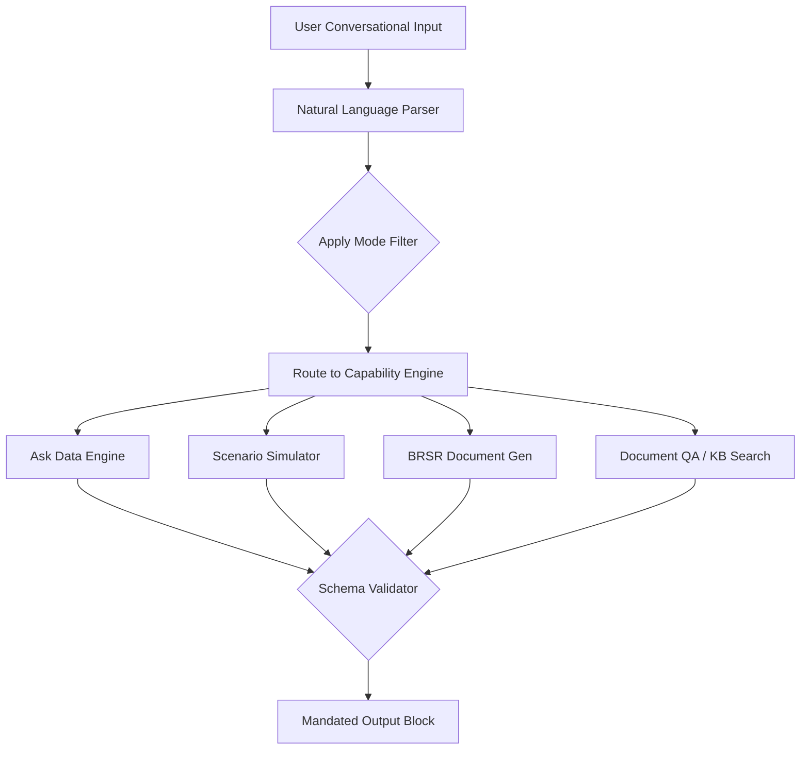

# SustainOCPM: AI Copilot UX Specification
## Conversational Interface & Experience Framework

This document outlines the user interface (UI) and user experience (UX) specifications for the SustainOCPM AI Copilot. The AI Copilot serves as an intelligent agent enabling natural language exploration of complex Object-Centric Event Logs (OCEL 2.0), carbon attribution matrices, and environmental compliance frameworks.

---

### 1. Copilot Personas & Modes

The Copilot dynamically adapts its behaviors, UI focus areas, and analytical depth based on the selected Mode.

| Mode | Target User Persona | Primary Analytical Lens & Tone | Default Data Filters / Scope |
| :--- | :--- | :--- | :--- |
| **Executive Mode** | C-Suite, Board Members, VPs | Strategic, financial risk mitigation, high-level ESG ratings, ROI, summary metrics | High-level corporate structure, aggregated facility metrics, annual targets |
| **Research Mode** | Academic Researchers, PhDs | Rigorous, scientific, statistical validation, event-log anomalies, hypothesis testing | Full granularity event logs (OCEL 2.0), raw parameters, dynamic graphs |
| **Auditor Mode** | Internal/External Compliance Inspectors | Forensic, strict compliance, evidence-first, trail tracing, conformance validation | Transaction histories, event validation logs, system sign-offs, immutable records |
| **ESG Consultant Mode** | Sustainability Officers, Consultants | Materiality, framework alignment (GRI/SASB/TCFD), benchmark comparisons | Facility-level resource metrics, carbon intensities, supplier scorecards |
| **Process Mining Expert**| Data Scientists, Process Analysts | Algorithmic, topological process flows, case notions, throughput, bottleneck analysis | Multi-object event logs, case definitions, activity/transition matrices |
| **BRSR Mode** | Indian Compliance Officers | Regulatory, SEBI alignment, Part A/B/C disclosure validation, quantitative indicators | SEBI-mandated entities, employee metrics, community footprint, local Scope 1/2/3 |

---

### 2. Core Copilot Capabilities

The table below specifies the UX inputs, system outputs, and expected system behaviors for each core capability.



#### A. Ask Data
*   **UX Inputs:** Natural language questions about process instances, metrics, or anomalies (e.g., *"Which batch had the highest emission variance last Tuesday?"*).
*   **System Outputs:** Direct answers paired with auto-generated data visualizations (charts, timelines) and deep links to relevant pages.
*   **Behavior:** Translate NL queries to object queries against the database without exposing raw query syntax to the user.

#### B. Executive Summary
*   **UX Inputs:** Click trigger or text prompt (e.g., *"Generate a weekly summary for the Mumbai plant"*).
*   **System Outputs:** Bullet-point highlights of carbon trends, major process bottlenecks, and operational deviations.
*   **Behavior:** Aggregate metrics across all objects within the time/facility scope and present a consolidated dashboard summary.

#### C. Carbon Analysis
*   **UX Inputs:** Prompts requesting carbon allocation metrics (e.g., *"Why did Scope 3 emissions spike for steel deliveries?"*).
*   **System Outputs:** Apportionment breakdown, process heatmap highlighting carbon-heavy steps, and supplier contribution chart.
*   **Behavior:** Query the carbon attribution engine to trace emissions back to specific events (machining, transport) and objects (steel batches).

#### D. ESG Analysis
*   **UX Inputs:** Prompts referencing specific framework guidelines (e.g., *"How do we stand on SASB material sourcing guidelines?"*).
*   **System Outputs:** Progress indicators against SASB/GRI metrics and gaps identified in existing logs.
*   **Behavior:** Cross-reference operational event metrics with GRI/SASB mapping tables to identify omissions or performance gaps.

#### E. Supplier Analysis
*   **UX Inputs:** Prompts analyzing supply chain partners (e.g., *"Rank suppliers based on carbon intensity per unit delivered"*).
*   **System Outputs:** Comparative ranking list, supplier risk matrix, and optimization suggestions.
*   **Behavior:** Segment process objects by "Supplier ID" and calculate total emissions divided by unit volume for each supplier.

#### F. Conformance Analysis
*   **UX Inputs:** Prompts asking about rule violations (e.g., *"Find all instances where the green logistics path was bypassed"*).
*   **System Outputs:** Flowcharts highlighting deviation steps, volume of non-conforming items, and potential causes.
*   **Behavior:** Compare discovered multi-object process maps with the normative reference model and flag non-matching event sequences.

#### G. BRSR Generation
*   **UX Inputs:** Prompt requesting compliance generation (e.g., *"Draft Part C, Principle 6 for the FY25 BRSR filing"*).
*   **System Outputs:** Drafted text and populated tables matching the SEBI BRSR Excel format.
*   **Behavior:** Retrieve corresponding operational data, format it into BRSR-aligned templates, and provide a download/export option.

#### H. Scenario Simulation
*   **UX Inputs:** "What-if" parameters (e.g., *"What happens to our carbon intensity if we shift 30% of logistics from road to rail?"*).
*   **System Outputs:** Comparative charts mapping baseline vs. simulated scenarios for emissions and operational throughput.
*   **Behavior:** Feed parameters to the process simulation engine and run Monte Carlo runs using historically discovered routing characteristics.

#### I. Digital Twin Comparison
*   **UX Inputs:** Selection of two process variants or historical periods (e.g., *"Compare Mumbai Plant Q1 with Zurich Plant Q1"*).
*   **System Outputs:** Side-by-side process graphs highlighting structural differences, cycle times, and carbon intensity delta.
*   **Behavior:** Render multi-object event logs of both targets simultaneously, highlights structural deltas, and run variance tests.

#### J. Document QA & Knowledge Base Search
*   **UX Inputs:** Questions referencing external standards, PDFs, or regulations (e.g., *"What does SEBI say about Scope 3 reporting deadlines in BRSR?"*).
*   **System Outputs:** Direct text extract from documents with page numbers, document reference, and relevance confidence score.
*   **Behavior:** Execute RAG (Retrieval-Augmented Generation) query over the uploaded PDF regulations and company policies index.

---

### 3. Layout Specifications

The Copilot UI is built around a collapsible right-hand workspace drawer, enabling simultaneous analysis of the live user interface and AI insights.

```
+---------------------------------------------------------------------------------------------------+
| LIVE INTERACTIVE SCREEN (e.g., Discovered Process Map, Performance Dashboard)                     |
+---------------------------------------------------------------------------------------------------+
| AI COPILOT WORKSPACE DRAWER (Collapsible Right Side, Width: 480px)                                |
|                                                                                                   |
| +-----------------------------------------------------------------------------------------------+ |
| | HEADER: [Mode Selector: Process Mining Expert | v ]                         [Settings] [Close] | |
| +-----------------------------------------------------------------------------------------------+ |
| | CHAT SCROLL AREA                                                                              | |
| |                                                                                               | |
| |   User: "Identify where our carbon intensity deviates from the reference model."             | |
| |                                                                                               | |
| |   Copilot: [Mandated Output Block]                                                            | |
| |   - ANSWER: Conformance checking revealed 3 key process loops driving 82% of deviations...   | |
| |   - EVIDENCE: Drawer [View 12 Deviant Batches]                                                | |
| |   - Explainability: [Confidence: High (94%)] | [Show Derivation Formulas]                     | |
| |                                                                                               | |
| +-----------------------------------------------------------------------------------------------+ |
| | PROMPT SUGGESTIONS (Chips)                                                                    | |
| |  [Show me the BRSR Part C Table]  [Analyze Supplier Carbon]  [Simulate rail logistics shift]  | |
| +-----------------------------------------------------------------------------------------------+ |
| | INPUT AREA                                                                                    | |
| |  [Type your query...                                                                       >] | |
| |  [Attach Document]                                                 [Voice Command Control]    | |
| +-----------------------------------------------------------------------------------------------+ |
+---------------------------------------------------------------------------------------------------+
```

#### A. Chat Layout
*   **Placement:** Slides out from the right margin; does not overlay active charts but compresses the main dashboard content space dynamically.
*   **Controls:** Minimum size 400px, expandable to 800px (Split View), collapsible to a single float button.

#### B. Prompt Suggestions
*   **Behavior:** Context-aware prompt suggestions (chips) are served dynamically based on the active screen. If the user is on the "Conformance Checking" screen, the suggestions auto-focus on deviations and rules.

#### C. Response Structure & Panels
*   **Evidence Drawer:** A slide-out panel within the chat that displays the exact raw data, event tables, or transaction records that back up the AI's claim.
*   **Explainability Panel:** Clicking "Show Derivation" opens a popover detailing how the AI parsed the prompt, which database entities it queried, and the steps it took to generate the result.
*   **Confidence Indicators:** Color-coded badges:
    *   *High (Green, >90%):* Based on direct database queries.
    *   *Medium (Yellow, 70-90%):* Includes estimated parameters or RAG documents.
    *   *Low (Red, <70%):* Extrapolations or partial logs.
*   **Recommendations Panel:** Dedicated sub-section proposing actionable mitigations (e.g., *"Reroute batch 42 to reduce footprint by 15%"*).
*   **Citations & Methodology Links:** Tiny tags listing references like `[ecoinvent v3.9]` or `[GRI 305-1 (2016)]` that link directly to external standard definitions or database metadata.
*   **Follow-Up Questions:** 3 context-aware follow-up options generated dynamically at the end of each response block.

---

### 4. Mandated Output Schema

Every conversational output block returned by the AI Copilot must strictly adhere to the following schema structure. If a field is not applicable to the context, it must be returned as empty rather than omitted, preserving structural consistency.

```yaml
OutputBlock:
  Answer: "The core textual response answering the user query. Must be clear, direct, and free of filler language."
  Evidence:
    VisualLink: "Reference to the specific page or component ID within the app (e.g., /conformance/deviations)."
    TargetObjectIDs: ["List of unique IDs in the database, e.g., 'OBJ-BATCH-2026-889'"]
  Formula: "Mathematical formulation or mathematical logic used for calculation, e.g., 'Sum(Scope 1) + Sum(Scope 2)'"
  DataSources:
    - Name: "Database table or external standard referenced (e.g., 'event_log_table', 'India GHG Grid Factor 2024')"
      ConfidenceMetric: 0.98
  Confidence:
    Score: 0.95 # Numerical score between 0.0 and 1.0
    Reasoning: "Explanation of score based on data completeness and source validity."
  Limitations:
    - "Statement outlining data gaps, estimation factors used, or potential biases in the response."
  Recommendations:
    - Action: "Specific operational action suggested to resolve the issue."
      ImpactEstimate: "Quantifiable benefit, e.g., 'Reduce emissions by 12%'"
      TargetComponent: "Link to action component in app."
```

#### Schema UI Rendering Guidelines
*   **Answer:** Rendered in standard typography.
*   **Evidence:** Displayed as interactive pill buttons that, when clicked, automatically highlight the referenced objects in the primary page view or open the Evidence Drawer.
*   **Formula:** Rendered in a LaTeX block style with a gray background.
*   **Confidence:** Visualized as a circular progress ring next to the title.
*   **Limitations & Warnings:** Highlighted with a warning border styling to ensure transparency.
