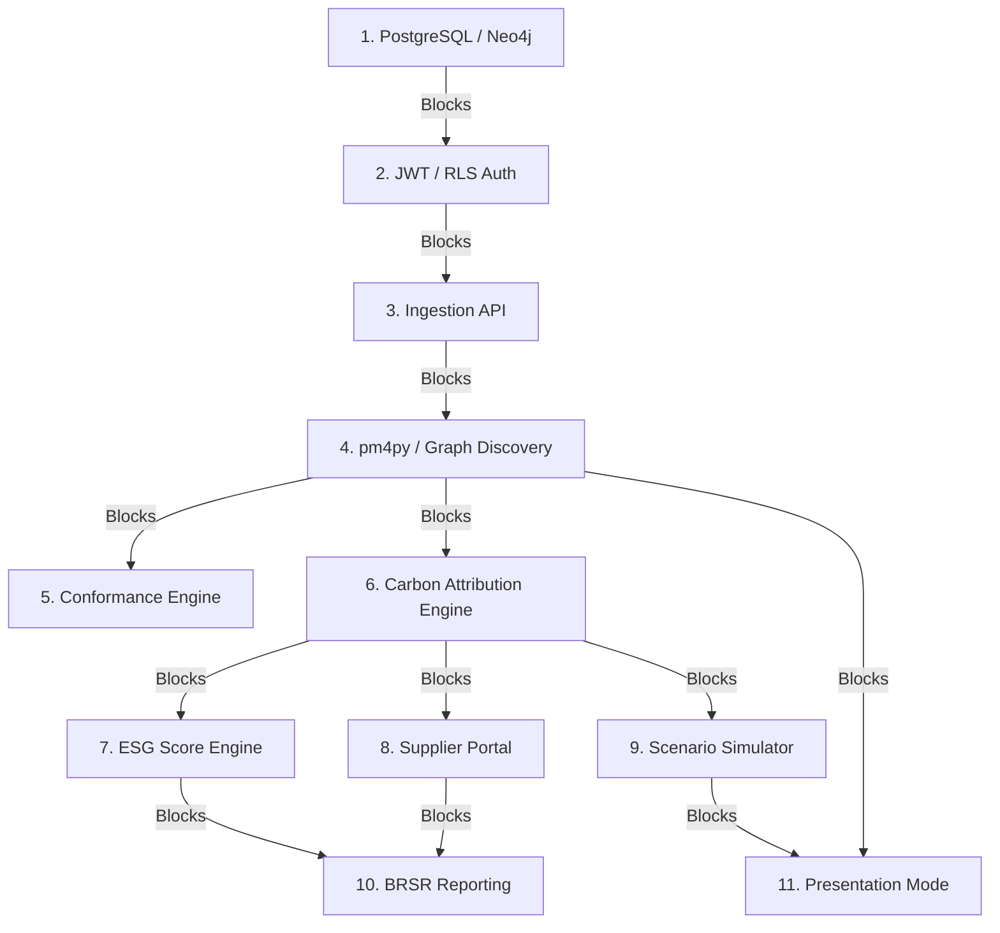

# SustainOCPM: Dependency Map

This document maps the architectural dependencies and parallel development tracks across the system's layers.

---

## 1. Architectural Layers & Core Dependencies

| Domain / Layer | Target Module | Direct Dependency | Purpose |
| :--- | :--- | :--- | :--- |
| **Database** | PostgreSQL + RLS | None | Foundational data layer; isolates tenants. |
| **Database** | Neo4j Graph Cluster | PostgreSQL | Maps event relationships. |
| **Backend** | Ingestion Engine | PostgreSQL | Saves upload records. |
| **Backend** | OCPM Graph Mapper | Ingestion Engine + Neo4j | Translates raw events to graph. |
| **Backend** | Carbon Engine | OCPM Graph Mapper | Performs carbon calculation algebra. |
| **Backend** | ESG Engine | Carbon Engine | Pulls carbon numbers to compute ESG scores. |
| **Backend** | Scenario Simulator | Carbon Engine | Uses carbon formulas to run what-if models. |
| **AI Copilot** | pgvector Store | PostgreSQL | Storage for document vectors. |
| **AI Copilot** | LLM Orchestrator | pgvector + Neo4j | Resolves chat queries using RAG and Graph data. |
| **Frontend** | Onboarding Wizard | Ingestion Engine | Provides step-by-step ingestion UX. |
| **Frontend** | Dashboards | Carbon Engine + ESG Engine | Visualizes carbon/ESG scores. |
| **Frontend** | Presentation Mode | Scenario Simulator + Dashboards | Renders live data on interactive slides. |

---

## 2. Core Build Order (What Must Be Built First)
1. **Infrastructure Foundation:** PostgreSQL, TimescaleDB, and Neo4j initialization.
2. **Security Gateway:** JWT Authentication and Row-Level Security (RLS).
3. **Ingestion Engine:** Ingestion APIs and OCEL 2.0 Mapping Services.
4. **Graph Mining Engine:** Process Discovery algorithms and pm4py configuration.

---

## 3. Parallelization Strategy (What Can Be Parallelized)
Once the Graph Mining Engine is finalized, development can split into three parallel, non-blocking tracks:
*   **Track A (Carbon & ESG):** Implementing the Carbon Attribution Service, ESG Scoring Engine, and Supplier portal.
*   **Track B (AI Copilot & Knowledge Base):** Implementing the pgvector Store, RAG pipeline, and Chat orchestration.
*   **Track C (Frontend UI):** Constructing the Onboarding interfaces, dashboard page structures, and alert panels.

---

## 4. Blocked Modules & Gates

