# SustainOCPM Design System

This document specifies the typography, color palette, spacing, layout, components, and motion tokens for SustainOCPM. These design system tokens provide a unified, accessible framework for manufacturing process analysis and sustainability intelligence dashboards.

Cross-References:
- Functional Requirements: [PRODUCT_REQUIREMENTS_DOCUMENT.md](./PRODUCT_REQUIREMENTS_DOCUMENT.md)
- User Flows & Persona Journeys: [USER_JOURNEYS.md](./USER_JOURNEYS.md)
- Navigational Hierarchy: [INFORMATION_ARCHITECTURE.md](./INFORMATION_ARCHITECTURE.md)

---

## 1. Typography

SustainOCPM uses **Inter** as its primary typeface to ensure readability in data-dense tables, graph labels, and analytics dashboards.

### Font Family & Settings
- **Primary Typeface**: `Inter, system-ui, -apple-system, sans-serif`
- **Monospace (for data values & IDs)**: `JetBrains Mono, Fira Code, monospace`
- **Font Rendering**: `-webkit-font-smoothing: antialiased; -moz-osx-font-smoothing: grayscale;`

### Type Scale & Hierarchy

| Token Name | Font Size | Line Height (Leading) | Letter Spacing (Tracking) | Font Weights | Primary Usage |
| :--- | :--- | :--- | :--- | :--- | :--- |
| `text-display-lg` | 36px (2.25rem) | 40px (1.1) | -0.02em | Bold (700) | Executive dashboards, high-level metric summaries |
| `text-display-md` | 30px (1.875rem) | 36px (1.2) | -0.02em | SemiBold (600), Bold (700) | Main page titles, header views |
| `text-h1` | 24px (1.5rem) | 32px (1.33) | -0.015em | SemiBold (600), Bold (700) | Panel headers, primary container titles |
| `text-h2` | 20px (1.25rem) | 28px (1.4) | -0.015em | Medium (500), SemiBold (600) | Table section titles, card headers |
| `text-h3` | 18px (1.125rem) | 26px (1.44) | -0.01em | Medium (500), SemiBold (600) | Popover titles, inner-card grouping labels |
| `text-body-lg` | 16px (1rem) | 24px (1.5) | 0.0em | Regular (400), Medium (500) | Copy blocks, primary onboarding text |
| `text-body-md` | 14px (0.875rem) | 20px (1.43) | 0.0em | Regular (400), Medium (500) | Tables, labels, form input fields |
| `text-caption` | 12px (0.75rem) | 16px (1.33) | +0.01em | Regular (400), Medium (500) | Legend keys, helper text, timestamps, tags |
| `text-code` | 12px (0.75rem) | 16px (1.33) | 0.0em | Regular (400) | Event log IDs, DB columns, schema mapping codes |

---

## 2. Color System

The system colors are optimized for process mining visualization, balancing high-contrast data rendering with an executive-level sustainability aesthetic.

### Core Tokens

| Semantic Role | Token Name | Light Mode Hex | Dark Mode Hex | Usage Context |
| :--- | :--- | :--- | :--- | :--- |
| **Canvas Background** | `color-bg` | `#FAFAFA` | `#0B0F19` | Global viewport background |
| **Surface (Card)** | `color-surface` | `#FFFFFF` | `#111827` | Content containers, card panels, table rows |
| **Primary Text** | `text-primary` | `#111827` | `#F9FAFB` | Headings, labels, critical information |
| **Secondary Text** | `text-secondary`| `#6B7280` | `#9CA3AF` | Supporting text, inactive state tabs, descriptions |
| **Accent / Interactive**| `color-accent` | `#2563EB` | `#3B82F6` | Primary action buttons, selection indicators |
| **Success** | `color-success`| `#16A34A` | `#22C55E` | Carbon targets met, conforming process paths |
| **Warning** | `color-warning`| `#F59E0B` | `#FBBF24` | Bottlenecks, minor compliance deviations |
| **Error / Alert** | `color-error` | `#DC2626` | `#EF4444` | Severe carbon hotspots, non-conformance, violations |

### Border & Muted Colors

| Token Name | Light Mode Hex | Dark Mode Hex | Usage Context |
| :--- | :--- | :--- | :--- |
| `border-light` | `#E5E7EB` | `#1F2937` | Standard borders, divider lines, grid overlays |
| `border-focus` | `#93C5FD` | `#2563EB` | Target outline border for focused items |
| `color-muted-bg` | `#F3F4F6` | `#1F2937` | Inactive input backgrounds, disabled states |
| `color-accent-light` | `#EFF6FF` | `#1E3A8A` | Selected item background highlight |

---

## 3. Spacing Scale

SustainOCPM relies strictly on a **4px-based grid** to maintain visual alignment across dense interactive dashboards.

| Spacing Token | Pixels | CSS Value | Utility Class Reference | Primary Usage |
| :--- | :--- | :--- | :--- | :--- |
| `space-1` | 4px | `0.25rem` | `p-1` / `m-1` | Micro-spacings, icon-text gap |
| `space-2` | 8px | `0.5rem` | `p-2` / `m-2` | Inside padding for small buttons, tag elements |
| `space-3` | 12px | `0.75rem`| `p-3` / `m-3` | Padding for form elements, list items |
| `space-4` | 16px | `1.0rem` | `p-4` / `m-4` | Standard card padding, grid item gaps |
| `space-6` | 24px | `1.5rem` | `p-6` / `m-6` | Spacing between major grid columns, cards |
| `space-8` | 32px | `2.0rem` | `p-8` / `m-8` | Section titles, dashboard group spacing |
| `space-12` | 48px | `3.0rem` | `p-12` / `m-12` | Hero sections, onboarding steps |
| `space-16` | 64px | `4.0rem` | `p-16` / `m-16` | Viewport outer padding margins |

---

## 4. Grid & Layout System

Dashboards and step-by-step setup screens follow a structured responsive system to organize OCPM diagrams, tables, and AI Copilot side-sheets.

### Desktop Grid Specification (1024px and above)
- **Columns**: 12 Columns (Flexible/Fluid)
- **Gutter Width**: `space-6` (24px)
- **Margins**: `space-8` (32px) on outer edges
- **Container Max-Width**: `1440px`

### Common Layout Patterns
1. **Three-Panel Layout**: Left Panel (Navigation/Hierarchy, 2 cols), Center Panel (Process Mining Graph, 7 cols), Right Panel (AI Copilot / Config panel, 3 cols).
2. **Setup View Layout**: Center Column (8 cols) containing interactive wizard components, flanked by empty side columns (2 cols each).
3. **Data Grid View**: Table expands to full width (12 cols) with a collapsible configuration drawer (3 cols overlays right edge).

---

## 5. Shadows & Borders

Elevation and structure tokens define surface levels, distinguishing cards, modals, and tooltips from canvas backgrounds.

### Border Radii
- `radius-sm`: **4px** — Badges, checkboxes, tags, small inputs.
- `radius-md`: **8px** — Input fields, buttons, drop-down select menus, status alerts.
- `radius-lg`: **12px** — Standard dashboard panels, cards, event-mapping boxes, modals.
- `radius-full`: **9999px** — Pill badges, avatar icons, active navigation tabs.

### Elevation & Shadows

| Elevation Level | Light Mode CSS Value | Dark Mode CSS Value | Primary Usage |
| :--- | :--- | :--- | :--- |
| `shadow-sm` | `0 1px 2px 0 rgba(0, 0, 0, 0.05)` | `0 1px 2px 0 rgba(0, 0, 0, 0.5)` | Data rows, subtle card boundaries |
| `shadow-md` | `0 4px 6px -1px rgba(0, 0, 0, 0.1), 0 2px 4px -1px rgba(0, 0, 0, 0.06)` | `0 4px 6px -1px rgba(0, 0, 0, 0.3), 0 2px 4px -1px rgba(0, 0, 0, 0.2)` | Interactive cards, dropdown selectors |
| `shadow-lg` | `0 10px 15px -3px rgba(0, 0, 0, 0.1), 0 4px 6px -2px rgba(0, 0, 0, 0.05)` | `0 10px 15px -3px rgba(0, 0, 0, 0.4), 0 4px 6px -2px rgba(0, 0, 0, 0.3)` | Floating action menus, Modals, AI Copilot overlay |

---

## 6. Motion & Animation Rules

Standard transition parameters prevent visual jar when state changes, maintaining a responsive, crisp enterprise feel.

- **Transition Properties Allowed**: `color`, `background-color`, `border-color`, `text-decoration-color`, `fill`, `stroke`, `opacity`, `box-shadow`, `transform`
- **Curves (Easing)**:
  - `ease-in-out` (Standard): `cubic-bezier(0.4, 0, 0.2, 1)` — Default for general elements.
  - `ease-out` (Entrance): `cubic-bezier(0, 0, 0.2, 1)` — For fly-outs, dropdown entries.
  - `ease-in` (Exit): `cubic-bezier(0.4, 0, 1, 1)` — For collapsing elements, modal closures.

### Animation Tokens

| Token Name | Duration | Easing Curve | Target State | Visual Behavior |
| :--- | :--- | :--- | :--- | :--- |
| `motion-hover` | 150ms | `ease-in-out` | Button hover, card hover, table row highlight | Smooth background color transition |
| `motion-active`| 100ms | `ease-in-out` | Button click, checkbox press, dropdown item select | Slight scale down (`scale-98`) or shadow depth reduction |
| `motion-load` | 300ms | `ease-out` | Table loading, graph rendering, new state transition | Fade-in and vertical slide up (10px offset) |
| `motion-drawer`| 250ms | `ease-out` | AI Copilot or schema configuration panel slide-out | Horizontal slide-in from right edge |

---

## 7. Iconography Guidelines

SustainOCPM integrates the **Lucide Icon** package. Icons are used functionally as labels and indicator helpers, never for pure decoration.

### Usage Standards
- **Sizing Framework**:
  - `icon-sm` (14x14px): Inline labels, table column headers.
  - `icon-md` (16x16px): Input field icons, buttons, default card navigation elements.
  - `icon-lg` (20x20px): Page header controls, panel toggle buttons.
  - `icon-xl` (24x24px): Empty states, modal icons, onboarding guides.
- **Stroke Width**: Fixed to `2px` (or `1.5px` for highly detailed icons in tight layouts).
- **Styling Rules**:
  - **Color**: Must inherit text color (`currentColor`). Muted colors applied using opacity on containers or secondary text classes.
  - **Aria Attributes**: All icons must have `aria-hidden="true"` if they are decorative. Interactive icon-only buttons must have `aria-label` set.

---

## 8. Accessibility (a11y) Standards

SustainOCPM targets **WCAG 2.1 AA** compliance globally, with key metrics fields satisfying **AAA** benchmarks.

- **Contrast Benchmarks**:
  - Normal text (under 18pt/24px): Minimum contrast ratio of **4.5:1** against the background.
  - Large text (18pt/24px and above): Minimum contrast ratio of **3:1**.
  - Interactive controls & icons: Contrast ratio of **3:1** against adjacent colors.
  - Data visualizations: Process paths must use secondary visual cues (width, pattern, or direct labels) in addition to color.
- **Interactive Targets**:
  - All clickable nodes, table headers, buttons, and switches must have a minimum interactive target size of **44x44px** (including transparent padding if necessary).
- **Keyboard Navigation**:
  - Strict focus indicators (colored ring with outline offset) must be visible when navigating via keyboard.
  - Tab order must flow logically from top-to-bottom, left-to-right.
- **Screen Reader Support**:
  - Forms must have explicit `<label>` tags.
  - Charts, process flow diagrams, and complex graphs must provide an accessible raw tabular data fallback.

---

## 9. Responsive Breakpoints

The layout dynamically shifts configurations based on screen widths to preserve multi-variable analytical workspaces.

| Breakpoint Name | Minimum Width | Core Design Constraints | Layout Adjustments |
| :--- | :--- | :--- | :--- |
| `breakpoint-sm` (Mobile) | 320px | Single-column view, full screen overlay menus | Left navigation collapses to hamburger. Process mining visualizers display a message recommending larger viewports. |
| `breakpoint-md` (Tablet) | 768px | Hybrid grid, visible panel drawers | Side-sheets default to overlay mode. Multi-column tables collapse trailing fields into detail drawers. |
| `breakpoint-lg` (Desktop) | 1024px | 12-column grid layout, persistent sidebars | Left navigation persistent. Sidebars sit side-by-side. Charts are fully interactive. |
| `breakpoint-xl` (Wide) | 1440px | Ultra-dense analytical layouts | AI Copilot panel can be pinned open alongside the primary mining graph and detailed data logs without overlap. |

---

## 10. Light/Dark Mode Strategy

Dynamic theme adjustments map semantic colors directly. Custom styles or hardcoded RGB values are restricted to preserve dynamic rendering.

```mermaid
graph TD
    classDef tokenStyle fill:#f9f,stroke:#333,stroke-width:2px;
    classDef semanticStyle fill:#bbf,stroke:#333,stroke-width:1px;

    Theme[Theme Selector] -->|Light Theme| LightTokens[Light Mode Mappings]
    Theme -->|Dark Theme| DarkTokens[Dark Mode Mappings]

    LightTokens --> BG_L["color-bg: #FAFAFA"]:::semanticStyle
    LightTokens --> Card_L["color-surface: #FFFFFF"]:::semanticStyle
    LightTokens --> Border_L["border-light: #E5E7EB"]:::semanticStyle
    LightTokens --> Text_L["text-primary: #111827"]:::semanticStyle
    LightTokens --> TextSec_L["text-secondary: #6B7280"]:::semanticStyle
    LightTokens --> Accent_L["color-accent: #2563EB"]:::semanticStyle

    DarkTokens --> BG_D["color-bg: #0B0F19"]:::semanticStyle
    DarkTokens --> Card_D["color-surface: #111827"]:::semanticStyle
    DarkTokens --> Border_D["border-light: #1F2937"]:::semanticStyle
    DarkTokens --> Text_D["text-primary: #F9FAFB"]:::semanticStyle
    DarkTokens --> TextSec_D["text-secondary: #9CA3AF"]:::semanticStyle
    DarkTokens --> Accent_D["color-accent: #3B82F6"]:::semanticStyle
```

---

## 11. Interaction Feedback Rules

To guide users through OCPM analysis configurations, every interactive component must report state changes immediately.

| Component State | Border Token | Background Token | Shadow State | Font Color Token | Additional Visuals |
| :--- | :--- | :--- | :--- | :--- | :--- |
| **Default** | `border-light` | `color-surface` | `shadow-sm` | `text-primary` | Standard cursor pointer. |
| **Hover** | `color-accent` | `color-bg` | `shadow-md` | `text-primary` | Underline applied to active text-links; tooltip appears after 500ms delay. |
| **Active (Click)** | `color-accent` | `color-accent-light` | `shadow-sm` (Inset) | `text-primary` | Scale transform adjusted to `scale-98`. |
| **Focus (Tabbed)** | `border-focus` | `color-surface` | Outline Ring (2px) | `text-primary` | Outer glow matching `border-focus`. |
| **Disabled** | `border-light` | `color-muted-bg` | None | `text-secondary` | `cursor-not-allowed` pointer override, opacity set to 50%. |
| **Loading** | `border-light` | `color-muted-bg` | None | `text-secondary` | Display spinning loader icon, disable click listeners. |
