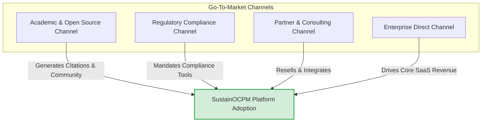

# SustainOCPM — Enterprise Roadmap

This document outlines the strategic product roadmap, enterprise features architecture, trust and explainability framework, pricing structure, go-to-market strategies, and scaling metrics for SustainOCPM. SustainOCPM is designed to transition from a bilateral research project into a dominant enterprise platform that integrates Object-Centric Process Mining (OCPM) with carbon attribution, regulatory compliance, and decision intelligence.

---

## 1. Platform Maturity Phases

The evolution of SustainOCPM is divided into five distinct phases over a 40-month timeline, bridging the gap between advanced research and enterprise-scale deployment.

```mermaid
gantt
    title SustainOCPM Platform Maturity Timeline
    dateFormat  YYYY-MM
    axisFormat  %m-%Y
    
    section Platform Phases
    Phase 1: Research Prototype  :active, p1, 2026-06, 8m
    Phase 2: Alpha Platform      :p2, after p1, 8m
    Phase 3: Beta Platform       :p3, after p2, 8m
    Phase 4: GA Release          :p4, after p3, 8m
    Phase 5: Enterprise Scale    :p5, after p4, 8m
```

### Phase 1: Research Prototype (Months 1-8)
*   **Core Capabilities:**
    *   Ingestion of standard OCEL 2.0 logs (JSON-XML, relational SQLite database).
    *   Basic Object-Centric Event Analysis (OCEAn) discovery algorithms (object-centric Petri nets, process graph visualizations).
    *   Static Scope 1, 2, and 3 carbon attribution models mapping emissions to event types and object types.
    *   Manual BRSR Part C compliance template generation (PDF/Excel exports).
*   **Target Users:**
    *   Academic researchers in process mining and sustainability.
    *   Bilateral grant reviewers (Indo-Swiss Joint Research Committee).
    *   Internal development team and initial pilot engineers.
*   **Target Customers:**
    *   Early-adopter research institutions.
    *   Two designated pilot manufacturing partners (one in India, one in Switzerland).

### Phase 2: Alpha Platform (Months 9-16)
*   **Core Capabilities:**
    *   In-memory graph processing for medium-sized OCEL datasets (up to 10M events).
    *   Dynamic emissions factor lookup integrated with public databases (e.g., Ecoinvent, DEFRA).
    *   Basic conformance checking comparing OCEL logs to normative BPMN/declare models.
    *   Initial AI Copilot interface for querying log stats and generating process summaries.
    *   Basic multi-tenant architecture with organizational isolation.
*   **Target Users:**
    *   Sustainability officers in pilot organizations.
    *   Process analysts seeking to combine performance and ESG metrics.
    *   ESG consultants drafting early compliance reports.
*   **Target Customers:**
    *   5-10 mid-market manufacturing and logistics companies in India and Europe.
    *   Partner consulting firms validating carbon-attribution models.

### Phase 3: Beta Platform (Months 17-24)
*   **Core Capabilities:**
    *   Distributed query execution engine over OCEL logs using Apache Spark / DuckDB clusters.
    *   Real-time event streaming and ingestion pipeline support (Apache Kafka, MQTT for IoT/Scope 1 emissions tracking).
    *   Comprehensive conformance checking with environmental violation alerts.
    *   Scenario simulator modeling the impact of operational changes on both process execution times and carbon footprints.
    *   Drafting and approval workflows for regulatory ESG audits.
*   **Target Users:**
    *   Chief Sustainability Officers (CSOs).
    *   Operations managers optimizing production lines.
    *   Compliance officers preparing for CSRD and BRSR audits.
*   **Target Customers:**
    *   20-30 enterprise customers across heavy manufacturing, chemicals, and pharmaceutical sectors.
    *   Public sector regulatory agencies evaluating pilot ESG frameworks.

### Phase 4: General Availability (GA) Release (Months 25-32)
*   **Core Capabilities:**
    *   Production-ready, highly available, multi-tenant SaaS architecture with enterprise-grade security (SOC2 Type II, ISO 27001).
    *   No-code scenario builder and digital twin modeling interface.
    *   Out-of-the-box connectors for major ERPs (SAP S/4HANA, Oracle Cloud, Microsoft Dynamics) to ingest process and emissions data.
    *   Fully functional AI Copilot with autonomous agent execution for process optimization suggestions.
    *   Granular Role-Based Access Control (RBAC) and comprehensive system audit trails.
*   **Target Users:**
    *   External financial and environmental auditors.
    *   Supply chain directors managing Scope 3 carbon compliance.
    *   Business unit heads tracking operational KPIs and ESG limits.
*   **Target Customers:**
    *   100+ global enterprises requiring automated BRSR, CSRD, and SEC climate disclosure reports.

### Phase 5: Enterprise Scale (Months 33-40)
*   **Core Capabilities:**
    *   Global multi-region deployments with regional data residency compliance (GDPR, India DPDP Act).
    *   Peta-scale log processing support utilizing serverless distributed query engines.
    *   Self-learning process mining loops that automatically suggest and execute RPA/workflow adjustments.
    *   Industry benchmarking networks with anonymous peer comparison of process efficiency and carbon intensity.
    *   Advanced digital twin simulation with real-time operational feedback loops.
*   **Target Users:**
    *   C-Suite executives (CEO, CFO, COO, CSO).
    *   Global operations risk committees.
    *   Independent third-party certification bodies (TÜV, SGS, PwC).
*   **Target Customers:**
    *   500+ Fortune 500 multinationals and top 1000 listed entities in India.

---

## 2. Enterprise Features Architecture

This section details the 15 core enterprise features that transform SustainOCPM from a research framework into a secure, scalable enterprise SaaS application.

### 2.1 Multi-Tenant SaaS
*   **Description:** A secure, cloud-native architecture ensuring complete logical isolation of data, configurations, models, and metadata between separate client accounts (tenants).
*   **User Stories:**
    1.  *As an IT Administrator,* I want to provision a new client tenant within 5 minutes, ensuring their database and execution compute are completely isolated from others.
    2.  *As an Enterprise Security Officer,* I want to enforce tenant-specific encryption keys (BYOK) so that our data cannot be accessed by other tenants or cloud operators.
    3.  *As a DevOps Engineer,* I want to monitor resource consumption on a per-tenant basis to optimize infrastructure costs and allocate utility charges.
*   **Architectural Components:**
    *   *Tenant Router:* Ingress controller routing requests based on subdomains or custom domains.
    *   *Isolated Database Routing:* Connection-pool router that switches schemas or databases dynamically based on the validated JWT claim.
    *   *KMS Integration:* Integration with AWS KMS / HashiCorp Vault to manage tenant-specific envelope encryption keys.
*   **Dependencies:** Identity Provider, Shared Compute Fabric.
*   **Complexity:** XL
*   **Phase Assignment:** Phase 2 (Alpha)

### 2.2 Role-Based Access Control (RBAC)
*   **Description:** Granular authorization mechanism allowing administrators to define roles with specific permissions down to the object type, event attribute, and menu screen level.
*   **User Stories:**
    1.  *As an Administrator,* I want to assign the "ESG Auditor" role to an external consultant, giving them read-only access to emissions metrics without showing operational cost attributes.
    2.  *As an Operations Manager,* I want to restrict access to the "Manufacturing Line 4" workspace to authorized operators only.
    3.  *As an Analyst,* I want to view process graphs but be blocked from modifying conformance checking models.
*   **User Story Acceptance Criteria:**
    *   Access token must contain structural scopes mapping to resources.
    *   System must reject API queries that reference forbidden object types or event attributes.
    *   UI must dynamically render components based on current user permissions.
*   **Architectural Components:**
    *   *PEP (Policy Enforcement Point):* API gateway filter checking request scopes.
    *   *PDP (Policy Decision Point):* OPA (Open Policy Agent) service evaluating policies written in Rego.
    *   *Attribute Masker:* Middleware to redact sensitive fields (like cost, vendor name) from event log queries.
*   **Dependencies:** Multi-Tenant SaaS, Auth0/Okta integration.
*   **Complexity:** M
*   **Phase Assignment:** Phase 2 (Alpha)

### 2.3 Organization Management
*   **Description:** Hierarchical management of business units, subsidiaries, and departments within a single tenant to support complex multi-national corporate structures.
*   **User Stories:**
    1.  *As a Group ESG Director,* I want to view a consolidated carbon attribution dashboard for the entire corporation while allowing subsidiary managers to see only their local operations.
    2.  *As a Regional Administrator,* I want to create a new sub-organization for the Indian operations to comply with local BRSR regulations.
    3.  *As a Finance Controller,* I want to assign cost-center codes to different organizational nodes to track emissions-intensity-per-revenue.
*   **Architectural Components:**
    *   *Organization Tree Service:* Manages the hierarchical relationship in a relational graph.
    *   *Data Inheritance Engine:* Automatically cascades security policies down the organizational hierarchy.
*   **Dependencies:** Multi-Tenant SaaS, RBAC.
*   **Complexity:** M
*   **Phase Assignment:** Phase 3 (Beta)

### 2.4 Workspace Management
*   **Description:** Sandboxed environments within an organization where analysts can import logs, create custom process models, run simulations, and build dashboards without affecting production systems.
*   **User Stories:**
    1.  *As a Process Analyst,* I want to create a temporary workspace to test a new OCEL log mapping before publishing the metrics to the main ESG team.
    2.  *As a Team Lead,* I want to share a specific workspace with my department colleagues so we can collaborate on optimizing the supply chain route.
    3.  *As an Auditor,* I want to see a list of all active workspaces and their associated raw datasets.
*   **Architectural Components:**
    *   *Workspace Metadata Store:* Manages state, ownership, and permissions for workspaces.
    *   *Sandbox Data Manager:* Coordinates temporary table creation and memory limits in the query engine.
*   **Dependencies:** Org Management, RBAC.
*   **Complexity:** S
*   **Phase Assignment:** Phase 2 (Alpha)

### 2.5 Audit Trail
*   **Description:** An immutable, chronological ledger of all user actions, configuration changes, model updates, and data exports, required for regulatory and compliance validation.
*   **User Stories:**
    1.  *As a Compliance Auditor,* I want to query a complete change log for the "Scope 2 Emissions Formula" to verify who changed the grid emission factor and when.
    2.  *As an IT Auditor,* I want to trace all data exports to verify that no unauthorized user downloaded raw manufacturing logs.
    3.  *As a System Administrator,* I want to see a log of all failed login attempts and permission check rejections.
*   **Architectural Components:**
    *   *Audit Log Publisher:* Async middleware publishing event data to a messaging queue (e.g., Kafka).
    *   *WORM (Write Once Read Many) Storage:* Log archival utilizing AWS S3 Object Lock in compliance mode.
*   **Dependencies:** Multi-Tenant SaaS, RBAC.
*   **Complexity:** L
*   **Phase Assignment:** Phase 3 (Beta)

### 2.6 Collaboration Hub
*   **Description:** Integrated communication tools enabling process analysts, sustainability managers, and auditors to comment, share insights, assign tasks, and tag peers directly on process models and dashboards.
*   **User Stories:**
    1.  *As a Sustainability Manager,* I want to highlight a specific process bottleneck with high carbon intensity and assign an optimization task to the Plant Manager.
    2.  *As an ESG Auditor,* I want to add a comment directly to a conformance violation node asking for evidence of compliance.
    3.  *As a Process Analyst,* I want to receive real-time notifications when another team member updates a shared simulation model.
*   **Architectural Components:**
    *   *Real-time Sync Engine:* WebSockets-based communication server for presence and chat.
    *   *Task & Notification Service:* Manages alerts, emails, and integrations with enterprise channels (Teams, Slack, Jira).
*   **Dependencies:** Workspace Management, RBAC.
*   **Complexity:** M
*   **Phase Assignment:** Phase 3 (Beta)

### 2.7 Versioned Analyses
*   **Description:** Git-like version control system for process models, dashboards, metrics formulas, and conformance criteria, allowing users to track progress, rollback, and compare versions.
*   **User Stories:**
    1.  *As a Process Analyst,* I want to commit a new version of the "Procure-to-Pay" process model with detailed commit notes, so my team can see my changes.
    2.  *As a Sustainability Manager,* I want to roll back the carbon attribution rules to the version used in the FY25 report to replicate a baseline calculation.
    3.  *As an Auditor,* I want to perform a diff comparison between two versions of the BRSR mapping logic.
*   **Architectural Components:**
    *   *Configuration Versioning Service:* Git-compatible backend storing JSON-serialized process models and formulas.
    *   *Diff Calculation Engine:* Visual diff generator for process graphs and model structures.
*   **Dependencies:** Workspace Management.
*   **Complexity:** L
*   **Phase Assignment:** Phase 3 (Beta)

### 2.8 Alert Center
*   **Description:** Centralized notification engine that evaluates continuous process streams against thresholds (time, cost, emissions) and triggers emails, webhooks, or ticketing system workflows.
*   **User Stories:**
    1.  *As a Supply Chain Manager,* I want to receive an alert if the average Scope 3 emission of a product batch exceeds our ESG target by more than 10%.
    2.  *As a Plant Safety Officer,* I want a critical system ticket to be created in ServiceNow when conformance checking detects a safety steps bypass.
    3.  *As an IT Admin,* I want to configure alert routing rules so that critical warnings go to Slack and minor deviations are aggregated into a daily email digest.
*   **Architectural Components:**
    *   *Rules Evaluation Engine:* Stream processing engine (e.g., Flink) checking rules against inbound events.
    *   *Notification Router:* Dispatcher for various notification targets (Webhook, Email, SMS, Slack, ServiceNow).
*   **Dependencies:** Audit Trail, Org Management.
*   **Complexity:** M
*   **Phase Assignment:** Phase 3 (Beta)

### 2.9 Sustainability Knowledge Base
*   **Description:** An integrated repository of global emissions factors (Ecoinvent, DEFRA, IPCC), environmental standards (GRI, GHG Protocol), and internal compliance guidelines.
*   **User Stories:**
    1.  *As an ESG Analyst,* I want to search for the latest regional grid emission factor for Western India to apply it to our manufacturing step.
    2.  *As a Compliance Officer,* I want to review the GRI standards reference inside the platform to check if our process steps align with standard reporting requirements.
    3.  *As a system user,* I want the AI Copilot to reference internal sustainability policies when suggesting process optimizations.
*   **Architectural Components:**
    *   *Database Connector API:* Feeds and updates datasets from public/paid carbon registries.
    *   *Semantic Search Engine:* Vector database (e.g., Qdrant) hosting embedded ESG standards and documents.
*   **Dependencies:** None.
*   **Complexity:** S
*   **Phase Assignment:** Phase 2 (Alpha)

### 2.10 Document Intelligence
*   **Description:** AI-powered document parsing engine that extracts emissions data, activity factors, and transport distances from purchase invoices, utility bills, and shipping manifests, transforming them into OCEL event attributes.
*   **User Stories:**
    1.  *As a Supply Chain Officer,* I want to upload a batch of shipping manifests, and have the system automatically extract fuel consumption and ton-kilometer attributes.
    2.  *As an Auditor,* I want to click on an event's Scope 2 attribute and see the original PDF utility bill with the extracted values highlighted.
    3.  *As a Logistics Manager,* I want the tool to extract supplier carbon credentials (e.g., ISO 14001 certificates) and flag non-compliant vendors.
*   **Architectural Components:**
    *   *OCR and Extraction Pipeline:* LLM-based layout parser (e.g., DocumentAI, customized LLM) that reads invoices/documents.
    *   *Log Mapper:* Component that parses extracted JSON key-value pairs into OCEL 2.0 objects and event attributes.
*   **Dependencies:** Multi-Tenant SaaS, Alert Center.
*   **Complexity:** XL
*   **Phase Assignment:** Phase 4 (GA)

### 2.11 Scenario Simulator
*   **Description:** A simulation engine that lets users run "what-if" scenarios (e.g., swapping a supplier, changing transport modes, or automating a step) to predict process latency, costs, and carbon emission changes.
*   **User Stories:**
    1.  *As an Operations Director,* I want to simulate changing our primary logistics provider to rail transport to evaluate the trade-off between lead time and carbon emissions.
    2.  *As a Process Architect,* I want to simulate automating a quality-checking step to calculate the reduction in paper waste and cycle time.
    3.  *As a CFO,* I want to run a simulation modeling a 20% increase in regional carbon tax to see the financial impact on our current manufacturing lines.
*   **Architectural Components:**
    *   *Monte Carlo Simulation Engine:* Generates event distributions based on historic variances.
    *   *OCEL Graph Simulator:* Walks through object-centric process topologies under modified attributes and routing probabilities.
*   **Dependencies:** Versioned Analyses, Sustainability Knowledge Base.
*   **Complexity:** XL
*   **Phase Assignment:** Phase 3 (Beta)

### 2.12 Process Digital Twin
*   **Description:** A near real-time virtual replica of the physical processes, combining live IoT telemetry, ERP transactions, and supply chain data to monitor efficiency and carbon metrics continuously.
*   **User Stories:**
    1.  *As a Plant Manager,* I want to view a 3D process map of our factory floor with live overlays of energy consumption and machine throughput.
    2.  *As a Maintenance Engineer,* I want to see predicted machine failures based on abnormal energy spikes in the digital twin.
    3.  *As a Carbon Auditor,* I want to replay yesterday's shift in the digital twin to observe exactly when and why our Scope 1 emissions spiked.
*   **Architectural Components:**
    *   *Time-Series Database:* (e.g., TimescaleDB, InfluxDB) storing high-frequency IoT data.
    *   *Digital Twin State Synchronizer:* Combines real-time event streams with the static OCEL graph to keep the active process representation updated.
*   **Dependencies:** Scenario Simulator, Alert Center.
*   **Complexity:** XL
*   **Phase Assignment:** Phase 5 (Enterprise Scale)

### 2.13 Cross-Organization Benchmarking
*   **Description:** A secure, privacy-preserving analytics framework that anonymizes client data to allow organizations to compare their process efficiency and carbon footprints against industry peers.
*   **User Stories:**
    1.  *As a Sustainability Director,* I want to compare our "Procure-to-Pay" carbon footprint percentile against companies of similar size in the same sector.
    2.  *As a Plant Manager,* I want to compare my plant's cycle time and Scope 1 intensity against regional benchmarks.
    3.  *As an Industry Evaluator,* I want to download sector-wide anonymized process metrics to publish environmental benchmark guides.
*   **Architectural Components:**
    *   *Anonymization and Aggregation Engine:* Strips identifier columns and aggregates metrics.
    *   *Federated Learning / Data Sharing Network:* Secure database views sharing only aggregated KPIs.
*   **Dependencies:** Multi-Tenant SaaS, Org Management.
*   **Complexity:** L
*   **Phase Assignment:** Phase 5 (Enterprise Scale)

### 2.14 Maturity Assessment Engine
*   **Description:** An assessment framework that evaluates an organization's process mining and carbon reporting capabilities, providing recommendations to progress toward net-zero targets.
*   **User Stories:**
    1.  *As a Chief Sustainability Officer,* I want to run a maturity assessment to see how our carbon reporting processes align with global best practices (e.g., GRI Level 3).
    2.  *As an ESG Consultant,* I want to access a guided roadmap of recommended process optimizations based on our maturity score.
    3.  *As a Board Member,* I want to export our ESG maturity scorecard to share with investors during financial briefings.
*   **Architectural Components:**
    *   *Maturity Rule Parser:* Evaluates operational metrics and compliance coverage against a predefined maturity rubric.
    *   *Recommendation Builder:* Matches gaps in the maturity scorecard with actions from the Knowledge Base.
*   **Dependencies:** Sustainability Knowledge Base.
*   **Complexity:** S
*   **Phase Assignment:** Phase 4 (GA)

### 2.15 Autonomous Workflow Automation
*   **Description:** Integrated automation layer that detects high-emission process variants and executes RPA scripts, ERP API transactions, or workflow updates to correct process deviations.
*   **User Stories:**
    1.  *As an Operations Manager,* I want the system to automatically trigger a warehouse re-routing command in SAP when a high-carbon transport option is detected.
    2.  *As a Procurement Officer,* I want to configure the platform to automatically blacklist a supplier in the ERP system if they fail three consecutive sustainability audits.
    3.  *As a System Admin,* I want to view a log of all automated actions taken by the platform, including their success rates and carbon savings.
*   **Architectural Components:**
    *   *Action Execution Engine:* Connects to external systems via REST APIs, webhooks, or RPA runtimes.
    *   *Decision Orchestrator:* Human-in-the-loop validation flow for approval before execution of high-impact automated actions.
*   **Dependencies:** Alert Center, Process Digital Twin.
*   **Complexity:** XL
*   **Phase Assignment:** Phase 5 (Enterprise Scale)

---

## 3. Trust & Explainability Architecture

To drive enterprise adoption, SustainOCPM implements a 10-level Trust Stack. This stack guarantees that every ESG metric, optimization suggestion, and dashboard view can be traced back to its raw event logs and data lineage.

```
+-------------------------------------------------------------+
| Level 10: Explainability Layer (Natural Language Reasoning) |
+-------------------------------------------------------------+
                            |
+-------------------------------------------------------------+
| Level 9: System Audit Trail (Change and Access Log)        |
+-------------------------------------------------------------+
                            |
+-------------------------------------------------------------+
| Level 8: Data Lineage (ETL, Source Schema Map, Ingestion)   |
+-------------------------------------------------------------+
                            |
+-------------------------------------------------------------+
| Level 7: Source Events (OCEL 2.0 Objects, Attributes)        |
+-------------------------------------------------------------+
                            |
+-------------------------------------------------------------+
| Level 6: Raw Records (Aggregated Object & Event Counts)     |
+-------------------------------------------------------------+
                            |
+-------------------------------------------------------------+
| Level 5: Calculation Logic (Execution Graph, Engine State)  |
+-------------------------------------------------------------+
                            |
+-------------------------------------------------------------+
| Level 4: Thresholds & Budgets (Targets, Compliance Limits)  |
+-------------------------------------------------------------+
                            |
+-------------------------------------------------------------+
| Level 3: Calculation Inputs (Parameters, Emission Factors)  |
+-------------------------------------------------------------+
                            |
+-------------------------------------------------------------+
| Level 2: Metric Formula (Mathematical Specification)        |
+-------------------------------------------------------------+
                            |
+-------------------------------------------------------------+
| Level 1: Metric Value (Consolidated ESG KPI Result)         |
+-------------------------------------------------------------+
```

### Level 1: Metric Value
*   **Definition:** The final consolidated KPI result displayed on an executive dashboard.
*   **Data Model:**
    ```json
    {
      "metric_id": "scope3_purchased_goods_ytd",
      "value": 14205.82,
      "unit": "tCO2e",
      "timestamp": "2026-06-16T12:00:00Z",
      "status": "APPROVED",
      "confidence_score": 0.94
    }
    ```
*   **API Endpoint:** `GET /api/v1/metrics/{metric_id}/value`
*   **UI Concept:** A high-impact dashboard KPI card showing the value, comparison trend, and a prominent "Trace Value" button that opens the Trust Stack panel.
*   **Performance Considerations:** Pre-aggregated and cached in Redis. Refreshed asynchronously upon ingest changes.

### Level 2: Metric Formula
*   **Definition:** The mathematical and logical definition of the metric.
*   **Data Model:**
    ```json
    {
      "formula_id": "scope3_pg_formula_v2",
      "metric_id": "scope3_purchased_goods_ytd",
      "expression": "SUM(events.quantity * inputs.emission_factor * inputs.transport_distance_km * inputs.transport_factor)",
      "variables": ["quantity", "emission_factor", "transport_distance_km", "transport_factor"],
      "created_by": "user_182",
      "checksum": "sha256_e3b0c442"
    }
    ```
*   **API Endpoint:** `GET /api/v1/metrics/{metric_id}/formula`
*   **UI Concept:** A LaTeX-formatted equation viewer displaying the exact formula with interactive hovers for each variable explaining its semantic definition.
*   **Performance Considerations:** Static schema read. Low performance overhead.

### Level 3: Calculation Inputs
*   **Definition:** The specific parameters, conversion factors, and data tables fed into the formula.
*   **Data Model:**
    ```json
    {
      "input_id": "ef_steel_road_transport",
      "type": "EMISSION_FACTOR",
      "value": 0.1204,
      "unit": "kgCO2e/t-km",
      "source": "Ecoinvent v3.9.1",
      "version": "2025-Q4",
      "active": true
    }
    ```
*   **API Endpoint:** `GET /api/v1/metrics/{metric_id}/inputs?timestamp=2026-06-16T12:00:00Z`
*   **UI Concept:** An input registry table highlighting which emission factor database was accessed, showing safety margins or uncertainty percentages.
*   **Performance Considerations:** Cached in application memory. Indexing by `input_id` and `version` is critical.

### Level 4: Thresholds & Budgets
*   **Definition:** The operational targets, regulatory limits, or carbon budget parameters.
*   **Data Model:**
    ```json
    {
      "threshold_id": "target_scope3_2026",
      "metric_id": "scope3_purchased_goods_ytd",
      "target_limit": 12000.00,
      "warning_limit": 10500.00,
      "jurisdiction": "SEBI BRSR / CSRD",
      "action_on_breach": "TRIGGER_ALERT_CSRD_COMPLIANCE"
    }
    ```
*   **API Endpoint:** `GET /api/v1/metrics/{metric_id}/thresholds`
*   **UI Concept:** Visual indicator bars on the KPI card (green, orange, red zones) with details showing regulatory citations on hover.
*   **Performance Considerations:** Evaluated in stream processing engine. Low database query impact.

### Level 5: Calculation Logic
*   **Definition:** The execution plan generated by the platform to calculate the metric from raw tables.
*   **Data Model:**
    ```json
    {
      "execution_id": "exec_88319a8d",
      "engine": "DuckDB-Distributed-Query-Planner",
      "query_plan_json": {
        "operator": "HashAggregate",
        "children": [
          { "operator": "Projection", "attributes": ["quantity", "distance"] },
          { "operator": "HashJoin", "condition": "events.material_id = objects.material_id" }
        ]
      },
      "execution_duration_ms": 142
    }
    ```
*   **API Endpoint:** `GET /api/v1/metrics/{metric_id}/execution/{execution_id}`
*   **UI Concept:** An interactive execution graph showing query optimization nodes, similar to database explain plans, simplified for ESG auditors.
*   **Performance Considerations:** Stored in execution history tables. Purged after 90 days, retaining only metadata.

### Level 6: Raw Records
*   **Definition:** The aggregated intermediate tables (objects and event counts) that directly feed the calculation.
*   **Data Model:**
    ```json
    {
      "execution_id": "exec_88319a8d",
      "aggregated_records": [
        { "material_type": "Structural Steel", "total_quantity_tons": 520.0, "total_events": 42 },
        { "material_type": "Recycled Aluminum", "total_quantity_tons": 180.5, "total_events": 12 }
      ]
    }
    ```
*   **API Endpoint:** `GET /api/v1/metrics/{metric_id}/raw-records?execution_id=exec_88319a8d`
*   **UI Concept:** A spreadsheet-style data grid showing the compiled inputs, with options to download as CSV or export for audit.
*   **Performance Considerations:** DuckDB parquet reads. Can involve high disk I/O, optimized by column indexing and tenant partitioning.

### Level 7: Source Events (OCEL 2.0)
*   **Definition:** The specific event occurrences, object instances, and attribute values in the OCEL 2.0 database that constitute the metric's base dataset.
*   **Data Model:**
    ```json
    {
      "events": [
        {
          "event_id": "e_prod_step_442",
          "activity": "Steel Cutting",
          "timestamp": "2026-06-16T10:15:30Z",
          "omap": ["obj_steel_beam_8891"],
          "vmap": { "energy_kwh": 45.2, "scrap_rate": 0.02 }
        }
      ],
      "objects": [
        {
          "object_id": "obj_steel_beam_8891",
          "type": "Steel Beam",
          "ovmap": { "weight_tons": 12.5, "supplier": "Tata Steel" }
        }
      ]
    }
    ```
*   **API Endpoint:** `GET /api/v1/ocel/events?event_ids=e_prod_step_442`
*   **UI Concept:** A list of specific events and objects, featuring a graph visualization of object-to-event relationships.
*   **Performance Considerations:** Requires indexed primary keys in the OCEL 2.0 object-relational store. Query performance must be sub-second for small subsets.

### Level 8: Data Lineage
*   **Definition:** The pipeline data path from raw ERP or IoT source systems to the platform's database.
*   **Data Model:**
    ```json
    {
      "pipeline_id": "sap_to_sustainocpm_ingest_prod",
      "steps": [
        { "step": "SAP RFC Extraction", "status": "SUCCESS", "records_read": 14500 },
        { "step": "Schema Validation", "schema": "ocel2_manufacturing_spec_v1" },
        { "step": "DuckDB Insertion", "table": "tenant_104_events" }
      ],
      "source_system": "SAP ERP Production Client 100"
    }
    ```
*   **API Endpoint:** `GET /api/v1/lineage/pipeline/{pipeline_id}`
*   **UI Concept:** An end-to-end flowchart from source systems (ERP, IoT, CSV uploads) into the platform's database, indicating processing time, status, and schema mapping.
*   **Performance Considerations:** Data lineage updates are read from system metadata stores. Read-heavy during auditing periods.

### Level 9: Audit Trail
*   **Definition:** The system registry verifying the security and compliance of the data pipeline.
*   **Data Model:**
    ```json
    {
      "audit_id": "aud_772183",
      "actor": "user_id_182",
      "action": "READ_METRIC_VALUE",
      "target_resource": "metric_id:scope3_purchased_goods_ytd",
      "client_ip": "192.168.1.42",
      "digital_signature": "sig_52a1b9c..."
    }
    ```
*   **API Endpoint:** `GET /api/v1/audit?resource_id=scope3_purchased_goods_ytd`
*   **UI Concept:** A timeline visualization showing when the data was accessed, changed, or exported, alongside security approvals and user signatures.
*   **Performance Considerations:** Logs are appended to a write-optimized database (e.g., PostgreSQL/TimescaleDB) and replicated to an immutable store. Queries use read replicas to prevent impact on production performance.

### Level 10: Explainability Layer
*   **Definition:** The AI Copilot or rule-based engine output that translates technical data into natural language summaries.
*   **Data Model:**
    ```json
    {
      "explanation_id": "exp_339121a",
      "narrative": "Scope 3 emissions increased by 14.2% in May 2026. The primary driver was a change in logistics routes for steel transport, swapping rail for road transport for Tata Steel shipments.",
      "supporting_evidence": ["exec_88319a8d", "ef_steel_road_transport"],
      "confidence": 0.95
    }
    ```
*   **API Endpoint:** `POST /api/v1/explainability/narrate`
*   **UI Concept:** A side panel with plain-language explanations of process deviations, highlighting direct links to data levels 1-9.
*   **Performance Considerations:** Uses LLM text generation (typically cached). Relies on structured semantic context to minimize token usage and latency.

---

## 4. Pricing & Licensing Strategy

SustainOCPM offers a licensing model designed to support academic research, regulatory audits, mid-market validation, and large-scale enterprise deployments.

### 4.1 Tier Comparison Table

| Metric/Feature | Freemium / Research | Professional | Enterprise | Research Collaborative |
| :--- | :--- | :--- | :--- | :--- |
| **Target Audience** | Academic Researchers & Students | Mid-market companies & ESG Consultants | Large Enterprises (top 1000 listed) | Multi-institution research projects |
| **Pricing Model** | Free ($0) | $1,500 / month (billed annually) | Custom Enterprise Quote (typ. $10k+/mo) | Grant-funded / Shared costs |
| **Active Users** | 1 user | Up to 10 users | Unlimited | Up to 25 users |
| **Tenants** | Single shared tenant | Dedicated tenant | Multi-tier Tenant / Subsidiaries | Shared research tenant |
| **Event Limit** | Max 100,000 events | Max 10,000,000 events | Unlimited (Peta-scale) | Max 5,000,000 events |
| **Object Types** | Max 3 object types | Max 10 object types | Unlimited | Unlimited |
| **AI Copilot Queries** | 50 queries / month | 1,000 queries / month | Unlimited | 500 queries / month |
| **Data Residency** | Shared EU/US region | Selection of single region | Regional / On-prem / Hybrid | Shared research region |
| **Support SLA** | Community forums | Business hours (email/chat) | 24/7/365 priority (15-min SLA) | Dedicated researcher liaison |

### 4.2 Research Tier Constraints & Terms
The **Research/Freemium** tier is restricted to non-commercial academic research and initial feasibility testing. Any publication containing analysis generated through this tier must cite:
> *"Analysis generated using SustainOCPM under Indo-Swiss Joint Research Grant Program (Project Ref: IND-CH-2026-X)."*
*Commercial use of data generated in this tier is strictly prohibited.*

### 4.3 Enterprise Add-Ons
1.  **Custom ERP Connectors (SAP S/4HANA, Oracle):** $2,000/month per connector.
2.  **Dedicated On-Premises Execution Node:** $5,000/month (for high security manufacturing sites requiring no cloud data egress).
3.  **Third-Party Auditor Workspace:** $500/month per external auditor login (packaged with immutable audit logs).

---

## 5. Go-to-Market (GTM) Strategy

SustainOCPM utilizes a multi-channel Go-to-Market strategy to build trust with academics, meet regulatory requirements, and drive enterprise sales.



### 5.1 Academic & Open-Source Channel
*   **Strategy:** Position SustainOCPM as a standard for Object-Centric Process Mining with ESG metrics.
*   **Actions:**
    1.  Publish academic papers at international conferences (e.g., International Conference on Process Mining - ICPM).
    2.  Provide free, full-featured access to researchers at institutions worldwide (e.g., RWTH Aachen, IIT Bombay, ETH Zurich).
    3.  Release an open-source Python SDK (`sustainocpm-sdk`) that reads/writes OCEL 2.0 files and integrates with `pm4py`.

### 5.2 Regulatory & Compliance Channel
*   **Strategy:** Position SustainOCPM as a tool for regulatory reports like the Indian SEBI BRSR and European CSRD.
*   **Actions:**
    1.  Build templates verified by certified auditors for CSRD, BRSR, TCFD, and GHG Protocol.
    2.  Engage with local policy makers and sustainability committees (e.g., SEBI advisory panels in India, Swiss Federal Office for the Environment).
    3.  Establish partnerships with environmental audit associations to train auditors on verifying the platform's 10-level Trust Stack.

### 5.3 Partner & Consulting Channel
*   **Strategy:** Leverage global management consultancies and systems integrators who deliver ESG transformation programs.
*   **Actions:**
    1.  Create a "SustainOCPM Certified Consultant" program for firms like Accenture, PwC, Deloitte, and EY.
    2.  Provide co-branded sandbox tenants for consultants to run process diagnostic workshops for client projects.
    3.  Implement referral incentives and revenue sharing for partners who resell licensing tiers to enterprise accounts.

### 5.4 Enterprise Direct Sales
*   **Strategy:** Focus on sectors with carbon footprints and complex processes, including manufacturing, chemical refining, logistics, and pharmaceuticals.
*   **Actions:**
    1.  Target Chief Sustainability Officers and Chief Operating Officers with process diagnostics that link operational savings to carbon reduction.
    2.  Offer a 30-day proof-of-concept (PoC) using a customer's historic ERP and transport data to identify potential carbon savings.
    3.  Develop vertical-specific marketing collateral demonstrating ROI (e.g., *"How a chemical plant reduced Scope 1 emissions by 18% using object-centric process intelligence"*).

---

## 6. Key Metrics by Phase

The following metrics track platform growth, scale, and performance through each maturity phase.

| Metric | Phase 1 | Phase 2 | Phase 3 | Phase 4 | Phase 5 |
| :--- | :--- | :--- | :--- | :--- | :--- |
| **Duration** | Months 1-8 | Months 9-16 | Months 17-24 | Months 25-32 | Months 33-40 |
| **Target Active Users** | 50 (Research) | 500 (Pilot/Early) | 5,000 (Beta) | 50,000 (GA) | 250,000+ (Scale) |
| **Active Tenants** | 2 (Pilot Sites) | 15 (Early Adopters) | 100 (Beta Customers) | 500 (Enterprise Tier) | 2,500+ (Enterprise Tier) |
| **Max Events Processed** | 500,000 | 10,000,000 | 250,000,000 | 5,000,000,000 | 50,000,000,000+ |
| **Versioned Analyses** | 10 | 150 | 2,000 | 25,000 | 150,000+ |
| **Reports Generated / Mo**| 5 | 50 | 800 | 12,000 | 80,000+ |
| **AI Queries / Mo** | 100 | 2,000 | 50,000 | 1,000,000 | 10,000,000+ |
| **SLA / System Uptime** | N/A (Best Effort) | 99.0% | 99.9% | 99.95% | 99.99% |
| **Max Concurrent Users** | 10 | 50 | 500 | 5,000 | 25,000+ |
| **Ingestion Pipeline Latency** | Batch (24 hrs) | Batch (6 hrs) | Near Real-time (15 min) | Real-time (sub-minute) | Real-time (sub-second) |
| **Average Query Response** | < 10 sec | < 3 sec | < 1.5 sec | < 800 ms | < 400 ms |

---

> [!NOTE]
> All target metrics are subject to revision based on actual grant funding tranches, server capacity subsidies, and market adoption rates.
