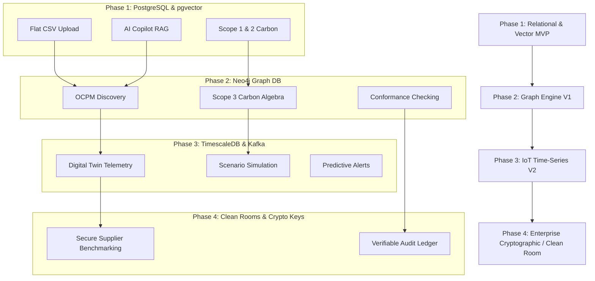

# SustainOCPM: Feature Priority Matrix

This document defines the implementation phases, scope limits, release definitions, and architectural complexity dependencies for the 18 core features of the SustainOCPM platform. 

To maintain architectural alignment without content duplication, this matrix cross-references functional targets in [PRODUCT_REQUIREMENTS_DOCUMENT.md](file:///Users/rudrapratapsingh/Desktop/newpro/PRODUCT_REQUIREMENTS_DOCUMENT.md) and milestones in [ENTERPRISE_ROADMAP.md](file:///Users/rudrapratapsingh/Desktop/newpro/ENTERPRISE_ROADMAP.md).

---

## 1. Core Feature Prioritization Matrix

| Feature | MVP | V1 | V2 | Enterprise |
| :--- | :--- | :--- | :--- | :--- |
| **CSV Upload** | **Scope:** Flat CSV files only. **Limits:** Max 50MB, single object type. **Release:** Manual column header mapping. **Dependencies:** Ingestion Engine. | **Scope:** Multi-CSV mapping. **Limits:** Max 500MB. **Release:** Dynamic event-object association. **Dependencies:** Relational database. | **Scope:** Auto-schema detection. **Limits:** Max 2GB. **Release:** Anomaly & type mismatch flagging. **Dependencies:** Validation API. | **Scope:** Parallel batch upload. **Limits:** Unlimited, direct S3/Blob. **Release:** Streamed schema mapping. **Dependencies:** Kafka pipeline. |
| **Process Discovery** | **Scope:** Single-case process maps. **Limits:** Heuristics Miner only. **Release:** Interactive static diagram. **Dependencies:** pm4py engine, Postgres. | **Scope:** Object-Centric Process Mining. **Limits:** OCEL 2.0 standard. **Release:** Many-to-many relationship graphs. **Dependencies:** Neo4j, OCEAn. | **Scope:** Carbon-attributed paths. **Limits:** Dynamic variant visualization. **Release:** Node/edge emission overlays. **Dependencies:** Carbon Service. | **Scope:** Real-time process graphs. **Limits:** Petabyte scale. **Release:** Auto-pruned massive graphs. **Dependencies:** Spark GraphX, Neo4j. |
| **Conformance** | **Scope:** Token replay checking. **Limits:** Single-case BPMN models. **Release:** Diagnostic logs. **Dependencies:** Process Mining Agent. | **Scope:** Object-Centric Conformance. **Limits:** OCEL 2.0 alignment. **Release:** Multi-object deviation maps. **Dependencies:** Neo4j Graph DB. | **Scope:** Carbon-boundary checks. **Limits:** Regulatory threshold rules. **Release:** Real-time deviation alerts. **Dependencies:** Carbon Service. | **Scope:** Automated self-healing conformance. **Limits:** Continuous online audit. **Release:** Deviation cost projections. **Dependencies:** Kafka, Alert Engine. |
| **Carbon Intelligence** | **Scope:** Scope 1 & 2 estimation. **Limits:** Static emission factors. **Release:** Basic KPI scorecards. **Dependencies:** Relational DB. | **Scope:** Scope 3 attribution. **Limits:** Upstream logistics focus. **Release:** Many-to-many carbon allocation. **Dependencies:** Carbon Algebra engine. | **Scope:** Real-time telemetry carbon. **Limits:** Machine-level sensors. **Release:** Time-series emissions maps. **Dependencies:** TimescaleDB. | **Scope:** End-to-end supply chain carbon. **Limits:** Audit-ready verification. **Release:** QR-code verifiable certificates. **Dependencies:** Data Clean Room. |
| **ESG Intelligence** | **Scope:** Manual ESG KPI entry. **Limits:** Static dashboards. **Release:** Basic charts (water, waste). **Dependencies:** Relational DB. | **Scope:** Process-driven ESG metrics. **Limits:** GRI/SASB alignments. **Release:** Dynamic reports. **Dependencies:** Carbon Service, ESG Service. | **Scope:** Supply chain ESG scoring. **Limits:** External API inputs. **Release:** Supplier ESG scorecards. **Dependencies:** Supplier Service. | **Scope:** Global double-materiality. **Limits:** Multi-region compliance. **Release:** CSRD disclosure portal. **Dependencies:** Compliance Engine. |
| **Supplier Intelligence** | **Scope:** Supplier registry. **Limits:** Static contact & category profiles. **Release:** Dynamic supplier tables. **Dependencies:** Relational DB. | **Scope:** Supplier carbon ingestion. **Limits:** Direct CSV entry. **Release:** Upstream Scope 3 dashboard. **Dependencies:** Ingestion Portal API. | **Scope:** Supplier risk profiling. **Limits:** Automated risk scoring. **Release:** Supplier ESG audit trails. **Dependencies:** ESG Service. | **Scope:** Collaborative supplier networks. **Limits:** Cross-tenant secure sharing. **Release:** Anonymized benchmarking views. **Dependencies:** Data Clean Room. |
| **AI Copilot** | **Scope:** Static QA on dashboards. **Limits:** Pre-defined prompt selections. **Release:** Simple RAG chat. **Dependencies:** OpenAI API, pgvector. | **Scope:** Conversational OCPM. **Limits:** Natural Language to Cypher. **Release:** Dynamic process querying. **Dependencies:** Neo4j, LLM Agent. | **Scope:** Prescriptive actions. **Limits:** Decarbonization tips. **Release:** Optimization recommendations. **Dependencies:** Recommendation Service. | **Scope:** Autonomous multi-agent loops. **Limits:** Private LLM host. **Release:** Self-correcting audit loops. **Dependencies:** Private GPU clusters. |
| **BRSR Reporting** | **Scope:** Manual PDF export. **Limits:** BRSR Section A (General). **Release:** Static form fields. **Dependencies:** Reporting Service. | **Scope:** Semi-automated export. **Limits:** BRSR Section B & C. **Release:** Automated ESG data pull. **Dependencies:** Carbon & ESG Services. | **Scope:** Fully automated reports. **Limits:** Entire SEBI framework. **Release:** PDF/JSON compliant files. **Dependencies:** BRSR Agent, Reporting DB. | **Scope:** Digital audit-ready BRSR. **Limits:** XBRL schema compliance. **Release:** Direct regulatory submission. **Dependencies:** Cryptographic Audit. |
| **Benchmarking** | **Scope:** Simple process benchmarking. **Limits:** Compare cycle times. **Release:** Dashboard comparisons. **Dependencies:** Relational DB. | **Scope:** Variant-level comparisons. **Limits:** Plant/facility variants. **Release:** Multi-variable analytics. **Dependencies:** Core Analytics Service. | **Scope:** Peer-group benchmarking. **Limits:** Anonymous industrial metrics. **Release:** Industry baseline comparison. **Dependencies:** Data Clean Room. | **Scope:** Automated optimization maps. **Limits:** Dynamic best-practice path. **Release:** AI-driven optimization inputs. **Dependencies:** Recommendation Service. |
| **Knowledge Base** | **Scope:** Static regulatory PDF list. **Limits:** User-uploaded files only. **Release:** Document list UI. **Dependencies:** Relational DB. | **Scope:** Vectorized regulations. **Limits:** GRI/SASB/BRSR docs. **Release:** Document-grounded RAG QA. **Dependencies:** pgvector, Parser API. | **Scope:** Operational wiki. **Limits:** Past process resolutions. **Release:** User annotation integration. **Dependencies:** LLM summarizer. | **Scope:** Federated knowledge search. **Limits:** External enterprise data. **Release:** SharePoint/Confluence APIs. **Dependencies:** OAuth gateways. |
| **Digital Twin** | **Scope:** Static plant layout. **Limits:** Non-interactive image overlay. **Release:** Dashboard layout page. **Dependencies:** Static assets. | **Scope:** Dynamic Process Twin. **Limits:** Visualizes current OCEL logs. **Release:** Real-time state-graph UI. **Dependencies:** Neo4j Graph DB. | **Scope:** IoT-enabled Digital Twin. **Limits:** Real-time sensor telemetry. **Release:** Dynamic overlay dashboard. **Dependencies:** TimescaleDB, Kafka. | **Scope:** Bidirectional Digital Twin. **Limits:** Active workflow execution. **Release:** Automated system controls. **Dependencies:** ERP API writeback. |
| **Scenario Simulator** | **Scope:** Static what-if calculator. **Limits:** Manual input parameters. **Release:** Formula-based slider page. **Dependencies:** Carbon Service. | **Scope:** Process simulation. **Limits:** Cycle time simulation. **Release:** Variant time-delta projections. **Dependencies:** Simulation Engine. | **Scope:** Graph-based simulation. **Limits:** Carbon, cost, time loops. **Release:** Dynamic variant simulator. **Dependencies:** Neo4j, Digital Twin. | **Scope:** Prescriptive AI simulation. **Limits:** Multi-variable optimizations. **Release:** Automated ROI scenario reports. **Dependencies:** Simulation Agent. |
| **Workflow Automation** | **Scope:** Static email notifications. **Limits:** System admin updates. **Release:** SMTP server setup. **Dependencies:** Relational DB. | **Scope:** Webhook triggers. **Limits:** Basic operational triggers. **Release:** Jira/Slack API integrations. **Dependencies:** Alert Engine. | **Scope:** Multi-step orchestration. **Limits:** Cross-system workflows. **Release:** Interactive workflow designer. **Dependencies:** Workflow Service. | **Scope:** Autonomous self-healing. **Limits:** ERP feedback loop API. **Release:** Automated process correction. **Dependencies:** Bidirectional twin. |
| **Collaboration** | **Scope:** Link sharing. **Limits:** Raw URL copying. **Release:** Static share button. **Dependencies:** Frontend router. | **Scope:** Dashboard annotations. **Limits:** Inline text comments. **Release:** Mention capabilities (@user). **Dependencies:** Relational DB. | **Scope:** Live workspaces. **Limits:** Real-time dashboard co-edit. **Release:** Shared collaborative room. **Dependencies:** WebSockets. | **Scope:** Inter-tenant portals. **Limits:** Secure supplier share. **Release:** Data Clean Room sharing. **Dependencies:** Encryption Gateway. |
| **Alerts** | **Scope:** Basic system failures. **Limits:** Relational database flags. **Release:** Log monitoring dashboard. **Dependencies:** Relational DB. | **Scope:** Operational alerts. **Limits:** Deviation & threshold breach. **Release:** In-app notification center. **Dependencies:** Alert Service. | **Scope:** Smart alert groupings. **Limits:** Anomaly clustering. **Release:** Reduced alert noise UI. **Dependencies:** AI Copilot Service. | **Scope:** Predictive alerts. **Limits:** Projected carbon violations. **Release:** Proactive system interventions. **Dependencies:** Scenario Simulator. |
| **Audit Trail** | **Scope:** Simple activity logs. **Limits:** User auth tracking. **Release:** Static table logs. **Dependencies:** Relational DB. | **Scope:** Regulatory carbon audits. **Limits:** Emission factor edits. **Release:** Immutable audit tables. **Dependencies:** Audit Service. | **Scope:** Process change logs. **Limits:** Graph modification tracks. **Release:** Graphical audit timeline. **Dependencies:** Neo4j history engine. | **Scope:** Cryptographic verification. **Limits:** Financial-grade tamper proof. **Release:** Exportable blockchain/ledger. **Dependencies:** Signer API. |
| **Multi-Tenant SaaS** | **Scope:** Single-tenant container. **Limits:** Independent database instance. **Release:** Separated VM deployment. **Dependencies:** Docker, K8s. | **Scope:** Shared database schema. **Limits:** Postgres RLS enforcement. **Release:** Dynamic workspace routes. **Dependencies:** Postgres RLS. | **Scope:** Regional cloud compliance. **Limits:** Localized database storage. **Release:** Cross-region user routing. **Dependencies:** IAM Gateway. | **Scope:** Hybrid SaaS plane. **Limits:** Dedicated edge collectors. **Release:** Secure tenant isolation. **Dependencies:** Private Link network. |
| **Presentation Mode** | **Scope:** Static slide export. **Limits:** Standard PDF/Image downloads. **Release:** Dashboard print styles. **Dependencies:** Frontend export. | **Scope:** Live presentation slide. **Limits:** Dashboard page projection. **Release:** Fullscreen interactive mode. **Dependencies:** Presentation Spec. | **Scope:** Presentation builder. **Limits:** Slide compilation page. **Release:** Custom chart selections. **Dependencies:** Slide builder engine. | **Scope:** Shared presenting room. **Limits:** Sync presenter-audience views. **Release:** WebSockets live actioning. **Dependencies:** WebSockets, Simulator. |

---

## 2. Key Architectural Complexity Dependencies

The rollout of features is heavily gated by three structural transitions in the database and ingestion pipeline. The diagram below illustrates how features are constrained by database migrations:

### 2.1 Critical Path Dependencies
1. **Transition to Graph (MVP -> V1):** Process Discovery, Conformance, and Scope 3 Carbon calculations cannot advance beyond rudimentary, single-case tabular metrics without migrating to the Neo4j graph structure. Attempting to run many-to-many relationship mappings on standard PostgreSQL tables will lead to severe operational performance degradation.
2. **Transition to Time-Series Ingestion (V1 -> V2):** SCADA and IoT sensor integration for real-time digital twins and scenario simulation requires the addition of TimescaleDB and Kafka pipelines. Standard relational tables cannot support the write volume of high-frequency machine metrics.
3. **Transition to Secure Sharing (V2 -> Enterprise):** Collaborative benchmarking and supply chain Scope 3 calculations require a Zero-Knowledge / Data Clean Room infrastructure to avoid sharing sensitive competitive data across tenant boundaries, enforcing absolute compliance.
