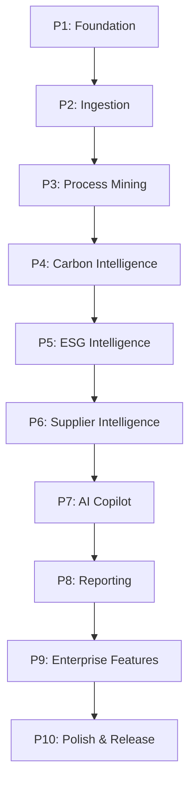

# SustainOCPM: Implementation Roadmap

This document defines the implementation phases, objectives, dependencies, deliverables, risks, and acceptance criteria for SustainOCPM.

---

## 1. Roadmap Phases

| Phase | Focus Domain | Objectives | Dependencies | Key Deliverables | Key Risks | Acceptance Criteria |
| :--- | :--- | :--- | :--- | :--- | :--- | :--- |
| **P1** | **Foundation** | Set up multi-tenant DB schemas, user auth (RBAC), and basic logging/auditing. | None | Multi-tenant PostgreSQL with RLS, auth service, base audit ledger. | Schema rigidity slowing downstream features. | Database tables initialized; RLS prevents cross-tenant access. |
| **P2** | **Ingestion** | Ingest OCEL 2.0 files and auto-detect/map schemas. | P1 | Ingestion API, validation worker, schema mapper UI. | Large file parse timeouts, invalid formats. | Mapped columns successfully validate against OCEL 2.0 standards. |
| **P3** | **Process Mining** | Discover many-to-many relationship graphs and trace variant sequences. | P2 | pm4py heuristics miner, Neo4j graph storage, process map UI. | Graph traversal explosion, poor database query execution times. | Render interactive process graph with cycle times. |
| **P4** | **Carbon Intelligence** | Attribute Scope 1, 2, and 3 emissions to process steps. | P3 | Carbon algebra calculator, emission factor registry. | Unreliable emission factors, incomplete supplier logs. | Map exact metric tons of CO2e per activity instance in the process graph. |
| **P5** | **ESG Intelligence** | Score ESG metrics and map them to GRI/SASB boundaries. | P4 | ESG scoring engine, water/waste telemetry dashboards. | Inconsistent data collection, vague organizational boundaries. | Aggregate scores match GRI/SASB framework compliance rules. |
| **P6** | **Supplier Intelligence** | Ingest supplier carbon data and manage upstream ESG scores. | P5 | Supplier portal, Scope 3 dashboard, risk matrix. | Supplier onboarding friction, data leakage risks. | Supplier profiles show validated Scope 3 allocations. |
| **P7** | **AI Copilot** | Provide RAG query interface and Natural Language to Cypher/SQL generation. | P6 | pgvector search, LLM orchestration agent, prompt UI. | LLM hallucinations, high API costs, prompt injection. | Conversational queries return validated SQL/Cypher with citations. |
| **P8** | **Reporting** | Generate compliance documents (SEBI BRSR Section A, B, C). | P7 | BRSR export service (PDF/JSON), report editor UI. | Changing SEBI regulations, formatting errors. | One-click export produces audit-ready BRSR reporting documents. |
| **P9** | **Enterprise Features** | Scenario simulation, digital twin viewer, and workflow automation. | P8 | Simulation engine, state-graph twin, webhook triggers. | High telemetry write loads, infinite loops in triggers. | Run what-if parameters and overlay simulated metrics on the twin. |
| **P10**| **Polish & Release** | Run E2E verification, accessibility checks, and pilot deployment. | P9 | QA dashboards, production assets, performance logs. | Missed grant demo targets, low usability. | Pass WCAG 2.1 AA audits and run the grant-evaluation presentation deck. |

---

## 2. Phase Interdependencies

