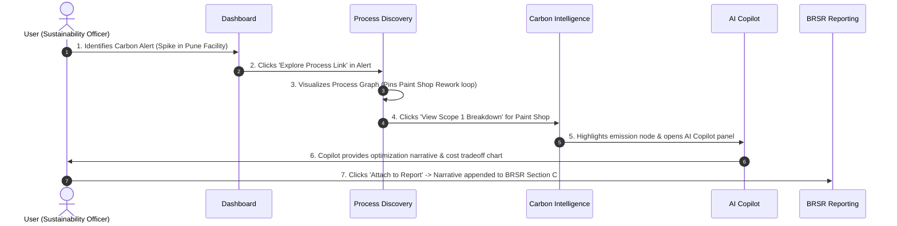

# SustainOCPM — Information Architecture

> Architectural Blueprint for Carbon-Aware Object-Centric Process Intelligence

**Document ID:** SUSTAIN-IA-001  
**Version:** 1.0.0  
**Classification:** Strategic Design Document  
**Last Updated:** 2026-06-16  
**Owner:** Product Design & UX Team  
**Cross-References:** [USER_JOURNEYS.md](./USER_JOURNEYS.md) · [API_ARCHITECTURE.md](./API_ARCHITECTURE.md) · [RESEARCH_POSITIONING.md](./RESEARCH_POSITIONING.md)

---

## Document Overview & Design Philosophy

This document defines the complete Information Architecture (IA) for **SustainOCPM**, a Carbon-Aware Object-Centric Process Mining (OCPM) Platform. Developed under an Indo-Swiss Research Grant, SustainOCPM integrates OCPM based on the OCEL 2.0 standard with carbon accounting, ESG metrics, SEBI BRSR compliance, and AI-driven decision intelligence.

To serve both academic evaluators and enterprise stakeholders (executives, sustainability officers, process analysts), the platform is structured into two distinct zones:
1. **The Public Platform:** An educational and promotional interface demonstrating academic credibility, the core methodology, and driving conversion.
2. **The Workspace Application:** A high-fidelity, interactive operational dashboard and analytics environment where enterprise users configure data pipelines, discover processes, track compliance, and optimize carbon-cost trade-offs.

---

## Part 1: Public Platform

The public platform serves as the marketing, academic validation, and user acquisition engine. It targets government reviewers, corporate decision-makers, and sustainability researchers.

### 1.1 Sitemap Overview & Target Alignment
The public platform navigation is optimized to guide different user personas to their respective "Aha!" moments:
* **Academic Reviewers** are guided toward the Research and Methodology pages.
* **Corporate Executives** are directed to the Platform capabilities and Demo pages.
* **Sustainability Officers** are steered toward the BRSR/ESG regulatory content and the interactive Demo.

```
Public Sitemap:
├── Home (Entryway & Trust Establishment)
├── Platform (Capabilities & Tech Stack)
├── Research (Academic Backing & Grant Progress)
├── Methodology (Transparency & Mathematical Formulations)
├── Documentation (API & Integration Guides)
├── Demo (Interactive Sandbox & Guided Flows)
└── Contact (Lead Capture & Query Routing)
```

---

### 1.2 Home Page

* **Purpose:** Establish platform credibility, explain the unique value of carbon-aware object-centric process mining, show corporate/academic backing, and route users to targeted conversion paths.
* **Target Audience:** All personas (Sustainability Officers, VP Operations, Academic Evaluators, CEO).
* **CTA Strategy:**
  * *Primary:* "Start Free Trial" (directs to Workspace onboarding) or "Schedule Guided Demo".
  * *Secondary:* "Read Research Whitepaper" (directs to Research page).
  * *Micro-Conversion:* "Download BRSR Compliance Checklist" (gated PDF download).

#### Content Sections & Structural Layout
1. **Hero Section:**
   * Headline: *“Object-Centric Process Mining Meets Carbon Intelligence.”*
   * Sub-headline: *“Expose emission bottlenecks, ensure regulatory BRSR compliance, and optimize multi-object workflows with the world's first carbon-aware OCPM engine.”*
   * Interactive UI Mockup: A floating, interactive 3D process graph showing an order-to-delivery flow where nodes represent carbon hot-spots and edges display emissions in metric tons of $CO_2e$.
   * Core CTAs side-by-side.
2. **Academic & Grant Validation Strip:**
   * Prominent logos of partnering Indian and Swiss institutions (e.g., IIT, ETH Zürich, RWTH Aachen).
   * Badge: *"Supported by the Indo-Swiss Joint Research Programme (ISJRP)."*
3. **The Core Problem Grid (Why OCPM + Carbon?):**
   * Three cards contrasting traditional process mining (single case notion, blind to carbon) with carbon-aware OCPM (multi-object, linking procurement, manufacturing, and transport emissions).
4. **Interactive Carbon-Process Simulator:**
   * A simplified interactive widget. Users slide a "Bottleneck Reduction" slider and watch a simulated manufacturing process's carbon footprint and operational cost drop in real-time.
5. **Key Platform Capabilities (Feature Teasers):**
   * *Process Discovery:* Dynamic node-link diagrams mapped to OCEL 2.0.
   * *Carbon Attribution:* Direct linkage of Scope 1, 2, and 3 emissions to event logs.
   * *BRSR Core Compliance:* Auto-generation of India-specific regulatory reports.
   * *AI Copilot:* Natural language process querying.
6. **Social Proof & Client Spotlights:**
   * Rotating case studies (e.g., *"How a Pune Auto Component Manufacturer Cut Carbon by 18% and Increased Throughput by 12%"*).
7. **Trust & Security Badges:**
   * ISO 14064 (Greenhouse Gas Verification), ISO 27001 (Information Security), and SOC 2 Type II compliance indicators.
8. **Pre-Footer CTA Banner:**
   * High-contrast band with action-oriented text: *“Ready to transition from static carbon spreadsheets to dynamic process carbon intelligence?”*

---

### 1.3 Platform Page

* **Purpose:** Provide an in-depth, feature-by-feature breakdown of the SustainOCPM software capabilities, integration ecosystem, and system scalability.
* **Target Audience:** VP Operations, Process Analysts, IT Directors, ESG Consultants.
* **CTA Strategy:**
  * *Primary:* "Request Technical Demo" (launches contact form with technical role pre-selected).
  * *Secondary:* "Explore Integration Guides" (links to Documentation).

#### Content Sections & Structural Layout
1. **Header & Value Proposition:**
   * Title: *“Enterprise-Grade Process & Sustainability Intelligence.”*
   * Subtitle: *“A deep dive into the features powering next-generation operational audits.”*
2. **Feature Deep-Dive Grid (Alternating Layout):**
   * *Object-Centric Process Discovery:* Explanation of how the platform extracts multi-object logs (e.g., orders, items, containers) without the "relation duplication" problem of traditional process mining.
   * *Scope 1/2/3 Carbon Attribution:* Visual breakdown of how emission coefficients are dynamically applied to specific event activities and object lifecycles.
   * *Conformance Checking:* Explanation of the alignment algorithms that compare actual event sequences against normative BPMN/PNML reference models.
   * *Supplier Carbon Network:* Visualization of supply-chain interactions and upstream Scope 3 attribution.
3. **Interactive Technology Stack Explorer:**
   * A clickable diagram illustrating the data flow from ERPs (SAP, Oracle) and MES systems through the OCEAn parsing engine into the OCEL 2.0 database, and out through the UI.
4. **Integration Ecosystem & Connectors:**
   * Grid of pre-built connector logos: SAP S/4HANA, Oracle ERP Cloud, Microsoft Dynamics, Salesforce, plus standard databases (PostgreSQL, Snowflake, Databricks).
5. **Security, Governance & Compliance Section:**
   * Details on role-based access control (RBAC), data masking for sensitive operational events, and secure audit trails for environmental compliance reporting.

---

### 1.4 Research Page

* **Purpose:** Anchor the platform in rigorous academic research, highlighting the Indo-Swiss grant collaboration, peer-reviewed publications, and contributions to the OCPM community.
* **Target Audience:** Government Reviewers, Academic Researchers, Grant Evaluators, Sustainability Specialists.
* **CTA Strategy:**
  * *Primary:* "Collaborate / Join Research Network".
  * *Secondary:* "Read the Core OCEAn Paper (PDF)".

#### Content Sections & Structural Layout
1. **Grant Information & Collaboration Scope:**
   * Headline: *“Advancing Process Mining for Global Sustainability.”*
   * Project narrative outlining the objectives of the Indo-Swiss grant: integrating process science with carbon accounting.
2. **Joint Research Team & Steering Committee:**
   * Grid with photos, names, and academic titles of leading professors and researchers from Indian institutes and Swiss technical universities.
3. **Core Publications & Bibliography:**
   * Table of published research papers, journal articles, and conference proceedings resulting from this project.
   * Columns: Title, Authors, Journal/Conference, Year, Download Link, Citation (BibTeX).
4. **OCEL 2.0 Standardization Contributions:**
   * A section detailing how the platform supports and expands the Object-Centric Event Log (OCEL 2.0) standard, specifically detailing custom extensions for carbon attribute structures.
5. **Research Roadmap & Milestones:**
   * Gantt-style visual showing completed, active, and planned milestones under the research grant (e.g., *“Milestone 4: Multi-criteria optimization algorithm verification - Completed Q1 2026”*).

---

### 1.5 Methodology Page

* **Purpose:** Provide complete mathematical and operational transparency into how emissions are calculated and attributed to specific processes, removing the "black box" skepticism of typical ESG platforms.
* **Target Audience:** Sustainability Officers, ESG Auditors, Regulatory Reviewers.
* **CTA Strategy:**
  * *Primary:* "Download Methodology PDF" (gated).
  * *Secondary:* "View Carbon Database Sources".

#### Content Sections & Structural Layout
1. **The Carbon-Process Attribution Framework:**
   * Explains how the platform moves from static carbon accounting (e.g., fuel bills) to dynamic event-level attribution.
2. **Mathematical Formulation (LaTeX Rendering):**
   * Presentation of core equations used to calculate process step emissions:
     $$E_{event} = \sum (Q_{activity} \times EF_{activity}) + E_{idle\_share} + E_{object\_overhead}$$
   * Explanation of variables: Activity Quantity ($Q$), Emission Factor ($EF$), and allocation rules for machine idle time and object-level overheads.
3. **Emission Factor (EF) Database Integrations:**
   * Details on the databases used to pull emission factors (e.g., ecoinvent, DEFRA, India Grid Emission Factors, and custom corporate databases). Includes description of fallback hierarchy when exact matches are unavailable.
4. **Conformance & Deviation Accounting:**
   * Detail on how compliance deviations (e.g., an item bypassing quality check and requiring rework) increase carbon footprints. Includes case studies of rework loops.
5. **Audit Trails & Verification Standards:**
   * Explanation of how data provenance is maintained, ensuring that any number on a BRSR report can be traced back to the raw event, system timestamp, and source ERP document.

---

### 1.6 Documentation Page

* **Purpose:** Provide technical users with instructions on how to install, configure, feed data into, and query the SustainOCPM system.
* **Target Audience:** IT Engineers, Data Engineers, Process Miners, System Integrators.
* **CTA Strategy:**
  * *Primary:* "Launch Sandbox Environment".
  * *Secondary:* "Visit GitHub Repository".

#### Content Sections & Structural Layout
1. **Quick-Start Guide:**
   * Step-by-step instructions to initialize a local parsing environment, upload a sample OCEL log, and view the discovered process.
2. **OCEL 2.0 Schema Definition:**
   * Detailed breakdown of the JSON and SQLite database schema templates expected by the platform, including mandatory event-object tables and custom attributes for carbon.
3. **API Reference Guide:**
   * Clean, multi-column API documentation listing core endpoints (e.g., `POST /api/v1/logs/import`, `GET /api/v1/analytics/carbon-profile`).
   * Contains interactive request/response JSON snippets.
4. **Data Integration & Pipeline Setup:**
   * Detailed instructions on setting up extraction scripts for SAP S/4HANA (using RFC or OData services) and Oracle ERP.
5. **Troubleshooting & FAQ Accordion:**
   * Answers to common integration questions: *“How do we handle timezone differences in log ingestion?”*, *“What happens if object relationships are cyclical?”*.

---

### 1.7 Demo Page

* **Purpose:** Deliver a low-friction, interactive, hands-on preview of the SustainOCPM workspace interface using pre-loaded industry datasets.
* **Target Audience:** Sustainability Officers, Plant Managers, VP Operations.
* **CTA Strategy:**
  * *Primary:* "Create Workspace & Upload My Log" (converts demo user to registered tenant).
  * *Secondary:* "Request Guided Tour with Solutions Engineer".

#### Content Sections & Structural Layout
1. **Sandbox Selection Panel:**
   * Interactive cards allowing the user to select their demo industry dataset:
     * *Scenario A: Steel Manufacturing (High Scope 1 focus, complex rework loops).*
     * *Scenario B: Automotive Supply Chain (High Scope 3 focus, multi-tier supplier interactions).*
     * *Scenario C: Pharmaceutical Logistics (High Scope 2/3 focus, cold-chain temperature deviations).*
2. **Embedded Interactive Demo UI:**
   * A simulated version of the workspace. Users can click on nodes, select variants, trigger simulated optimization runs, and watch KPIs update.
   * Floating guide banners explain what the user is seeing (e.g., *“Notice how the paint shop bottleneck accounts for 40% of the total carbon footprint due to oven warm-up cycles”*).
3. **Sample BRSR Report Viewer:**
   * Tabbed interface showing a real-time generated Business Responsibility and Sustainability Report (specifically the Essential Indicators of Principle 6: Environmental management).
4. **Live Chat Interface:**
   * Direct connection to product specialists or support team members to answer questions during the sandbox experience.

---

### 1.8 Contact Page

* **Purpose:** Capture inbound enterprise leads, research partnerships, and support requests, routing them to the correct department.
* **Target Audience:** All personas.
* **CTA Strategy:**
  * *Primary:* "Send Message".
  * *Secondary:* "Book a 15-Minute Technical Call" (Calendly integration).

#### Content Sections & Structural Layout
1. **Query Routing Contact Form:**
   * Fields: Full Name, Business Email, Organization, Job Title, Country, Department (Sales / Academic Collaboration / Support / General).
   * Context-sensitive fields: If "Academic Collaboration" is selected, fields appear for "Affiliated Institution" and "Grant Reference Number".
2. **Global Office Locations:**
   * Details for the Indian Operations Center (Pune) and Swiss Research Liaison Office (Zürich), complete with maps, mailing addresses, and phone numbers.
3. **Interactive FAQ Sidebar:**
   * A short list of high-level administrative questions (e.g., *“Is my uploaded data safe during trial runs?”*, *“Are there academic discounts?”*) to reduce support volume.

---

## Part 2: Workspace (Application)

The workspace is the core operational application where authenticated tenants analyze their event logs, perform conformance checking, audit carbon footprints, and generate regulatory reports.

---

### 2.1 Dashboard

| Attribute | Detail |
|-----------|--------|
| **Purpose** | Provide a single pane of glass summarizing operational efficiency, carbon intensity, compliance deviations, and ESG readiness across all active projects. |
| **Primary Audience** | VP Operations, Sustainability Officers, CEOs, Plant Managers. |
| **Entry Points** | Post-login redirect, global navigation header home icon, deep links in alert notifications. |
| **Inputs** | Date range selectors, organizational unit dropdowns, project profiles, baseline selectors. |
| **Outputs** | Executive KPI cards, emission trend lines, recent alerts list, quick-compliance indicators, AI-generated summary paragraph. |
| **Key Components** | Global Filter Bar, KPI Summary Grid, Trend Analytics Panel, Compliance Radar, Critical Alert Queue, In-App Copilot Summary. |
| **Dependencies** | Process Discovery Engine, Carbon Attribution Engine, Ingestion Logs, BRSR Template definitions, Notification Dispatcher. |
| **Business Value** | Enables executive leadership to immediately identify operational inefficiencies and carbon exceptions, ensuring swift action to maintain ESG commitments. |
| **KPIs** | Dashboard load time (< 1.5s), bounce rate (re-login activity), widget click-through rate, alert response time. |

#### Conceptual Layout & Grid Structure
The Dashboard is organized in a modular 12-column CSS grid framework, optimizing high-density information display:
* **Row 1 (Header):** Title block with context breadcrumbs, date range dropdown, global facility filter, and project workspace selector.
* **Row 2 (KPIs):** Four card components:
  1. *Total Carbon Footprint:* Large text metric (e.g., *"14,250 tCO2e"*), percentage change indicator, sparkline trend.
  2. *Process Carbon Intensity:* Carbon per object (e.g., *"45.2 kg CO2e / Unit"*), variance versus historical baseline.
  3. *Conformance Score:* Combined alignment fitness score (e.g., *"91.2%"*), color-coded threshold ring.
  4. *Regulatory Readiness:* Percentage of BRSR indicators populated (e.g., *"84%"*), progress bar.
* **Row 3 (Main Content):**
  * *Left Column (8/12 grid width):* Cumulative emissions vs. target timeline chart (dual-axis line/bar chart displaying monthly actuals against SBTi targets).
  * *Right Column (4/12 grid width):* Compliance Radar Chart mapping readiness across GRI, TCFD, BRSR Core, and CSRD.
* **Row 4 (Bottom Utility):**
  * *Left Column (6/12 grid width):* Alert Notification Feed (sorted by severity and timestamp).
  * *Right Column (6/12 grid width):* Recent Active Projects & Ingestion Logs status table.

#### Data Ingestion & In-Memory State Model
The frontend queries the `/api/v1/dashboard/summary` endpoint, loading a structured JSON payload containing metadata, aggregated stats, and timeseries arrays.
* **Query Parameters:** `facility_id` (UUID), `start_date` (ISO 8601), `end_date` (ISO 8601), `baseline_year` (YYYY).
* **Expected Response Fields:**
  * `total_emissions`: `{ value: float, unit: string, change_percentage: float }`
  * `carbon_intensity`: `{ value: float, unit: string, target_value: float }`
  * `conformance_fitness`: `{ score: float, target_score: float }`
  * `brsr_readiness`: `{ percentage: integer }`
  * `emissions_trend`: Array of `{ date: string, actual: float, target: float }`
  * `recent_alerts`: Array of `{ alert_id: UUID, severity: string, message: string, timestamp: string }`

#### UI Component Interaction Flow
1. **Global Filter Update:** When the user changes the facility selection from "All Facilities" to "Pune Assembly", the workspace header updates to showing a "Filtering active..." progress indicator.
2. **Dashboard Re-query:** The state manager triggers updates across all registered widgets, querying the API with the updated query parameters.
3. **Transition Animation:** Widgets fade down to 50% opacity, showing loading spinners. Charts update using smooth linear animations upon data resolution.
4. **Drill-down Action:** Clicking the "Conformance Score" KPI card performs a deep link transition, loading the Conformance Intelligence tab with the active filters preserved.

#### Edge Cases & Error Handling
* **Missing Ingestion Logs (Clean Slate):** If the database query returns null values for all metrics, the dashboard renders an empty-state overlay. All charts are replaced by illustration vectors, and a prominent prompt guides the user: *"No data sources configured. Visit Settings to set up your database connectors or import an OCEL log file."*
* **Timezone Offset Mismatches:** If log events are recorded in Indian Standard Time (IST) but the corporate reporting baseline is in Central European Time (CET), the state manager standardizes all timeline data to UTC prior to aggregation. The UI header warns the user: *"Displaying metrics normalized to UTC."*

---

### 2.2 Process Discovery

| Attribute | Detail |
|-----------|--------|
| **Purpose** | Discover, visualize, and interact with the actual multi-object process maps generated from OCEL 2.0 logs, highlighting bottlenecks and carbon-intensive pathways. |
| **Primary Audience** | Process Engineers, Process Mining Specialists, Plant Managers. |
| **Entry Points** | Primary sidebar navigation, "Explore Process" buttons on dashboard alerts. |
| **Inputs** | Activity frequency thresholds, path density sliders, object type filters (e.g., viewing logs by Order vs. Item), node color configurations (Time vs. Carbon vs. Cost). |
| **Outputs** | Interactive Node-Link Process Graph, variant list tables, path time distribution histograms. |
| **Key Components** | Graph Canvas, Controls Toolbar, Object Type Toggle, Variant Inspector panel, Attribute Heatmap Panel. |
| **Dependencies** | OCEAn Process Discovery Engine, OCEL Database, Layout rendering engine (Graphviz/Cytoscape based conceptual architecture). |
| **Business Value** | Uncovers the real process routes, highlighting shadow processes, rework loops, and operational bottlenecks that add cost and increase carbon footprints. |
| **KPIs** | Graph rendering time for logs > 1M events (< 3.0s), average interaction duration, variant filtering speed. |

#### Conceptual Layout & Grid Structure
The Process Discovery workspace is structured in a split-screen layout with an interactive panel overlay:
* **Left Control Sidebar (3/12 width):**
  * *Object Type Selector:* Multi-select checkboxes for active OCEL object types (e.g., `orders`, `items`, `shipments`, `containers`).
  * *Metric Projection Selector:* Radio buttons to select node colors (Frequency, Duration, Carbon Footprint, Financial Cost).
  * *Graph Density Controls:* Dual slider bars controlling activity thresholds (0-100%) and path connection density (0-100%).
  * *Variant List Panel:* Vertical list sorting discovered process paths by frequency.
* **Center Graph Canvas (9/12 width):**
  * Full-screen WebGL-accelerated interactive canvas.
  * Node-Link elements with color intensity mapped to the selected metric.
  * Float overlay containing zoom controls, canvas centering, mini-map window, and screen export utilities.
* **Right Drawer Panel (Slide-out on selection):**
  * Detail panel showing analytics for the selected node or edge.
  * In-context action button: *"Send to AI Copilot for bottleneck query."*

#### Data Ingestion & In-Memory State Model
The process discovery screen requests structure data from the `/api/v1/process/graph` endpoint. The model stores nodes and edges in memory.
* **Node Schema:**
  * `id`: Unique activity identifier (string).
  * `label`: User-facing name (e.g., *"Baking Process"*).
  * `frequency`: Absolute execution count (integer).
  * `mean_duration`: Time in seconds (float).
  * `carbon_footprint`: `$CO_2e$` in kilograms (float).
  * `cost`: Value in preferred currency (float).
* **Edge Schema:**
  * `id`: Connection identifier (string).
  * `source`: Source node ID (string).
  * `target`: Target node ID (string).
  * `object_types`: Array of strings indicating linked object classes.
  * `transition_count`: Number of times traversed (integer).

#### UI Component Interaction Flow
1. **Interactive Slider Adjustments:** As the user drags the "Path Connection Density" slider down, the graph rendering engine updates real-time. Unimportant edges fade out to simplify the visual layout.
2. **Node Click Event:** Clicking a node (e.g., `Machining_Step_3`) pauses the canvas rendering loops, opens the Right Detail Drawer, and highlights all connected edges while fading out unrelated pathways.
3. **Metric Switch:** Switching the node coloring from "Lead Time" to "Carbon Footprint" triggers an instant color transition across nodes. The color scheme shifts from blue (duration) to red (emissions hot-spots).
4. **Variant Filter:** Selecting "Variant 3" in the sidebar dims all nodes and edges not part of that variant pathway, highlighting the variant's sequence.

#### Edge Cases & Error Handling
* **High Event Densities ("Spaghetti" Graphs):** If the ingested OCEL log contains over 150 unique activities and 10,000 edges, the screen displays a warning: *"High graph complexity detected. We have applied a 40% density filter to maintain legibility."* The user can click "Render Full Model" to override this.
* **Disconnected Graph Components:** If the uploaded event log contains isolated events not connected to the main process flow, they are grouped and rendered in a "Detached Activities" tray along the bottom of the canvas, keeping the main process flow clear.

---

### 2.3 Conformance Checking

| Attribute | Detail |
|-----------|--------|
| **Purpose** | Compare the discovered actual processes against standard normative guidelines, identifying violations, bypasses, and unauthorized process steps that compromise efficiency or regulatory compliance. |
| **Primary Audience** | ESG Auditors, Compliance Officers, Operations Directors. |
| **Entry Points** | Primary sidebar, "Check Conformance" indicators on project dashboards. |
| **Inputs** | Reference process uploads (BPMN, PNML, or XML templates), fitness thresholds, severity filters. |
| **Outputs** | Fitness & Precision scores, deviation lists, alignment graphs (showing skipped or unexpected events), exportable compliance log. |
| **Key Components** | Reference Model Selector, Alignment View Canvas, Deviation Table, Fitness Trend Widget. |
| **Dependencies** | Conformance Checking Alignment Algorithms, Reference Model Database. |
| **Business Value** | Assures regulators and internal auditors that operational guardrails are active, detecting compliance violations and shadow procedures. |
| **KPIs** | Alignment calculation speed, percentage of events successfully aligned, user resolution rate of identified deviations. |

#### Conceptual Layout & Grid Structure
The page is organized into two primary rows:
* **Row 1 (Controls & Models):**
  * *Left Side:* Reference model manager dropdown, target conformance thresholds slider, and fitness score indicator card.
  * *Right Side:* Real-time alignment canvas rendering the normative model structure with color-coded overlays indicating step compliance (Green = Compliant, Yellow = Delayed/Rework, Red = Violation/Bypassed).
* **Row 2 (Deviation Details):**
  * High-density data table listing identified deviations.
  * Columns: Deviation Name, Execution Frequency, Affected Objects, Extra Cost, Extra Carbon Footprint, Mitigation Action.

#### Data Ingestion & In-Memory State Model
The conformance tool queries the `/api/v1/conformance/alignments` endpoint, sending the log ID and selected reference model template.
* **API Ingestion Keys:**
  * `fitness`: General fitness alignment score (float between 0 and 1).
  * `deviations`: Array of:
    * `deviation_id`: UUID.
    * `type`: enum `["skipped_event", "unplanned_event", "incorrect_ordering"]`.
    * `activity`: Name of step.
    * `frequency`: Frequency count.
    * `impact_co2`: Metric tons of emissions added by this deviation.
    * `impact_cost`: Financial cost added.

#### UI Component Interaction Flow
1. **Reference Model Upload:** The user clicks "Upload Reference Model" and drops in a BPMN 2.0 file. The system validates the XML format, parses the node structures, and displays a success alert.
2. **Alignment Generation:** Clicking "Run Conformance Check" starts the calculation engine. A circular progress indicator shows the percentage of event traces analyzed.
3. **Filter Deviations:** Clicking a cell in the deviation table (e.g., "Quality Check Bypassed") highlights the skipped step in the process overlay. It also updates the bottom dashboard to show only the traces containing that bypass.
4. **Resolution Generation:** The user clicks "Resolve" on a deviation row, opening a drawer to document the incident or assign a follow-up task.

#### Edge Cases & Error Handling
* **Mismatched Step Labels:** If the event log labels use names like `QC_Step` but the BPMN reference model uses `Quality Control Check`, the system prompts: *"We detected label mismatches. Please align log terms with model labels in our mapping wizard."*
* **Cycle-Heavy Process Logs:** Logs with extreme loops can lead to calculation timeouts. The system mitigates this by capping alignment loops at 100 iterations per trace, warning the user: *"Maximum alignment recursion depth reached. Scores are based on sampled variants."*

---

### 2.4 Carbon Intelligence

| Attribute | Detail |
|-----------|--------|
| **Purpose** | Deliver detailed carbon emissions analysis by process, activity, and object, allowing users to drill down into Scope 1, 2, and 3 profiles. |
| **Primary Audience** | Sustainability Officers, Carbon Analysts, Environmental Auditors. |
| **Entry Points** | Primary sidebar, "Emissions Detailed View" link on dashboard. |
| **Inputs** | Carbon standard toggles (GHG Protocol, ISO 14064), carbon pricing rates, allocation rule toggles. |
| **Outputs** | Scope 1/2/3 breakdown charts, carbon intensity metrics (e.g., $kg\ CO_2e$ per product unit), waterfall chart of emissions by process step. |
| **Key Components** | Scope Selector Cards, Carbon Intensity KPI Strip, Waterfall Emission Explorer, Factor Mapping Table. |
| **Dependencies** | Carbon Attribution Engine, Emission Factor Database, ERP activity data. |
| **Business Value** | Provides carbon data directly linked to business processes, showing exactly where emissions occur to inform targeted reduction plans. |
| **KPIs** | Carbon attribution coverage (percentage of events with calculated carbon), data accuracy level, carbon pricing scenario run count. |

#### Conceptual Layout & Grid Structure
The Carbon Intelligence workspace is organized into three analytical areas:
* **Top Area (Scope Selectors & Intensity Indicators):**
  * Three interactive cards representing Scope 1 (Direct), Scope 2 (Indirect), and Scope 3 (Value Chain) emissions. Selecting a card filters the metrics below.
  * Side KPI strip displaying: *Carbon Intensity per Product*, *Renewable Energy Share*, and *Estimated Carbon Tax Exposure*.
* **Middle Area (Carbon Source Analysis):**
  * *Left Side (7/12 width):* A waterfall chart displaying emissions added at each step of the process.
  * *Right Side (5/12 width):* A pie chart displaying emissions by energy/fuel source (Electricity, Diesel, Natural Gas, Coal).
* **Bottom Area (Factor Mappings):**
  * A table displaying mapping coefficients between process events and their emission factors.

#### Data Ingestion & In-Memory State Model
The frontend queries the `/api/v1/sustainability/emissions` endpoint.
* **API Ingestion Keys:**
  * `scopes_summary`: `{ scope1: float, scope2: float, scope3: float }`
  * `waterfall_data`: Array of `{ step_name: string, value_added: float, cumulative: float }`
  * `energy_mix`: Array of `{ source: string, emissions: float, percentage: float }`
  * `factor_mappings`: Array of `{ activity: string, asset_id: string, factor: float, source_db: string }`

#### UI Component Interaction Flow
1. **Scope Selection Toggle:** The user clicks the Scope 3 card. The system updates the UI, changing the waterfall chart to display supply chain logistics and material sourcing emissions.
2. **Interactive Tax Simulation:** The user adjusts the carbon tax slider in the right panel. The tax exposure calculations update, and the corresponding segment on the cost timeline shifts to show the potential impact of carbon taxes.
3. **Database Selection:** Clicking on the "Source DB" cell in the factor mappings table opens a selector. Users can swap between ecoinvent and regional databases, prompting an instant recalculation of emissions.

#### Edge Cases & Error Handling
* **Missing Activity Emission Factors:** If an activity lacks an assigned emission factor, the platform flags the row with a red icon and displays a warning: *"Unmapped emissions data found. We have applied a regional fallback proxy."*
* **Log Value Outliers:** If a faulty sensor records an unusually high fuel consumption value (e.g., 1000x normal), the data ingestion engine flags it and excludes the outlier from calculations until approved by an administrator.

---

### 2.5 ESG Intelligence

| Attribute | Detail |
|-----------|--------|
| **Purpose** | Aggregate and format process-derived carbon and ESG metrics into frameworks (GRI, TCFD, EU CSRD), mapping events to sustainability indices. |
| **Primary Audience** | Sustainability Officers, ESG Consultants, Investor Relations. |
| **Entry Points** | Primary sidebar navigation. |
| **Inputs** | ESG Framework toggle (GRI vs. TCFD vs. CSRD), audit target years, reporting boundaries. |
| **Outputs** | ESG scorecard, ready-to-copy framework disclosures, compliance indicators, gap analysis reports. |
| **Key Components** | Framework Selector, Scorecard Grid, Disclosure Accordions, Materiality Matrix Widget. |
| **Dependencies** | Carbon Intelligence Engine, BRSR Database, ESG Mapping Definitions. |
| **Business Value** | Simplifies global ESG reporting by auto-populating complex framework disclosures with process-level audit trails. |
| **KPIs** | Framework coverage percentage, audit prep time reduction, external auditor review success rate. |

#### Conceptual Layout & Grid Structure
The page is organized into a side-by-side split layout:
* **Left Column (4/12 grid width):**
  * *Framework Selector Tabs:* Toggles between GRI Standards, TCFD, EU CSRD, and SASB.
  * *Audit Progress Tracker:* Summary metrics indicating section completion, verified indicators, and items requiring review.
  * *Materiality Matrix:* A quadrant diagram displaying ESG factors mapped by their importance to stakeholders and impact on the business.
* **Right Column (8/12 grid width):**
  * *Disclosure Accordion List:* A list matching the selected ESG framework's standard structure.
  * When expanded, each accordion displays: the requirement text, the auto-populated value, a link to the source audit trail, and a draft narrative.

#### Data Ingestion & In-Memory State Model
Queries the `/api/v1/esg/report` endpoint, passing framework identifiers.
* **API Ingestion Keys:**
  * `framework_id`: string (e.g., `"GRI_2026"`).
  * `overall_score`: float.
  * `disclosures`: Array of:
    * `code`: string (e.g., `"GRI 305-1"`).
    * `title`: string.
    * `status`: enum `["complete", "missing_data", "requires_review"]`.
    * `calculated_value`: string (representing numeric or categorical data).
    * `audit_trail_url`: string.

#### UI Component Interaction Flow
1. **Framework Toggle:** Toggling from TCFD to GRI shifts the accordion list to display the standard index of GRI indicators.
2. **Audit Verification Check:** Clicking "Verify Data Source" next to an indicator opens a popup displaying the system logs, database tables, and calculation methods that generated the metric.
3. **Data Refresh:** The user updates a dataset in Settings and returns to the page. Clicking "Refresh ESG Metrics" recalculates values and updates status badges.

#### Edge Cases & Error Handling
* **Incomplete Reporting Periods:** If the query date range falls short of a full fiscal year, a warning banner appears at the top: *"Incomplete reporting period selected. Some ESG disclosures require a full 12-month data window to compute."*
* **Regulatory Standard Updates:** When regulatory bodies update reporting rules, the system flags outdated sections and links to the updated guidelines: *"TCFD v4 guidelines detected. Updates applied to energy usage calculations."*

---

### 2.6 Supplier Intelligence

| Attribute | Detail |
|-----------|--------|
| **Purpose** | Map and analyze the upstream supply chain processes (Scope 3) using multi-tier object connection logs, assessing supplier carbon intensity. |
| **Primary Audience** | Procurement Managers, Supply Chain Officers, Sustainability Officers. |
| **Entry Points** | Primary sidebar navigation, "Scope 3 Supplier Breakdown" link. |
| **Inputs** | Supplier selection filters, material category dropdowns, supplier risk tolerance sliders. |
| **Outputs** | Supplier emissions leaderboard, multi-tier supply network graph, supplier scorecard sheets. |
| **Key Components** | Supplier Map Canvas, Emission Leaderboard, Procurement Category Matrix, Supplier Comparison Grid. |
| **Dependencies** | OCPM Multi-Object Engine, Supplier Shipment Log Data, Scope 3 Emission Databases. |
| **Business Value** | Identifies and helps mitigate high-emission nodes in the supply chain, facilitating green sourcing decisions. |
| **KPIs** | Supplier response rate to data requests, percentage of Scope 3 calculated using primary supplier data, supplier swap cost-carbon ratio. |

#### Conceptual Layout & Grid Structure
The workspace is split into three main panels:
* **Left Panel (3/12 width):**
  * *Supplier Leaderboard:* Table ranking suppliers by emission intensity ($kg\ CO_2e$ per kg of material supplied).
  * *Category Breakdown:* Groupings by procurement categories (e.g., Logistics, Raw Metals, Packaging).
* **Center Map Panel (6/12 width):**
  * Geographic visualization displaying supplier hubs, logistics paths, and transit routes mapped to corporate manufacturing centers.
  * Node sizes indicate total emissions, and line colors indicate transport methods (Red = Air Freight, Orange = Road, Green = Rail/Ocean).
* **Right Detail Panel (3/12 width):**
  * *Supplier Scorecard:* Summary data for the selected supplier, including Scope 3 data confidence scores and transition pathway ratings.

#### Data Ingestion & In-Memory State Model
Queries the `/api/v1/suppliers/network` endpoint.
* **API Ingestion Keys:**
  * `suppliers`: Array of:
    * `supplier_id`: UUID.
    * `name`: string.
    * `carbon_intensity`: float.
    * `data_confidence`: enum `["high", "medium", "low"]`.
  * `network_nodes`: Array of `{ id: string, name: string, lat: float, lon: float, type: string }`.
  * `network_edges`: Array of `{ source: string, target: string, mode: string, emissions: float }`.

#### UI Component Interaction Flow
1. **Network Node Selection:** Clicking a supplier node on the map filters the left leaderboard, highlights their logistics paths, and opens their scorecard in the right panel.
2. **Transportation Scenario Simulation:** The user swaps a supplier's transit mode from "Air Cargo" to "Ocean Freight" in the scorecard. The system updates emissions values and highlights the potential reductions.
3. **Supplier Comparison:** Checking boxes next to multiple suppliers opens a side-by-side comparison modal displaying costs, lead times, emissions, and risk scores.

#### Edge Cases & Error Handling
* **Incomplete Scope 3 Data:** If a supplier has not provided primary emissions data, the map flags the node as "Low Confidence" and applies sector-based proxy factors. A notification prompts the user to request direct data from the supplier.
* **Circular Logistics Paths:** If parts ship back and forth between supplier sites, the map rendering simplifies the route and displays a loop indicator to prevent visual clutter.

---

### 2.7 BRSR Reporting

| Attribute | Detail |
|-----------|--------|
| **Purpose** | Streamline the creation of India’s Business Responsibility and Sustainability Report (BRSR) by auto-populating sections using process-mined data. |
| **Primary Audience** | Sustainability Officers, Corporate Counsel, Board Auditors. |
| **Entry Points** | Primary sidebar navigation. |
| **Inputs** | Financial year selectors, company registration data inputs, custom narrative explanations. |
| **Outputs** | Completed BRSR PDF/JSON report, sector-specific annexes, auditor working papers. |
| **Key Components** | BRSR Section Tree, Auto-population Status Matrix, Direct Data Validation interface, Export Panel. |
| **Dependencies** | Carbon Intelligence Engine, Conformance Checking logs, SEBI Compliance Standard definition database. |
| **Business Value** | Reduces BRSR preparation times from weeks to minutes, assuring data accuracy and minimizing compliance liability risks. |
| **KPIs** | Section completion rate, auditor verification approval rate, PDF export generation speed (< 4s). |

#### Conceptual Layout & Grid Structure
The page layout mimics the structure of the official SEBI BRSR report. The left list handles sections; the right details form fields and data sources.
* **Left Navigation Panel (3/12 width):**
  * Vertical navigation tree based on SEBI's BRSR format:
    * *Section A: General Disclosures* (Corporate details, operations, employees).
    * *Section B: Management and Process* (Governance policies, commitments).
    * *Section C: Principle-wise Performance* (Principles 1-9 performance indicators).
* **Right Detail Panel (9/12 width):**
  * Form views displaying populated indicator values, source links, and qualitative narrative inputs.

#### Data Ingestion & In-Memory State Model
Queries the `/api/v1/brsr/report` endpoint.
* **API Ingestion Keys:**
  * `fiscal_year`: string.
  * `sections_status`: Array of `{ section_id: string, completeness: float }`.
  * `indicators`: Array of:
    * `indicator_id`: string (e.g., `"P6-E1"`).
    * `description`: string.
    * `type`: enum `["essential", "leadership"]`.
    * `value`: string.
    * `source_process_id`: UUID.

#### UI Component Interaction Flow
1. **Section Tree Navigation:** Clicking "Principle 6 (Environment)" loads the section form. Essential indicators (energy, water, emissions) display values auto-populated by the platform.
2. **AI-Assisted Narrative Infill:** For qualitative fields, clicking "Draft with AI" opens a panel displaying a generated response based on the facility’s logs.
3. **Report Compilation:** The user clicks "Generate Final Report" in the top header, launching a modal to configure export formats (PDF, JSON, or XBRL) and sign-off parameters.

#### Edge Cases & Error Handling
* **Missing SEBI Required Disclosures:** If mandatory general disclosures (like employee counts) are missing, the system marks the section incomplete and displays a warning: *"General Disclosures are missing required fields. Report cannot be generated."*
* **Multi-Unit Currency Conversions:** If entities use different currencies, the system converts all financials to INR (as required by SEBI) using exchange rates matching the reporting period baseline.

---

### 2.8 AI Copilot

| Attribute | Detail |
|-----------|--------|
| **Purpose** | Enable users to query processes, deviations, and emissions databases using natural language, receiving instant charts and narrative summaries. |
| **Primary Audience** | CEOs, Sustainability Officers, Plant Managers, Analysts. |
| **Entry Points** | Global header search icon, chat tray on pages, dedicated sidebar page. |
| **Inputs** | Natural language queries (typed or voice-activated), contextual page focus. |
| **Outputs** | Synthesized text explanations, dynamically rendered inline charts, links to process files. |
| **Key Components** | Conversational Thread Panel, Quick-Query Suggestion Grid, Data-Viz Output Area, Feedback Loop. |
| **Dependencies** | Large Language Model API (Gemini/Enterprise Engine), Process & Carbon Query Database. |
| **Business Value** | Democratizes complex process data analysis, allowing non-technical executives to pull key sustainability statistics instantly. |
| **KPIs** | Response latency (< 2s), query accuracy rating, user feedback loop (thumbs up/down). |

#### Conceptual Layout & Grid Structure
The AI Copilot page features a split-pane layout designed for conversational workflow:
* **Left Chat History Panel (3/12 width):**
  * Vertical list of previous search queries and conversations, grouped by date.
  * Options to rename or export conversation history.
* **Center Chat Feed (6/12 width):**
  * Main conversation feed. Chat messages include user query bubbles and assistant response blocks.
  * System responses feature text blocks and interactive cards displaying live tables or charts.
  * Input area at the bottom containing standard prompt suggestions (e.g., *"Draft GRI 305 report"*).
* **Right Context Panel (3/12 width):**
  * Displays details on active filters, selected datasets, and referenced documentation pages.

#### Data Ingestion & In-Memory State Model
Queries the `/api/v1/copilot/query` endpoint via WebSockets.
* **WebSocket Ingestion Message Schema:**
  * `query_id`: UUID.
  * `prompt_text`: string.
  * `session_context`: `{ active_page: string, active_filters: object }`.
* **WebSocket Response Message Schema:**
  * `response_type`: enum `["text_chunk", "chart_payload", "error", "complete"]`.
  * `text`: string (sent as a stream of markdown text).
  * `chart`: Chart component configuration JSON (when complete).

#### UI Component Interaction Flow
1. **Interactive Query Submission:** The user clicks a suggested prompt card: *"Analyze Pune emissions."* The system populates the input field and sends the query.
2. **Streaming System Response:** The assistant starts streaming the text response. A typewriter animation prints text in the chat bubble.
3. **Visual Chart Integration:** When the text stream finishes, the system renders an interactive bar chart below the text bubble. Hovering over bars displays tooltips.
4. **Action Link Click:** The user clicks *"View Process Map"* within the assistant's reply. The workspace navigates to the Process Discovery tab with the corresponding filters pre-applied.

#### Edge Cases & Error Handling
* **Ambiguous Search Queries:** If the user inputs *"Optimize emissions"*, the system asks clarifying questions: *"Do you want to focus on Scope 1 direct emissions or Scope 3 logistics?"*
* **Service Interruptions:** If connection to the AI engine drops mid-stream, the assistant displays a warning: *"Connection to LLM service lost. Reconnecting..."* and retries the request.

---

### 2.9 Presentation Mode

| Attribute | Detail |
|-----------|--------|
| **Purpose** | Transform process maps, carbon metrics, and ESG stats into clean, boardroom-ready slides, enabling executive reviews without external slide tools. |
| **Primary Audience** | Sustainability Officers, CEOs, Plant Managers. |
| **Entry Points** | Global header utility bar, export panels on dashboards. |
| **Inputs** | Slide template styles, slide content additions, chart layouts, speaker note inputs. |
| **Outputs** | Full-screen interactive slide deck, downloadable PPTX/PDF packages. |
| **Key Components** | Slide Outline Rail, Main Slide Editor Canvas, Live Widget Wrapper, Presentation Control HUD. |
| **Dependencies** | Front-end slide rendering components, Dashboard Metric API. |
| **Business Value** | Eliminates manual copy-pasting of charts into static slide decks, keeping executive reporting directly linked to live, verified data. |
| **KPIs** | Slide load time, export success rate, length of presentation duration. |

#### Conceptual Layout & Grid Structure
The page is organized into an editing workspace split-screen view:
* **Left Slide Navigation Rail (2/12 width):**
  * Vertical scroll of slide thumbnail previews.
  * Add slide button, slide duplication controls, and slide order dragging handles.
* **Center Slide Canvas (8/12 width):**
  * Main slide viewport displaying the selected slide.
  * Slide layouts support headings, bulleted texts, images, and live data charts.
* **Right Formatting Inspector (2/12 width):**
  * Formatting controls for text sizes, grid alignments, slide themes, and background colors.
  * Speaker Notes text box.

#### Data Ingestion & In-Memory State Model
Queries the `/api/v1/presentation/deck` endpoint.
* **API Ingestion Keys:**
  * `presentation_id`: UUID.
  * `theme`: string (e.g., `"light"`, `"corporate_dark"`).
  * `slides`: Array of:
    * `slide_id`: string.
    * `layout_type`: enum `["title", "text_only", "chart_split", "grid"]`.
    * `elements`: Array of elements (headers, text blocks, embedded live widgets).

#### UI Component Interaction Flow
1. **Interactive Element Drag:** The user drags a live chart widget from their pinned items gallery and drops it onto Slide 3. The slide canvas arranges elements to fit the widget.
2. **Entering Presentation Mode:** Clicking "Start Presentation" transitions the browser to full-screen mode, hiding the sidebar and navigation menus.
3. **Navigating Slides:** The presenter presses the arrow keys to advance slides. Dynamic slide transition animations are applied between slides.
4. **Live Chart Drill-down:** During the presentation, the presenter hovers over a chart segment. The chart displays live tooltips, allowing the presenter to answer audience questions on the spot.

#### Edge Cases & Error Handling
* **Stale Slide Data Alerts:** If a presentation deck was created a month ago, a warning appears when loading the deck: *"This presentation references historical data. Click 'Refresh Data' to update charts with current system metrics."*
* **Disconnection During Presentations:** If internet connection drops during a live presentation, the slides fall back to cached local data. A warning icon in the presenter menu indicates offline status.

---

### 2.10 Documentation (In-App)

| Attribute | Detail |
|-----------|--------|
| **Purpose** | Help users understand process mining terminology, standard formulas, and platform features without exiting their workflow. |
| **Primary Audience** | Process Engineers, New Users, Sustainability Analysts. |
| **Entry Points** | "Help" sidebar icon, contextual question mark tooltips next to charts. |
| **Inputs** | Search terms, feedback queries, category filters. |
| **Outputs** | Quick guides, definition panels, step-by-step videos. |
| **Key Components** | Search input, Quick Links grid, Category Tree, Help Ticket Form. |
| **Dependencies** | Public documentation database, Search engine indexing. |
| **Business Value** | Lowers support ticket volume and shortens onboarding curves by offering immediate guidance. |
| **KPIs** | In-app documentation search volume, help desk ticket reduction rate, helpfulness rating. |

#### Conceptual Layout & Grid Structure
The page is organized as a three-column reference layout:
* **Left Topic Tree Column (3/12 width):**
  * Hierarchy listing topics by category (Getting Started, Data Ingestion, OCPM Concepts, Sustainability Accounting, Troubleshooting).
* **Center Article Panel (6/12 width):**
  * Main article display area showing the selected guide.
  * Includes code snippets for API queries, step-by-step videos, and reference links.
* **Right FAQ & Ticket Panel (3/12 width):**
  * Dynamic list of frequently asked questions related to the selected topic.
  * "Still need help?" contact form to submit a support ticket.

#### Data Ingestion & In-Memory State Model
Queries `/api/v1/docs/articles` using structured search parameters.
* **API Ingestion Keys:**
  * `article_id`: string.
  * `category`: string.
  * `title`: string.
  * `content_markdown`: string.
  * `related_articles`: Array of `{ title: string, path: string }`.

#### UI Component Interaction Flow
1. **Topic Selection:** Clicking a topic in the left navigation loads the markdown content in the center panel and slides the scrollbar to the top.
2. **Keyword Search:** Typing in the search field filters the topic tree and highlights matching keywords within search result descriptions.
3. **Article Evaluation:** Clicking a thumbs-up icon at the end of an article triggers a thank-you message and updates the article's helpfulness rating in the database.

#### Edge Cases & Error Handling
* **Offline Documentation Access:** If the application cannot connect to the documentation host, the platform displays locally cached quick-start guides and registers search requests to be processed once connectivity is restored.

---

### 2.11 Settings

| Attribute | Detail |
|-----------|--------|
| **Purpose** | Manage data pipelines, connector configurations, user access control, and notification targets. |
| **Primary Audience** | System Administrators, IT Directors, Data Leads. |
| **Entry Points** | Bottom-left corner sidebar settings gear. |
| **Inputs** | Database credentials, API keys, RBAC mapping tables, alert threshold fields. |
| **Outputs** | Saved system configurations, connection status reports, active user directories. |
| **Key Components** | Settings Navigation Sidebar, Data Source List, RBAC Assignment Panel, Alert Config Panel. |
| **Dependencies** | Enterprise Connector Service, Identity Provider (IdP) Integrations. |
| **Business Value** | Simplifies platform administration, ensuring data access matches compliance frameworks and company hierarchy. |
| **KPIs** | Connection success rates, user creation durations, settings load speed. |

#### Conceptual Layout & Grid Structure
The Settings layout uses a side-by-side configuration layout:
* **Left Sub-navigation Panel (3/12 width):**
  * Settings menu tabs:
    1. *Data Pipelines:* Database connections, SFTP folders, API connections.
    2. *User Directory:* Internal users list, access group assignments.
    3. *Access Control (RBAC):* Role definitions and system permissions.
    4. *Custom Schemas:* Event attribute maps, object relations, and metadata.
    5. *Carbon Standards:* Selected emission factor databases and allocation rules.
* **Right Configuration Area (9/12 width):**
  * Edit forms, data tables, or control fields matching the selected settings tab.

#### Data Ingestion & In-Memory State Model
Queries various management endpoints (e.g., `/api/v1/settings/pipelines`).
* **API Ingestion Keys:**
  * `pipelines`: Array of:
    * `pipeline_id`: UUID.
    * `name`: string.
    * `status`: enum `["connected", "failed", "running"]`.
    * `last_sync`: string (timestamp).
  * `users`: Array of `{ user_id: UUID, name: string, email: string, role: string }`.

#### UI Component Interaction Flow
1. **Adding an Ingestion Connector:** The user clicks "Add Connector" in the Data Pipelines tab, opening a database configuration modal.
2. **Testing Database Connections:** After entering database details, clicking "Test Connection" triggers a verification check. The modal button displays a loading spinner and updates to a green checkmark upon connection success.
3. **Saving Configurations:** Clicking "Save Config" writes updates to the settings database, triggers a background data refresh, and displays a success notification banner.

#### Edge Cases & Error Handling
* **Broken Data Connections:** If an active database sync fails, the system sends an email alert to administrators and marks the connection status as "Failed" in the Settings list, detailing the connection error.
* **Access Level Conflicts:** If a user attempts to change their own account permission level, the platform blocks the action and displays a validation warning: *"Permissions cannot be updated by the logged-in user. Please contact a system administrator."*

---

## Part 3: Navigation Design

SustainOCPM’s navigation is designed to allow users to move easily between process discovery, carbon calculations, and compliance reporting.

### 3.1 Primary Navigation Hierarchy
The global navigation structure uses a side navigation bar for primary workspace pages, coupled with a top header utility bar for global context and tools.

```mermaid
graph TD
    %% Define Root Nodes
    Root["SustainOCPM Global Portal"] --> Pub["Public Web (sustainocpm.com)"]
    Root --> App["Workspace Application (app.sustainocpm.com)"]

    %% Public Pages
    Pub --> PubHome["Home Page"]
    Pub --> PubPlat["Platform & Tech"]
    Pub --> PubRes["Research Hub"]
    Pub --> PubMeth["Methodology"]
    Pub --> PubDoc["Documentation"]
    Pub --> PubDemo["Sandbox Demo"]
    Pub --> PubCon["Contact & Lead"]

    %% Application Workspace
    App --> AppDash["Dashboard (Overview)"]
    App --> AppMin["Process Discovery (OCPM)"]
    App --> AppConf["Conformance Checking"]
    App --> AppCarb["Carbon Intelligence"]
    App --> AppESG["ESG Frameworks"]
    App --> AppSupp["Supplier Analytics"]
    App --> AppBRSR["BRSR Report Gen"]
    App --> AppAI["AI Copilot"]
    App --> AppPres["Presentation Mode"]
    App --> AppDocIn["In-App Manual"]
    App --> AppSet["System Settings"]

    %% Layout styling
    style Root fill:#ECEFF1,stroke:#37474F,stroke-width:2px
    style Pub fill:#E8F5E9,stroke:#2E7D32,stroke-width:2px
    style App fill:#E3F2FD,stroke:#1565C0,stroke-width:2px
```



---

### 3.2 Secondary Navigation & Workspace Layouts
* **Horizontal Tabs:** Inside complex dashboards (like Carbon Intelligence or Settings), horizontal sub-tabs segment details without altering the primary sidebar view.
* **Flyout Utility Panels:** The AI Copilot and the In-App Help panels slide out from the right side of the screen over the active page. This allows users to read documentation or ask questions without losing their spot.
* **Contextual Breadcrumbs:** Positioned in the top-left header of all sub-pages, breadcrumbs help anchor the user’s location (e.g., `Workspace / Project Pune Steel / Carbon Intelligence / Scope 3 Suppliers`).

---

### 3.3 Cross-Page Interaction Flows
To facilitate seamless work, the platform supports several cross-page action flows:



---

### 3.4 Search Architecture
SustainOCPM implements a global semantic search interface activated by pressing `Cmd + K` (Mac) or `Ctrl + K` (Windows) anywhere in the application.

* **Fuzzy Ingestion Matching:** Search handles typing errors, abbreviation matching (e.g., "emissions" matching "Scope 1 tCO2e"), and synonyms.
* **Context-Aware Recommendations:** The dropdown groups search results into categories: Actions, Projects, Data Views, and Help Documents.

```
+--------------------------------------------------------------------+
|  Search SustainOCPM (Cmd + K): [ rewrite loops                     ] |
+--------------------------------------------------------------------+
|  [Actions]                                                         |
|  - Check conformance for Pune Rework Log                           |
|                                                                    |
|  [Data Views]                                                      |
|  - Process Discovery > Bottleneck analysis > Rework Loop           |
|  - Carbon Intelligence > Scope 1 > Rework emissions                |
|                                                                    |
|  [Documentation]                                                   |
|  - How does SustainOCPM identify rework loops?                     |
|  - Adjusting variant parameters for loop analysis                  |
+--------------------------------------------------------------------+
```

---

### 3.5 Notification & Alert System
The platform features an alert mechanism monitoring logs for anomalies, deviations, and compliance risks.

* **Alert Classifications:**
  * **Critical (Red):** Compliance violations or carbon spikes exceeding set limits (e.g., *"Zürich logistics fuel efficiency dropped below limit, adding +12t CO2e"*).
  * **Warning (Yellow):** Pattern deviations or missing data fields in logs (e.g., *"24 entries in Pune Log missing Machine energy association coefficients"*).
  * **Info (Blue):** Ingestion runs completed or target reports ready for review.
* **Notification Preferences:** Users configure alert delivery channels (In-app notification center, Email summaries, Slack channels, Webhook endpoints) inside Settings.

---

### 3.6 Integrated In-App Help System
* **Step-by-Step Interactive Tours:** Activated for new users on their first visit to key pages, highlighting critical buttons and controls.
* **Contextual Tooltip Icons:** Standardized question-mark icons (`?`) next to charts explain formulas and data sources on hover.
* **Direct Feedback Form:** Allows users to flag data anomalies or UI bugs directly to support with pre-packaged diagnostic logs.

---

## Part 4: Widget/Component Architecture (Conceptual)

The visual design language of the workspace uses consistent widgets, forms, and charts to keep layouts clean and readable.

### 4.1 Chart Types & Data Mappings

| Chart Type | Primary Data Mapping | Target User Interaction |
|------------|----------------------|-------------------------|
| **Sankey Diagram** | Material flow volume and carbon distribution across supply chain nodes. | Hover over paths to view transport costs; click nodes to filter logs. |
| **Waterfall Chart** | Cumulative carbon emissions added at each stage of a production process. | Click columns to expand details on that step's sub-processes. |
| **Pareto Chart** | Frequency of process variants vs. cumulative contribution to emissions. | Click the 80% line to filter out low-frequency outlier variants. |
| **Radar Chart** | ESG compliance coverage scores across standards (GRI, TCFD, BRSR, CSRD). | Hover over axes to view missing indicators; click to jump to section. |
| **Stacked Bar Chart** | Monthly fuel-mix emissions (Scope 1 direct vs. Scope 2 purchased). | Toggle categories in the legend to isolate specific fuel sources. |
| **Scatterplot Grid** | Lead Time (X-axis) vs. Carbon Footprint (Y-axis) for individual object runs. | Click individual runs to open their specific process graphs. |

---

### 4.2 Process Visualization Formats
* **Object-Centric Process Graphs:** Multi-object node-link diagrams displaying the relationships between different entities (e.g., orders, items, shipments). 
  * Nodes represent activities, and edges represent transitions. Node size can map to carbon output, while edge thickness indicates lead time.
* **Dotted Charts:** Event timelines plotting event timestamps (X-axis) against individual object IDs (Y-axis).
  * Colors represent activity classes or carbon intensity levels. This helps reveal temporal patterns and machine idle periods.
* **Reference Model Alignment Overlays:** Highlights deviations by overlaying actual process logs on top of normative BPMN reference structures.
  * Correct paths show in green, missing events in dotted gray, and unplanned activities in red.

---

### 4.3 Data Table Specifications
* **Multi-Object Data Grids:** Tables displaying logs with diverse attributes (e.g., Order ID, Parts List, Weight, Facility, CO2e).
* **Advanced Features:**
  * **Column Pinning & Rearranging:** Users drag and drop columns to customize their layout.
  * **Aggregations:** Bottom rows display averages, counts, or sums based on filtered criteria.
  * **Conditional Cell Styling:** Highlights anomalous cells (e.g., a process step costing over $100 or producing over 2 tons of $CO_2e$) in light red.

---

### 4.4 Form Control Frameworks
* **Ingestion Mapping Step Form:** Used when importing custom CSV or database structures.
  * The form guides users through mapping columns to standard OCEL 2.0 object-event properties (Timestamp, Event Type, Object ID, Carbon Coefficient).
* **Alert Trigger Rule Creator:** Allows users to set up custom monitoring thresholds:
  * Structure: *IF [Activity Duration] at [Pune Plant] EXCEEDS [4 hours] AND [Direct Carbon] > [1.5 tCO2e] THEN [Send Critical Notification via Slack]*.

---

### 4.5 Sharing, Export & Collaboration Patterns
* **Executive Summary Generator:** A quick-export modal on dashboards allows users to compile all charts, tables, and AI summaries into a PDF report or PowerPoint presentation.
* **Secure Web View Sharing:** Generates view-only sharing links to dashboard configurations. Users can set password protection and expiration dates on shared links.
* **Inline Thread Commenting:** Collaborative workspaces allow team members to mention colleagues (`@name`) directly on process nodes, variant paths, or specific data rows to address anomalies.

---

## Part 5: Edge Cases, System Rules & UX Safeguards

SustainOCPM is designed to handle complex corporate data structures and prevent common data ingestion and analysis errors.

### 5.1 OCEL 2.0 Data Schema Invalidation
When importing a log file, the platform validates the database schemas to prevent errors down the line.

> [!WARNING]
> If the uploaded OCEL log is missing the `event_to_object` table mapping or leaves out mandatory attributes (like unique event timestamps), ingestion pauses. The system displays a validation error showing exactly which rows and columns require fixing.

### 5.2 Missing Emission Factors (GHG Protocol Fallbacks)
When the platform cannot find an exact match for an activity in the active carbon database (e.g., ecoinvent), it applies a fallback hierarchy:

```
Emission Factor Ingest Validation Flow:
[Exact match found?] --Yes--> Apply Exact Coefficient
       |
       No
       v
[Sector average available?] --Yes--> Apply Sector Average (Annotate: Estimate)
       |
       No
       v
[GHG Protocol national proxy?] --Yes--> Apply National Proxy (Annotate: High Variance)
       |
       No
       v
[Flag Activity Row] ----> Alert System (Requires Manual Mapping in Settings)
```

---

### 5.3 Massive Event Log Performance Mitigation
Rendering process graphs for logs containing millions of events can impact browser performance.

* **Dynamic In-Memory Sampling:** If a log file exceeds 500,000 events, the system offers to filter by variants or sample the data during rendering to keep the interface responsive.
* **On-Demand Graph Simplification:** Users can use a density slider to hide low-frequency paths, keeping the visualization clean.

---

### 5.4 Cross-Organizational Data Silos (RBAC & Masking)
Global enterprises need to restrict access to sensitive financial and operational data across facilities.

* **Multi-Tenant Security Scopes:** The workspace uses role-based access control (RBAC) to ensure that users at the Pune assembly plant can view local logs and emissions data without seeing sensitive cost details from the Zürich headquarters.
* **Dynamic Attribute Masking:** System administrators can configure rules to mask customer names or product IDs in exported audit trails.

---

### 5.5 Cycle & Loop Resolution in OCPM Graphs
Object-centric logs often contain cycles (e.g., parts returning to assembly multiple times). If not handled correctly, these loops can distort metrics.

* **Loop Sub-Clustering:** The OCPM discovery engine detects cycles and groups them into clickable loop nodes. This keeps the main process view readable while allowing users to click and expand loops to inspect individual passes.
* **Step-Specific Metrics:** Metrics like lead time and carbon emissions are calculated and displayed for each pass through a loop, making it easy to see how rework impacts efficiency.

---

## Part 6: In-Depth Page Layouts and Detailed Specifications

This section provides concrete layouts, wireframe descriptions, UI states, API payload structures, and technical edge cases for every page within the application workspace.

### 6.1 Dashboard UI Detail

```
+-------------------------------------------------------------------------------------------------------------------------+
| Workspace / Project Pune Auto / Dashboard                                                                               |
+-------------------------------------------------------------------------------------------------------------------------+
| [Global Filter Bar: FY 2025-26 | Pune Assembly & Logistics | Chassis & Engine Blocks | Currency: INR | CO2: Metric Tons] |
+-------------------------------------------------------------------------------------------------------------------------+
| [KPI: Total Emissions]          [KPI: Carbon Intensity]          [KPI: Conformance Score]       [KPI: BRSR Readiness]   |
| 14,250 tCO2e                    45.2 kg CO2e / Unit              91.2%                          84% Complete            |
| ( -4.2% vs FY24-25 )            ( Target: 40.0 kg CO2e )         ( Target: 95.0% )              ( 42 / 50 Indicators )  |
| [Sparkline: -------\___]        [Sparkline: ----\_____-]         [Sparkline: __/----\---]       [Progress: [=======--]]  |
+-------------------------------------------------------------------------------------------------------------------------+
| [Line Chart: Monthly Emissions vs Target]                       | [Radar Chart: ESG Standards Readiness Score]          |
|  tCO2e                                                          |                                                       |
|  1.5k|  *     *                                                 |                      GRI (92%)                        |
|  1.0k|  | * * | *   *                                           |                      /   \                            |
|  0.5k|  | | | | | * | *                                         |          CSRD (78%) /     \ TCFD (85%)                |
|    0 +------------------- Month                                 |                     \     /                           |
|       Apr May Jun Jul Aug Sep Oct Nov Dec Jan Feb Mar           |                      \   /                            |
|       (* Actuals  | Target Baseline)                            |                      BRSR (84%)                       |
+-----------------------------------------------------------------+-------------------------------------------------------+
| [Data Grid: Critical Alerts Feed]                               | [Data Grid: Data Pipelines Status]                    |
| Severity | Timestamp | Message              | Source Log        | Source    | Type    | Last Sync    | Records | Status   |
| [CRIT]   | 13:42:01  | Paint shop loop spike| Pune_Paint_Log    | SAP_S4    | DB Sync | 2026-06-16   | 4.2M    | Active   |
| [WARN]   | 11:20:15  | Missing material tags| Ingest_Staging    | ecoinvent | API Ref | 2026-06-15   | 240k    | Syncing  |
| [INFO]   | 08:00:00  | Daily backup complete| System_Storage    | Tally_ERP | CSV Dir | 2026-06-16   | 1.2M    | Idle     |
+-------------------------------------------------------------------------------------------------------------------------+
```

#### In-Memory State variables (Dashboard)
* `is_loading`: boolean, manages global spinner.
* `active_filters`: `{ dates: Array, facility_id: String, products: Array }`.
* `summary_data`: `{ scope1: Float, scope2: Float, scope3: Float, currency_factor: Float }`.
* `alerts_list`: Array of alerts currently displayed in the bottom-left feed.

---

### 6.2 Process Discovery UI Detail

```
+-------------------------------------------------------------------------------------------------------------------------+
| Workspace / Project Pune Auto / Process Discovery                                                                       |
+-------------------------------------------------------------------------------------------------------------------------+
| [Filter: Activities (85%)] [Density: [=======-------] 45%] [Colors: ( ) Time (x) Carbon ( ) Cost] [Export: SVG | JSON]  |
+---------------------------------+---------------------------------------------------------------------------------------+
| [Side Panel: Object Toggles]    | [WebGL Graph Canvas: Multi-Object Flow Diagram]                                       |
| [*] Sales Orders                |                                                                                       |
| [*] Production Items            |                  [ Sales Order Created ]                                              |
| [ ] Delivery Notes              |                             |                                                         |
| [ ] Freight Documents           |                             v                                                         |
|                                 |             [ Production Material Requested ]                                         |
| [Side Panel: Discovered Variants]|                             |                                                         |
| [*] Var 1 (Freq: 64%, CO2: Low) |              +--------------+--------------+                                          |
| [ ] Var 2 (Freq: 18%, CO2: High)|              |                             |                                          |
| [ ] Var 3 (Freq: 12%, CO2: Med) |              v                             v                                          |
|                                 |     [ Assembly Line 1 ]           [ Assembly Line 2 ]                                 |
| [Side Panel: Metric Summary]    |     (Emissions: High - Red)       (Emissions: Low - Green)                            |
| Max Node Carbon: 840 kg CO2e    |              |                             |                                          |
| Min Node Carbon: 12 kg CO2e     |              +--------------+--------------+                                          |
| Mean Process Duration: 42.4 hrs |                             |                                                         |
|                                 |                             v                                                         |
|                                 |                   [ Quality Control Inspection ]                                      |
+---------------------------------+---------------------------------------------------------------------------------------+
```

#### Canvas Interaction Model & WebGL Details
* **Pan & Zoom:** Standard gesture inputs. Canvas elements scale dynamically using viewport transforms.
* **Force-Directed Layout Constraints:** The graph is organized hierarchically by default, matching event sequences. Clicking "Organic Mode" triggers a spring-based layout showing clusters of related activities.
* **Edge Routing Visuals:** Object types are color-coded (e.g., green for orders, blue for parts, yellow for shipping containers) and slide along edges in the direction of flow. Animation speed corresponds to transition throughput.

---

### 6.3 Conformance Intelligence UI Detail

```
+-------------------------------------------------------------------------------------------------------------------------+
| Workspace / Project Pune Auto / Conformance checking                                                                   |
+-------------------------------------------------------------------------------------------------------------------------+
| [Normative Model Selector: Standard_ISO_14001_Assembly] [Threshold: 90%] [Fitness: 91.2%] [Precision: 88.4%]            |
+---------------------------------+---------------------------------------------------------------------------------------+
| [Reference Step List]           | [Alignment Graph View]                                                                |
| 1. Ingest Raw Metal (Ok)        |                                                                                       |
| 2. Perform Milling (Ok)         |      [ Milling ] ----> [ Quality Inspection ] ----> [ Assembly ]                        |
| 3. Quality Control (Bypassed)   |                                  |                                                    |
| 4. Final Assembly (Ok)          |                                  +--------(Bypassed)--------+                         |
| 5. Surface Paint Coating (Ok)   |                                                               |                         |
|                                 |                                                               v                         |
| [Statistics Summary]            |                                                         [ Assembly ] (Red Highlight)  |
| Total Aligned Traces: 42,500    |                                                                                       |
| Traces with Deviations: 3,740   | [AI Diagnostic Box]                                                                   |
| Average Deviation Cost: $420    | "We detected that 11.2% of assemblies bypassed Quality Inspection during week 3,      |
| Carbon Deviation: +120 kg CO2   |  adding $12,400 in scrap costs and increasing carbon emissions by 4.2 tons."          |
+---------------------------------+---------------------------------------------------------------------------------------+
```

#### Detailed Algorithmic Metrics & Conformance Equations
1. **Trace Fitness ($f$):** Evaluates how well actual event logs match the normative model's rules:
   $$f(L, M) = 1 - \frac{\text{skipped\_events} + \text{unexpected\_events}}{\text{total\_events}}$$
2. **Precision ($p$):** Measures how closely the actual variants follow the model path, flagging unauthorized paths:
   $$p(L, M) = \frac{\text{visited\_states\_in\_model}}{\text{total\_states\_allowed}}$$
3. **Trace Alignment Algorithm:** Uses a heuristic search (A* search based) to find the path of least resistance matching events in the log to transitions in the model.

---

### 6.4 Carbon Intelligence UI Detail

```
+-------------------------------------------------------------------------------------------------------------------------+
| Workspace / Project Pune Auto / Carbon Intelligence                                                                     |
+-------------------------------------------------------------------------------------------------------------------------+
| [Standard: (x) GHG Protocol ( ) ISO 14064] [View: ( ) Global (x) Process ( ) Facility] [Reporting Period: FY 2025-26]   |
+-------------------------------------------------------------------------------------------------------------------------+
| [Scope 1: Direct Combustion]    | [Scope 2: Purchased Grid Energy] | [Scope 3: Upstream & Transport]                    |
| 4,520 tCO2e (31.7%)             | 1,200 tCO2e (8.4%)                 | 8,530 tCO2e (59.9%)                                |
| [=======---------------------]  | [====------------------------]     | [==================----------]                     |
+---------------------------------+------------------------------------+--------------------------------------------------+
| [Waterfall Chart: Carbon added by step (Scope 1/2)]                 | [Pie Chart: Energy Mix Source]                    |
|  tCO2e                                                              |                                                   |
|  5k|                                                                |                  Grid (64%)                       |
|  4k|    *                                                           |                 /   \                             |
|  3k|    | \                                                         |     Diesel (18%)    Solar (12%)                   |
|  2k|    |  *                                                        |                 \   /                             |
|  1k|    |  | \                                                      |                Gas (6%)                           |
|  0 +----+--+--+---- Step                                            |                                                   |
|     Melt Mill Paint Ship Total                                      |                                                   |
+---------------------------------------------------------------------+---------------------------------------------------+
| [Data Grid: Emission Factor Mapping Table]                                                                              |
| Activity Name | Device / Asset ID | Fuel Type     | Emission Coefficient | Source Reference | Confidence Score         |
| Heating       | Boiler_Furnace_A  | Natural Gas   | 2.03 kg CO2e / m3    | ecoinvent v3.9   | [HIGH] Verified          |
| Transport     | Shipping_Truck_C4 | Diesel        | 0.24 kg CO2e / km    | DEFRA 2025       | [MED] Estimated          |
| Ingestion     | Grid_Utility_In   | Electricity   | 0.82 kg CO2e / kWh   | Central Elec Auth| [HIGH] Verified          |
+-------------------------------------------------------------------------------------------------------------------------+
```

#### Detailed Emission Allocation Specifications
* **Allocation of Common Idle Emissions:** Energy used while a machine is idle is distributed among the items processed. If a furnace runs empty for 2 hours ($100\ kWh$ of energy used) between processing Item A and Item B, $50\ kWh$ is added to the carbon footprint of each item.
* **Process Step Mapping Logic:**
  ```json
  {
    "activity_id": "act_milling_pune",
    "emission_source": {
      "type": "scope_2_electricity",
      "meter_device_id": "meter_sub_facility_3",
      "factor_mapping_id": "ef_india_grid_2025",
      "default_value_kwh": 14.5
    }
  }
  ```

---

### 6.5 ESG Intelligence UI Detail

```
+-------------------------------------------------------------------------------------------------------------------------+
| Workspace / Project Pune Auto / ESG Intelligence                                                                        |
+-------------------------------------------------------------------------------------------------------------------------+
| [Reporting Framework: (x) GRI Standards ( ) TCFD ( ) EU CSRD] [View: ( ) Summary (x) Detailed Index]                    |
+---------------------------------+---------------------------------------------------------------------------------------+
| [Section A: Disclosure Status]  | [Disclosure Accordion: GRI 305 - Emissions]                                           |
| [*] GRI 305-1: Scope 1 (Verif)   | +-----------------------------------------------------------------------------------+ |
| [*] GRI 305-2: Scope 2 (Verif)   | | [x] GRI 305-1: Direct (Scope 1) GHG Emissions                                     | |
| [*] GRI 305-3: Scope 3 (Review)  | | Reported Metric Value: 4,520 tCO2e                                                | |
| [ ] GRI 302-1: Energy (Pending)  | | Calculated Source Logs: 4 Ingested Database Runs                                  | |
| [ ] GRI 306-3: Waste (Pending)   | | [View Verification Audit Trail]  [Export Calculation Log Sheets]                  | |
|                                 | |                                                                                   | |
| [Section B: Materiality Score]  | | Narrative Draft text:                                                             | |
| Env Impact: Critical            | | "During the reporting period, direct Scope 1 greenhouse gas emissions at all      | |
| Stakeholder Priority: High      | | facilities totaled 4,520 metric tons CO2e, representing a 4.2% reduction..."      | |
| GRI Coverage Rating: 82%        | | [Edit Narrative Block]  [Apply AI Suggestion Engine]                              | |
|                                 | +-----------------------------------------------------------------------------------+ |
+---------------------------------+---------------------------------------------------------------------------------------+
```

#### Detailed Gap Analysis Framework Rules
* **Data Completeness Check:** The system verifies if the data covers the entire reporting period. If the selected date range is 12 months but a sensor dataset has a 3-week gap in month 4, the platform flags the indicator: *"GRI 305-2 status: Incomplete. Data gap detected in April 2026."*
* **Materiality Scoring Matrix Configuration:** Environmental factors are mapped by their impact on operations and their importance to stakeholders. Double materiality (as required by the EU CSRD) is evaluated by assessing both internal operational impacts and outward environmental risks.

---

### 6.6 Supplier Intelligence UI Detail

```
+-------------------------------------------------------------------------------------------------------------------------+
| Workspace / Project Pune Auto / Supplier Intelligence                                                                   |
+-------------------------------------------------------------------------------------------------------------------------+
| [Procurement Focus: (x) Raw Materials ( ) Logistics ( ) Packaging] [Region: Global] [Sort by: Emission Intensity]       |
+---------------------------------+---------------------------------------------------------------------------------------+
| [Supplier Emissions Rank]       | [Supplier Map & Logistics Route Visual]                                               |
| 1. SteelCorp (1.82 kg CO2e/kg)  |                                                                                       |
| 2. AluMax    (1.12 kg CO2e/kg)  |                  [ Zürich Hub ]                                                       |
| 3. EcoPlast  (0.24 kg CO2e/kg)  |                        \                                                              |
| 4. IndusRef  (0.85 kg CO2e/kg)  |                         \ (Ocean Cargo: 12t CO2e)                                     |
|                                 |                          v                                                            |
| [Procurement Share Matrix]      |                     [ Mumbai Port ]                                                   |
| SteelCorp: 45% ($1.2M)          |                            \                                                          |
| AluMax:    35% ($920k)          |                             \ (Rail Cargo: 1.2t CO2e)                                 |
| EcoPlast:  20% ($510k)          |                              v                                                        |
|                                 |                       [ Pune Assembly ]                                               |
+---------------------------------+---------------------------------------------------------------------------------------+
```

#### Detailed Sourcing Swap Optimization Scenarios
1. **Scenario Target Setup:** Swap supplier `SteelCorp` (current emissions: $1.82\ kg\ CO_2e/kg$, cost: $\$10.00/kg$) with `GreenSteel` (emissions: $0.62\ kg\ CO_2e/kg$, cost: $\$12.50/kg$).
2. **Platform Recalculation Output:**
   * *Carbon Reduction:* $-540\ tCO_2e$ per year (Scope 3 reduction).
   * *Procurement Cost Impact:* $+\$250,000$ (increase in cost).
   * *Carbon abatement cost:* $\$463.00$ per ton of $CO_2$ reduced.

---

### 6.7 BRSR Reporting UI Detail

```
+-------------------------------------------------------------------------------------------------------------------------+
| Workspace / Project Pune Auto / BRSR Reporting                                                                          |
+-------------------------------------------------------------------------------------------------------------------------+
| [BRSR Form Standard: SEBI Core Checklist] [Language: English] [Status: Draft Review] [Target: SEBI Top 1000 Filing]     |
+---------------------------------+---------------------------------------------------------------------------------------+
| [BRSR Index Navigation]         | [Filing Editor: Principle 6 - Essential Indicator 1]                                  |
| [x] Part A: General Details     | +-----------------------------------------------------------------------------------+ |
| [x] Part B: Management Review   | | Section: Energy Consumption Details                                               | |
| [>] Part C: Principle Perform   | | 1. Total electricity consumed (grid power): 142,500 MWh                           | |
|     [ ] Principle 1 (Ethics)    | |    [Verification Reference: SAP_Utilities_Ingest_FY25]                            | |
|     [ ] Principle 5 (Rights)    | | 2. Total self-generated electricity (renewable): 12,000 MWh                      | |
|     [>] Principle 6 (Env)       | |    [Verification Reference: Solar_Meter_Raw_Data]                                 | |
|     [ ] Principle 9 (Customers) | | 3. Total energy consumed: 154,500 MWh                                             | |
|                                 | |                                                                                   | |
| [Export & Compliance Check]     | | [Auditor Notes Area]                                                              | |
| Validation Status: Clean        | | "Data values verified against source utility invoices and smart meter logs.      | |
| Warnings: 0, Errors: 0          | |  Provenance signature matches system logs."                                        | |
+---------------------------------+---------------------------------------------------------------------------------------+
```

#### Detailed Validation Rules (BRSR Reporting)
* **Numeric Range Limits:** Electricity consumption figures cannot be negative. The system flags values below 0: *"BRSR Principle 6 Error: Energy consumption cannot be negative."*
* **Cross-Section Consistency:** Total energy consumption in Principle 6 must equal the sum of energy sources in Section A. Mismatches are flagged.

---

### 6.8 AI Copilot UI Detail

```
+-------------------------------------------------------------------------------------------------------------------------+
| Workspace / Project Pune Auto / AI Copilot                                                                              |
+-------------------------------------------------------------------------------------------------------------------------+
| [System Mode: (x) Standard ( ) Strict Compliance (No External LLM API)] [Selected Project Context: Pune Assembly]      |
+---------------------------------+---------------------------------------------------------------------------------------+
| [Recent Chats Directory]        | [Conversational View Panel]                                                           |
| 1. Pune emissions spike (June)  | [User]: "Show me a comparison of lead times and emissions for the assembly variants." |
| 2. Draft GRI 305 report         |                                                                                       |
| 3. Conformance check errors     | [Copilot]: "Here is the comparison table and chart based on the Pune assembly logs." |
|                                 |                                                                                       |
| [Copilot Quick Questions]       | [Interactive Element: Bar Chart showing Lead Time vs Carbon Footprint by Variant]    |
| - "Where are the carbon         |   Var 1: Time 12h, CO2 1.2t                                                           |
|    bottlenecks in my process?"  |   Var 2: Time 36h, CO2 4.8t (Rework Loop Spike)                                       |
| - "Generate a draft narrative   |                                                                                       |
|    for GRI indicator 305-1."    | [Pin Chart to Presentation Slide Deck]  [Save Query Result to Settings Dashboard]     |
+---------------------------------+---------------------------------------------------------------------------------------+
| Input Query: [ Why is Variant 2's carbon footprint so high?                                                      ] [Send] |
+-------------------------------------------------------------------------------------------------------------------------+
```

#### Context Windows & Prompt Structure
* **Context Assembly:** When the user enters a query, the platform gathers workspace state metadata (active project, filters, and current views) to send alongside the prompt, helping keep the assistant's responses relevant to the user's workflow.
* **Database Query Conversion:** User requests like *"Show me the highest emission steps last month"* are translated into structured database queries (SQL or Cypher-like syntax for the process graph database), run against the local databases, and returned to the UI as clean tables or charts.

---

### 6.9 Presentation Mode UI Detail

```
+-------------------------------------------------------------------------------------------------------------------------+
| Workspace / Project Pune Auto / Presentation Mode                                                                       |
+-------------------------------------------------------------------------------------------------------------------------+
| [Layout Templates: Dark Boardroom] [Deck Name: FY 2025-26 Executive Board Review] [Present Mode] [Export: PPTX | PDF]    |
+-------------------+-----------------------------------------------------------------------------------------------------+
| [Slides Outline]  | [Main Slide View Canvas]                                                                            |
| [ Slide 1 ]       | +-------------------------------------------------------------------------------------------------+ |
| Title Page        | |                     Executive Process & Carbon Audit — Pune Plant                               | |
|                   | |                                                                                                 | |
| [ Slide 2 ]       | | * Operational efficiency has improved, but rework loops continue to impact emissions targets.   | |
| Key KPI Summary   | | * Scope 2 indirect emissions decreased by 14% after transition to onsite solar generation.      | |
|                   | |                                                                                                 | |
| [ Slide 3 ]       | |  [Live Chart Component: Carbon Intensity Trend (Hover and Zoom enabled during presentation)]   | |
| Process Map       | |   40 kg|                 *                                                                      | |
|                   | |   20 kg|  *     *  *  *  |  *                                                                   | |
| [ Slide 4 ]       | |    0 kg+-------------------+-- Month                                                            | |
| Mitigation Plan   | |       Apr  May  Jun  Jul  Aug  Sep                                                              | |
|                   | +-------------------------------------------------------------------------------------------------+ |
+-------------------+-----------------------------------------------------------------------------------------------------+
```

#### Detailed Slide Synchronization Patterns
* **Widget Pinning Framework:** Dynamic dashboard charts can be pinned directly to presentation slides. Pinned elements preserve their query configurations and update automatically when new data is ingested, ensuring presentations always display current metrics.
* **Exporting to Presentation Files:** The PDF and PPTX export engines recreate slide elements using native shapes and vector paths. Pinned charts are converted to editable vector shapes, preserving text styling and layouts.

---

### 6.10 Documentation (In-App) UI Detail

```
+-------------------------------------------------------------------------------------------------------------------------+
| Workspace / Project Pune Auto / Documentation (In-App Help Panel)                                                       |
+-------------------------------------------------------------------------------------------------------------------------+
| Search Help Manual: [ how is conformance fitness calculated                                                      ] [Go] |
+---------------------------------+---------------------------------------------------------------------------------------+
| [Help Manual Categories]        | [Main Document Panel: Conformance Fitness Metric Calculation]                         |
| [v] Process Mining Concepts     |                                                                                       |
|     - Object-Centric Logs       | This section explains how the system calculates process fitness scores ($f$).        |
|     - Variant Classification    |                                                                                       |
| [>] Sustainability Indicators   | The fitness score evaluates the alignment of process log events against reference    |
| [>] Connector Integration       | workflows:                                                                            |
| [>] System Settings Admin       |                                                                                       |
|                                 | $$f = 1 - \frac{\text{skipped\_events} + \text{unexpected\_events}}{\text{total\_events}}$$
| [Top Quick Links]               |                                                                                       |
| - How to Map Custom CSV Columns | Values range from 0 to 1, where 1 indicates perfect compliance with the reference path.|
| - Connectors setup guide        |                                                                                       |
| - Resetting user permissions    | [View Step-by-Step Video Tutorial]  [Open Troubleshooting Ticket with Support]        |
+---------------------------------+---------------------------------------------------------------------------------------+
```

#### In-App Contextual Tooltip Structures
* **Help Trigger Mechanics:** Clicking a help icon (`?`) on any chart slides open the help panel and displays the documentation article for that specific chart type or metric.
* **Walkthrough Wizard Rules:** Interactive guides overlay tooltips on the screen. Tooltips point to UI elements (e.g., the filters bar or graph canvas) and display explanatory text. The wizard prevents clicks outside the highlighted area until the user clicks "Next" or closes the guide.

---

### 6.11 Settings UI Detail

```
+-------------------------------------------------------------------------------------------------------------------------+
| Workspace / Project Pune Auto / Settings                                                                                |
+-------------------------------------------------------------------------------------------------------------------------+
| Settings Modules: [Data Pipelines] [User Access (RBAC)] [Schedules & Alerts] [Carbon Databases] [Company profile]       |
+-------------------------------------------------------------------------------------------------------------------------+
| [Pipeline List]                 | [Database Connector Form: Add New Source Connection]                                  |
| 1. Pune SAP ERP (Connected)     |                                                                                       |
| 2. Zürich Tally CSV (Idle)      | Connection Name:    [ Zürich Assembly ERP Database ]                                    |
| 3. ecoinvent Reference (Active) | Connection Type:    ( ) SAP RFC Connector  (x) PostgreSQL Direct  ( ) REST API Source   |
|                                 | Host Address:       [ db.zurich.corporate.net ]    Port: [ 5432 ]                       |
| [User Profiles List]            | Database Name:      [ production_events ]                                              |
| Admin: priya@corporate.com      | DB Username:        [ read_sustain_logs ]                                              |
| Analyst: amit@corporate.com     | DB Password:        [ ****************** ]                                             |
| Auditor: swiss_aud@partner.ch   |                                                                                       |
|                                 | [ Test Ingestion Connection ]                      [ Save Connector Settings ]           |
+---------------------------------+---------------------------------------------------------------------------------------+
```

#### Detailed User Permissions Map (RBAC Specifications)
* **Access Group Permissions Matrix:**
  * `Administrator`: Full system access, directory configurations, database source setup, and billing controls.
  * `Sustainability Officer`: Access to all emission, ESG, and BRSR metrics, report generation tools, and narrative drafts. Can read process discovery charts but cannot change database connections.
  * `Process Engineer`: Full access to Process Discovery and Conformance checking views. Can edit reference paths. Access to emissions metrics is limited to operational data (cannot view corporate financial details).
  * `External ESG Auditor`: View-only access to conformance, carbon, and ESG dashboards. Access is restricted to the specific logs and datasets submitted for audits.

---

## Part 7: Navigation Design & Search System Architecture

This section details how the platform manages user navigation paths, sitemaps, semantic search indexes, and contextual alert notifications.

### 7.1 Detailed Navigation Hierarchy

The application workspace uses a two-tier navigation structure:
1. **Primary Global Sidebar:** A thin vertical sidebar on the left providing access to main application sections (Dashboard, Discovery, Conformance, Carbon, ESG, Supplier, BRSR, Copilot, Settings).
2. **Context-Sensitive Header Tab Bar:** A horizontal bar at the top of the main content area that updates based on the selected sidebar section to show relevant view options.

```mermaid
graph TD
    %% Define Sidebar Top Nodes
    Sidebar["Primary Global Navigation Sidebar"] --> Dash["Dashboard Module"]
    Sidebar --> Discovery["Process Discovery Canvas"]
    Sidebar --> Conformance["Conformance checking Engine"]
    Sidebar --> Carbon["Carbon Intelligence Hub"]
    Sidebar --> ESG["ESG Standards Panel"]
    Sidebar --> Supplier["Supplier Sourcing Network"]
    Sidebar --> BRSR["BRSR Regulatory Reporting"]
    Sidebar --> Settings["System Administration Panel"]

    %% Dashboard subtabs
    Dash --> DashOverview["Global Executive Overview"]
    Dash --> DashAlerts["Unresolved Alerts View"]
    Dash --> DashActivity["Data Pipeline Logs"]

    %% Process Discovery subtabs
    Discovery --> DiscCanvas["Graph Discovery Area"]
    Discovery --> DiscVariants["Variant Explorer Panel"]
    Discovery --> DiscAttributes["Log Attributes Mapping"]

    %% Carbon Intelligence subtabs
    Carbon --> CarbScope1["Scope 1 direct Combustion"]
    Carbon --> CarbScope2["Scope 2 indirect Grid Power"]
    Carbon --> CarbScope3["Scope 3 Value Chain Logistics"]
    Carbon --> CarbFactors["Emission Coefficients Mapping"]

    %% Settings subtabs
    Settings --> SetPipelines["Data Source Connections"]
    Settings --> SetRBAC["User Profiles & RBAC Mapping"]
    Settings --> SetFactors["Emission Coefficient Databases"]

    %% Node styling
    style Sidebar fill:#ECEFF1,stroke:#37474F,stroke-width:2px
    style Dash fill:#E3F2FD,stroke:#1565C0,stroke-width:2px
    style Discovery fill:#E8F5E9,stroke:#2E7D32,stroke-width:2px
    style Carbon fill:#FFF3E0,stroke:#E65100,stroke-width:2px
```



---

### 7.2 Custom Navigation Flow Patterns
To facilitate seamless work, the platform supports several cross-page action flows:

```
Navigation Flow: Resolving a Carbon-Conformance Spike
===================================================

[Dashboard View]
       |
       |  (User clicks 'Investigate Spike' in a Critical Alert)
       v
[Process Discovery View]
       |
       |  (The system loads the process log and highlights the problematic rework loop in red)
       |  (User selects the rework loop node and clicks 'Analyze Carbon Impact')
       v
[Carbon Intelligence View]
       |
       |  (The system displays the Scope 1 emissions breakdown for the rework loop)
       |  (User opens the AI Copilot side panel and requests a mitigation plan)
       v
[AI Copilot Panel]
       |
       |  (Copilot drafts an optimization recommendation and a narrative for the audit report)
       |  (User clicks 'Assign Task' to delegate the resolution)
       v
[Settings / Task Management]
       |
       |  (The system assigns a follow-up task to the facility manager)
       v
[Dashboard View] (Returns the user to the dashboard, marking the alert status as 'In-Progress')
```

---

### 7.3 Global Search Architecture & Indexing

The platform’s global search box (`Cmd + K` search tray) uses a local search engine running in the browser, indexing workspace data and documentation:

```
[User Query Input]
       |
       v
[Normalization Filter] ----> Remove special characters, convert to lowercase.
       |
       v
[Token Splitting] ---------> Split input into search terms.
       |
       v
[Fuzzy Match Index] -------> Map input to page URLs, metrics, and documentation titles.
       |
       v
[Ranking Algorithm] -------> Score matches: Exact match (1.0), fuzzy match (0.6), synonym match (0.4).
       v
[Categorized Search Results Grid]
```

* **Indexed Content Categories:**
  * `Actions`: Direct navigation paths (e.g., *"Configure new database source"* matches `/settings/pipelines`).
  * `Reports`: Compliance documents (e.g., *"Print GRI emissions report"* matches `/brsr/generate`).
  * `Objects`: Direct search for parts or orders (e.g., *"Check status of chassis order #9284"* matches `/process/discovery?search=9284`).
  * `Help`: Support articles (e.g., *"How to map data fields"* matches `/docs/faq_mapping`).

---

### 7.4 Notifications & Alert Rules Engine
The alerts engine monitors incoming event logs and runs diagnostic checks to identify compliance risks.

* **Alert Schema:**
  ```json
  {
    "alert_id": "alert_902847",
    "severity_level": "critical",
    "timestamp_utc": "2026-06-16T12:00:00Z",
    "alert_category": "conformance_violation",
    "target_facility": "Pune Assembly Plant",
    "alert_message": "Quality Check Bypassed. 12 chassis items skipped QA in the last 24 hours.",
    "carbon_cost_penalty": "+4.2t CO2e / +$12,400",
    "resolution_path": "/conformance/alignments?focus_id=qa_bypass"
  }
  ```
* **Alert Prioritization Rules Matrix:**
  * *Critical:* Any deviation that increases carbon emissions by more than 5 tons, raises processing costs by over $\$10,000$, or violates regulatory compliance guidelines.
  * *Warning:* Deviations increasing emissions by 1 to 5 tons, cost increases of $\$1,000$ to $\$10,000$, or missing non-mandatory log attributes.
  * *Info:* Process execution updates, completed pipeline syncs, or report exports.

---

### 7.5 Contextual In-App Help System
* **Context-Aware Sidebar Tooltips:** Small help icons (`?`) next to charts link to definitions and guides. Hovering over a help icon display a popover; clicking it opens the full article in the right slide-out panel.
* **Support Ticket Integration Payload:** If a user submits a support ticket through the help panel, the system packages the request with diagnostic details:
  ```json
  {
    "ticket_id": "ticket_2984",
    "user_email": "priya@corporate.com",
    "active_page_path": "/process/discovery",
    "active_filters": {
      "project_id": "pune_auto",
      "selected_variants": [1, 2]
    },
    "system_diagnostic_logs": {
      "browser_user_agent": "Mozilla/5.0 Chrome/124.0.0",
      "last_database_connection_status": "connected",
      "last_query_execution_time_ms": 1420
    }
  }
  ```

---

## Part 8: Widget/Component Architecture (Conceptual Layouts)

This section defines the visual design standards and interactive behavior for the platform's charts, tables, and collaboration tools.

### 8.1 Chart Components Specifications

#### Sankey Diagram (Material & Carbon Flow)
* **Purpose:** Map material and logistics shipments and their associated carbon footprints across supply chain nodes.
* **Data Mapping:**
  * Node width represents the volume of material processed.
  * Edge width represents total transport emissions ($tCO_2e$).
  * Edge color indicates transport methods (Red = Air, Orange = Road, Green = Rail/Ocean).
* **Interactions:** Hovering over a path displays a tooltip with details on transport costs and carbon efficiency. Clicking a node filters the main dashboard view to display data for that facility.

#### Waterfall Chart (Process Carbon Addition)
* **Purpose:** Show how emissions accumulate at each step of a production process.
* **Data Mapping:**
  * Column height represents the emissions added at each process step.
  * Colors highlight steps (Red = High emissions step, Green = Offset/Reduction step, Gray = Running totals).
* **Interactions:** Clicking a column expands the view to show the sub-processes and activities within that step.

#### Conformance Overlay Diagram
* **Purpose:** Compare actual process paths against reference models.
* **Visual Rules:**
  * Normative steps are rendered as light gray rectangles.
  * Actual event logs are drawn over the model:
    * *Compliant routes* display as solid green lines.
    * *Skipped steps* display as dashed red arrows.
    * *Unplanned activities* display as red boxes.
* **Interactions:** Hovering over a deviation node displays its frequency and carbon penalty.

---

### 8.2 Data Grid Component Specs
* **Layout Grid System:** High-density data tables built with horizontal row borders and clean spacing, prioritizing readability.
* **Standard Control Elements:**
  * *Global Column Search:* A text input at the top of the table filters rows based on matches in any cell.
  * *Column Toggle Menu:* A dropdown allows users to show or hide columns to customize their view.
  * *Export Data Button:* A button to download the filtered dataset in CSV, Excel, or Parquet format.
* **Cell Formatting Rules:**
  * Text values are left-aligned.
  * Numeric metrics (currency, emissions, counts) are right-aligned.
  * Status cells use colored pill containers:
    * `[Active]` / `[Compliant]`: Green fill, dark green text.
    * `[Syncing]` / `[Review]`: Yellow fill, dark yellow text.
    * `[Failed]` / `[Deviation]`: Red fill, dark red text.

---

### 8.3 Ingestion Mapping Form Specs
* **Step 1: File Source Selection:** Users select their file format (CSV, JSON, SQLite) and upload the file. A progress bar shows upload status.
* **Step 2: Table Relations Mapping:** The system analyzes the file and displays columns side-by-side. The user maps source columns to standard OCEL 2.0 object-event properties:
  * Column `EV_TIME` -> Map to: `Event Timestamp` (type datetime).
  * Column `ID_PART` -> Map to: `Object ID` (type string).
  * Column `ACT_NAME` -> Map to: `Activity Name` (type string).
* **Step 3: Verification Run:** The system runs a validation check on the first 1,000 rows. Any formatting errors or missing values are highlighted, prompting correction.
* **Step 4: Save & Process Ingestion:** The user saves the configuration, and the platform runs the pipeline to import the log data.

---

### 8.4 Collaboration Widget Specs
* **In-Context Comment Threads:** Clicking a comment icon next to any process node, chart segment, or data row opens a conversation thread.
* **Collaborative Controls:**
  * *User Mention Autocomplete:* Typing `@` in a comment field displays a dropdown list of team members. Selecting a user adds them to the thread and triggers a notification.
  * *Status Toggle Selector:* Comments can be marked as:
    * `[Open Ticket]`: Displayed with an orange status indicator.
    * `[Resolved]`: Displayed with a green indicator, archiving the thread from the active alerts feed.
  * *Activity Log Audit Trail:* Every comment, assignment, and status change is logged in the settings audit tab, maintaining data integrity for compliance reports.
