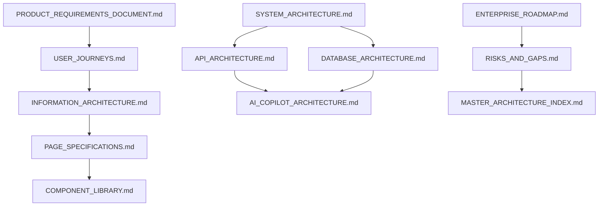

# SustainOCPM: Master Architecture Index
## Traceability Matrix & Gap Analysis

This document serves as the master index for the SustainOCPM platform architecture, establishing traceability between system requirements, UI components, backend APIs, data structures, and AI agents. It also provides a gap analysis and validation metadata for the suite of core architecture documents.

---

### 1. Requirements Traceability Matrix

The matrix below maps the primary Functional Requirements (defined in section 19 of the `PRODUCT_REQUIREMENTS_DOCUMENT.md`) to their corresponding system elements.

| Req ID & Title | Target Pages | Core UI Components | Core API Services | Database Entities | AI Agents | Output Reports / Artifacts |
| :--- | :--- | :--- | :--- | :--- | :--- | :--- |
| **REQ-19.1 Ingestion & Extractor** | Home Page, Process Discovery | Upload Wizard, Schema Mapping Wizard | Data Ingestion API, Analysis Service | Uploads, Events, Objects, Event-Object, Object-Object | Process Mining Agent | Raw Log Schema Mapping Log, Dead Letter Queue Report |
| **REQ-19.2 Carbon Attribution** | Carbon Intelligence | Carbon Score Card, Chart Container, Audit Trail Viewer | Carbon Service, Methodology Service | Emissions, Emission Factors, Audit Logs | Carbon Agent, Methodology Agent | ISO 14067 PCF Report with Audit QR Code |
| **REQ-19.3 Conformance Engine** | Conformance Intelligence | Process Graph, Data Table, Alert Panel | Conformance Service, Alert Service | Process Models, Conformance Results, Alerts | Process Mining Agent, Recommendation Agent | Process Deviation Auditing Log |
| **REQ-19.4 Compliance & ESG** | ESG Intelligence, BRSR Reporting | ESG Score Card, Report Viewer, Supplier Card | ESG Service, Supplier Service, Reporting Service | Reports, Suppliers, Benchmarks, Dashboards | ESG Agent, Supplier Agent, BRSR Agent | SEBI BRSR Section C (XBRL/PDF), GRI, SASB Disclosures |
| **REQ-19.5 AI Copilot & Decisions** | AI Copilot | AI Chat, Prompt Suggestions, Scenario Simulator, Digital Twin Viewer | Copilot Service, KB Service, Scenario Simulation Service, Digital Twin Service | AI Sessions, Knowledge Base, Recommendations, Scenario Simulations, Digital Twins | Orchestrator, Recommendation Agent, Simulation Agent, Research Agent | Decarbonization ROI Scenario Report |

---

### 2. Core Architecture Document Metadata

Below is the metadata table mapping the ten core architectural documents of SustainOCPM to trace their purpose, linkages, and lifecycle properties.

#### A. Product Requirements Document (PRD)
*   **Purpose:** Establish functional/non-functional targets, user personas, research scope, and project constraints.
*   **Dependencies:** None (origin document).
*   **Related Documents:** All.
*   **Implementation Priority:** Critical.
*   **Risks:** Changing compliance frameworks (EU CBAM/SEBI) may require revisions to metrics.
*   **Future Enhancements:** Add support for regional compliance standards beyond India (BRSR) and EU (CSRD).

#### B. User Journeys
*   **Purpose:** Map user tasks, pain points, and click paths for target personas (Executives, Auditors, Researchers).
*   **Dependencies:** PRD.
*   **Related Documents:** IA, Page Specifications.
*   **Implementation Priority:** High.
*   **Risks:** Disconnect between scientific researcher paths and corporate officer workflows.
*   **Future Enhancements:** Add multi-user collaboration journeys (e.g., ESG Consultant drafting, CSO signing off).

#### C. Information Architecture (IA)
*   **Purpose:** Define system taxonomy, routing structure, sitemap, and data navigation pathways.
*   **Dependencies:** User Journeys.
*   **Related Documents:** Page Specifications, System Architecture.
*   **Implementation Priority:** Medium.
*   **Risks:** Navigational complexity due to overlapping multi-object views.
*   **Future Enhancements:** Model dynamic search-driven navigation patterns.

#### D. System Architecture
*   **Purpose:** Outline deployment layout, event pipelines (Kafka/Spark), container topology, and security perimeters.
*   **Dependencies:** PRD.
*   **Related Documents:** API Architecture, Database Architecture.
*   **Implementation Priority:** High.
*   **Risks:** Network bottlenecks during massive real-time IoT event streams.
*   **Future Enhancements:** Plan federated deployments across edge nodes for local operations.

#### E. Database Architecture
*   **Purpose:** Map hybrid transactional/analytical patterns (PostgreSQL, TimescaleDB, pgvector, Neo4j) and schemas.
*   **Dependencies:** System Architecture.
*   **Related Documents:** API Architecture.
*   **Implementation Priority:** Critical.
*   **Risks:** Graph traversal performance degrades exponentially with complex object-object networks.
*   **Future Enhancements:** Implement automatic graph pruning algorithms for inactive historical events.

#### F. API Architecture
*   **Purpose:** Standardize endpoints, payloads, validation rules, rate-limits, and HATEOAS structures.
*   **Dependencies:** Database Architecture.
*   **Related Documents:** AI Copilot Architecture.
*   **Implementation Priority:** High.
*   **Risks:** Complex multi-object queries exceeding REST timeout thresholds.
*   **Future Enhancements:** Implement GraphQL endpoints for flexible multi-object graph queries.

#### G. AI Copilot Architecture
*   **Purpose:** Define specialized agent roles, prompts, RAG vectors, explainability loops, and orchestration constraints.
*   **Dependencies:** API Architecture, Database Architecture.
*   **Related Documents:** Master Index.
*   **Implementation Priority:** Medium-High.
*   **Risks:** Hallucinations on regulatory queries or carbon metrics calculation paths.
*   **Future Enhancements:** Implement local fine-tuned LLM execution pipelines to prevent third-party data leakage.

#### H. Research Positioning
*   **Purpose:** Map mathematical models, OCEAn framework validity, and contributions to OCPM state-of-the-art.
*   **Dependencies:** PRD.
*   **Related Documents:** System Architecture.
*   **Implementation Priority:** Medium.
*   **Risks:** Discrepancy between academic algorithm scalability limits and enterprise production throughput.
*   **Future Enhancements:** Publish benchmark results for carbon attribution algorithms on open public datasets.

#### I. Enterprise Roadmap
*   **Purpose:** Frame timeline, releases, and consortium co-design milestones across a 4-year plan.
*   **Dependencies:** PRD, System Architecture.
*   **Related Documents:** Risks & Gaps.
*   **Implementation Priority:** Low.
*   **Risks:** Resource constraints or delays in academic-industry technology handoff.
*   **Future Enhancements:** Incorporate feedback loops to adjust milestones based on pilot evaluations.

#### J. Risks & Gaps
*   **Purpose:** Document known technology limitations, security liabilities, performance risks, and mitigation strategies.
*   **Dependencies:** All core architecture files.
*   **Related Documents:** Master Index.
*   **Implementation Priority:** Medium.
*   **Risks:** Failing to address identified gaps before starting system development.
*   **Future Enhancements:** Dynamic risk scoring updated via CI/CD test results.

---

### 3. Critical Findings (Gap Analysis)

During the compilation of the master index and validation of the architecture files, the following critical gaps, conflicts, and overlaps were identified:

#### A. Missing Requirements
1.  **Scope 3 Data Trust Protocol:** While the PRD mentions importing Scope 3 data from suppliers, it lacks a mechanism to verify the validity of supplier inputs.
    *   *Mitigation:* Introduce a digital signature verification step in the Data Ingestion API for supplier-submitted event logs.
2.  **CBAM Regulation Compliance:** The platform lacks automated metrics to calculate Exposure Taxes under the European Carbon Border Adjustment Mechanism (CBAM) for Indian exports.
    *   *Mitigation:* Add a dedicated calculation service in the ESG Service that maps shipping routes and product weights to CBAM tariff rules.

#### B. Architectural Conflicts
1.  **Real-Time Kafka Ingestion vs. Graph Database Updates:** Real-time shop floor SCADA telemetry stream (Kafka/TimescaleDB) runs at millisecond rates, while Neo4j graph updates for object relationships are computationally expensive.
    *   *Mitigation:* Decouple ingestion from graph mapping. Write event telemetry directly to TimescaleDB, and update Neo4j asynchronously using batch jobs run every 5 minutes.
2.  **Multi-Tenant Isolation vs. Shared Supply Chain Graph:** The database architecture mandates strict tenant isolation via Postgres RLS. However, tracking Scope 3 carbon requires sharing object-level emission factors across supply chains.
    *   *Mitigation:* Implement a "Data Clean Room" approach using an anonymized public registry table for product carbon intensity metrics, bypassing raw tenant records.

#### C. System Overlaps
1.  **Duplicate Calculations in Carbon & ESG Services:** Both services independently query the same emission factors to calculate carbon values for reporting.
    *   *Mitigation:* Unify calculations under the `Carbon Service`, and have the `ESG Service` consume these computed values directly.
2.  **Copilot Recommendation Agent vs. Local Recommendation Service:** Both components generate operational recommendations (e.g., shift schedule changes), leading to potential guidance conflicts.
    *   *Mitigation:* Designate the `Recommendation Service` as the single source of truth for optimization algorithms, and configure the Copilot agent to act as an NL presentation interface for these results.

#### D. Operational Gaps
1.  **Schema Evolution Strategy:** OCEL 2.0 schemas will evolve over the 3-year data retention period, but there is no mechanism defined to handle legacy object properties.
    *   *Mitigation:* Establish a schema versioning registry in the mapping engine to automatically run migrations on older database records during query execution.
2.  **Disaster Recovery for Vector Search:** The database architecture defines recovery plans for relational tables but lacks replication details for the pgvector HNSW indexes, which could lead to offline Copilot status during failovers.
    *   *Mitigation:* Include pgvector directories in the hourly database snapshot routines and automate index rebuilding on the secondary database node.
