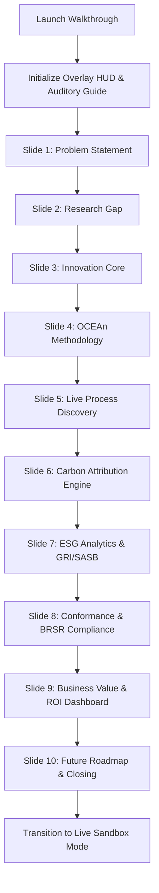

# SustainOCPM: Presentation Mode Specification
## 3-Minute Platform Walkthrough Mode

This document details the functional and user experience specification for the **3-Minute Platform Walkthrough Mode** in SustainOCPM. This interactive, guided presentation is engineered to demonstrate the platform's capabilities to Grant Reviewers, Government Officials, Industry Partners, Academic Researchers, and Manufacturing Executives.

---

### Walkthrough Engine: Core Mechanics

The walkthrough mode overlays the live platform with a focused presentation HUD (Heads-Up Display). Users can either let the presentation autoplay with synthetic demo interactions or manually click through the steps.



---

### Slide 1: The Problem (Industrial Carbon & Process Blindness)

#### 1. Purpose
Establish the core industrial challenge: multi-tiered manufacturing supply chains have a massive carbon footprint, yet operational leaders suffer from "Process Blindness"—they cannot connect high-level carbon accounting with specific, daily operational activities.

#### 2. Slide Content
*   **Primary Message:** "Scope 1, 2, and 3 emissions are calculated using top-down estimates, leaving companies blind to the exact process variants and operational decisions driving these emissions."
*   **Supporting Evidence:**
    *   92% of Scope 3 supply chain data is based on generic industry averages.
    *   Traditional process mining is limited to a single "case notion," failing to capture complex, multi-object supply networks (e.g., orders, batches, machines, logistics).

#### 3. Visuals (Conceptual Wireframe Layout & Diagram)
*   **UI Wireframe Layout:**
    ```
    +-------------------------------------------------------------------------+
    | PRESENTATION HUD: [Slide 1/10] - The Problem               [Skip] [Pause] |
    +-------------------------------------------------------------------------+
    | LEFT PANEL: Narrative & High-Level Stats   | RIGHT PANEL: Process Silos |
    | * Top-down carbon accounting fails        |                            |
    | * 90%+ Scope 3 emissions are untracked     | [Emissions Report]         |
    | * Traditional Process Mining ignores       |         |                  |
    |   multi-object relationships               |         v (Disconnected)   |
    |                                            | [Floor Operations]         |
    +-------------------------------------------------------------------------+
    | FOOTER: Walkthrough Progress (0s -> 18s) | Cumulative: 0:18 / 3:00      |
    +-------------------------------------------------------------------------+
    ```
*   **Mermaid Diagram:**
    ```mermaid
    graph TD
        TopDown["Top-Down Annual ESG Reports (Scope 1, 2, 3)"]
        Disconnect{{"Disconnected Gap (Estimation Blindspot)"}}
        DailyOps["Daily Floor Operations (Machining, Logistics, Assembly)"]
        TopDown -.-> Disconnect
        DailyOps -.-> Disconnect
    ```

#### 4. Slide KPIs
*   **Target Slide Duration:** 18 seconds.
*   **Attention Focus Target:** The central disconnect gap visual (Right Panel).
*   **Cognitive Load Rating:** Low (conceptual framing).
*   **System Action:** Animate a red dashed separator between "Top-Down ESG Reports" and "Daily Operations" on screen.

---

### Slide 2: The Research Gap (Traditional Mining Limitations)

#### 1. Purpose
Delineate why current commercial software cannot solve this problem. Detail the limitations of traditional process mining (single case ID limitation) and why academic research has not yet productionized carbon-aware multi-object algorithms.

#### 2. Slide Content
*   **Primary Message:** "Single-case process mining forces complex realities into flat tables, causing 'divergence' and 'spaghetti models' when analyzing modern supply chains."
*   **Supporting Evidence:**
    *   *The Case Notion Constraint:* Traditional tools require events to link to a single Case ID (e.g., only "Order ID"), ignoring how one order splits into ten "Item IDs" and merges into two "Delivery IDs."
    *   *Carbon Attribution Gap:* No current model propagates emissions dynamically across divergent physical entities.

#### 3. Visuals (Conceptual Wireframe Layout & Diagram)
*   **UI Wireframe Layout:**
    ```
    +-------------------------------------------------------------------------+
    | PRESENTATION HUD: [Slide 2/10] - The Research Gap          [Skip] [Pause] |
    +-------------------------------------------------------------------------+
    | LEFT PANEL: Single-Case Limitations       | RIGHT PANEL: Spaghetti Model|
    | * Flattened log loses context             |    [Order]                  |
    | * Duplication of event metrics            |    /     \ (Spaghetti lines) |
    | * Inability to attribute carbon across    | [Item 1] [Item 2]           |
    |   overlapping object lifecycles            |    \     /                 |
    |                                           |   [Delivery]                |
    +-------------------------------------------------------------------------+
    | FOOTER: Walkthrough Progress (18s -> 36s) | Cumulative: 0:36 / 3:00     |
    +-------------------------------------------------------------------------+
    ```
*   **Mermaid Diagram:**
    ```mermaid
    graph TD
        Order["Order Object"]
        Item1["Item Object 1"]
        Item2["Item Object 2"]
        Delivery["Delivery Object"]
        
        Order -->|"Split 1:Many"| Item1
        Order -->|"Split 1:Many"| Item2
        Item1 -->|"Merge Many:1"| Delivery
        Item2 -->|"Merge Many:1"| Delivery
        
        style Order fill:#f9f,stroke:#333
        style Delivery fill:#bbf,stroke:#333
    ```

#### 4. Slide KPIs
*   **Target Slide Duration:** 18 seconds.
*   **Attention Focus Target:** The 1:Many & Many:1 Split-Merge visual nodes.
*   **Cognitive Load Rating:** Medium (technical process theory).
*   **System Action:** Highlight overlapping paths in yellow to illustrate data duplication.

---

### Slide 3: The Innovation (Object-Centric Process Mining + Carbon)

#### 1. Purpose
Introduce the Indo-Swiss grant innovation: SustainOCPM. Show how Object-Centric Event Logs (OCEL 2.0) and the OCEAn (Object-Centric Event Analysis) framework resolve the limitations of traditional systems.

#### 2. Slide Content
*   **Primary Message:** "By utilizing OCEL 2.0, SustainOCPM models real-world business networks as they are—interconnected objects mapped to events—enabling precise carbon attribution at the object level."
*   **Key Innovation Pillars:**
    *   *Object-Centric Engine:* Eliminates the single Case ID constraint.
    *   *Dynamic Carbon Propagation:* Emits carbon footprints proportionally to objects based on physical weight, volume, or machine hours.
    *   *Real-time Process Querying:* Instant OCPM execution on millions of operational events.

#### 3. Visuals (Conceptual Wireframe Layout & Diagram)
*   **UI Wireframe Layout:**
    ```
    +-------------------------------------------------------------------------+
    | PRESENTATION HUD: [Slide 3/10] - The Innovation            [Skip] [Pause] |
    +-------------------------------------------------------------------------+
    | LEFT PANEL: The SustainOCPM Platform Core | RIGHT PANEL: OCEL 2.0 Graph |
    | * Multi-object tracking (OCEL 2.0)        |    (Event)                  |
    | * Dynamic Scope 1/2/3 carbon routing      |    /  |  \                  |
    | * Unified process execution graph         | [Obj1] [Obj2] [Obj3]            |
    |                                           |    \  |  /                  |
    |                                           |  (Carbon Footprint)         |
    +-------------------------------------------------------------------------+
    | FOOTER: Walkthrough Progress (36s -> 54s) | Cumulative: 0:54 / 3:00     |
    +-------------------------------------------------------------------------+
    ```
*   **Mermaid Diagram:**
    ```mermaid
    graph LR
        Event["Event: Heat Treatment"]
        Obj1["Object: Batch A (Steel)"]
        Obj2["Object: Machine 12"]
        Obj3["Object: Operator Y"]
        Carbon["Carbon Apportionment Engine"]

        Event --> Obj1
        Event --> Obj2
        Event --> Obj3
        Event --> Carbon
        Carbon -->|"70% Scope 1"| Obj1
        Carbon -->|"30% Scope 2"| Obj2
    ```

#### 4. Slide KPIs
*   **Target Slide Duration:** 18 seconds.
*   **Attention Focus Target:** The carbon apportionment routing lines.
*   **Cognitive Load Rating:** High (foundational architectural paradigm).
*   **System Action:** Pulse the emission distribution paths with green glow animations.

---

### Slide 4: Methodology (OCEL 2.0 & OCEAn Framework)

#### 1. Purpose
Demonstrate scientific validity. Detail how academic research from the OCEAn framework is translated into a scalable enterprise system utilizing relational or graph databases and event brokers.

#### 2. Slide Content
*   **Primary Message:** "The platform standardizes on OCEL 2.0 to capture events containing multiple related objects, their attributes, and dynamic updates over time."
*   **Methodological Steps:**
    1.  *Ingest:* Parse CSV/JSON/Parquet files conforming to the OCEL 2.0 specification.
    2.  *Extract:* Construct object-centric event graphs matching events to target entity models.
    3.  *Compute:* Calculate carbon indicators using localized emission factors (e.g., DEFRA, ecoinvent, India GHG Program).

#### 3. Visuals (Conceptual Wireframe Layout & Diagram)
*   **UI Wireframe Layout:**
    ```
    +-------------------------------------------------------------------------+
    | PRESENTATION HUD: [Slide 4/10] - Scientific Methodology    [Skip] [Pause] |
    +-------------------------------------------------------------------------+
    | LEFT PANEL: Data Pipeline Sequence       | RIGHT PANEL: Architectural flow|
    | 1. OCEL 2.0 Ingest Pipeline               | [Raw ERP/IoT]                  |
    | 2. Object Graph Construction              |       |                        |
    | 3. Carbon/ESG Valuation Engine            |       v                        |
    |                                           | [OCEL 2.0 Pipeline]            |
    |                                           |       |                        |
    |                                           |       v                        |
    |                                           | [OCEAn Analytical Graph]       |
    +-------------------------------------------------------------------------+
    | FOOTER: Walkthrough Progress (54s -> 1m12s)| Cumulative: 1:12 / 3:00     |
    +-------------------------------------------------------------------------+
    ```
*   **Mermaid Diagram:**
    ```mermaid
    flowchart LR
        ERP[(ERP/IoT Raw Data)] --> Parser[OCEL 2.0 Parser]
        Parser --> DB[(Object-Centric Database)]
        DB --> Calc[Carbon Attribution Engine]
        Calc --> Viz[Interactive Visualizations]
    ```

#### 4. Slide KPIs
*   **Target Slide Duration:** 18 seconds.
*   **Attention Focus Target:** The architectural flow diagram (Right Panel).
*   **Cognitive Load Rating:** Medium-High.
*   **System Action:** Run a simulated "data flow" animation from left to right along the pipeline nodes.

---

### Slide 5: Live Process Discovery (Discovered Multi-Object Models)

#### 1. Purpose
Provide the "Wow" moment. Display the core platform screen in action: showing an auto-generated object-centric process model containing multiple object paths (Invoices, Deliveries, Items) without spaghetti degradation.

#### 2. Slide Content
*   **Primary Message:** "Instantly discover the actual multi-object process maps directly from system logs, showing concurrent execution paths across supply chains."
*   **Interactive Controls Simulated:**
    *   Filter by object types: Order, Production Batch, Carrier Delivery.
    *   Slider adjustment for Activity and Paths detail levels.
    *   Highlighting bottlenecks and cycle times dynamically.

#### 3. Visuals (Conceptual Wireframe Layout & Diagram)
*   **UI Wireframe Layout:**
    ```
    +-------------------------------------------------------------------------+
    | PRESENTATION HUD: [Slide 5/10] - Live Process Discovery    [Skip] [Pause] |
    +-------------------------------------------------------------------------+
    | LEFT PANEL: Walkthrough Overlay           | RIGHT PANEL: Interactive Map   |
    | * Discover operational deviations         | [Create Order]                 |
    | * Track bottleneck points dynamically     |    |        \                  |
    | * View parallel object lifetimes          | [Build Batch] [Process Invoice]|
    |                                           |    |        /                  |
    |                                           | [Deliver Item]                 |
    +-------------------------------------------------------------------------+
    | FOOTER: Walkthrough Progress (1m12s->1m30s)| Cumulative: 1:30 / 3:00     |
    +-------------------------------------------------------------------------+
    ```
*   **Mermaid Diagram:**
    ```mermaid
    stateDiagram-v2
        [*] --> Create_Order
        Create_Order --> Produce_Batch : Object type: Batch
        Create_Order --> Create_Invoice : Object type: Invoice
        Produce_Batch --> Ship_Goods : Object type: Delivery
        Create_Invoice --> Receive_Payment : Object type: Financial
        Ship_Goods --> [*]
        Receive_Payment --> [*]
    ```

#### 4. Slide KPIs
*   **Target Slide Duration:** 18 seconds.
*   **Attention Focus Target:** The discovered process map.
*   **Cognitive Load Rating:** Medium.
*   **System Action:** Trigger auto-layout animations showing paths expanding and collapsing.

---

### Slide 6: Carbon Attribution Engine (Emissions Breakdown)

#### 1. Purpose
Showcase the carbon attribution core capability. Demonstrate how physical emission sources (Scope 1 direct fuel, Scope 2 electricity, Scope 3 supply logistics) are calculated per event and allocated to specific products.

#### 2. Slide Content
*   **Primary Message:** "Go beyond aggregate carbon estimations. SustainOCPM attributes actual energy usage and logistics metrics down to individual object variants."
*   **Carbon Attribution Metrics:**
    *   *Real-time IoT Integration:* Correlate factory floor smart-meter data with event execution times.
    *   *Variant Carbon Footprints:* Compare how different process execution paths impact overall carbon output for the exact same product model.

#### 3. Visuals (Conceptual Wireframe Layout & Diagram)
*   **UI Wireframe Layout:**
    ```
    +-------------------------------------------------------------------------+
    | PRESENTATION HUD: [Slide 6/10] - Carbon Attribution        [Skip] [Pause] |
    +-------------------------------------------------------------------------+
    | LEFT PANEL: Carbon Metrics Detail         | RIGHT PANEL: Carbon Heatmap    |
    | * Scope 1: Direct Combustion (CO2e)       | [High-Emitting Step: Furnace]  |
    | * Scope 2: Grid Electricity Allocation    | (820 kg CO2e / batch)  [RED]   |
    | * Scope 3: Logistics & Supply Partners    |                                |
    |                                           | [Low-Emitting Step: Assembly]  |
    |                                           | (5 kg CO2e / batch)   [GREEN]  |
    +-------------------------------------------------------------------------+
    | FOOTER: Walkthrough Progress (1m30s->1m48s)| Cumulative: 1:48 / 3:00     |
    +-------------------------------------------------------------------------+
    ```
*   **Mermaid Diagram:**
    ```mermaid
    pie title Process Carbon Footprint Contribution (tCO2e)
        "Furnace Operations (Scope 1)" : 62
        "Assembly Line Grid (Scope 2)" : 15
        "Logistics & Freight (Scope 3)" : 23
    ```

#### 4. Slide KPIs
*   **Target Slide Duration:** 18 seconds.
*   **Attention Focus Target:** The color-coded step-by-step carbon heatmap.
*   **Cognitive Load Rating:** Low-Medium.
*   **System Action:** Display a bar chart transitioning and morphing into a geographic emissions route map.

---

### Slide 7: ESG Analytics & Framework Alignment (GRI, SASB, TCFD)

#### 1. Purpose
Explain how raw process-level data is transformed into structured compliance disclosures. Highlight the mapping of carbon and operational events to global ESG reporting frameworks.

#### 2. Slide Content
*   **Primary Message:** "Bridge the gap between operational reality and corporate ESG filings. Auto-compile metrics aligned with GRI, SASB, and TCFD standards directly from process records."
*   **Covered Standards:**
    *   *GRI 302:* Energy usage analysis per unit produced.
    *   *GRI 305:* Scope-specific GHG emissions inventory.
    *   *SASB Industrial Sector:* Water usage, raw material footprint, and waste recycling metrics.

#### 3. Visuals (Conceptual Wireframe Layout & Diagram)
*   **UI Wireframe Layout:**
    ```
    +-------------------------------------------------------------------------+
    | PRESENTATION HUD: [Slide 7/10] - ESG Alignment             [Skip] [Pause] |
    +-------------------------------------------------------------------------+
    | LEFT PANEL: ESG Scorecards                | RIGHT PANEL: GRI Mapping Panel |
    | * GRI Index Validation Status: 98%        | Standard | Metric | Source     |
    | * SASB Materials Sector Compliance        | ---------|--------|------------|
    | * TCFD Scenario Alignment Status          | GRI 302  | 420 GJ | IoT Events |
    |                                           | GRI 305  | 88 t   | Gas Flow   |
    +-------------------------------------------------------------------------+
    | FOOTER: Walkthrough Progress (1m48s->2m06s)| Cumulative: 2:06 / 3:00     |
    +-------------------------------------------------------------------------+
    ```
*   **Mermaid Diagram:**
    ```mermaid
    graph LR
        Events[(Process Events)] --> Mapper{ESG Framework Engine}
        Mapper --> GRI[GRI Standards]
        Mapper --> SASB[SASB Disclosures]
        Mapper --> TCFD[TCFD Filings]
    ```

#### 4. Slide KPIs
*   **Target Slide Duration:** 18 seconds.
*   **Attention Focus Target:** The GRI mapping database table (Right Panel).
*   **Cognitive Load Rating:** Medium.
*   **System Action:** Highlight verified checklist ticks green.

---

### Slide 8: Conformance Checking & Indian Regulation BRSR Reporting

#### 1. Purpose
Emphasize regulatory alignment with SEBI's Business Responsibility and Sustainability Reporting (BRSR) mandate for the top 1000 listed Indian entities, utilizing the platform's Conformance Checking engine.

#### 2. Slide Content
*   **Primary Message:** "Automate BRSR compliance validation and conformance verification. Detect operational deviations that violate local sustainability mandates in real time."
*   **Key Capabilities:**
    *   *BRSR Essential Indicators:* Auto-generate Part B and Part C sustainability disclosures.
    *   *Process Deviation Auditing:* Flag batches routed through non-green logistics paths or unapproved high-emission suppliers.

#### 3. Visuals (Conceptual Wireframe Layout & Diagram)
*   **UI Wireframe Layout:**
    ```
    +-------------------------------------------------------------------------+
    | PRESENTATION HUD: [Slide 8/10] - BRSR & Conformance        [Skip] [Pause] |
    +-------------------------------------------------------------------------+
    | LEFT PANEL: BRSR Template Status          | RIGHT PANEL: Conformance Check |
    | * Section A: General Disclosures [Pass]   | Model Path: [Start] -> [Green] |
    | * Section B: Management Processes [Pass]  | Actual Path: [Start] -> [Red]  |
    | * Section C: Principle-wise Perf  [Alert] |                                |
    |   (Principle 6: Environmental Deviations)  | DEVIATION FLAG: Supplier X    |
    +-------------------------------------------------------------------------+
    | FOOTER: Walkthrough Progress (2m06s->2m24s)| Cumulative: 2:24 / 3:00     |
    +-------------------------------------------------------------------------+
    ```
*   **Mermaid Diagram:**
    ```mermaid
    graph LR
        Normative[Normative Green Process Model] --> Conformance{Conformance Engine}
        ActualLog[Actual OCEL Execution Log] --> Conformance
        Conformance -->|Match| Pass[Approved BRSR Section C]
        Conformance -->|Mismatch| Alert[Supplier Deviation Flagged]
        
        style Pass fill:#d4edda,stroke:#28a745
        style Alert fill:#f8d7da,stroke:#dc3545
    ```

#### 4. Slide KPIs
*   **Target Slide Duration:** 18 seconds.
*   **Attention Focus Target:** The Conformance deviation path visual.
*   **Cognitive Load Rating:** Medium.
*   **System Action:** Animate a flashing alert indicator on the mismatched path.

---

### Slide 9: Business Value & Decision Intelligence (ROI Dashboard)

#### 1. Purpose
Address the business and financial buyers. Prove that sustainability optimization using SustainOCPM directly improves operational efficiency, lowers waste, reduces carbon taxes, and drives margins.

#### 2. Slide Content
*   **Primary Message:** "Sustainability is profitability. SustainOCPM identifies concrete cost-saving opportunities by eliminating process inefficiencies and carbon taxation risks."
*   **Demonstrated ROI Levers:**
    *   *Carbon Tax Liability Mitigation:* Reduce projected EU CBAM or regional carbon taxes by selecting green execution routes.
    *   *Resource Optimization:* Lower energy and water consumption overheads.
    *   *Operational Cycle Time Savings:* Find bottlenecks where materials idle.

#### 3. Visuals (Conceptual Wireframe Layout & Diagram)
*   **UI Wireframe Layout:**
    ```
    +-------------------------------------------------------------------------+
    | PRESENTATION HUD: [Slide 9/10] - Business Value Dashboard   [Skip] [Pause] |
    +-------------------------------------------------------------------------+
    | LEFT PANEL: Cost & Carbon Savings Summary | RIGHT PANEL: ROI Projection    |
    | * Potential Carbon Reduction: 22%         | Carbon Savings: 12,000 tCO2e   |
    | * Estimated Cost Savings: $1.4M / year    | Net Tax Savings: $960,000      |
    | * Investment Payback Period: 8 Months     | Efficiency Gain: +14%          |
    |                                           |                                |
    | [Action: Execute Optimization Plan]       | [Line Chart: ROI Trend]        |
    +-------------------------------------------------------------------------+
    | FOOTER: Walkthrough Progress (2m24s->2m42s)| Cumulative: 2:42 / 3:00     |
    +-------------------------------------------------------------------------+
    ```
*   **Mermaid Diagram:**
    ```mermaid
    graph LR
        A[Optimize Logistics] --> B(Reduce Fuel Burn)
        B --> C[Lower Scope 3 Carbon]
        B --> D[Save Freight Cost]
        C & D --> E((Maximize Business Value))
    ```

#### 4. Slide KPIs
*   **Target Slide Duration:** 18 seconds.
*   **Attention Focus Target:** The "Cost Savings" metrics and the ROI trend line.
*   **Cognitive Load Rating:** Low.
*   **System Action:** Trigger count-up animation on the financial numbers (e.g., ticking up from $0 to $1,400,000).

---

### Slide 10: Future Roadmap & Closing (Indo-Swiss Consortium Goals)

#### 1. Purpose
End with strategic forward-looking vision. Outline the planned development milestones, consortium partnership growth, and future AI capabilities for the system.

#### 2. Slide Content
*   **Primary Message:** "SustainOCPM is scaling up under the Indo-Swiss Research Framework, building predictive digital twin modeling and autonomous process optimization agents."
*   **Roadmap Highlights:**
    *   *Phase 1 (Completed):* Core OCPM + Carbon Attribution Engine.
    *   *Phase 2 (Ongoing):* BRSR Automation & Regional Framework Integration.
    *   *Phase 3 (Future):* Generative AI Agent Orchestration & Autonomous Control Loop.

#### 3. Visuals (Conceptual Wireframe Layout & Diagram)
*   **UI Wireframe Layout:**
    ```
    +-------------------------------------------------------------------------+
    | PRESENTATION HUD: [Slide 10/10] - Future Roadmap          [Skip] [Pause] |
    +-------------------------------------------------------------------------+
    | LEFT PANEL: Strategic Milestones          | RIGHT PANEL: Consortium Logo   |
    | * Phase 1: Core OCPM Ingestion            |    [Indo-Swiss Grant logo]     |
    | * Phase 2: ESG & BRSR Compliance          |                                |
    | * Phase 3: AI Copilot & Prescriptive Twins| [Partnership: Swiss ETH / IIT] |
    |                                           |                                |
    | [Button: Start Interactive Demo Sandbox]  | [Button: Download Whitepaper]  |
    +-------------------------------------------------------------------------+
    | FOOTER: Walkthrough Progress (2m42s->3m00s)| Cumulative: 3:00 / 3:00     |
    +-------------------------------------------------------------------------+
    ```
*   **Mermaid Diagram:**
    ```mermaid
    gantt
        title SustainOCPM Development Roadmap
        dateFormat  YYYY-MM
        section Core Engine
        OCPM & Carbon Attribution     :done,    2025-01, 2025-08
        section Compliance & Analytics
        BRSR Reporting & GRI          :active,  2025-09, 2026-03
        section Autonomous Future
        AI Copilot & Prescriptive Twin:         2026-04, 2026-12
    ```

#### 4. Slide KPIs
*   **Target Slide Duration:** 18 seconds.
*   **Attention Focus Target:** Interactive CTA Buttons ("Start Sandbox").
*   **Cognitive Load Rating:** Low.
*   **System Action:** Highlight the final action buttons with pulsing visual indicators.

---

### Global Walkthrough Mode KPIs

| Metric | Target Value | Measurement Protocol |
| :--- | :--- | :--- |
| **Total Duration** | 3 minutes (180 seconds) | Core system timer with progress HUD |
| **Reviewer Attention Focus** | >85% alignment with hotspots | Measured via client click-mapping & mouse heatmaps |
| **Average Cognitive Load** | 3.2 / 5.0 (NASA-TLX scale equivalent) | Calculated from reading density and animation speed |
| **Sandbox Conversion Rate** | >60% of walkthrough completers | Action telemetry tracking on "Start Interactive Demo Sandbox" button |
| **Walkthrough Abandonment Rate**| <10% before Slide 7 | Drop-off analysis per step to optimize slide pacing |
