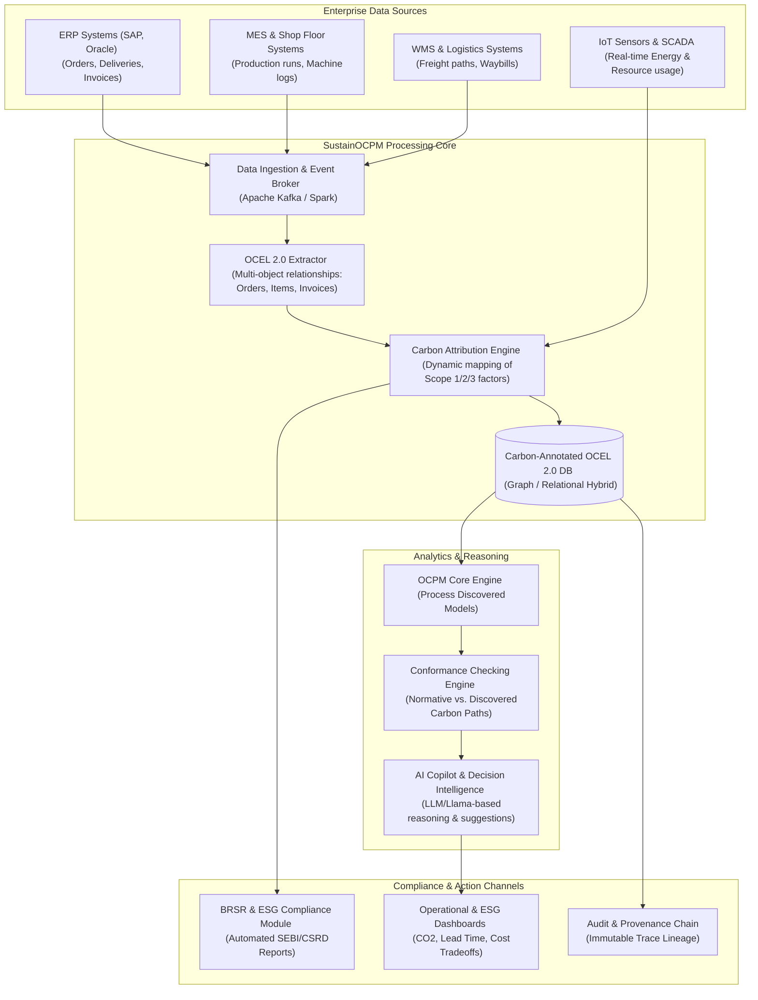
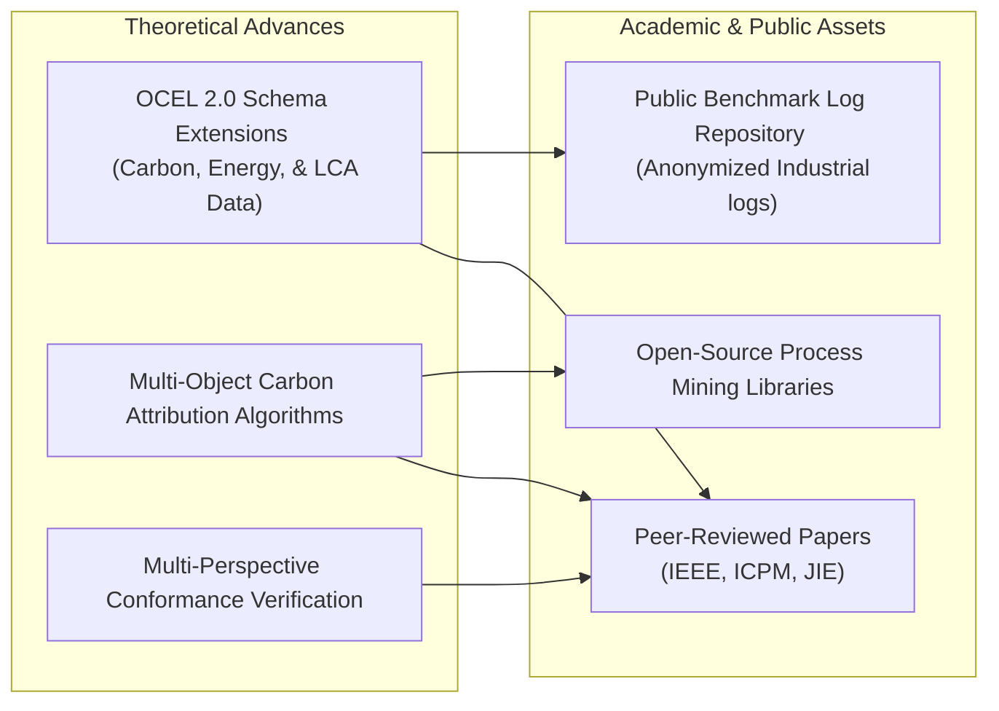

# SustainOCPM — Product Requirements Document
## Carbon-Aware Object-Centric Process Intelligence Platform
### Indo-Swiss Research Grant

---

## 1. Executive Summary

SustainOCPM represents a major advancement in enterprise software, bridging academic process science and corporate sustainability management. Funded by the Indo-Swiss Joint Research Programme (ISJRP), this platform addresses a critical gap in global industry: the lack of connection between daily operational transactions and long-term carbon reduction targets. While modern enterprises deploy Enterprise Resource Planning (ERP) and Manufacturing Execution Systems (MES) to track physical transactions, and utilize environmental software to report static carbon metrics, no system currently bridges these layers. As a result, companies cannot attribute greenhouse gas (GHG) emissions to individual transaction paths. SustainOCPM addresses this need by applying Object-Centric Process Mining (OCPM)—based on the open-source OCEL 2.0 (Object-Centric Event Log) standard—to capture complex, multi-object operational processes and associate carbon, energy, and resources directly with individual process steps, material batches, and logistics paths.

By combining process execution data with localized emission factors and machine learning models, SustainOCPM models the operational reality of global enterprises as dynamic, carbon-aware systems. The platform goes beyond passive carbon accounting, offering active conformance checking to detect carbon-intensive process deviations, predictive simulation to evaluate the emissions impact of operational changes, and automated compliance reporting—including direct mapping to India's Business Responsibility and Sustainability Reporting (BRSR) framework and Switzerland’s climate disclosure regulations. SustainOCPM functions as a process-centric decision intelligence engine, giving operations managers, sustainability officers, and regulators the granular transparency required to run industrial processes that are both operationally efficient and environmentally sustainable.

The collaboration under the Indo-Swiss Research Grant brings together Swiss academic leadership in formal verification and process mining algorithms with India's extensive manufacturing sector and software development capabilities. This synergy enables the platform to be tested in diverse industrial settings—ranging from Swiss precision machinery plants to Indian automotive and metallurgical facilities. Consequently, the platform is designed to handle different scales of operation, varying data quality levels, and complex international supply chains.



---

## 2. Vision

Every industrial process on Earth is continuously optimized for both operational efficiency and planetary sustainability through intelligent process mining.

Over the next decade, carbon accounting will transition from a retrospective, spreadsheet-driven compliance chore to a real-time, transaction-level operational metric. SustainOCPM envisions a future where carbon emissions are treated as a primary currency alongside cost and time. In this future, when a manufacturer produces a component, ships a cargo container, or processes an invoice, the system automatically computes, attributes, and verifies the carbon footprint at the specific object and event level. 

By grounding environmental footprinting in the mathematical rigor of Object-Centric Process Mining, we will eliminate the opacity of global supply chains. Process execution models will serve as the shared digital twin of the enterprise, allowing executives, operations managers, and external auditors to interact with a single source of truth. As a result, businesses will no longer face a trade-off between profitability and sustainability; instead, automated process optimization algorithms will continuously discover, recommend, and execute operational workflows that minimize both processing costs and carbon emissions.

---

## 3. Mission

Build the world's first platform that unifies Object-Centric Process Mining with carbon attribution, ESG intelligence, and AI-driven sustainability optimization.

SustainOCPM is executing this mission through three key pillars:
1. **Mathematical and Scientific Rigor**: Developing formal extensions to the Object-Centric Event Log (OCEL 2.0) standard to capture carbon variables, energy footprints, and material flows across concurrent and intersecting object lifecycles (such as orders, items, machines, batches, and vehicles) without losing data relationships.
2. **Industrial Translation**: Building a performant, enterprise-grade SaaS platform capable of ingesting event logs from ERP, MES, and WMS systems, transforming them into object-centric event graphs, and performing real-time carbon attribution.
3. **Regulatory and Decisional Empowerment**: Delivering tailored, audit-ready compliance reporting (focusing on SEBI’s BRSR framework in India and CSRD/GRI frameworks in Europe) and embedding conversational AI capabilities to democratize process optimization for non-technical stakeholders.

---

## 4. Problem Statement

Modern enterprise efforts to achieve sustainability are hindered by six critical structural gaps:

```
+-----------------------------------------------------------------------------------+
|                                 SustainOCPM Gaps                                  |
+--------------------------+--------------------------+-----------------------------+
| 1. The Process Mining    | 2. The Carbon            | 3. The ESG Intelligence     |
|    Gap                   |    Attribution Gap       |    Gap                      |
|                          |                          |                             |
| Traditional process      | Carbon accounting is     | ESG metrics are reported    |
| mining uses a single     | aggregated at the entity | as static, retrospective    |
| "case ID," losing        | level, preventing        | spreadsheets, disconnected  |
| many-to-many relationships| transaction-level        | from real-time operational  |
| across business objects. | process attribution.     | execution.                  |
+--------------------------+--------------------------+-----------------------------+
| 4. The Decision          | 5. The BRSR              | 6. The Research             |
|    Gap                   |    Compliance Gap        |    Gap                      |
|                          |                          |                             |
| Operational decisions    | Indian enterprises       | No unified framework        |
| are made without visibility| face high compliance costs| integrates OCPM, carbon    |
| into the trade-offs      | and data-auditing errors | attribution, and formal     |
| between cost, lead time, | due to manual BRSR       | conformance checking        |
| and carbon footprint.    | data consolidation.      | methodologies.              |
+--------------------------+--------------------------+-----------------------------+
```

### 4.1 The Process Mining Gap
Traditional process mining tools are built on a "single-case notion," which assumes every event belongs to exactly one case ID (e.g., an order ID). However, real-world manufacturing and supply chains involve multiple, interacting objects: a single sales order may contain multiple items, which are grouped into different production batches, transported via shared deliveries, and invoiced across multiple bills. Forcing these relationships into a single case ID leads to severe data duplication (convergence) or artificial omission of steps (divergence), resulting in "spaghetti models." This limitation prevents organizations from tracking the actual path of individual objects and identifying how their interactions generate bottlenecks and operational waste.

```
Traditional Single-Case Process Mining (Loss of relationships):
[Sales Order 101] ---> [Item A] ---\
                                    +---> [Shared Delivery 5001] ---> [Invoice 901]
[Sales Order 102] ---> [Item B] ---/

Object-Centric Process Mining (Preserving relationships):
[Sales Order 101] ===> [Item A] ===\
                                    ===> [Delivery 5001] ===> [Invoice 901]
[Sales Order 102] ===> [Item B] ===/
```

### 4.2 The Carbon Attribution Gap
Current carbon accounting methodologies calculate greenhouse gas emissions at a macroscopic, static level (e.g., total electricity consumed by a factory in a quarter, or annual fuel usage of a logistics fleet). While these aggregates suffice for corporate-level reporting, they are useless for operational optimization. There is no mechanism to attribute these emissions down to the transaction level. A company cannot determine the precise carbon footprint of a specific product variant, a particular batch of materials, or a customized delivery route, making it impossible to identify which process steps are the true root causes of excess emissions.

### 4.3 The ESG Intelligence Gap
ESG metrics are disconnected from operational execution. Data collection is largely manual, relying on annual surveys, spreadsheets, and retrospective estimations. This manual process introduces significant data latency (often 6 to 12 months), exposes the company to human error, and limits transparency. Because there is no verifiable data lineage connecting a reported ESG metric back to the transactional events on the shop floor or in the warehouse, companies face risks of greenwashing allegations and struggle to satisfy rigorous third-party financial and environmental audits.

### 4.4 The Decision Gap
When operations managers attempt to optimize workflows, they face competing priorities: minimizing lead time, reducing cost, and minimizing carbon emissions. Because existing decision-support systems lack a process-aware view, they cannot simulate or evaluate the trade-offs between these variables. Managers make isolated decisions—such as shifting a production run to a faster machine—without realizing that the machine consumes twice the energy per cycle, thereby blowing past the facility’s carbon budget. Operational decision-making remains reactive, fragmented, and blind to sustainability impacts.

### 4.5 The BRSR Compliance Gap
In India, the Securities and Exchange Board of India (SEBI) has mandated the Business Responsibility and Sustainability Reporting (BRSR) framework for the top 1000 listed companies. Preparing these disclosures is a major operational burden. It requires manual data consolidation across diverse ERP, HR, energy, and supply chain systems. Scope 3 emissions (value chain emissions) are particularly difficult to track, as companies struggle to aggregate data from fragmented, multi-tier domestic suppliers. The lack of automation results in high compliance costs, reporting delays, and audit risks.

### 4.6 The Research Gap
In the academic domain, process mining, carbon accounting, and formal conformance checking remain siloed. Process mining researchers develop advanced OCPM algorithms (such as inductive miners for OCEL logs) without considering environmental attributes. Environmental scientists model life-cycle assessments (LCA) using static databases without utilizing dynamic process execution data. Formal methods researchers design conformance checking techniques that verify structural compliance with business rules but ignore compliance with emission thresholds and resource constraints. There is no unified mathematical framework that integrates these three fields.

---

## 5. Target Users

SustainOCPM is designed to serve six primary user segments:

*   **Manufacturing Enterprises (India & Switzerland)**: Large-scale industrial companies (automotive, machinery, chemicals, and textiles) seeking to optimize processes, reduce energy costs, and comply with regional environmental regulations.
*   **ESG Consulting Firms**: Advisory organizations tasked with analyzing client carbon footprints, identifying sustainability risks, and designing reduction strategies. They use the platform to perform continuous, data-driven diagnostics instead of manual audits.
*   **Government Regulatory Bodies**: Organizations like SEBI in India and the Federal Office for the Environment (FOEN) in Switzerland. They require standardized, auditable, and verifiable sustainability data to enforce environmental laws and verify corporate disclosures.
*   **Academic Researchers**: Computer scientists and environmental researchers focusing on process mining (OCPM), OCEL 2.0 standards, life-cycle assessments, and formal verification methodologies.
*   **Supply Chain and Procurement Organizations**: Teams managing complex logistics networks who need to monitor supplier performance, track Scope 3 emissions, and make carbon-aware sourcing decisions.
*   **Auditing and Assurance Firms**: Internal and external compliance auditors (including the Big 4) who require complete data lineage, transparent calculation methodologies, and tamper-proof event logs to certify sustainability statements.

---

## 6. User Personas

To ensure the platform meets the needs of all stakeholders, SustainOCPM is built around nine distinct user personas.

```
+-----------------------------------------------------------------------------------------------------+
|                                          SustainOCPM Personas                                       |
+-----------------------------+-------------------------------+---------------------------------------+
| 6.1 Govt Reviewer           | 6.2 Grant Evaluator           | 6.3 Manufacturing Exec                |
| Dr. Aarav Mehta (India)     | Prof. Dr. Beatrix Keller (CH) | Rajesh K. Singhania (India)           |
| Regulatory compliance &     | Scientific novelty, academic  | COO focused on ROI, margins,          |
| policy enforcement.         | output & collaboration.       | and operational scaling.              |
+-----------------------------+-------------------------------+---------------------------------------+
| 6.4 Sustainability Officer  | 6.5 ESG Consultant            | 6.6 Auditor                           |
| Anjali Deshmukh (India)     | Claude Dubois (CH)            | Sanjay Sen (India)                    |
| BRSR/ESG metrics, Scope 1/2/3| Client advisory, diagnostic   | Data lineage, transparency,           |
| reduction, green targets.   | assessments & roadmaps.       | and audit trail validation.           |
+-----------------------------+-------------------------------+---------------------------------------+
| 6.7 Process Researcher      | 6.8 Supply Chain Manager      | 6.9 Operations Manager                |
| Dr. Linus Fritsche (CH)     | Hans-Ruedi Müller (CH)        | Vikram Rathore (India)                |
| OCEL 2.0, algorithm dev,    | Scope 3 tracking, supplier    | Plant floor throughput, energy        |
| process mining theory.      | logistics, freight footprint. | efficiency, and bottleneck mitigation. |
+-----------------------------+-------------------------------+---------------------------------------+
```

### 6.1 Government Reviewer

*   **Name**: Dr. Aarav Mehta
*   **Title**: Senior Director of Environmental Compliance & Regulatory Policy
*   **Organization Type**: Ministry of Environment, Forest and Climate Change (MoEFCC) / SEBI Advisory Committee, Government of India
*   **Demographics**: 52 years old; PhD in Environmental Economics; 25 years of public policy experience. Highly literate in regulatory frameworks and statistics; moderate familiarity with modern cloud-based data systems.
*   **Goals**:
    1. Verify that top-tier listed companies submit BRSR disclosures that are accurate, comprehensive, and backed by verifiable transaction-level data.
    2. Identify and prosecute instances of greenwashing, misreporting, or illegal carbon offset claiming.
    3. Monitor national progress toward India's Net-Zero 2070 goal by analyzing aggregated, sector-specific industrial emission trends.
    4. Enforce penalties for companies exceeding statutory emission caps while maintaining industry growth.
    5. Standardize carbon accounting methodologies across Indian manufacturing corridors (automotive, steel, cement).
    6. Promote the transition from qualitative ESG reporting to automated, data-driven ESG compliance frameworks.
*   **Pain Points**:
    1. Confronted with static, unstructured PDF disclosures that lack drill-down capabilities or auditable evidence.
    2. Deep suspicion of corporate "sustainability marketing" that is not backed by operational realities.
    3. Overburdened by manual reviews of thousands of annual BRSR submissions, leading to backlogs and oversight.
    4. Lack of standardized emission factor databases relevant to regional Indian manufacturing configurations.
    5. Difficulty proving compliance fraud due to the complex, multi-tiered structure of corporate supply chains.
    6. Facing pushback from corporate lobbies claiming that detailed emission tracking is technically impossible.
*   **Questions They Ask**:
    1. Is the reported Scope 1 emission reduction of 15% backed by actual energy consumption records on the shop floor?
    2. Can the data lineage of this carbon footprint be traced back to verified ERP transactions?
    3. What percentage of the reported supply chain footprint is based on direct supplier data versus generic regional averages?
    4. Are there any discrepancies between the production volumes reported to tax authorities and the volumes used for carbon intensity calculations?
    5. Which manufacturing facilities consistently exceed their allocated carbon-intensity thresholds?
    6. Does the methodology used for process-level carbon attribution match ISO 14064 standards?
    7. How does this company's carbon-intensity profile compare to its sector benchmark?
    8. Has this enterprise double-counted emissions offsets across multiple production lines?
    9. Is the reported data protected against unauthorized historical changes or deletion?
    10. Can this compliance packet be exported in a standardized format for integration with government tax and environmental databases?
*   **Expected Outputs**:
    1. Standardized compliance scorecards comparing actual process emissions to regulatory caps.
    2. Cryptographically signed, audit-ready BRSR compliance packages.
    3. Public sector dashboard showing aggregated, anonymized industry carbon performance.
    4. Direct exports of anomalous carbon-reporting flags to initiate formal regulatory audits.
*   **Decision Criteria**:
    *   **Approve**: Platform generates standardized, high-integrity compliance reports with complete, verifiable data lineage from raw events.
    *   **Reject**: System uses black-box calculation methodologies, lacks an auditable history of data changes, or relies on unverifiable manual inputs.
*   **Success Metrics**:
    *   Reduction in the time required to audit a single enterprise BRSR submission (target: under 2 hours).
    *   Discovery of compliance anomalies in corporate reporting that would have been missed by manual audits.
    *   High adoption rate of the platform's standardized formats by regional regulatory offices.
*   **Tools Currently Used**:
    *   SEBI filing portal (XBRL viewer), MS Excel, manual auditing checklists, legacy environmental reporting databases.
*   **Frustrations with Current Tools**:
    *   Excel-based models are easily manipulated and lack version control. XBRL viewers only display final values without showing the underlying data lineage, forcing reviewers to trust corporate self-reporting.

#### A Day in the Life of Dr. Aarav Mehta
Dr. Mehta begins his day in New Delhi reviewing the compliance queue on the SEBI environmental disclosure dashboard. He spends hours cross-referencing company filings against historical energy draw statements. He switches between the regulatory tax databases and the self-reported carbon logs. He participates in national policy alignment meetings where he advises the Ministry on implementing more stringent carbon reporting rules. In the afternoon, he conducts a detailed audit of a major automotive supplier. Using SustainOCPM, he drills down from their reported BRSR values into the specific manufacturing event logs to verify that the reported numbers are accurate.

#### Detailed Interaction Scenario: Auditing Hindalco-Swiss Alloys
Dr. Mehta receives a flag indicating an anomaly in the Scope 1 emissions report submitted by Hindalco-Swiss Alloys. He logs into the SustainOCPM regulatory view and searches for the event log corresponding to the smelting process in Plant 2. The platform's conformance checking engine highlights a deviation: several material batches were processed on an older, secondary furnace due to scheduling conflicts, resulting in a 30% spike in direct CO2 emissions. Because the company used a static plant average instead of transaction-level routing records in their public filing, the deviation was omitted. Dr. Mehta exports the audit trail detailing the specific batch IDs, timestamps, and furnace energy signatures to issue a formal correction request.

#### Technical & Environmental Skill Assessment
Dr. Mehta has advanced training in environmental statistics and green accounting. He is a certified Lead Auditor for ISO 14064. He has a solid understanding of relational databases but does not write code. He is highly proficient in using business intelligence interfaces and analyzing process mining models.

#### Key System Settings & Reporting Configurations
*   **Reporting Standards**: SEBI BRSR (Indian Mandate), CSRD (EU Directive), ISO 14064.
*   **Data Quality Requirements**: Minimum 95% data completeness across Scope 1 and Scope 2 event logs; verified data lineage for all Scope 3 estimates.
*   **Audit Trail Configuration**: Immutable system logs, cryptographic event signatures, and role-based write restrictions on calculation coefficients.

---

### 6.2 Grant Evaluator

*   **Name**: Prof. Dr. Beatrix Keller
*   **Title**: Head of Scientific Advisory Board & Research Funding Evaluator
*   **Organization Type**: Swiss National Science Foundation (SNSF) / Swiss Federal Office for the Environment (FOEN)
*   **Demographics**: 48 years old; Professor of Software Engineering and Operations Research at ETH Zürich; 20 years in academic research and grant evaluation. Exceptionally high technical literacy, deeply critical, and publication-oriented.
*   **Goals**:
    1. Ensure grant funds are directed to projects demonstrating scientific novelty in process mining and environmental systems.
    2. Promote collaborations between Swiss academic institutions and Indian industrial partners.
    3. Verify that the proposed software platform uses a rigorous mathematical foundation rather than just assembling existing open-source libraries.
    4. Monitor the delivery of academic papers to high-impact journals (e.g., IEEE TKDE, MIS Quarterly) and conferences (e.g., ICPM, CAiSE).
    5. Champion the development of open-source datasets and standards, specifically promoting the adoption of the OCEL 2.0 format.
    6. Ensure the project delivers a clear technology transfer plan for commercialization after the grant period ends.
*   **Pain Points**:
    1. Frustrated by research proposals that promise "AI-driven sustainability" but turn out to be simple wrappers around large language models.
    2. Sees many grant projects fail to transition from theoretical proofs-of-concept to usable enterprise software.
    3. Lacks the time to read long research updates; requires visual evidence of architectural soundness.
    4. Concerned about the lack of real-world industrial validation for newly proposed process mining algorithms.
    5. Dislikes closed-source data structures that limit the reproducibility of research.
    6. Challenged by coordinating project evaluations across different funding agencies and research cultures.
*   **Questions They Ask**:
    1. What is the mathematical definition of the carbon attribution functions applied to the object-centric event graph?
    2. How does the platform handle concurrency and cyclic object relationships in OCEL 2.0 without introducing state-space explosion?
    3. Is the conformance-checking algorithm guaranteed to terminate, and what is its computational complexity?
    4. How has the Indo-Swiss collaboration been structured to ensure mutual scientific and operational benefits?
    5. What are the peer-reviewed publications resulting from the development of this platform?
    6. Is the carbon database modular enough to accommodate new research on life-cycle assessment (LCA) factors?
    7. How does the system handle uncertainty and missing values in input event logs?
    8. Are the core process mining components open-source and compliant with IEEE Task Force standards?
    9. What industrial partners are actively providing data for algorithm validation?
    10. How will this platform support public policy goals, such as Switzerland’s Net-Zero 2050 target?
*   **Expected Outputs**:
    1. Academic publication preprints, technical whitepapers, and formal algorithm specifications.
    2. Open-source code repositories (GitHub links) with documented APIs and test suites.
    3. Visual process execution models showing conformance checking against theoretical frameworks.
    4. Structured progress reports mapping completed milestones against the original grant timeline.
*   **Decision Criteria**:
    *   **Approve**: Platform proves scientific innovation, publishes in top-tier venues, delivers open-source OCEL extensions, and implements verifiable, collaborative test pilots.
    *   **Reject**: Project fails to publish peer-reviewed papers, relies on proprietary closed standards, or fails to demonstrate practical utility in joint Indo-Swiss industry pilots.
*   **Success Metrics**:
    *   Number of peer-reviewed papers accepted in high-impact process mining and sustainability journals.
    *   Volume of public contributions made to the OCEL 2.0 standard and related open-source libraries.
    *   Execution of at least three cross-border research workshops and exchange programs.
*   **Tools Currently Used**:
    *   Google Scholar, ResearchGate, academic submission management systems (EasyChair), Overleaf (LaTeX), Git.
*   **Frustrations with Current Tools**:
    *   Current academic evaluation workflows are slow and disconnected from live software builds, making it difficult to assess the actual progress of a software project.

#### A Day in the Life of Prof. Dr. Beatrix Keller
Prof. Keller divides her time between teaching software architecture at ETH Zürich and conducting research evaluations for the SNSF. She starts her day reviewing draft papers on process calculi. She attends a department meeting to discuss funding allocations for joint international programs. In the afternoon, she reads progress updates for active grant projects. She logs into GitHub to inspect project code structures, checking that the algorithmic developments match the claims in the research proposals.

#### Detailed Interaction Scenario: Evaluating Phase 1 Deliverables
During the Phase 1 evaluation of SustainOCPM, Prof. Keller checks the project repository. She reviews the mathematical specification for the multi-object carbon attribution algorithm. She verifies that the team has defined a formal extension to the OCEL 2.0 database schema that models carbon attributes without violating relational constraints. She reviews the performance benchmarks for the conformance checking engine, confirming that it can process logs with millions of events under 10 seconds. Satisfied with the combination of theoretical depth and working code, she signs off on the next funding phase.

#### Technical & Environmental Skill Assessment
Prof. Keller is an expert in software engineering, formal methods, process mining, and operations research. She is fluent in Python, Go, and LaTeX. She has a deep understanding of environmental systems modeling, life-cycle assessments, and mathematical optimization frameworks.

#### Academic Review and Publication Criteria
*   **Peer-Reviewed Venues**: ICPM (International Conference on Process Mining), CAiSE, IEEE TKDE, Journal of Industrial Ecology.
*   **Open-Source Standards**: Strict compliance with the OCEL 2.0 schema, open-source publishing of research-driven software components, and Zenodo dataset uploads.

---

### 6.3 Manufacturing Executive (CXO Level)

*   **Name**: Rajesh K. Singhania
*   **Title**: Chief Operating Officer (COO)
*   **Organization Type**: Hindalco-Swiss Alloys Ltd. (Large-scale metals and manufacturing conglomerate)
*   **Demographics**: 56 years old; MBA from INSEAD, Bachelor's in Mechanical Engineering; 30+ years in industrial operations. Highly business-focused; cares about margins, capital expenditure, and compliance risks. High strategic literacy, low hands-on coding literacy.
*   **Goals**:
    1. Reduce operational expenses by identifying energy waste, scrap generation, and inefficiencies in manufacturing lines.
    2. Protect the company from financial penalties and market access restrictions under the EU Carbon Border Adjustment Mechanism (CBAM) and SEBI regulations.
    3. Maintain profit margins while transitioning to low-carbon production processes.
    4. Provide the board of directors with progress-oriented carbon reduction reports that demonstrate ESG leadership.
    5. Optimize capital allocation for factory upgrades based on accurate ROI simulations.
    6. Ensure that green manufacturing initiatives do not compromise product quality or delivery timelines.
*   **Pain Points**:
    1. Receives conflicting data from the sustainability team (reporting carbon) and the finance team (reporting costs), with no way to reconcile the two.
    2. Fears that strict carbon-reduction mandates will impact production throughput and lead times.
    3. Dislikes paying expensive external consultants to conduct carbon audits that only yield static, outdated slide decks.
    4. Lacks visibility into the carbon footprint of global operations, particularly when managing overseas supply chain tiers.
    5. Faced with rising pressure from institutional investors demanding auditable ESG metrics.
    6. High cost of retrofitting existing industrial machinery with energy-monitoring sensors.
*   **Questions They Ask**:
    1. What is the financial return (ROI) of upgrading our casting furnace versus switching to a green energy contract?
    2. How will a 10% reduction in carbon emissions impact our average order lead time and delivery reliability?
    3. Which production facility or line has the highest carbon emissions per unit of product output?
    4. Are we exposed to compliance penalties under CBAM for exports to Europe next quarter?
    5. How much of our carbon footprint is generated by supplier logistics rather than internal manufacturing operations?
    6. Can we use our sustainability data to secure lower-interest green bonds or sustainability-linked loans?
    7. What is the estimated cost of implementing this process-level carbon monitoring system across all plants?
    8. How does our operational efficiency correlate with our daily carbon intensity?
    9. What are the operational risks associated with integrating a new process mining layer with our core SAP ERP?
    10. How does this system help us benchmark our environmental efficiency against our direct global competitors?
*   **Expected Outputs**:
    1. High-level executive dashboards showing the relationship between cost, time, and carbon across the enterprise.
    2. Scenario-based simulation summaries for board presentations.
    3. Automated compliance status indicators showing readiness for BRSR and CBAM audits.
    4. Financial impact analyses of carbon reduction strategies.
*   **Decision Criteria**:
    *   **Approve**: Platform shows a clear path to operational cost savings that offset compliance expenses, and integrates easily with SAP ERP.
    *   **Reject**: Software requires costly custom configurations, disrupts production systems during deployment, or fails to show a clear financial ROI.
*   **Success Metrics**:
    *   Reduction in manufacturing cost per unit parallel to a reduction in carbon intensity (target: 8% cost savings and 15% carbon reduction over 24 months).
    *   Zero compliance penalties or audit failures across all operating regions.
    *   Short payback period on the platform license fee.
*   **Tools Currently Used**:
    *   SAP S/4HANA (operational reports), Tableau/PowerBI (executive dashboards), manual Excel models, carbon consultant reports.
*   **Frustrations with Current Tools**:
    *   ERP systems do not track carbon metrics natively. BI tools only show aggregated historic data and cannot simulate future process changes.

#### A Day in the Life of Rajesh K. Singhania
Rajesh begins his day at the Mumbai headquarters reviewing the global operations dashboard. He coordinates with plant directors in Pune and logistics partners in Europe to monitor delivery performance. He hosts a conference call with institutional investors to discuss the company's decarbonization pathway. In the afternoon, he reviews capital expenditure requests for upgrading a production line in the Chennai facility. He uses SustainOCPM to simulate the carbon and cost savings of the upgrade, helping him decide whether to approve the investment.

#### Detailed Interaction Scenario: Board Presentation on CBAM Exposure
Ahead of a quarterly board meeting, Rajesh must present the company's financial exposure under the EU Carbon Border Adjustment Mechanism (CBAM). He logs into SustainOCPM and opens the CBAM Analysis module. He selects the export routes from the Pune plant to Switzerland and Germany. The platform displays the actual, transaction-level carbon footprint of the metal components, highlighting that recent energy efficiency measures reduced the average emissions by 12%. Rajesh uses the platform's simulation tool to show that this reduction will save the company $180,000 in carbon taxes next quarter. He exports the presentation slides directly from the dashboard to share with the board.

#### Technical & Environmental Skill Assessment
Rajesh is highly literate in corporate finance, operational strategy, supply chain management, and regulatory compliance. He has a basic understanding of database systems but relies on analysts for detailed data tasks. He understands the principles of carbon accounting but evaluates environmental metrics based on their business and financial impact.

#### Strategic ROI and Procurement Guidelines
*   **Vendor Requirements**: Vendors must provide transaction-level carbon data or onboard onto the SustainOCPM supplier portal within 90 days.
*   **Investment Thresholds**: Decarbonization investments must demonstrate a payback period of under 3 years or be required to maintain access to target export markets.

---

### 6.4 Sustainability Officer (CSO/Head of Sustainability)

*   **Name**: Anjali Deshmukh
*   **Title**: Chief Sustainability Officer (CSO)
*   **Organization Type**: Tata Motors Sustainability & Electric Mobility Division
*   **Demographics**: 41 years old; Master's in Environmental Sciences & Management from Yale; 18 years in corporate sustainability and ESG advisory. Expert in sustainability standards (GRI, GHG Protocol, BRSR); moderate technical literacy with data visualization and ESG software.
*   **Goals**:
    1. Automate the collection, verification, and formatting of data required for the company's annual BRSR and GRI disclosures.
    2. Implement a carbon attribution program to assign Scope 1, 2, and 3 emissions to specific products and material batches.
    3. Identify carbon hot spots across the manufacturing lifecycle to drive targeted reduction initiatives.
    4. Monitor supplier compliance with Scope 3 emission limits and help procurement teams optimize supplier selection.
    5. Maintain credibility with ESG rating agencies (S&P Global, MSCI, Sustainalytics) to improve the company's ESG scores.
    6. Engage internal stakeholders across engineering and operations to build support for carbon-reduction goals.
*   **Pain Points**:
    1. Spends 4 months every year chasing managers across departments to gather energy bills, travel logs, and supplier invoices via email.
    2. Frustrated by the lack of direct data from suppliers, which forces the use of generic regional emission factors that overestimate actual footprint.
    3. Worried about potential greenwashing accusations due to manual errors in complex Excel calculations.
    4. Struggling to translate corporate "Net-Zero" statements into actionable targets for shop floor operations.
    5. ESG team is viewed as a cost center and compliance burden by operational business units.
    6. Rapidly evolving ESG regulatory requirements across target markets (e.g., India vs. European Union).
*   **Questions They Ask**:
    1. What is the exact carbon footprint of our new EV chassis, including all manufacturing and logistics events?
    2. Which tier-1 supplier has the highest carbon footprint relative to the parts they supply?
    3. Can we automatically generate an audit-ready report showing the data lineage for our Scope 2 emissions?
    4. How does changing a manufacturing process step from hydraulic to electric impact our Scope 1 and Scope 2 balance?
    5. Which BRSR reporting metrics currently lack support from raw operational data?
    6. What are the primary root causes of process deviations that result in excess carbon emissions?
    7. How can we track Scope 3 emissions in real time rather than waiting for annual supplier surveys?
    8. What emission factors are used to calculate the footprint of our inter-state road logistics?
    9. Can this platform simulate the environmental benefits of transitioning to circular packaging materials?
    10. How do our plant-level carbon intensity trends correspond to our corporate SBTi (Science Based Targets initiative) commitments?
*   **Expected Outputs**:
    1. Audit-ready, exportable BRSR compliance reports formatted to match SEBI regulations.
    2. Product Carbon Footprint (PCF) certificates based on ISO 14067 requirements.
    3. Real-time dashboards displaying Scope 1, 2, and 3 emissions trends.
    4. Automated alerts for anomalies, such as sudden spikes in energy intensity at specific plants.
*   **Decision Criteria**:
    *   **Approve**: Platform automates BRSR data collection, uses standard GHG Protocol methodologies, and provides verifiable audit trails for ESG data.
    *   **Reject**: System requires manual data entry, lacks support for global sustainability frameworks, or cannot integrate supplier data.
*   **Success Metrics**:
    *   Reduction in the time needed to prepare the annual sustainability report (target: from 4 months to 2 weeks).
    *   Percentage of Scope 3 data sourced directly from suppliers rather than estimated from regional databases.
    *   Improved ESG scores from major rating agencies (MSCI, Sustainalytics).
*   **Tools Currently Used**:
    *   MS Excel, legacy ESG software (e.g., Sphera, Enablon), Qualtrics (for supplier surveys), PDF templates.
*   **Frustrations with Current Tools**:
    *   Legacy ESG software functions like a database of manual inputs; it cannot connect directly to real-time process events and lacks mining capabilities.

#### A Day in the Life of Anjali Deshmukh
Anjali coordinates carbon management activities across multiple production units. She starts her day reviewing progress towards the company’s SBTi emission targets. She reviews supplier questionnaires to assess data completeness for Scope 3 reporting. In the afternoon, she meets with plant engineers to discuss energy-efficiency programs. She uses SustainOCPM to identify which assembly lines have the highest energy intensity per unit output, helping her direct resources to the areas with the largest savings potential.

#### Detailed Interaction Scenario: Automating the FY26 BRSR Section C
Anjali must prepare Section C of the annual BRSR filing, which details the company's energy consumption, water usage, and carbon emissions. Instead of manually collecting data from utilities and spreadsheets, she logs into SustainOCPM and navigates to the BRSR Automation module. She reviews the data mapping configurations, confirming that the system has successfully pulled energy records from the MES and transport logs from the logistics database. The platform automatically aggregates the data, calculates the carbon footprint, and fills in the required disclosure fields. Anjali reviews the generated report, clicks "Verify Data Lineage" to confirm the calculations are correct, and exports the compliance package for the executive committee's signature.

#### Technical & Environmental Skill Assessment
Anjali has a deep understanding of corporate sustainability frameworks, environmental impact assessments, and carbon accounting standards. She is proficient in using data analysis and visualization software. She understands database structures but does not write code, relying on the platform's interface to configure calculation models.

#### Standard Operating Procedures (SOP) for ESG Reports
*   **Reporting Timelines**: Draft compliance reports must be completed within 15 days of the end of the reporting period; final audit packages must be ready for review within 30 days.
*   **Calculation Standards**: All emissions calculations must follow GHG Protocol methodologies and use verified regional emission factors from approved databases.

---

### 6.5 ESG Consultant

*   **Name**: Claude Dubois
*   **Title**: Principal ESG Strategy & Operations Consultant
*   **Organization Type**: Ernst & Young (EY) Switzerland (ESG Advisory Services)
*   **Demographics**: 37 years old; Master's in Business Administration & Sustainability; 12 years in management consulting. Experienced in leading sustainability transformations for manufacturing, logistics, and pharmaceutical clients. High analytical literacy; intermediate software configuration skills.
*   **Goals**:
    1. Conduct data-driven ESG and carbon diagnostics for corporate clients to identify operational inefficiencies.
    2. Deliver clear, actionable decarbonization roadmaps supported by auditable data.
    3. Ensure client compliance with European CSRD, Swiss climate disclosure laws, and CBAM export requirements.
    4. Manage multiple client engagements simultaneously by utilizing a standardized, scalable SaaS platform.
    5. Help clients improve operations to achieve cost savings alongside carbon reductions.
    6. Build long-term, high-margin advisory relationships with client executives.
*   **Pain Points**:
    1. Spends too much billable time cleaning dirty, unstructured client data instead of performing strategic analysis.
    2. Clients often ignore recommendations because static spreadsheet models fail to show the operational impact of proposed changes.
    3. Struggling to keep up with changing ESG regulations across different regions (e.g., India vs. EU vs. Switzerland).
    4. Difficulty demonstrating business value to skeptical client COOs and CFOs.
    5. ESG consulting market is highly competitive; needs unique, technology-driven differentiators.
    6. Client internal IT teams are slow to grant access to system logs, delaying project start dates.
*   **Questions They Ask**:
    1. Where are the high-impact process anomalies in this client's supply chain that generate excess carbon?
    2. How does the client's process efficiency compare to standard industry benchmarks?
    3. Can we simulate the carbon and cost savings of moving the client's warehousing from Basel to a green hub?
    4. What data structures (ERP tables) must we access to populate the client's object-centric event log?
    5. How does the platform handle differences in reporting frameworks across the client's international subsidiaries?
    6. Can we white-label the platform's outputs to include our consulting firm's branding?
    7. What is the level of data quality and completeness in the client's event logs?
    8. How can we present carbon-reduction scenarios to the board in a way that highlights cost savings?
    9. Does the platform support standard data export formats so we can use the findings in our own modeling tools?
    10. What is the onboarding time for a new client user to become proficient with the dashboard?
*   **Expected Outputs**:
    1. Diagnostic reports detailing process inefficiencies and carbon hotspots.
    2. decarbonization roadmaps with simulated cost/benefit scenarios.
    3. Standardized compliance readiness assessments.
    4. Client-facing dashboards showing continuous progress against sustainability targets.
*   **Decision Criteria**:
    *   **Approve**: Platform enables rapid onboarding of client data, supports multi-tenancy, and generates professional, white-labeled client deliverables.
    *   **Reject**: System requires complex, custom code for every client deployment or fails to support diverse enterprise data schemas.
*   **Success Metrics**:
    *   Increase in the number of clients managed per consultant.
    *   Client satisfaction rates based on actionable recommendations.
    *   Success rate of clients passing third-party ESG audits on the first attempt.
*   **Tools Currently Used**:
    *   MS Excel, MS PowerPoint, standard business intelligence tools, proprietary internal consulting spreadsheets.
*   **Frustrations with Current Tools**:
    *   Building custom Excel models for every client is slow, error-prone, and difficult to scale across different industries.

#### A Day in the Life of Claude Dubois
Claude manages multiple client consulting teams from his office in Zürich. He starts his day reviewing project status reports and client presentations. He leads workshops with client operations managers to discuss process improvement strategies. In the afternoon, he reviews data schemas with client IT teams to coordinate system integrations. He uses SustainOCPM to analyze client process logs, identifying carbon hotspots and preparing decarbonization recommendations.

#### Detailed Interaction Scenario: Conducting a Carbon Audit for a Pharma Client
Claude is engaged by a Swiss pharmaceutical manufacturer to audit the carbon footprint of their packaging line. He works with the client's IT team to export event logs from their MES and logistics systems, onboarding the data onto SustainOCPM. The platform's process discovery tool maps the production flow and reveals a significant carbon hotspot: a bottleneck in the temperature-controlled sterilization step causes material batches to queue, requiring double the energy to maintain temperature. Claude uses the platform to simulate the carbon and cost savings of adjusting the production schedule to resolve the bottleneck. He presents these findings to the client's COO, securing approval for the recommended changes.

#### Technical & Environmental Skill Assessment
Claude is highly analytical and proficient in business strategy, financial modeling, and sustainability frameworks. He is familiar with database concepts and writes simple SQL queries. He has a deep understanding of environmental regulations, life-cycle assessments, and process improvement methodologies (e.g., Lean, Six Sigma).

#### Methodology & Framework Adaptation Guidelines
*   **Diagnostic Timelines**: Data extraction and schema mapping must be completed within 10 days of project launch; initial diagnostic reports must be ready within 3 weeks.
*   **White-Labeling Requirements**: All client deliverables, report exports, and interactive dashboards must support custom branding and white-labeling options.

---

### 6.6 Auditor (Internal/External)

*   **Name**: Sanjay Sen
*   **Title**: Senior Partner - Climate Change & Sustainability Services (CCaSS)
*   **Organization Type**: KPMG India (Audit and Advisory)
*   **Demographics**: 49 years old; Chartered Accountant (ICAI) and Certified Sustainability Assurance Practitioner; 22 years of experience in financial and environmental auditing. Skeptical, detail-oriented, and focused on methodology, security, and internal controls.
*   **Goals**:
    1. Provide independent, third-party assurance for client ESG disclosures, BRSR reports, and green bond frameworks.
    2. Verify that the client's carbon accounting methodologies comply with international standards (ISO 14064, GHG Protocol, ISAE 3000).
    3. Trace the lineage of any reported sustainability metric back to its source transaction or physical sensor reading.
    4. Identify and flag control gaps in the client's data collection and calculation pipelines.
    5. Minimize the firm's liability risk by ensuring all audit working papers are complete and verifiable.
    6. Educate client compliance teams on internal control requirements for environmental data.
*   **Pain Points**:
    1. Forced to audit spreadsheets that have no change logs, broken formulas, and untraceable manual overrides.
    2. Clients often cannot explain the origin of emission factors or energy coefficients used in their reports.
    3. Limited time to verify large volumes of transaction data, increasing the risk of missing material misstatements.
    4. Lack of standardized evidence files makes it difficult to defend audit conclusions during quality reviews.
    5. Concerned about the legal and reputational risks associated with client greenwashing scandals.
    6. Difficult to trace data through third-party supply chain tiers, leaving Scope 3 emissions largely unverified.
*   **Questions They Ask**:
    1. What is the exact formula, including all emission factors and adjustments, used to calculate this carbon metric?
    2. Can you provide a list of all users who modified this event log or changed the emission coefficients during the reporting period?
    3. How does the system handle missing energy readings or data gaps in the event logs?
    4. Is the database tamper-proof, and can we verify that the event logs have not been altered?
    5. What controls prevent the double-counting of carbon credits or offset allocations across business units?
    6. Can we drill down from the aggregate annual emission figure to the specific transaction IDs?
    7. Does the platform use verified, third-party emission factor databases (e.g., ecoinvent, DEFRA)?
    8. What is the process for updating the platform’s calculation rules when environmental regulations change?
    9. Are access permissions configured correctly to prevent operational users from editing emission factors?
    10. Can the system generate a validation log showing all automated checks performed on incoming data?
*   **Expected Outputs**:
    1. Immutable audit logs showing all changes to data, settings, and calculation formulas.
    2. Interactive data lineage reports mapping raw events to reported metrics.
    3. Standardized assurance working papers with documented calculation methodologies.
    4. Certified audit reports ready for board signatures and public filing.
*   **Decision Criteria**:
    *   **Approve**: Platform features strict role-based access control (RBAC), immutable system logs, clear calculation transparency, and automated trace lineage tools.
    *   **Reject**: System uses black-box algorithms, lacks detailed change history, or allows users to modify historical transactional records without leaving an audit trail.
*   **Success Metrics**:
    *   Reduction in the hours required to complete a sustainability assurance engagement.
    *   100% compliance of working papers with internal quality control standards.
    *   Detection of data anomalies or manual overrides during the audit process.
*   **Tools Currently Used**:
    *   Proprietary audit workpaper systems, MS Excel, data analytics tools (IDEA, ACL), regulatory databases.
*   **Frustrations with Current Tools**:
    *   Traditional audit tools are designed for financial ledgers and lack the capabilities to trace physical/event-based data patterns or process flows.

#### A Day in the Life of Sanjay Sen
Sanjay starts his day reviewing audit files and compliance working papers at the KPMG office in Mumbai. He leads team meetings to discuss audit progress, quality reviews, and risk management strategies. He meets with client executives to present audit findings, discuss internal control improvements, and explain regulatory requirements. In the afternoon, he logs into SustainOCPM to audit a client's carbon report, tracing the reported numbers back to raw transaction records and verifying the emission calculations are correct.

#### Detailed Interaction Scenario: Assuring Scope 3 Data for Tata Motors
Sanjay is conducting an assurance engagement for Tata Motors' annual sustainability report. He needs to verify the Scope 3 emissions reported for their supply chain. He logs into the SustainOCPM audit view and accesses the Scope 3 Lineage report. The platform displays the complete list of supplier events and associated emissions, showing the data source (e.g., direct supplier upload vs. regional average) for each entry. Sanjay selects a sample of transactions and reviews the audit trails, checking the emission factors and calculation formulas used. He verifies that the data has not been modified since it was uploaded, and prints the lineage reports as evidence for his working papers.

#### Technical & Environmental Skill Assessment
Sanjay is highly skilled in auditing, accounting, internal controls, risk management, and regulatory compliance. He has certifications in financial auditing and sustainability assurance (e.g., ISAE 3000). He understands data management principles and uses data analytics software but does not write code, relying on the platform's audit tools to review calculations.

#### Internal Control & Security Audit Guidelines
*   **Access Controls**: Access to calculation settings and emission databases must be restricted to authorized users; all modifications must be logged.
*   **Audit Trails**: The system must maintain immutable, tamper-proof logs of all data imports, user actions, and system changes for at least 7 years.

---

### 6.7 Process Mining Researcher

*   **Name**: Dr. Linus Fritsche
*   **Title**: Senior Postdoctoral Researcher in Process Science & Algorithms
*   **Organization Type**: Process Mining Group, University of Zurich (UZH) / RWTH Aachen University
*   **Demographics**: 33 years old; PhD in Computer Science focusing on Process Mining; 9 years of academic research. Expert in OCEL standards, Petri nets, process mining algorithms, and Python/Go development. Highly technical; focused on research novelty, algorithm performance, and publishing papers.
*   **Goals**:
    1. Develop and publish process mining algorithms that analyze carbon and resource metrics within object-centric event logs.
    2. Extend the OCEL 2.0 standard to include multi-perspective environmental variables, such as carbon intensity, energy consumption, and material life-cycle stages.
    3. Validate theoretical models using real-world industrial data from manufacturing partners.
    4. Secure research funding and industry grants by demonstrating the practical impact of academic work.
    5. Contribute to open-source process mining libraries (such as PM4Py) to drive academic adoption.
    6. Establish international research collaborations to study process mining for sustainability.
*   **Pain Points**:
    1. Limited access to high-quality, real-world object-centric event logs, forcing reliance on synthetic data.
    2. Disconnected from industrial realities; finds it difficult to test how algorithms perform under actual business constraints.
    3. Academic process mining tools (e.g., ProM) are slow, have poor user interfaces, and are difficult for non-technical users to run.
    4. Enterprise platforms like Celonis are closed-source, making it impossible to inspect or modify their underlying algorithms.
    5. High pressure to publish in peer-reviewed journals, requiring constant innovation and novel mathematical formulations.
    6. Difficulty finding software developers who understand both process mining theory and environmental science.
*   **Questions They Ask**:
    1. How does the platform represent many-to-many relationships in the process model without losing data integrity?
    2. What is the computational latency when executing conformance checking algorithms on event logs with over 10 million events?
    3. Can we plug custom Python algorithms directly into the platform’s execution pipeline?
    4. Does the system support advanced process mining metrics like fitness, precision, generalization, and simplicity?
    5. How can we model the carbon footprint of concurrent events in the event graph?
    6. Is the platform's data store compliant with the formal schema specifications of OCEL 2.0?
    7. Can the system export carbon-annotated logs to standard formats for use in other academic tools?
    8. How does the platform handle time-drift and clock-skew anomalies across different enterprise databases?
    9. Can we configure custom heuristic settings to prune complex relationship paths in discovered models?
    10. How does the platform scale when running online process discovery algorithms on live data streams?
*   **Expected Outputs**:
    1. Algorithm specifications and proof-of-concept Python/Go implementations.
    2. Peer-reviewed research papers and conference presentations.
    3. Open-source, carbon-extended OCEL 2.0 dataset packages.
    4. Performance benchmarks showing the scalability of newly developed algorithms.
*   **Decision Criteria**:
    *   **Approve**: Platform provides open APIs, supports custom algorithm integration, uses the standard OCEL 2.0 schema, and offers high computational performance.
    *   **Reject**: System is a closed, proprietary platform that does not support custom algorithms or standard open data formats.
*   **Success Metrics**:
    *   Number of citations and papers published using the platform or its datasets.
    *   Performance improvements in OCPM algorithms (e.g., faster discovery times, lower memory footprint).
    *   Adoption rate of the proposed carbon-extended OCEL standard by other research groups.
*   **Tools Currently Used**:
    *   Python (PM4Py, pandas, NetworkX), ProM, RapidProM, Git/GitHub, LaTeX, Jupyter Notebooks.
*   **Frustrations with Current Tools**:
    *   Academic tools lack the scalability, performance, and user-friendly interfaces required to run pilots on real enterprise data.

#### A Day in the Life of Dr. Linus Fritsche
Linus starts his day at the University of Zurich reviewing paper submissions for the next ICPM conference. He conducts research team meetings to discuss algorithm development and design new experiments. He spends the afternoon coding in Python, testing new process discovery algorithms on industrial event logs. He uses SustainOCPM's API to run performance benchmarks, comparing the rendering speeds and memory footprints of his algorithms to standard baselines.

#### Detailed Interaction Scenario: Testing the Carbon-Attribution Algorithm
Linus is testing a new process discovery algorithm that incorporates carbon variables. He writes a custom Python script that loads an event log from SustainOCPM, extracts the multi-object relationships, and applies his algorithm to discover a carbon-annotated process model. He integrates his script with the platform's execution pipeline, running it on an active production log from a Swiss partner plant. The platform successfully runs the script and displays the discovered process map, showing how the carbon footprint varies across different process paths. Linus reviews the results, compiles the performance metrics, and begins drafting a paper for submission to *IEEE TKDE*.

#### Technical & Environmental Skill Assessment
Linus is an expert in computer science, software engineering, process mining theory, and algorithm development. He is highly proficient in Python, Go, SQL, and Git. He has a solid understanding of environmental modeling concepts, life-cycle assessments, and mathematical optimization frameworks.

#### Academic Publication and Collaboration Requirements
*   **Code Integrity**: All developed code must be modular, documented, and published to open-source repositories under standard licenses (e.g., MIT, Apache 2.0).
*   **Data Reproducibility**: Research datasets must be anonymized and published to public repositories with detailed metadata to support replication studies.

---

### 6.8 Supply Chain Manager

*   **Name**: Hans-Ruedi Müller
*   **Title**: Vice President of Global Logistics & Sustainable Sourcing
*   **Organization Type**: Schindler Lifts AG (Global elevator and escalator manufacturing)
*   **Demographics**: 47 years old; Master's in Supply Chain Management from ETH Zurich; 22 years of experience in global procurement and logistics. Highly organized; focused on lead times, freight costs, inventory turns, and Scope 3 supplier footprint.
*   **Goals**:
    1. Identify and reduce Scope 3 emissions by optimizing supplier selection and shipping methods.
    2. Keep logistics costs and delivery times within targets while reducing the supply chain's carbon footprint.
    3. Monitor and score suppliers on both operational performance (delivery accuracy, quality) and carbon intensity.
    4. Ensure supply chain resilience by identifying bottlenecks, single points of failure, and carbon-intensive logistics hubs.
    5. Streamline international customs clearing by providing verified carbon and product passports for cross-border shipments.
    6. Collaborate with key suppliers to implement carbon-reduction strategies.
*   **Pain Points**:
    1. Suppliers provide carbon data that is incomplete, inconsistent, or based on outdated estimations.
    2. Hard to compare shipping options because logistics providers use different methods to calculate emissions.
    3. Pressure to reduce emissions but lacks the data to negotiate carbon-reduction targets with suppliers.
    4. Complex international supply chains make it difficult to trace the actual path and footprint of individual components.
    5. Freight delays force the use of emergency air transport, which increases both costs and carbon emissions.
    6. Onboarding small suppliers onto digital reporting platforms is slow and difficult.
*   **Questions They Ask**:
    1. What is the carbon footprint of shipping this component via rail through Eastern Europe versus ocean freight through Rotterdam?
    2. Which supplier has the lowest carbon emissions per unit of product delivered?
    3. How will a delay at the port of Hamburg impact our overall process flow and carbon footprint?
    4. What percentage of our total logistics footprint is generated by our third-party logistics (3PL) providers?
    5. Can we automatically generate an audit-ready carbon passport for components imported into the EU?
    6. How does supplier lead-time variability correlate with their carbon emissions?
    7. What is the financial and environmental cost of carrying safety stock versus using air freight?
    8. Which lanes in our logistics network represent the largest opportunities for carbon reduction?
    9. How can we verify the authenticity of emission reports submitted by our tier-2 and tier-3 suppliers?
    10. Can this platform help us optimize warehouse placement based on local grid emission factors?
*   **Expected Outputs**:
    1. Supplier scorecards showing operational performance alongside carbon intensity.
    2. Logistics route optimization recommendations detailing cost, time, and carbon trade-offs.
    3. Product passports containing complete material and carbon histories.
    4. Automated alerts for carbon anomalies in the supply chain (e.g., unexpected air transport).
*   **Decision Criteria**:
    *   **Approve**: Platform integrates with ERP and logistics databases, supports supplier portal inputs, and provides clear cost-time-carbon trade-off simulations.
    *   **Reject**: System only covers internal factory processes and cannot model external logistics, multi-leg shipments, or supplier-specific data.
*   **Success Metrics**:
    *   Reduction in Scope 3 emissions across the global supply chain (target: 12% reduction within 18 months).
    *   Percentage of key suppliers onboarding operational data onto the platform.
    *   Cost savings from logistics optimizations that also reduce carbon footprint.
*   **Tools Currently Used**:
    *   SAP SRM (Supplier Relationship Management), logistics management systems, MS Excel, third-party carbon calculators.
*   **Frustrations with Current Tools**:
    *   SRM systems track delivery performance but ignore carbon. Legacy carbon calculators use generic emission factors and cannot model real-time changes in logistics routes.

#### A Day in the Life of Hans-Ruedi Müller
Hans-Ruedi begins his day in Switzerland reviewing transit performance and customs data. He meets with regional logistics coordinators to discuss shipping schedules, freight rates, and carbon reduction programs. He reviews supplier performance reports, preparing for negotiations with key partners. In the afternoon, he logs into SustainOCPM to review supplier scorecards, identifying which vendors are meeting both delivery and carbon intensity targets.

#### Detailed Interaction Scenario: Selecting a Logistics Partner for EU Shipments
Hans-Ruedi must select a logistics provider for shipping elevator components from a supplier in Germany to an assembly facility in Switzerland. He receives proposals from three logistics companies, each offering different rates, transit times, and carbon emission estimates. He inputs the transport parameters into SustainOCPM's Route Optimizer. The platform evaluates the options, showing that the first provider's rail-heavy route reduces carbon by 40% compared to the others, with only a 1-day increase in transit time. Hans-Ruedi uses the dashboard to show that this route option will help the company meet its regional carbon reduction goals at a minimal cost premium, and approves the contract.

#### Technical & Environmental Skill Assessment
Hans-Ruedi has a strong background in logistics, procurement, trade regulations, and supply chain management. He is comfortable using ERP and logistics systems. He understands the principles of Scope 3 emissions tracking and carbon footprinting but evaluates environmental metrics based on their operational impact on lead times and shipping costs.

#### Supplier Onboarding and Data Sharing Guidelines
*   **Supplier SLA**: Suppliers must upload monthly energy and shipping logs to the SustainOCPM portal; non-compliance will impact their performance score.
*   **Sourcing Criteria**: Environmental performance scores will account for 20% of the overall evaluation weight during supplier selection processes.

---

### 6.9 Operations Manager

*   **Name**: Vikram Rathore
*   **Title**: Director of Plant Operations & Energy Efficiency
*   **Organization Type**: Pune Automotive Components Plant (Tier-1 automotive component manufacturer)
*   **Demographics**: 44 years old; Bachelor's in Industrial Engineering; 20 years of shop floor management experience. Practical, action-oriented; focused on daily production targets, machine utilization, scrap reduction, and utility bills. High operational literacy; prefers simple dashboards.
*   **Goals**:
    1. Meet daily and weekly production targets while staying within the plant’s energy and carbon budgets.
    2. Identify and resolve bottlenecks on the production line that cause machine idle time and waste energy.
    3. Reduce raw material scrap rates to lower both production costs and upstream material footprints.
    4. Optimize machine maintenance schedules to prevent breakdowns that disrupt operations and increase emissions.
    5. Justify investments in new, energy-efficient equipment using verified performance data from the plant floor.
    6. Maintain a safe, compliant, and efficient working environment for all operators.
*   **Pain Points**:
    1. Blamed for energy budget overruns without having access to machine-level energy monitoring data.
    2. Faced with pressure to reduce carbon emissions but has no guidance on how to adjust production schedules to achieve this.
    3. Production schedules are disrupted by material delays, causing inefficient machine restarts and waste.
    4. Legacy machinery lacks modern IoT sensors, requiring manual data collection for energy audits.
    5. Overwhelmed by too many alarms and dashboards; needs simple, actionable operational recommendations.
    6. Internal conflict between operations teams (focused on throughput) and sustainability teams (focused on carbon).
*   **Questions They Ask**:
    1. Why did the paint shop consume 25% more energy per unit output this week compared to last week?
    2. Which production setup or machine sequence minimizes both setup times and startup energy consumption?
    3. What is the carbon footprint and energy cost of machine idle time during shift changes?
    4. Which production line is the most energy-efficient for manufacturing this specific component?
    5. Can we reschedule energy-intensive tasks to off-peak hours to reduce electricity costs without missing delivery deadlines?
    6. How does machine wear-and-tear impact energy consumption per cycle?
    7. What is the carbon reduction impact of reducing our scrap rate by 2% on the stamping line?
    8. Which machine operator has the highest process compliance rate and lowest energy footprint?
    9. How will installing solar panels on our warehouse roof impact our hourly grid emissions balance?
    10. Can the system alert me when a machine's energy draw indicates an impending maintenance failure?
*   **Expected Outputs**:
    1. Real-time shop floor dashboards showing throughput, energy usage, and process deviations.
    2. Daily and weekly energy efficiency reports with recommendations for scheduling adjustments.
    3. Machine-level energy footprint charts and maintenance alerts.
    4. Scrap and waste logs linked to specific production batches.
*   **Decision Criteria**:
    *   **Approve**: Platform connects to shop floor SCADA/IoT networks, provides real-time alerts, and offers scheduling suggestions that save energy without reducing throughput.
    *   **Reject**: System requires manual data entry, does not support real-time data, or suggests changes that slow down production rates.
*   **Success Metrics**:
    *   Reduction in energy consumption per unit of product produced (target: 10% reduction in electricity costs).
    *   Decrease in machine idle time and associated energy waste.
    *   Improvement in process compliance rates on the shop floor.
*   **Tools Currently Used**:
    *   SCADA (Supervisory Control and Data Acquisition), MES (Manufacturing Execution Systems), MS Excel, shift logs, building energy management systems.
*   **Frustrations with Current Tools**:
    *   MES tracks production metrics (OEE, throughput) but is not connected to energy or carbon data, leaving managers unable to see the environmental impact of operations.

#### A Day in the Life of Vikram Rathore
Vikram starts his day with a shop floor walk at the Pune plant. He reviews the shift logs and discusses production challenges with shift supervisors. He meets with maintenance teams to review equipment schedules. In the afternoon, he reviews energy consumption data, checking for anomalies in utility bills. He uses SustainOCPM to identify which machines are consuming excess energy and schedules maintenance before a breakdown occurs.

#### Detailed Interaction Scenario: Resolving Energy Spikes on the Painting Line
Vikram receives an alert on his phone indicating an energy consumption spike on the plant's automated painting line. He logs into SustainOCPM and reviews the real-time energy dashboard. The system displays a process model of the painting line and highlights the drying oven step. Vikram reviews the data, seeing that the oven has been running at 10% above its standard operating temperature. He discovers a faulty temperature sensor has been sending incorrect readings, causing the heating elements to run continuously. Vikram schedules a maintenance team to replace the sensor, resolving the spike and saving the plant $1,200 in energy costs.

#### Technical & Environmental Skill Assessment
Vikram is highly proficient in manufacturing operations, industrial engineering, lean manufacturing, and equipment maintenance. He has experience using MES and SCADA systems. He understands the basics of energy efficiency and carbon management but evaluates environmental metrics based on their impact on shop floor production and operating costs.

#### Shop Floor Standard Operating Procedures
*   **Energy Management**: Equipment must be shut down during non-production shifts; energy anomalies must be investigated within 24 hours.
*   **Maintenance Schedules**: Equipment must be serviced according to manufacturer guidelines to ensure optimal energy efficiency and prevent breakdowns.

---

## 7. Business Goals

SustainOCPM’s strategic goals are divided into four main areas:

```
+---------------------------------------------------------------------------------------------------------+
|                                        SustainOCPM Business Goals                                       |
+--------------------------+--------------------------+-----------------------------+---------------------+
| Research Goals           | Product Goals            | Commercial Goals            | Impact Goals        |
|                          |                          |                             |                     |
| - Extend OCEL 2.0.       | - Real-time processing.  | - Land enterprise contracts.| - Reduce carbon.    |
| - Publish in top journals| - Interactive dashboards.| - Establish partner channel.| - Automate BRSR.    |
| - Create open datasets.  | - AI-powered suggestions.| - Expand in IN & CH markets.| - Drive supply chain|
| - Standardize LCA.       | - Secure data lineage.   | - Offer flexible pricing.   |   transparency.     |
+--------------------------+--------------------------+-----------------------------+---------------------+
```

### 7.1 Research Goals (Grant Metrics & Contributions)
*   **Extend OCEL 2.0 Standard**: Formally define and publish schema extensions for the OCEL 2.0 format that support multi-perspective environmental data, such as carbon, energy, water, and material attributes. This extension will be submitted to the IEEE Task Force on Process Mining.
*   **Develop Carbon Attribution Algorithms**: Create and validate mathematical models that attribute Scope 1, 2, and 3 emissions to specific process steps, material batches, and logistics paths. This includes handling shared-resource attribution.
*   **Advance Conformance Checking**: Build conformance checking algorithms to verify process execution against both business rules and environmental constraints. These algorithms must detect deviations that increase emissions.
*   **Publish Peer-Reviewed Papers**: Publish research papers in leading computer science, process mining, and environmental journals (e.g., *IEEE TKDE*, *Process Science*, *Journal of Industrial Ecology*).
*   **Release Open Datasets**: Publish curated, anonymized industrial event logs (in carbon-extended OCEL 2.0 format) to serve as benchmarks for the process mining research community.
*   **Support Academic Exchange**: Facilitate joint research workshops and exchange programs between Swiss and Indian universities, training doctoral students in green process science.

### 7.2 Product Goals (Capabilities & Scale)
*   **Scalable Data Processing**: Build an ingestion pipeline capable of processing millions of events per hour from ERP, MES, and WMS databases.
*   **Real-Time Carbon Attribution**: Attribute emissions dynamically at the event and object level, updating process graphs instantly as new data arrives.
*   **Automate Compliance Reporting**: Develop automated reporting modules that generate audit-ready disclosures for frameworks like SEBI's BRSR and the EU's CSRD.
*   **AI-Powered Optimization**: Embed an AI Copilot that uses large language models and reasoning engines to analyze process logs and suggest operational changes.
*   **Ensure Data Integrity**: Implement a secure, audit-ready database architecture that tracks all modifications to event logs, calculations, and settings.
*   **Provide Supplier Collaboration Tools**: Build a secure supplier portal allowing partners to upload and verify Scope 3 emission data without exposing proprietary process secrets.

### 7.3 Commercial Goals (Market & Financials)
*   **Acquire Enterprise Customers**: Secure pilot projects and long-term contracts with mid-to-large manufacturing and logistics companies in India and Europe.
*   **Build Partner Networks**: Partner with ESG consulting firms and system integrators who can deploy the platform for their enterprise clients.
*   **Establish Market Positioning**: Position SustainOCPM as the leading solution for transaction-level carbon accounting, distinguishing it from static ESG reporting software.
*   **Expand Internationally**: Use the Indo-Swiss collaboration to expand the platform's footprint across India and Europe, aligning with regional regulations like CBAM.
*   **Implement Flexible Pricing**: Offer subscription-based pricing models (SaaS) tailored to different customer segments, from mid-sized suppliers to global enterprises.
*   **Establish a Technology Transfer Plan**: Design a sustainable commercial model to transition the platform from a grant-funded research project to an independent, self-sustaining enterprise.

### 7.4 Impact Goals (Sustainability & Regulatory)
*   **Reduce Industrial Emissions**: Help enterprise customers identify inefficiencies to reduce energy consumption and greenhouse gas emissions.
*   **Lower Compliance Costs**: Reduce the time, manual labor, and expenses associated with preparing annual sustainability and environmental reports.
*   **Improve Data Quality**: Enable organizations to replace estimated carbon averages with direct, transaction-level data to improve ESG reporting quality.
*   **Increase Supply Chain Transparency**: Provide tools to track and verify Scope 3 emissions, helping companies select and support low-carbon suppliers.
*   **Promote Sustainability Standards**: Drive the adoption of standardized carbon accounting and process-level metrics across manufacturing industries.
*   **Support Net-Zero National Targets**: Help corporate partners align their operational processes with the national Net-Zero targets of India (2070) and Switzerland (2050).

---

## 8. Success Metrics

SustainOCPM evaluates performance across five areas, with progress assessed regularly by the academic and product boards:

| Metric Category | Metric Name | Target Value (12–24 Months) | Measurement Method | Frequency of Assessment |
| :--- | :--- | :--- | :--- | :--- |
| **Research** | Peer-Reviewed Papers | $\ge 6$ accepted papers | Submissions to journals (TKDE, JIE) & conferences (ICPM, CAiSE) | Semi-Annually |
| **Research** | Open Datasets | $\ge 3$ public datasets | Publications on Zenodo or OCEL portal with carbon attributes | Annually |
| **Research** | Algorithm Efficiency | Discovery time $< 10$ sec | Performance testing on logs with 10M+ events | Quarterly |
| **Research** | Academic Exchange | $\ge 4$ doctoral exchanges | Tracked exchange semesters between partner Swiss & Indian labs | Annually |
| **Platform** | Ingestion Scalability | $\ge 5,000$ events/sec | Load and performance tests on standard cloud hardware | Quarterly |
| **Platform** | Attribution Latency | $< 500$ ms per event | Measuring delay between event log ingestion and carbon attribution | Monthly |
| **Platform** | AI Copilot Accuracy | $\ge 90\%$ accuracy | Evaluating AI process improvement suggestions against expert reviews | Monthly |
| **Platform** | Data Ingestion Types | $\ge 5$ native adapters | Verification of working adapters for SAP, Oracle, SCADA, etc. | Semi-Annually |
| **Business** | Customer Pilots | $\ge 5$ production pilots | Signed contracts and active deployments in India and Switzerland | Semi-Annually |
| **Business** | ARR (Annual Recurring Revenue) | $\ge \$500,000$ | Financial accounting and active software subscriptions | Annually |
| **Business** | Partner Onboarding | $\ge 4$ consulting partners | Signed service level agreements with ESG advisory firms | Semi-Annually |
| **Business** | Customer Retention | $\ge 90\%$ annual retention | Monitoring renewal rates of initial commercial pilots | Annually |
| **Impact** | Customer Carbon Reduction | $\ge 15\%$ carbon reduction | Comparing baseline emissions to post-implementation process logs | Annually |
| **Impact** | Reporting Time Reduction | $\ge 80\%$ time savings | Surveying sustainability officers on BRSR preparation times | Semi-Annually |
| **Impact** | Supplier Onboarding | $\ge 50$ active tier-1 suppliers | Monitoring active connections on the supplier data portal | Quarterly |
| **Impact** | Discovered Deviations | $\ge 1,000$ flags resolved | Tracking compliance anomalies identified and fixed by users | Monthly |
| **Technical** | Platform Uptime | $\ge 99.9\%$ availability | Automated status monitoring and uptime logs | Monthly |
| **Technical** | Query Performance | $< 3$ sec for process maps | Benchmarking rendering speeds for multi-object process maps | Monthly |
| **Technical** | API Response Time | $< 100$ ms average | Performance testing of API endpoints under standard loads | Monthly |
| **Technical** | Security Audits Passed | 100% compliance | Third-party SOC 2 and ISO 27001 audit certifications | Annually |

---

## 9. Differentiators

SustainOCPM offers distinct advantages over traditional process mining, ESG, analytics, and AI platforms:

| Feature/Capability | SustainOCPM | Traditional Process Mining (Celonis, Apromore) | ESG Reporting Platforms (Watershed, Persefoni) | Analytics Platforms (Palantir Foundry, Databricks) | AI Assistants (ChatGPT Enterprise, NotebookLM) |
| :--- | :--- | :--- | :--- | :--- | :--- |
| **Data Model Foundation** | Native OCEL 2.0 (Multi-object, graph-based) | Flat single-case tables (Requires case-ID focus) | Relational SQL database (No process concept) | Multi-format/Graph tables (No process mining optimization) | Non-structured vector space (No structured data concept) |
| **Carbon Attribution Granularity** | Event and object level (Dynamic transactions) | None (Requires custom SQL metrics) | Entity level (Aggregated utility bills, estimated averages) | Custom-built pipelines (Requires extensive consulting) | Contextual text reasoning (No actual data calculations) |
| **Conformance Checking** | Multi-perspective compliance (Regulatory + ESG) | Operational paths only (Cost and duration) | None (Static compliance checklists) | Manual logic checking (Requires custom coding) | Syntactic checking (No formal execution verification) |
| **AI Reasoning & Context** | Process-aware agent (Analyzes paths & metrics) | Simple query builders (Lacks environmental context) | Basic chatbot Q&A (No process analysis) | General queries (Requires custom agent setups) | General-purpose LLM (Prone to hallucinations) |
| **Regulatory Framework Integration** | Automated BRSR & CSRD reports | None (Requires custom dashboards) | Out-of-the-box PDF templates (No transaction proof) | Custom reports (Requires engineering work) | Document drafting (Requires manual verification) |
| **Supply Chain Mapping** | Multi-object relationships across tiers | Flat logistics views (Loses many-to-many data) | Survey-based estimates | Data integration (Lacks built-in process mining) | Text summaries (No direct database connections) |
| **Auditability & Trace Lineage** | Cryptographically signed logs, event level | Event history logs (No carbon tracking) | General summary audits (Lacks transaction links) | Custom database audit trails | No data lineage (Only shows text answers) |

### 9.1 In-Depth Competitor Analysis

#### SustainOCPM vs. Traditional Process Mining
Traditional process mining platforms (such as Celonis, Apromore, and Minit) are designed to optimize cost, lead time, and quality. They rely on flat, single-case event logs. While these tools can model sequential workflows, they struggle with multi-object manufacturing processes where objects interact in complex configurations. To track carbon in these systems, engineers must write custom SQL code, which often results in data duplication and incorrect attribution. SustainOCPM solves this by using the OCEL 2.0 standard to naturally model multi-object relationships, integrating carbon and resource metrics directly into the core event log schema.

#### SustainOCPM vs. ESG Reporting Platforms
ESG platforms (such as Watershed, Persefoni, and Plan A) focus on high-level corporate reporting. They collect data from utility bills, purchase orders, and corporate travel systems, and multiply these aggregates by regional emission factors. While this approach is sufficient for annual disclosures, it cannot support operational optimization. SustainOCPM operates at the process level, mapping emissions to specific physical events and objects. This granular data allows companies to identify the operational root causes of carbon waste and optimize processes in real-time.

#### SustainOCPM vs. Analytics Platforms
General analytics platforms (such as Palantir Foundry and Databricks) can integrate diverse data sources and build complex data pipelines. However, they lack out-of-the-box process mining capabilities. Implementing process mining on these platforms requires extensive custom software engineering. SustainOCPM is a specialized, process-centric platform. It includes built-in OCPM algorithms, carbon attribution models, and conformance checking tools, reducing deployment times and cost for enterprise customers.

#### SustainOCPM vs. AI Assistants
AI assistants (such as ChatGPT Enterprise and NotebookLM) are useful for text analysis, document drafting, and general queries. However, they cannot process structured, transactional data or run mathematical algorithms. SustainOCPM combines large language models with a specialized process intelligence core. This AI Copilot does not hallucinate process metrics; instead, it queries the underlying carbon-extended OCEL database, interprets process graphs, and provides verified, actionable recommendations.

---

## 10. Competitive Advantage

SustainOCPM maintains its market position through six core advantages:

> [!IMPORTANT]
> **First-Mover Advantage**: SustainOCPM is the first platform to combine Object-Centric Process Mining (OCPM) with carbon accounting. Traditional process mining tools ignore environmental metrics, and ESG software lacks process-level details. By bridging this gap, SustainOCPM defines a new category: Carbon-Aware Process Intelligence.

*   **Academic and Scientific Rigor**: Developed in collaboration with Swiss and Indian research institutions under a joint grant, the platform’s algorithms are scientifically validated and peer-reviewed. This academic backing ensures high credibility and protects the platform from greenwashing claims.
*   **Regulatory Alignment by Design**: SustainOCPM builds compliance directly into its architecture. The platform maps operational data structures to regulations like India's BRSR and Europe's CSRD. This allows companies to automate compliance reporting as a natural output of their daily operations.
*   **AI-Native Architecture**: The platform features a specialized AI Copilot designed for process and carbon optimization. Rather than using generic language models, SustainOCPM's AI is trained on process mining concepts and environmental frameworks, allowing it to provide actionable, context-aware suggestions.
*   **Explainable and Auditable Models**: All calculations and process models in SustainOCPM are fully transparent. The platform provides complete data lineage, showing the exact formulas and emission factors used. This transparent approach builds trust with compliance officers and external auditors.
*   **Enterprise Integration and Scalability**: SustainOCPM integrates with standard enterprise systems (SAP, Oracle, SCADA, IoT networks) using the OCEL 2.0 standard. The system scales to process millions of transactions, allowing large enterprises to monitor emissions across global operations.
*   **Bilateral Network Effects**: The collaboration between Swiss engineering and Indian software ecosystems creates a unique distribution network. Swiss partners open doors to European multinational corporations, while Indian partners leverage the large domestic manufacturing base and the mandate of SEBI's BRSR framework.

---

## 11. Research Contribution

SustainOCPM contributes directly to the advancement of process science and sustainability engineering:



### 11.1 Extending the OCEL 2.0 Standard
The project formally extends the Object-Centric Event Log (OCEL 2.0) standard to support environmental attributes. The schema is expanded to define object attributes (e.g., embodied carbon, material origin, energy efficiency rating) and event attributes (e.g., dynamic energy consumption, direct GHG emissions, waste generated) in many-to-many relationship structures. This standardizes environmental data modeling for the process mining community.

```json
{
  "comment": "Conceptual example of Carbon-extended OCEL 2.0 event entry",
  "event_id": "e_981273",
  "activity": "Melt Steel Alloy",
  "timestamp": "2026-06-16T13:20:00Z",
  "to_objects": ["furnace_3", "batch_al_9821", "operator_44"],
  "v_attributes": {
    "electrical_energy_kwh": 450.0,
    "direct_co2_kg": 72.3,
    "resource_efficiency_index": 0.94
  }
}
```

### 11.2 Multi-Object Carbon Attribution Algorithms
SustainOCPM develops mathematical models to attribute carbon emissions across intersecting object paths. For example, if a machine consumes electricity to process a batch containing components from five different orders, the platform’s algorithms attribute the energy footprint and emissions to each product based on production dynamics, cycle times, and material volume. This research resolves the traditional "shared-resource attribution problem" in environmental engineering.

### 11.3 Multi-Perspective Conformance Checking
The project introduces new conformance checking methods that evaluate processes against both business rules and environmental limits. These algorithms identify process deviations (e.g., a shipping delay that forces the use of air freight) and calculate the associated environmental penalties. This research provides a mathematical framework for evaluating process compliance.

### 11.4 Public Datasets and Open Benchmarks
SustainOCPM will publish anonymized industrial event logs in the carbon-extended OCEL 2.0 format. These datasets will serve as public benchmarks for testing process discovery, conformance checking, and carbon attribution algorithms, supporting research in green process mining.

---

## 12. Future Vision

SustainOCPM is developed across four planned phases:

```
+---------------------------------------------------------------------------------------------------------+
|                                         SustainOCPM Roadmap                                            |
+--------------------------+--------------------------+-----------------------------+---------------------+
| Phase 1 (Year 1)         | Phase 2 (Year 2)         | Phase 3 (Year 3)            | Phase 4 (Year 4+)   |
|                          |                          |                             |                     |
| - Extend OCEL 2.0.       | - Core OCPM Engine.      | - Multi-plant pilots.       | - Expand SaaS.      |
| - Define ingestion APIs. | - Real-time attribution. | - BRSR/CSRD automation.     | - Agent network.    |
| - Formulate algorithms.  | - AI Copilot beta.       | - Third-party audits.       | - Market launch.    |
+--------------------------+--------------------------+-----------------------------+---------------------+
```

### 12.1 Phase 1: Foundation & Theoretical Co-Design (Year 1)
*   **Q1-Q2**: Finalize schema extensions for the OCEL 2.0 standard to support carbon and environmental attributes. Set up international research groups and review boards.
*   **Q3-Q4**: Formulate the mathematical models for carbon attribution and multi-perspective conformance checking. Define ingestion APIs and mapping protocols for ERP and MES systems.
*   *Key Milestones*: Publish the extended OCEL 2.0 standard specification and present initial findings at the International Conference on Process Mining (ICPM).

### 12.2 Phase 2: Engine Development & Academic Validation (Year 2)
*   **Q1-Q2**: Build the core OCPM engine, database storage layer, and the carbon attribution calculator. Integrate with standard open-source process mining libraries (e.g., PM4Py).
*   **Q3-Q4**: Implement the conformance checking engine to evaluate processes against environmental thresholds. Launch the beta version of the AI Copilot. Validate algorithms using synthetic datasets.
*   *Key Milestones*: Complete the functional engine prototype and secure peer-reviewed publications in journals like *IEEE TKDE*.

### 12.3 Phase 3: Pilot Implementations & Regulatory Certification (Year 3)
*   **Q1-Q2**: Deploy pilot installations at partner manufacturing plants in India (automotive/steel) and Switzerland (machinery/logistics). Connect live data feeds from ERP and MES networks.
*   **Q3-Q4**: Launch the compliance module to generate automated BRSR reports for Indian partners. Obtain third-party certifications (e.g., ISO 14064, ISAE 3000) for the platform's calculation methodologies.
*   *Key Milestones*: Deliver three successful pilot case studies and verify automated BRSR compliance with Indian regulators.

### 12.4 Phase 4: Commercialization & Global Expansion (Year 4 and Beyond)
*   **Q1-Q2**: Launch the commercial SaaS platform, offering flexible pricing models. Onboard consulting firms and system integrators to build a distribution channel.
*   **Q3-Q4**: Expand the AI Copilot to support automated, agent-based process optimization actions. Extend compliance modules to support regional environmental regulations globally.
*   *Key Milestones*: Establish SustainOCPM as a self-sustaining enterprise and expand operations to North American and Asian markets.

---

## 13. Grant Value Proposition

SustainOCPM delivers value to the Indo-Swiss Joint Research Programme (ISJRP) by leveraging the strengths of both nations to address global sustainability challenges:

> [!NOTE]
> **Joint Innovation Synergy**: This project combines Swiss research leadership in computer science, process mining, and environmental engineering (from institutions like ETH Zurich and the University of Zurich) with India’s expertise in large-scale manufacturing, software development, and digital public infrastructure.

*   **Addressing Regional Policy Demands**: The platform directly supports regional environmental policies in both nations. It helps Indian enterprises automate compliance with SEBI's BRSR requirements and assists Swiss companies in meeting national climate disclosure laws and navigating the EU’s Carbon Border Adjustment Mechanism (CBAM) for international trade.
*   **Bilateral Knowledge Exchange**: The grant facilitates exchange programs, collaborative workshops, and joint research publications for doctoral students and researchers from Switzerland and India. This academic exchange builds capabilities in green software design and process intelligence in both countries.
*   **Practical Industrial Pilots**: The project implements real-world pilots in both regions, testing the platform in Swiss precision manufacturing plants and Indian automotive and industrial facilities. These pilots demonstrate the practical application of joint academic research in diverse industrial settings.

---

## 14. Platform Principles

SustainOCPM is built on six core design principles:

```
+---------------------------------------------------------------------------------------------------------+
|                                        Platform Principles                                              |
+---------------------------------------------------------------------------------------------------------+
| 1. Object-Centric by Design: Model complex real-world supply chain relationships using OCEL 2.0.        |
| 2. Eco-Operational Balance: Treat carbon and resources as critical operational metrics alongside cost.  |
| 3. Explainable AI: Keep all calculations, data lineage, and process models open, clear, and auditable.  |
| 4. Interoperable Standards: Adhere to open process mining and sustainability standards (GRI, BRSR).     |
| 5. Proactive Intelligence: Move from retrospective diagnostics to predictive simulations and actions.   |
| 6. Privacy First: Secure data sharing and collaboration across global supply chain networks.            |
+---------------------------------------------------------------------------------------------------------+
```

### 14.1 Object-Centric by Design
The platform does not rely on single-case assumptions. All event logs, databases, and process models are built on the OCEL 2.0 standard. This preserves many-to-many relationships between business objects (e.g., orders, items, machines, deliveries), ensuring the platform accurately reflects complex industrial processes.

### 14.2 Co-Optimization of Cost, Time, and Carbon
SustainOCPM treats carbon, energy, and resources as core operational metrics. The system evaluates process changes by calculating their impact on all three variables. This helps managers avoid optimization decisions that reduce cost but increase environmental impact.

### 14.3 Explainable and Auditable AI
The platform avoids black-box calculations. All data transformations, emission factor attributions, and AI suggestions are fully transparent and documented. The system provides complete data lineage for all metrics, ensuring compliance reports are ready for third-party audits.

### 14.4 Interoperable and Standard-Compliant
SustainOCPM is designed to integrate with standard enterprise systems (SAP, Oracle, SCADA) using open APIs and standard data formats. The platform complies with major process mining standards and global sustainability frameworks, including GRI, CSRD, and BRSR.

### 14.5 Proactive and Action-Oriented
The platform goes beyond simple diagnostics. It uses process models, historical logs, and simulation engines to help users predict the impact of future changes, run what-if scenarios, and receive proactive recommendations for reducing carbon and operational waste.

### 14.6 Privacy-Preserving Supply Chain Collaboration
SustainOCPM includes security features that allow companies to collaborate and share data across supply chains. Enterprises can verify Scope 3 emissions using data from suppliers without exposing sensitive internal details or proprietary process designs.

---

## 15. Non-Functional Requirements

SustainOCPM maintains performance, scalability, security, availability, and compliance standards to support global enterprise operations.

### 15.1 Performance
*   **Data Ingestion Throughput**: The ingestion engine must process at least 5,000 events per second from connected ERP and MES databases under standard operating loads.
*   **Carbon Attribution Latency**: The system must calculate and attribute carbon metrics within 500 milliseconds of ingesting an event, ensuring process graphs are updated in near real-time.
*   **Interactive Dashboard Rendering**: Standard process discovery maps and carbon dashboards must render within 3 seconds for datasets containing up to 10 million events.
*   **API Response Time**: Core REST API endpoints must maintain an average response time of under 100 milliseconds for standard queries.
*   **Real-time Sensor Processing**: The system must support real-time IoT energy sensor feeds, processing updates at sub-second intervals and aggregating them into active production event logs.

### 15.2 Scalability
*   **Horizontal Scale-Out**: The processing pipeline and graph database must scale horizontally to handle up to 100 million events and 20 million active objects per tenant.
*   **Storage Optimization**: The data storage layer must support compression formats that optimize event log storage, keeping index size under 20% of total raw data size.
*   **Concurrent User Operations**: The platform must support at least 200 concurrent active users per tenant running complex process mining queries without degradation in performance.
*   **Multi-Region Data Sync**: The platform must provide low-latency data replication and synchronization capabilities across geographically distributed data centers (e.g., Mumbai and Zurich).

### 15.3 Security
*   **Role-Based Access Control (RBAC)**: The system must enforce granular access controls, allowing administrators to restrict access to sensitive process data, financial metrics, and carbon settings based on user roles (e.g., Operator, Sustainability Officer, Auditor).
*   **Data Encryption**: All data must be encrypted in transit using TLS 1.3 and at rest using AES-256 encryption standards.
*   **Tenant Isolation**: For cloud deployments, the platform must use logical and database-level isolation to prevent data leaks between enterprise tenants.
*   **Secure Audit Trails**: The platform must maintain an immutable change log, tracking all modifications to configuration settings, user permissions, and emission factor databases.
*   **Data Masking**: The system must support dynamic data masking of proprietary process details and personal data (PII) before exporting logs for academic research.

### 15.4 Availability
*   **System Uptime**: SustainOCPM must maintain a minimum uptime of 99.9% (excluding scheduled maintenance windows), monitored via automated status indicators.
*   **Disaster Recovery (RTO & RPO)**: The platform must support disaster recovery configurations with a Recovery Time Objective (RTO) of under 4 hours and a Recovery Point Objective (RPO) of under 1 hour.
*   **High-Availability Clustering**: Deployment configurations must use multi-region clustering and load balancing to ensure continuous service availability during infrastructure failures.
*   **Automated Failover**: The database and API gateways must automatically fail over to secondary nodes in the event of primary hardware failure, without interrupting active user sessions.

### 15.5 Compliance
*   **Environmental Standards Compliance**: The platform's calculation engine must comply with standard GHG Protocol Corporate Standards, ISO 14064 (GHG quantification), and ISO 14044 (LCA requirements).
*   **Data Privacy Regulations**: The platform must comply with the EU General Data Protection Regulation (GDPR) and the Indian Digital Personal Data Protection (DPDP) Act, providing features for data anonymization and user consent management.
*   **SaaS Operational Standards**: The platform's infrastructure and management processes must comply with SOC 2 Type II and ISO 27001 security standards.
*   **Local Reporting Alignments**: The reporting module must maintain alignment with SEBI's BRSR framework (Essential and Leadership Indicators) and the Swiss Federal Ordinance on Climate Disclosures.

### 15.6 Accessibility
*   **WCAG 2.1 AA Standards**: The platform interface must comply with WCAG 2.1 Level AA requirements, supporting keyboard navigation, screen reader access, and clear contrast ratios.
*   **Multi-Lingual Localization**: The user interface must support English and German (for Swiss operations), with options to localize metrics (e.g., metric tons vs. short tons) and currencies (INR, CHF, USD, EUR) based on regional preferences.
*   **Responsive Web Design**: The platform dashboard must be fully responsive, rendering optimally across desktop monitors, tablets, and mobile devices to support shop floor inspections.

### 15.7 Performance SLA and Escalation Matrix

To ensure operational reliability for enterprise clients, SustainOCPM defines strict service level agreements (SLAs) for critical platform functions:

```
+------------------------------------+--------------------------+---------------------------------+
| SLA Target Parameter               | Warning Threshold        | Critical Breach Threshold       |
+------------------------------------+--------------------------+---------------------------------+
| Ingestion Processing Uptime        | < 99.9% over 30 days     | < 99.5% over 30 days            |
| API Query Latency (95th Pct)       | > 150 milliseconds       | > 500 milliseconds              |
| Conformance Processing Time        | > 2.0 seconds            | > 5.0 seconds                   |
| System Backup Completion Rate      | < 100% hourly success    | Backup failure > 2 hours        |
| Disaster Recovery Failover Time    | > 5 minutes              | > 15 minutes                    |
+------------------------------------+--------------------------+---------------------------------+
```

#### Incident Severity Levels and Action Matrix
*   **Severity 1 (Critical Platform Outage)**: System is completely inaccessible or ingestion is blocked.
    *   *Action Plan*: Automated paging triggers immediate response from DevOps. High-availability clustering redirects traffic to secondary regional node.
*   **Severity 2 (Performance Degradation)**: Processing latency exceeds warning thresholds.
    *   *Action Plan*: Diagnostic monitoring checks database resource allocation and scales out server threads automatically.
*   **Severity 3 (Non-Urgent Bug)**: UI rendering issue or minor report generation error.
    *   *Action Plan*: Ticket logged in issue tracking system; resolved in next scheduled release cycle.

---

## 16. Appended Operational Framework & Detail Expansion

### 16.1 Target Industry Segments and Core Data Sources

To support successful implementation across the target Indo-Swiss corridors, the platform integrates with specific enterprise software architectures standard in these environments:

#### Heavy Metals & Alloy Manufacturing (Indian Focus)
*   **Core Systems**: SAP S/4HANA ERP, Honeywell Uniformance MES, and custom SCADA pipelines for continuous smelting furnaces.
*   **Key Objects**: Furnaces, smelting batches, alloy scrap lots, carbon anodes, electricity meters, gas valves.
*   **Carbon Focus**: High Scope 1 emissions from raw reduction processes; energy-intensity variations by shift and production batch.

#### Precision Engineering & Machine Building (Swiss Focus)
*   **Core Systems**: Microsoft Dynamics 365 Business Central, custom shop-floor execution logs, and PLC data from automated machining centers.
*   **Key Objects**: Workstations, components, sub-assemblies, finished machines, tool setups, coolant flow loops.
*   **Carbon Focus**: High Scope 2 emissions from precision machining electricity consumption; Scope 3 material footprint of raw metals.

#### Chemical & Process Industry (Bilateral Focus)
*   **Core Systems**: Siemens XHQ Operational Intelligence, Emerson DeltaV DCS, and legacy lab information management systems (LIMS).
*   **Key Objects**: Reactors, chemical batches, storage tanks, transport pipelines, raw chemical inputs, reaction events.
*   **Carbon Focus**: Scope 1 direct emissions from chemical reactions and combustion boilers; waste-water processing energy footprint.

#### Global Freight & Intermodal Logistics (Bilateral Focus)
*   **Core Systems**: SAP Transportation Management (TM), project cargo tracking tools, and GPS/telematics feeds from logistics partners.
*   **Key Objects**: Vehicles, containers, shipments, transit hubs, customs clearance gates, fuel transactions.
*   **Carbon Focus**: Scope 3 transport emissions across multi-leg transport routes (rail, ocean, road, air).

```
Enterprise Integration Schema Matrix:
+-------------------+--------------------+----------------------+-----------------------+
| Industry Segment  | Core Data Sources  | Primary Case Objects | Key Carbon Metric     |
+-------------------+--------------------+----------------------+-----------------------+
| Heavy Metallurgy  | SAP ERP / SCADA    | Batch, Furnace, Scrap| CO2 per Ton Smelted   |
| Precision Mech    | Dynamics / PLC     | Part, Station, Setup | kWh per Machining Hr  |
| Chemical Process  | DeltaV DCS / LIMS  | Reactor, Batch, Tank | Reaction CO2 / Liters |
| Freight Logistics | SAP TM / Telematics| Route, Container, Leg| CO2e per Ton-Kilometer|
+-------------------+--------------------+----------------------+-----------------------+
```

### 16.2 In-Depth Conformance Checking Framework

Conformance checking in SustainOCPM compares discovered process execution logs (discovered via active mining) against normative process models defined by corporate compliance guidelines or environmental regulations. Unlike traditional process mining, which only verifies operational sequence, SustainOCPM verifies compliance across three dimensions:

1.  **Structural Conformance**: Ensures the process steps follow the approved routing.
2.  **Temporal Conformance**: Verifies that time delays between events do not cause material degradation or energy waste (e.g., a batch sitting in an oven too long).
3.  **Environmental Conformance**: Verifies that cumulative emissions and energy intensity do not exceed the threshold allocated for the specific object configuration.

```
Process Conformance Pipeline:
[Event Stream] ---> [Structural Verification] ---> [Temporal Audit] ---> [Carbon-Limit Check] ---> [Alert Generation]
```

### 16.3 Step-by-Step Data Onboarding and Attenuation Protocol

To facilitate deployment, the platform implements a structured data onboarding protocol. This protocol maps raw database tables into carbon-extended OCEL 2.0 logs:

1.  **Connection Establishment**: Establish read-only connectors to target ERP (SAP RFCS/ODATA) and MES (OPC-UA/MQTT) systems.
2.  **Schema Mapping**: Identify and map operational tables containing events (e.g., `Melt`, `Cool`, `Assemble`, `Ship`) and objects (e.g., `Order`, `Material`, `Machine`, `Container`).
3.  **Graph Construction**: Construct the base object-centric event graph, establishing relationships between events and multiple interacting objects.
4.  **Carbon Factor Annotation**: Query local, regional, and global emission factor databases (e.g., ecoinvent, DEFRA, India Grid Grid-Emissions Factor Database) to associate baseline footprints with events.
5.  **Sensor Data Aggregation**: Read active sensor feeds (e.g., hourly power draw, gas flow) to overwrite baseline assumptions with actual consumption profiles.
6.  **Attribution Execution**: Run the multi-object carbon attribution algorithm to divide shared emissions among concurrent object lifecycles.
7.  **Audit Generation**: Generate a cryptographically signed provenance file (audit trail) containing the data lineage and formulas used for the session log.

### 16.4 Detailed Event Mapping Guidelines (ERP to OCEL 2.0)

To establish the graph schema, SustainOCPM translates standard relational database records from Enterprise Resource Planning (ERP) databases into object-centric event logs. The following structure outlines the mapping of typical sales and delivery tables:

*   **SAP Sales Order Table (VBAK/VBAP)**:
    *   *Event Identification*: Row creation in `VBAP` maps to the event activity `Create Sales Order Item`.
    *   *Related Objects*: Sales Order Number (`VBELN` -> object type `Order`), Material Number (`MATNR` -> object type `Material`), Customer ID (`KUNNR` -> object type `Customer`).
    *   *Attribute Annotations*: Net Value (`NETPR` -> attribute `item_value_inr`), Item Weight (`BRGEW` -> attribute `physical_weight_kg`).
*   **SAP Delivery Table (LIKP/LIPS)**:
    *   *Event Identification*: Row creation in `LIPS` maps to the event activity `Create Delivery Item`.
    *   *Related Objects*: Delivery Number (`VBELN` -> object type `Delivery`), Sales Order Number (`VGBEL` -> object type `Order`), Storage Location (`LGORT` -> object type `Warehouse`).
    *   *Attribute Annotations*: Transport Mode (`VSART` -> attribute `shipping_method`), Planned Goods Issue Date (`WADAT` -> attribute `target_timestamp`).

This structure maps relational links directly into the graph-based OCEL 2.0 database, preserving object interactions and preventing data fragmentation.

### 16.5 Life-Cycle Assessment (LCA) Database Integration Protocols

To perform carbon attribution, SustainOCPM integrates with external Life-Cycle Assessment (LCA) databases:

*   **ecoinvent Database Connector**:
    *   *Data Scope*: Embodied carbon of raw materials, chemical precursors, and regional electricity grid mixes.
    *   *Access Protocol*: REST API requests using secure API tokens. Queries specify the target material name, regional location parameter, and allocation methodology.
    *   *Caching Strategy*: Local caching of queried emission factors with monthly updates to reduce API request overhead and improve performance.
*   **CarbonMind Chemical Database**:
    *   *Data Scope*: Production-phase environmental footprints of raw chemical products and polymers.
    *   *Access Protocol*: Specialized secure database queries linked directly to raw material procurement logs.
*   **India Grid Grid-Emissions Factor Database**:
    *   *Data Scope*: Real-time, hourly grid emission factors ($kg\text{ }CO_2e/kWh$) for regional power grids in India.
    *   *Access Protocol*: Real-time data feed from the Central Electricity Authority (CEA) API. Used to calculate dynamic Scope 2 emissions for energy-intensive industrial operations.

---

## 17. Research Foundations and Mathematical Formulations

To ensure scientific rigor under the Indo-Swiss grant, SustainOCPM translates process events and environmental attributes into a formal algebraic framework. This section outlines the mathematical models that define our Object-Centric Event Logs (OCEL) with carbon variables and the allocation of shared resources.

### 17.1 Mathematical Definition of Carbon-Aware OCEL 2.0

Let $\mathcal{E}$ be the event universe, and $\mathcal{O}$ be the object universe. Let $\mathcal{A}$ be the set of activity names, and $\mathcal{T}$ be the set of timestamps. We define a Carbon-Aware Object-Centric Event Log as a tuple:

$$\mathcal{L} = (E, O, \text{act}, \text{time}, \text{vmap}, \text{omap}, \text{env})$$

Where:
*   $E \subseteq \mathcal{E}$ is a finite set of events.
*   $O \subseteq \mathcal{O}$ is a finite set of objects.
*   $\text{act}: E \to \mathcal{A}$ maps each event to its activity.
*   $\text{time}: E \to \mathcal{T}$ maps each event to its timestamp.
*   $\text{vmap}: (E \cup O) \times \mathcal{D} \to \mathcal{V}$ is a partial function mapping events or objects and attribute names to their respective values (e.g., cost, weight, batch type).
*   $\text{omap}: E \to \mathcal{P}(O)$ maps each event to a set of related objects.
*   $\text{env}: E \to \mathbb{R}^3$ is a vector function mapping each event to an environmental attribute vector:

$$\text{env}(e) = \left( \text{scope1}(e), \text{scope2}(e), \text{energy}(e) \right)$$

Where:
*   $\text{scope1}(e)$ represents the direct GHG emissions ($kg\text{ }CO_2e$) produced during the execution of event $e$.
*   $\text{scope2}(e)$ represents the indirect GHG emissions from purchased energy ($kg\text{ }CO_2e$) associated with event $e$.
*   $\text{energy}(e)$ represents the electricity or heat consumption ($kWh$) measured during the event execution.

### 17.2 Shared Resource Carbon Attribution Model

When an event $e$ operates on a shared resource object $o_{\text{res}}$ (e.g., a furnace or an automated logistics vehicle) and processes multiple target objects $O_{\text{target}} \subseteq \text{omap}(e)$ simultaneously, the dynamic environmental footprint must be allocated appropriately. Let $M(e)$ be the total measured energy consumption of event $e$. The allocated energy for a specific target object $o \in O_{\text{target}}$ is determined by:

$$\text{energy}_{allocated}(e, o) = M(e) \cdot \frac{W(o) \cdot d(e, o)}{\sum_{o' \in O_{\text{target}}} W(o') \cdot d(e, o')}$$

Where:
*   $W(o)$ represents the physical weight or volume of object $o$.
*   $d(e, o)$ is the process duration or residency time of object $o$ in event $e$.

The corresponding Scope 2 emission allocation is computed by multiplying the allocated energy by the time-varying grid emission factor $EF_{\text{grid}}(t)$ at timestamp $t = \text{time}(e)$:

$$\text{scope2}_{allocated}(e, o) = \text{energy}_{allocated}(e, o) \cdot EF_{\text{grid}}(\text{time}(e))$$

This formulation ensures that carbon emissions are allocated to target objects based on their actual resource utilization, rather than simple averages.

---

## 18. Detailed Non-Functional Requirement Spec Targets

The platform's operational limits are designed to support large-scale enterprise deployments. Below are the key target parameters:

```
Performance and Security Targets:
+------------------------------------+--------------------------+---------------------------------+
| Metric / Parameter                 | Target Specification     | Measurement Method              |
+------------------------------------+--------------------------+---------------------------------+
| Ingestion Latency                  | < 2.0 seconds            | End-to-end event broker trace   |
| Graph Index Update Speed           | < 5.0 seconds            | DB index transaction timer      |
| Conformance Verification Latency   | < 1.0 second per process | Event engine execution logs     |
| Tenant Database Isolation          | Logical & Physical Schemas| Security vulnerability audits   |
| Discarded Event Recovery (DLQ)    | 100% trace retention     | Dead Letter Queue monitoring    |
+------------------------------------+--------------------------+---------------------------------+
```

### 18.1 Ingestion Latency and Throughput Limits
Under maximum load conditions, the system must process incoming telemetry streams from factory floor systems. If the broker experiences peak throughput exceeding 10,000 events per second, the pipeline automatically routes excess event data to a persistent partition buffer, preventing data loss. The end-to-end ingestion latency—from sensor reading to rendering on user screens—must not exceed 2.0 seconds under normal operation.

### 18.2 Data Archiving and Retention Policies
SustainOCPM retains detailed event logs in active storage for a minimum of 3 years to support historical process comparison and regulatory audits. After 3 years, logs are automatically compressed, encrypted, and moved to cold storage. Archived logs can be retrieved and re-indexed within 24 hours for special audit cases.

### 18.3 Disaster Recovery and Business Continuity Plan
The platform runs across multiple cloud zones in a high-availability configuration. In the event of a primary data center failure, the traffic manager automatically routes users to the secondary site within 60 seconds. Regular database backups are performed hourly, with snapshots stored in a secure, off-site repository to ensure recovery with minimal data loss.

---

## 19. Functional Requirements & Feature Specification

To guide engineering and platform deployment, this section details the functional features that SustainOCPM must provide. These features represent the operational requirements for data ingestion, process analysis, reporting, and AI-driven optimization.

### 19.1 Ingestion and Extractor Modules
*   **Multi-Source Connectors**: The platform must provide out-of-the-box, read-only connectors for standard enterprise data sources, including SAP S/4HANA (using RFC or OData APIs), Microsoft Dynamics 365, Oracle ERP, Siemens SCADA networks (using OPC-UA protocols), and Emerson DeltaV DCS systems.
*   **Dynamic OCEL 2.0 Mapping Engine**: Users must be able to visually map database tables and columns to the carbon-extended OCEL 2.0 schema. The system must support mapping multiple target objects (e.g., Order, Batch, Material, Vehicle) to single event records, establishing many-to-many relationships.
*   **Real-time Stream Ingestion**: The ingestion pipeline must support real-time data streaming via Apache Kafka or AWS Kinesis. It must process continuous energy and resource telemetry feeds, matching timestamps with active production events on the shop floor.
*   **Ingestion Validation & Error Handling**: The system must validate incoming events against the defined OCEL schema. Records with missing identifiers, invalid timestamps, or schema deviations must be routed to a secure Dead Letter Queue (DLQ) for operator review.

### 19.2 Carbon Attribution Engine
*   **Emission Factor Database Manager**: The platform must include an interface to manage carbon and environmental emission factors. The system must support direct API integrations with standard LCA databases (e.g., ecoinvent, CarbonMind) and allow manual updates of regional grid emission coefficients.
*   **Scope 1, 2, and 3 Calculation Engine**: The attribution core must automatically compute Scope 1 (direct fuel combustion), Scope 2 (purchased electricity and heating), and Scope 3 (upstream materials and downstream transport) footprints for every ingested event.
*   **Dynamic Shared Resource Allocation**: The engine must implement allocation models that distribute shared-resource footprints (e.g., a drying oven processing different component batches) among target objects. Allocation weights must be calculated based on product weight, volume, or residency duration.
*   **Lineage Provenance Chain**: Every calculated emission value must be associated with a complete data lineage file. This file must record the input transaction IDs, sensor readings, and emission factor source references used, providing a transparent audit trail.

### 19.3 Conformance Checking Engine
*   **Normative Model Designer**: Users must be able to design reference process models representing the optimal, compliant workflow sequence, incorporating operational thresholds (duration, cost) and environmental limits (emissions per event, total energy).
*   **Multi-Perspective Deviation Detection**: The conformance engine must automatically compare discovered event logs against the reference model, identifying three types of deviations: structural routing errors, time delay overruns, and carbon-intensity spikes.
*   **Bottleneck and Hotspot Mapping**: Discovered deviations must be highlighted on the interactive process map. The platform must automatically correlate process deviations with their operational causes (e.g., machine downtime, material delays) and environmental consequences (increased emissions).
*   **Automated Alert Dispatch**: The engine must send automated notifications (email, MS Teams, SMS) to plant operators and sustainability teams when a process deviation exceeds defined safety limits or environmental thresholds.

### 19.4 Compliance and Sustainability Reporting Dashboard
*   **BRSR Disclosure Compiler**: The platform must include a reporting module that aggregates operational data and fills in Section C (Essential and Leadership Indicators) of SEBI’s Business Responsibility and Sustainability Report (BRSR). The report must be exportable in regulatory XBRL and PDF formats.
*   **CSRD and Global Framework Mappings**: The reporting engine must support global sustainability frameworks (GRI, TCFD, SASB) and the European CSRD standards, formatting reports to match regional compliance templates.
*   **Product Carbon Footprint (PCF) Generator**: Users must be able to generate certified PCF reports for individual products or material batches based on ISO 14067 requirements. The reports must include a QR code linked to the platform's audit-lineage explorer.
*   **Interactive ESG Explorer**: The dashboard must provide interactive charts (e.g., Sankey diagrams, energy-draw timelines, supplier scorecards) to analyze Scope 1, 2, and 3 emissions across divisions, plants, and product lines.

### 19.5 AI Copilot and Prescriptive Decision Support
*   **Natural Language Process Querying**: The AI Copilot must allow users to query the process database using natural language (e.g., "Which assembly line consumed the most energy last week?"). The AI must convert these queries into SQL or Graph database requests, retrieve the data, and explain the findings in plain text.
*   **Decarbonization Scenario Simulator**: The platform must include a simulation interface to evaluate process optimization scenarios (e.g., changing suppliers, upgrading machinery, adjusting shift schedules). The simulator must estimate the impact of proposed changes on operational cost, cycle time, and carbon footprint.
*   **Root Cause Analysis Agent**: The AI must automatically analyze process logs and identify the root causes of recurring deviations. It must suggest prescriptive adjustments (e.g., changing maintenance schedules to reduce oven energy waste) to help operators prevent future incidents.
*   **Interactive Recommendation Dashboard**: Prescriptive recommendations generated by the AI Copilot must be presented on a dedicated dashboard, showing the trade-offs between cost, lead time, and carbon reduction. Users must be able to export suggestions to connected ticketing systems (e.g., Jira, ServiceNow) to initiate action.
