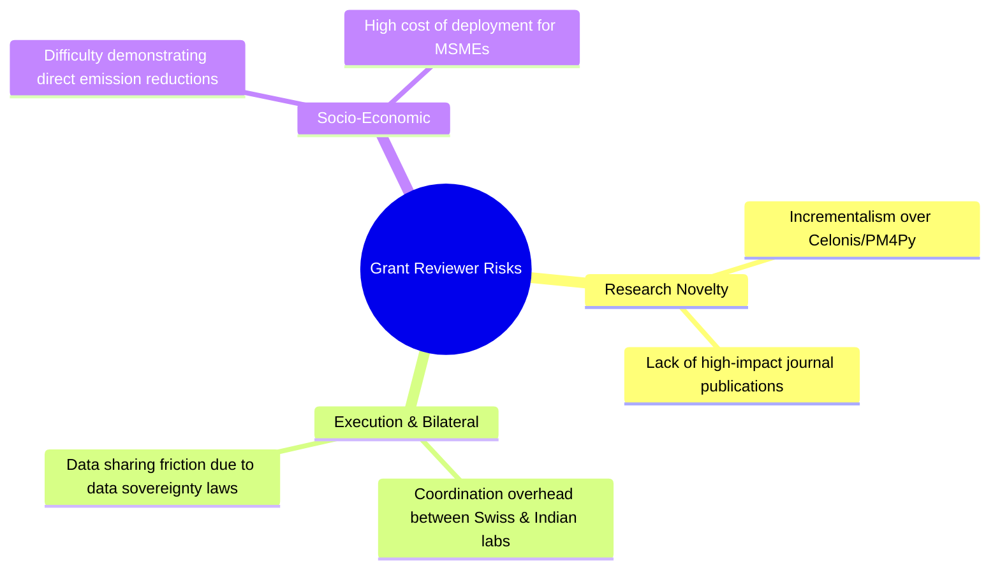

# SustainOCPM — Risks & Gaps Analysis

This document provides a critical evaluation of the SustainOCPM platform. It challenges the project's core assumptions, technical feasibility, research novelty, and market viability. The analysis is structured from five distinct expert perspectives to identify architectural, methodological, and commercial vulnerabilities.

---

## 1. Grant Reviewer Perspective
*Focus: Academic innovation, bilateral collaboration value, project execution, and socio-economic impact under the Indo-Swiss Joint Research Grant.*



### 1.1 Research Novelty Risks
*   **Challenge:** Grant reviewers must justify public funding for research that is distinct from existing commercial solutions. If SustainOCPM is perceived as an incremental wrapper around existing tools (e.g., Celonis or `pm4py`), it risks losing funding tranches or failing mid-term evaluations.
*   **Specific Risks:**
    *   *Risk 1.1.1 (Academic Dilution):* The integration of carbon attribution into OCPM might be seen as an application engineering problem rather than a fundamental scientific breakthrough.
    *   *Risk 1.1.2 (Methodological Overlap):* Existing academic papers have proposed basic emissions attribution in single-case process mining. The extension to object-centric mining must demonstrate novel theoretical contributions to avoid rejection by reviewers.
*   **Mitigations:**
    *   Focus research publications on the mathematical formalization of **many-to-many carbon allocation algebra** in non-linear process executions.
    *   Submit peer-reviewed papers to top-tier conferences (e.g., ICPM, CAiSE) and journals (e.g., IEEE TKDE) to validate academic contributions.

### 1.2 Research Methodology Risks
*   **Challenge:** The research relies on access to real-world industrial data from both Swiss and Indian manufacturing sites. If these sites fail to provide high-quality event logs, the empirical validation of the research model will fail.
*   **Specific Risks:**
    *   *Risk 1.2.1 (Data Incompleteness):* Manufacturing partners may provide clean event logs but omit critical carbon-relevant attributes (e.g., direct power consumption per machine, supplier transport logistics).
    *   *Risk 1.2.2 (Siloed Validation):* Algorithms developed in laboratory environments may fail to scale when applied to noisy, real-world industrial systems.
*   **Mitigations:**
    *   Establish formal Data Delivery Agreements (DDAs) with industrial partners during the first 30 days of the project.
    *   Develop synthetic OCEL generator scripts that model carbon emissions under different noise levels to test algorithms before receiving real-world data.

### 1.3 Bilateral Collaboration Risks
*   **Challenge:** Coordinating research across institutions in Switzerland (e.g., ETH Zurich, EPFL) and India (e.g., IITs) involves geographic, cultural, and administrative challenges.
*   **Specific Risks:**
    *   *Risk 1.3.1 (Sovereignty & Compliance Friction):* Transferring raw operational data from Indian manufacturing facilities to Swiss research servers can trigger legal issues under the India DPDP Act or European GDPR.
    *   *Risk 1.3.2 (Mismatched Research Goals):* Swiss teams may focus on theoretical process mining models (e.g., formal conformance metrics), while Indian teams focus on practical applications (e.g., BRSR report generation and local supply chain optimization), leading to fragmented deliverables.
*   **Mitigations:**
    *   Implement federated execution models where data remains on local servers, and only anonymized model parameters are shared.
    *   Set up a bi-weekly technical synchronization meeting and plan bi-annual researcher exchange programs.

---

## 2. Celonis Product Lead Perspective
*Focus: Commercial viability, product-market fit, user experience, and competitive positioning against process mining vendors.*

### 2.1 Product-Market Fit (PMF) Risks
*   **Challenge:** Process mining users (traditionally process analysts and IT engineers) and sustainability professionals (ESG compliance officers and CSOs) operate in separate organizational silos. A tool that combines both domains must establish clear ownership and value for both groups.
*   **Specific Risks:**
    *   *Risk 2.1.1 (Siloed Budgets):* ESG teams may lack the budget for process mining software, while operations teams may not prioritize sustainability metrics, leaving the product without a clear buying center.
    *   *Risk 2.1.2 (Actionable Gap):* Knowing that a process step generates emissions is not valuable unless operations teams have the authority and resources to modify the physical process.
*   **Mitigations:**
    *   Design separate user personas and customized dashboards: an operational efficiency view for COOs and a compliance-ready carbon ledger view for CSOs.
    *   Focus on identifying cost-saving opportunities that align with carbon reduction (e.g., reducing cycle times to lower energy usage).

### 2.2 Technical Implementation Risks
*   **Challenge:** Standard process mining engines are built around single-case notions. Moving to an object-centric, multi-relational model requires complex graph databases and query engines that are difficult to build and scale.
*   **Specific Risks:**
    *   *Risk 2.2.1 (Performance Bottlenecks):* Object-centric query engines often experience slow performance when running real-time conformance checks on multi-million event datasets.
    *   *Risk 2.2.2 (UX Complexity):* Visualizing multi-dimensional object-centric process graphs (with intersecting orders, deliveries, and machines) can lead to cluttered, hard-to-read user interfaces.
*   **Mitigations:**
    *   Implement a hybrid storage model: use a column-oriented database (like DuckDB) for rapid aggregations and a graph database for path traversal and relationship mining.
    *   Use simplified process views (such as object-specific sub-processes or interactive views) rather than showing a single, complex graph of the entire process.

### 2.3 Competitive Response Risks
*   **Challenge:** Major players like Celonis (with its Process Intelligence Graph) and SAP (with Signavio) can develop carbon-attribution features and release them to their existing customer bases.
*   **Specific Risks:**
    *   *Risk 2.3.1 (Feature Commoditization):* Established vendors can add carbon calculation plugins, making SustainOCPM's core features commodity additions to their suites.
    *   *Risk 2.3.2 (Distribution Disadvantage):* Startups face high barriers to entry when competing against established ERP vendors who package process mining directly with system licenses.
*   **Mitigations:**
    *   Differentiate by building deep integrations with local ESG frameworks, such as the Indian SEBI BRSR and Swiss/EU carbon border adjustments.
    *   Provide open-source research extensions that encourage community contributions, positioning the platform as an open alternative to proprietary ecosystems.

---

## 3. RWTH Aachen Researcher Perspective
*Focus: Theoretical rigor, mathematical validation, OCPM extensions, and process mining methodology.*

```
Traditional Process Mining (Single-Case Notion)
[Order Event 1] --> [Order Event 2] --> [Order Event 3]  (Linear path, simple carbon split)

SustainOCPM Object-Centric Model (OCEL 2.0 Many-to-Many Relation)
               +--> [Inbound Delivery 1 (CO2e Allocation)] --+
               |                                             |
[Purchase Order]                                             +--> [Batch Production (Shared Machine Energy)]
               |                                             |
               +--> [Inbound Delivery 2 (CO2e Allocation)] --+
```

### 3.1 Methodological Rigor Risks
*   **Challenge:** Carbon accounting requires clear allocation rules. In an object-centric process, events can relate to multiple objects (e.g., a single transport event moves multiple orders, items, and containers). Distributing carbon emissions across these objects without double-counting requires a formal mathematical framework.
*   **Specific Risks:**
    *   *Risk 3.1.1 (Double Counting):* Assigning the total emissions of a shared transport event to each related object artificially inflates the carbon footprint when aggregated.
    *   *Risk 3.1.2 (Arbitrary Splitting Rules):* Using simple linear heuristics (e.g., splitting transport carbon equally among items) can produce inaccurate results if items vary in weight or volume.
*   **Mitigations:**
    *   Formulate a mathematically rigorous carbon allocation algebra based on object weight, volume, and processing time.
    *   Incorporate uncertainty margins and range-bound estimates into the data model rather than presenting a single, absolute carbon value.

### 3.2 OCPM Extension Risks
*   **Challenge:** OCEL 2.0 defines relationships between events and objects, but does not natively model resource constraints like energy grids, utility lines, or local emissions factors.
*   **Specific Risks:**
    *   *Risk 3.2.1 (Schema Limitations):* Attempting to store environmental variables (like hourly grid emissions factors or seasonal water usage) directly in standard OCEL 2.0 schemas can lead to overly complex event attributes.
    *   *Risk 3.2.2 (Conformance Gaps):* Traditional alignment algorithms do not evaluate environmental compliance, such as verifying if a process path violated a localized daily emissions limit.
*   **Mitigations:**
    *   Design a dual-graph schema that links the standard OCEL 2.0 event-object graph with an environmental context graph.
    *   Extend conformance checking algorithms to include cost and resource-constrained alignments (e.g., multi-objective optimization models).

### 3.3 Evaluation Risks
*   **Challenge:** Validating process mining research requires comparing outcomes against baseline standards. Since object-centric carbon attribution is a new domain, there are no established benchmark datasets.
*   **Specific Risks:**
    *   *Risk 3.3.1 (Self-Referential Validation):* Evaluating algorithms using our own synthetic logs or pilot datasets can introduce confirmation bias.
    *   *Risk 3.3.2 (Replicability Barriers):* Industrial partners may restrict the publication of validation datasets due to trade secrets, preventing other researchers from replicating our findings.
*   **Mitigations:**
    *   Create and release an anonymized, public benchmark OCEL 2.0 log dataset containing realistic carbon attributes.
    *   Verify the platform's outputs against established third-party life cycle assessment (LCA) tools like SimaPro or openLCA.

---

## 4. Palantir Architect Perspective
*Focus: Data integration, ontology design, platform scalability, pipeline reliability, and AI safety.*

### 4.1 Scalability Risks
*   **Challenge:** Processing object-centric logs requires managing complex graph traversals. Combining this with real-time IoT energy monitoring data can lead to performance bottlenecks.
*   **Specific Risks:**
    *   *Risk 4.1.1 (Join Explosion):* Querying multi-relational graphs across millions of events can lead to exponential join complexity, causing out-of-memory errors in standard relational databases.
    *   *Risk 4.1.2 (Pipeline Lag):* Real-time stream processing engines can struggle to match inbound events with existing object histories, causing delays in generating dashboard metrics.
*   **Mitigations:**
    *   Use a distributed query engine (like Apache Spark or DuckDB) to run analytics asynchronously, separating reporting queries from the transactional database.
    *   Materialize and pre-aggregate relationship graphs for common query paths.

### 4.2 Data Quality Risks
*   **Challenge:** ERP data is often incomplete, showing inconsistent records like missing timestamps, manual overrides, or unlinked document tables.
*   **Specific Risks:**
    *   *Risk 4.2.1 (Broken Lineage):* If an ERP system fails to link a purchase order to its delivery receipt, the platform cannot calculate the associated Scope 3 logistics emissions.
    *   *Risk 4.2.2 (Garbage In, Garbage Out):* Incorrectly entered activity inputs (e.g., entering fuel usage in gallons instead of liters) can lead to highly inaccurate emissions calculations.
*   **Mitigations:**
    *   Include a data-cleaning and verification layer in the ingestion pipeline to identify and flag inconsistencies before processing the logs.
    *   Use probabilistic mapping to estimate missing relations, clearly marking these values as estimates in the user interface.

### 4.3 Integration Risks
*   **Challenge:** Connecting to legacy ERP platforms (like SAP ECC or on-premises Oracle databases) often requires custom database configurations and approvals from client IT security departments.
*   **Specific Risks:**
    *   *Risk 4.3.1 (Integration Delays):* Enterprise IT security reviews can delay data integration tasks by 6 to 12 months.
    *   *Risk 4.3.2 (High Maintenance Costs):* Changes to a client's internal ERP schemas can break existing ingestion pipelines, requiring frequent maintenance.
*   **Mitigations:**
    *   Develop a library of pre-packaged SQL and RFC templates for common ERP modules (e.g., SAP MM, PP, SD).
    *   Provide a secure, file-based ingestion portal where clients can upload exported CSV/JSON logs without requiring direct database connections.

### 4.4 AI Copilot & Agent Risks
*   **Challenge:** LLM-based assistants can generate incorrect information or hallucinate facts. Relying on an AI to interpret carbon data or suggest process changes can introduce operational risks.
*   **Specific Risks:**
    *   *Risk 4.4.1 (Calculation Errors):* LLMs can misinterpret complex formulas, resulting in inaccurate emissions reports.
    *   *Risk 4.4.2 (Hallucinated Root Causes):* The AI Copilot might suggest incorrect reasons for a process bottleneck, leading teams to make ineffective changes.
*   **Mitigations:**
    *   Use LLMs only for natural language summarization and query translation, executing all math calculations in the structured query engine.
    *   Implement a retrieval-augmented generation (RAG) system that restricts the Copilot's answers to validated documentation and verified execution histories.

---

## 5. Enterprise CTO Perspective
*Focus: Security, compliance, vendor lock-in, total cost of ownership (TCO), and implementation overhead.*

### 5.1 Adoption & Friction Risks
*   **Challenge:** Business teams are often resistant to adopting new software platforms, especially when they require changes to daily operational workflows.
*   **Specific Risks:**
    *   *Risk 5.1.1 (Alert Fatigue):* Setting too many process compliance alerts can lead to users ignoring notifications, reducing the platform's effectiveness.
    *   *Risk 5.1.2 (Onboarding Overhead):* If the tool requires users to manually clean data and define complex process relationships, adoption rates will remain low.
*   **Mitigations:**
    *   Build templates and auto-discovery algorithms that automatically suggest initial process models and configurations.
    *   Implement smart notification routing to ensure users receive only high-priority, actionable alerts.

### 5.2 Security & Compliance Risks
*   **Challenge:** Processing core transactional logs requires the platform to access sensitive intellectual property, customer data, and operational financial records.
*   **Specific Risks:**
    *   *Risk 5.2.1 (Data Leakage):* Storing data from multiple clients in a shared database can lead to data leaks if tenant isolation rules are misconfigured.
    *   *Risk 5.2.2 (Regulatory Violations):* Storing operational data across regions can violate local privacy laws, such as the EU GDPR or the India DPDP Act.
*   **Mitigations:**
    *   Conduct annual, independent SOC 2 Type II security audits of the cloud platform.
    *   Support tenant-managed encryption keys and provide options for on-premises deployment in highly regulated sectors.

### 5.3 Vendor Lock-In Risks
*   **Challenge:** Enterprises are hesitant to adopt platforms that lock their data into proprietary formats, making it difficult to switch vendors in the future.
*   **Specific Risks:**
    *   *Risk 5.3.1 (Proprietary Lock-in):* If the platform uses proprietary schemas for process models and simulation rules, clients cannot easily export their configurations to other tools.
    *   *Risk 5.3.2 (Integration Dependencies):* Deeply integrating the platform's automated workflows with internal ERP systems can make it difficult to deprecate the software.
*   **Mitigations:**
    *   Standardize all core data models on the open-source OCEL 2.0 format.
    *   Export all custom models and conformance rules in standardized formats like BPMN 2.0 or DMN.

### 5.4 Cost Risks
*   **Challenge:** Running graph databases and distributed queries can result in high cloud infrastructure bills, reducing the platform's profitability.
*   **Specific Risks:**
    *   *Risk 5.4.1 (High Infrastructure Costs):* Complex query executions can lead to high monthly cloud hosting costs.
    *   *Risk 5.4.2 (Licensing Cost Pressures):* Mid-market clients may find the software's price tag hard to justify unless they can point to immediate, quantifiable cost savings.
*   **Mitigations:**
    *   Optimize query execution plans and use serverless computing models to scale database resources dynamically based on demand.
    *   Provide clear ROI metrics on the dashboard, demonstrating the direct financial savings generated by process optimizations.

---

## 6. Consolidated Risk Matrix

| Risk ID | Category | Description | Prob | Imp | Severity | Mitigation Strategy | Owner |
| :--- | :--- | :--- | :---: | :---: | :---: | :--- | :--- |
| **RM-01** | Research | Lack of academic novelty over basic OCPM and single-case emissions models. | M | H | **High** | Focus on many-to-many allocation math and publish in peer-reviewed journals. | Principal Investigator |
| **RM-02** | Data | Industrial partners fail to provide clean, complete OCEL logs. | H | H | **Critical** | Sign formal Data Delivery Agreements with partners within the first 30 days. | Project Manager |
| **RM-03** | Compliance | Ingress/egress of data violates cross-border data protection laws (GDPR, DPDP). | M | H | **High** | Build federated execution nodes; keep processing local to the region. | Chief Security Officer |
| **RM-04** | PMF | ESG and Operations departments operate in silos, causing budget conflicts. | H | M | **High** | Create distinct dashboards for operational savings and ESG compliance. | Product Director |
| **RM-05** | Technical | Object-centric graph queries cause high response latency. | H | H | **Critical** | Implement a hybrid storage engine using DuckDB for analytical queries. | Chief Architect |
| **RM-06** | UX | Complex process graphs confuse business users. | H | M | **High** | Use simplified sub-process views and interactive visual filters. | UX Design Lead |
| **RM-07** | Competition | Major vendor (e.g., Celonis) adds carbon-attribution features to their suite. | H | H | **Critical** | Differentiate by integrating with specific regional reporting frameworks. | Product Director |
| **RM-08** | Math | Double-counting carbon emissions during object splits and merges. | M | H | **High** | Develop a mathematically sound carbon allocation algebra. | Lead Researcher |
| **RM-09** | Schema | OCEL 2.0 schema lacks native support for environmental variables. | M | M | **Medium** | Design a dual-graph system that links event logs with environmental context. | Chief Architect |
| **RM-10** | Validation | Lack of baseline datasets for object-centric carbon accounting. | M | M | **Medium** | Build and release an anonymized, public benchmark OCEL 2.0 dataset. | Lead Researcher |
| **RM-11** | Scale | Graph queries crash databases during peak periods. | M | H | **High** | Materialize common query paths and scale database resources dynamically. | DevOps Lead |
| **RM-12** | Data Quality | Broken document links in client ERP systems prevent emissions calculations. | H | M | **High** | Implement a data cleaning layer that flags issues during ingestion. | Data Engineer |
| **RM-13** | Integration | Long security review processes delay ERP data integration. | H | M | **High** | Build pre-packaged SQL extraction templates for standard ERP modules. | Integration Lead |
| **RM-14** | AI Security | AI Copilot hallucinates calculation steps or root cause analyses. | M | H | **High** | Restrict LLM to text generation, running math calculations in SQL. | AI Research Lead |
| **RM-15** | Adoption | Users experience alert fatigue from too many non-critical alerts. | H | M | **High** | Build smart routing workflows to filter out low-priority alerts. | Product Manager |
| **RM-16** | Security | Multi-tenant tenant leak exposes confidential manufacturing data. | L | H | **High** | Undergo annual SOC 2 Type II audits and encrypt data at rest. | Chief Security Officer |
| **RM-17** | Lock-In | Proprietary file formats make it difficult for users to export data. | M | M | **Medium** | Standardize core storage and export logic on the open OCEL 2.0 format. | Chief Architect |
| **RM-18** | Cost | High hosting costs for running graph queries reduce margins. | M | M | **Medium** | Use serverless execution models and optimize database index structures. | DevOps Lead |
| **RM-19** | Team | Lack of personnel who understand both process mining and ESG. | H | M | **High** | Run internal cross-training sessions on process mining and ESG. | Project Manager |
| **RM-20** | Financial | Grant funding delays disrupt platform development schedules. | M | H | **High** | Keep a 3-month operating cash reserve and build commercial pipelines. | Finance Director |
| **RM-21** | Scope | Expanding project scope delays the core platform launch. | H | M | **High** | Define a strict MVP feature set and use a formal change request process. | Product Director |
| **RM-22** | Support | Technical team cannot handle enterprise customer support requests. | M | M | **Medium** | Build a customer self-service center and set up support ticketing. | Support Lead |
| **RM-23** | API | Inconsistent API updates break customer workflows. | M | M | **Medium** | Adopt strict API versioning rules and write automated regression tests. | QA Lead |
| **RM-24** | Hardware | IoT telemetry systems experience hardware connection failures. | H | L | **Medium** | Implement data caching on edge devices to preserve offline metrics. | IoT Architect |
| **RM-25** | Policy | Changes in global ESG standards make existing reports obsolete. | M | H | **High** | Design flexible compliance templates that can be updated dynamically. | Compliance Officer |
| **RM-26** | Audit | Auditors reject the platform's carbon calculation methodologies. | M | H | **High** | Validate the platform's calculations with third-party certification bodies. | Compliance Officer |
| **RM-27** | Customization | High demand for custom features slows core development. | H | M | **High** | Build a flexible plugin framework to support custom requirements. | Chief Architect |
| **RM-28** | Performance | High latency when loading complex analytical dashboards. | M | M | **Medium** | Pre-compute and cache dashboard widgets in Redis. | Frontend Lead |
| **RM-29** | Ingestion | Database ingestion queues clog during high-volume periods. | M | M | **Medium** | Implement rate limiting and use message queues to buffer data. | Data Engineer |
| **RM-30** | License | Research partners use free licensing tiers for commercial work. | M | L | **Low** | Include automated usage tracking in the academic license tier. | Legal Counsel |

---

## 7. Gap Analysis

We have identified critical gaps across four areas that must be resolved to successfully launch the platform.

```
       Identified Gaps & Targeted Resolutions
+--------------------------------------------------------+
| 1. Technical Gaps                                      |
|    - Lack of real-time OCEL 2.0 ingestion engines      |
|    - High resource cost of multi-relational queries   |
+--------------------------------------------------------+
                           |
+--------------------------------------------------------+
| 2. Methodological Gaps                                 |
|    - No standardized many-to-many carbon split math    |
|    - Lack of verified process-level emissions data     |
+--------------------------------------------------------+
                           |
+--------------------------------------------------------+
| 3. Market Gaps                                         |
|    - Separated budgets for operations and ESG teams    |
|    - Compliance reporting seen as a check-box exercise|
+--------------------------------------------------------+
                           |
+--------------------------------------------------------+
| 4. Team Gaps                                           |
|    - Shortage of engineers with OCPM and ESG expertise |
|    - Need for specialized enterprise SaaS developers   |
+--------------------------------------------------------+
```

### 7.1 Technical Gaps
1.  *Real-Time OCEL Ingestion:* Current process mining libraries (such as `pm4py`) are built to process static file exports. There are no open-source, production-ready engines designed to ingest and query OCEL 2.0 logs in real time.
2.  *High Resource Cost:* Relational database joins on multi-relational graphs are slow. Standard SQL engines cannot run execution path queries across millions of events quickly enough for interactive dashboards.
3.  *ERP Ingestion Templates:* Mapping raw data tables from systems like SAP to the OCEL 2.0 format is currently a manual, time-consuming process.

### 7.2 Methodological Gaps
1.  *Allocation Formulas:* There is no standard, widely accepted mathematical framework for allocating Scope 3 transport emissions across multiple, shared shipping objects in a process graph.
2.  *Process-Level Emission Records:* Existing databases (such as Ecoinvent) provide emissions factors for raw materials but lack data profiles for specific, step-by-step manufacturing actions.
3.  *Conformance Measurement:* Traditional conformance checking metrics do not account for environmental limits or multi-objective trade-offs.

### 7.3 Market Gaps
1.  *Siloed Buying Teams:* Purchasing budgets for sustainability and operations are managed separately, which makes it difficult to establish a single, clear buyer for the platform.
2.  *Regulatory Compliance Focus:* Most enterprises view carbon accounting as a reporting compliance exercise rather than an opportunity to optimize daily operational processes.
3.  *Unproven ROI:* There are few published case studies demonstrating the direct financial savings of using process mining to reduce carbon footprints.

### 7.4 Team Gaps
1.  *Cross-Domain Expertise:* It is difficult to recruit researchers who understand both advanced object-centric process mining and environmental science.
2.  *SaaS Software Engineering:* Academic research labs often lack engineers with experience building secure, multi-tenant SaaS applications at scale.
3.  *Sales & Marketing Experience:* The core team lacks enterprise sales professionals experienced in selling process mining software to multinational companies.

---

## 8. Recommendations

The following actions are recommended to address the identified risks and gaps over a 12-month timeline.

### Immediate Actions (Next 30 Days)
*   **Establish Allocation Formulas:** Formulate the mathematical framework for allocating emissions across shared object paths to prevent double-counting.
*   **Formalize Data Agreements:** Sign Data Delivery Agreements (DDAs) with pilot partners to secure access to manufacturing data.
*   **Finalize DB Architecture:** Select the core database engine (e.g., DuckDB + PostgreSQL) to handle both analytical queries and tenant storage.
*   **Design Pilot Schema:** Define the initial OCEL 2.0 database schema, specifying key event and object attributes for carbon tracking.

### Short-Term Actions (Next 90 Days)
*   **Build SaaS Prototype:** Launch a basic multi-tenant version of the platform with isolated data access controls.
*   **Develop ERP Connectors:** Build standard SQL scripts to extract and map data from common ERP modules (e.g., SAP purchasing and inventory tables).
*   **Deploy AI Security Safeguards:** Set up validation layers to prevent the AI Copilot from hallucinating calculations.
*   **Establish Academic Program:** Launch the free research tier to encourage academic citations and community validation.

### Medium-Term Actions (6 Months)
*   **Optimize Query Engine:** Implement query caching and performance optimization steps to speed up dashboard response times.
*   **Verify Calculations:** Validate the platform's carbon models with third-party environmental auditing firms.
*   **Launch Scenario Simulator:** Release the first version of the simulation engine, allowing users to model the impact of operational changes on emissions.
*   **Conduct Security Review:** Perform an external security assessment of the SaaS infrastructure to prepare for future compliance certifications.

### Long-Term Actions (12 Months)
*   **Prepare for SOC 2 Certification:** Complete the audit preparation steps and initiate the SOC 2 Type II certification process.
*   **Scale Partner Program:** Build formal referral and integration partnerships with regional consulting firms and system integrators.
*   **Publish Validation Study:** Publish a detailed case study documenting the carbon and cost savings achieved during the pilot deployments.
*   **Deploy Workflow Automations:** Release the workflow automation features, enabling the platform to trigger corrective actions in client ERP systems automatically.

---

> [!WARNING]
> Failing to address the database query latency and carbon allocation risks in the early stages of development will delay subsequent pilot deployments and affect core platform scalability.
