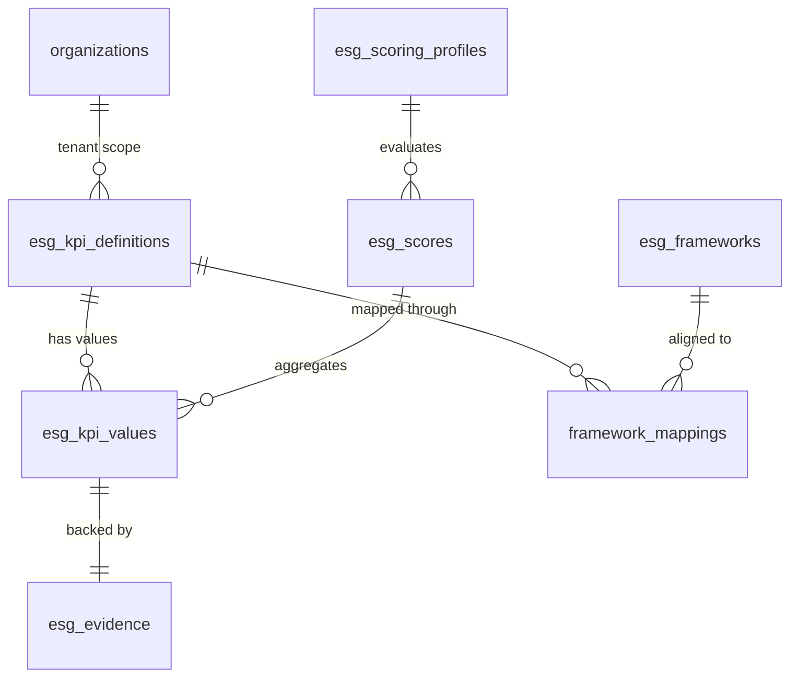
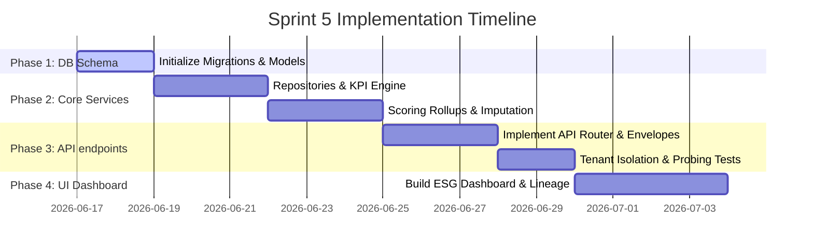

# Implementation Plan — Sprint 5: ESG Intelligence

This plan details the design, architecture additions, database updates, API contracts, services, and implementation phases required to build the **ESG Intelligence** module for SustainOCPM.

---

## 1. Executive Summary

Sprint 5 establishes the foundation for ESG reporting and scoring within the SustainOCPM platform. By extracting carbon metrics and process performance indicators from daily operations, the module aggregates environmental impact alongside social and governance metadata. This plan ensures every reported score is backed by transaction-level evidence, verifiable lineage, and mapped directly to regulatory frameworks, primarily India's **Business Responsibility and Sustainability Reporting (BRSR)**.

---

## 2. Dependencies on Sprints 1–4

The ESG Intelligence module is built on top of the existing platform foundations:
1.  **Multi-Tenant Scoping (Sprint 1/Hardening)**: All tables will contain a `tenant_id` column and enforce isolation. Cross-tenant UUID probing will return 404.
2.  **Authentication & RBAC (Sprint 1)**: API endpoints will utilize `get_current_active_user` and verify roles (e.g., only `Admin` or `Manager` can update scoring weight profiles).
3.  **Process Discovery & Metrics (Sprint 3)**: Process throughput times and frequencies serve as operational efficiency baselines.
4.  **Carbon Attribution Engine (Sprint 4)**: Process-specific Scope 1, Scope 2, and Scope 3 emissions feed directly into Environmental KPIs.

---

## 3. Database additions

To persist definitions, scores, weights, and audit trails, we introduce six new database entities.

### 3.1 Entity Relationship Diagram (Conceptual)



### 3.2 Schema Table Definitions

#### `esg_kpi_definitions`
Stores definition configurations for all tracked ESG metrics with full version control.
*   `id`: `UUID` (Primary Key, Default: uuid4)
*   `tenant_id`: `UUID` (Foreign Key -> `organizations.id`, ondelete="CASCADE", nullable=False, index=True)
*   `kpi_code`: `String` (Unique code, e.g., "ENV-CO2-S1", index=True, nullable=False)
*   `version`: `Integer` (Default: 1, nullable=False)
*   `name`: `String` (nullable=False)
*   `category`: `String` (e.g., "Environmental", "Social", "Governance", index=True, nullable=False)
*   `description`: `String` (nullable=True)
*   `unit`: `String` (e.g., "tCO2e", "KL", "%", "Count", nullable=False)
*   `source_type`: `String` (e.g., "automated_process", "manual_entry", "external_api", nullable=False)
*   `calculation_method`: `JSON` (Details formulas or extraction rules, nullable=True)
*   `effective_from`: `DateTime` (nullable=False)
*   `effective_to`: `DateTime` (nullable=True)
*   `is_active`: `Boolean` (Default: True, nullable=False)
*   `parent_kpi_id`: `UUID` (Foreign Key -> `esg_kpi_definitions.id`, ondelete="SET NULL", nullable=True)
*   `created_at`: `DateTime` (Default: utcnow, nullable=False)

#### `esg_kpi_values`
Stores values computed or recorded for a specific versioned KPI over a reporting period.
*   `id`: `UUID` (Primary Key, Default: uuid4)
*   `kpi_definition_id`: `UUID` (Foreign Key -> `esg_kpi_definitions.id`, ondelete="CASCADE", nullable=False)
*   `tenant_id`: `UUID` (Foreign Key -> `organizations.id`, ondelete="CASCADE", nullable=False, index=True)
*   `workspace_id`: `UUID` (Foreign Key -> `workspaces.id`, ondelete="CASCADE", nullable=False, index=True)
*   `project_id`: `UUID` (Foreign Key -> `projects.id`, ondelete="CASCADE", nullable=True, index=True)
*   `period`: `String` (e.g., "2026", "2026-Q1", index=True, nullable=False)
*   `value`: `Float` (nullable=False)
*   `is_manual`: `Boolean` (Default: False, nullable=False)
*   `calculated_at`: `DateTime` (Default: utcnow, nullable=False)
*   `recorded_by`: `UUID` (Foreign Key -> `users.id`, ondelete="SET NULL", nullable=True)

#### `esg_frameworks`
Stores compliance framework catalog meta parameters.
*   `id`: `UUID` (Primary Key, Default: uuid4)
*   `framework_name`: `String` (e.g., "BRSR", "GRI", "SASB", unique, nullable=False)
*   `framework_version`: `String` (e.g., "2024-V2", nullable=False)
*   `description`: `String` (nullable=True)
*   `created_at`: `DateTime` (Default: utcnow, nullable=False)

#### `framework_mappings`
Maps versioned ESG KPIs to corresponding sections and criteria of global frameworks.
*   `id`: `UUID` (Primary Key, Default: uuid4)
*   `framework_id`: `UUID` (Foreign Key -> `esg_frameworks.id`, ondelete="CASCADE", nullable=False)
*   `kpi_definition_id`: `UUID` (Foreign Key -> `esg_kpi_definitions.id`, ondelete="CASCADE", nullable=False)
*   `framework_section`: `String` (e.g., "Section C", index=True, nullable=False)
*   `framework_principle`: `String` (e.g., "Principle 6", index=True, nullable=True)
*   `framework_question`: `String` (e.g., "Essential-Q5", nullable=False)
*   `reporting_category`: `String` (e.g., "Essential Indicators", "Leadership Indicators", nullable=False)
*   `created_at`: `DateTime` (Default: utcnow, nullable=False)

#### `esg_scoring_profiles`
Maintains weight profiles used to roll up KPI metrics into composite ESG scores.
*   `id`: `UUID` (Primary Key, Default: uuid4)
*   `tenant_id`: `UUID` (Foreign Key -> `organizations.id`, ondelete="CASCADE", nullable=False, index=True)
*   `name`: `String` (e.g., "Manufacturing Standard", nullable=False)
*   `environmental_weight`: `Float` (Default: 0.40, nullable=False)
*   `social_weight`: `Float` (Default: 0.30, nullable=False)
*   `governance_weight`: `Float` (Default: 0.30, nullable=False)
*   `kpi_weights`: `JSON` (Map of KPI codes to their relative weight within category, nullable=False)
*   `is_active`: `Boolean` (Default: True, nullable=False)
*   `created_at`: `DateTime` (Default: utcnow, nullable=False)

#### `esg_scores`
Stores aggregated category and overall scoring outputs referencing specific versions.
*   `id`: `UUID` (Primary Key, Default: uuid4)
*   `tenant_id`: `UUID` (Foreign Key -> `organizations.id`, ondelete="CASCADE", nullable=False, index=True)
*   `workspace_id`: `UUID` (Foreign Key -> `workspaces.id`, ondelete="CASCADE", nullable=False, index=True)
*   `period`: `String` (index=True, nullable=False)
*   `scoring_profile_id`: `UUID` (Foreign Key -> `esg_scoring_profiles.id`, ondelete="RESTRICT", nullable=False)
*   `overall_score`: `Float` (Scale: 0-100, nullable=False)
*   `environmental_score`: `Float` (Scale: 0-100, nullable=False)
*   `social_score`: `Float` (Scale: 0-100, nullable=False)
*   `governance_score`: `Float` (Scale: 0-100, nullable=False)
*   `completeness_score`: `Float` (Percentage of variables with active data, nullable=False)
*   `calculated_at`: `DateTime` (Default: utcnow, nullable=False)

#### `esg_evidence`
Maintains cryptographic data integrity logs, source targets, lineage paths, and calculation details.
*   `id`: `UUID` (Primary Key, Default: uuid4)
*   `kpi_value_id`: `UUID` (Foreign Key -> `esg_kpi_values.id`, ondelete="CASCADE", nullable=False, index=True)
*   `tenant_id`: `UUID` (Foreign Key -> `organizations.id`, ondelete="CASCADE", nullable=False)
*   `source_description`: `String` (nullable=False)
*   `source_entity_type`: `String` (Constraints: "dataset", "process_analysis", "process_model", "conformance_result", "carbon_attribution", "manual_upload", "external_api", nullable=False)
*   `source_entity_id`: `UUID` (Target entity reference, nullable=True)
*   `evidence_file_path`: `String` (Reference to object storage location, nullable=True)
*   `cryptographic_hash`: `String` (SHA-256 validation checksum of source data, nullable=True)
*   `calculation_steps`: `JSON` (Logs intermediate variables and formulas, nullable=False)
*   `lineage_path`: `JSON` (JSON tracking path of data derivation, nullable=False)
*   `audited_by`: `UUID` (Foreign Key -> `users.id`, ondelete="SET NULL", nullable=True)
*   `audited_at`: `DateTime` (nullable=True)

---

## 4. API additions

All endpoints will return standard enveloped envelopes (`StandardSuccessEnvelope` / resource models) and run tenant check scopes.

### 4.1 KPI Definitions & Values
*   `GET /api/esg/kpi-definitions`
    *   **Description**: Get all active ESG KPI catalog definitions for the current tenant.
*   `POST /api/esg/kpi-definitions`
    *   **Description**: Define a new tenant-specific ESG KPI.
*   `GET /api/esg/kpi-values`
    *   **Description**: Retrieve calculated or entered values for active KPIs, filtered by `workspace_id` and `period`.
*   `POST /api/esg/kpi-values`
    *   **Description**: Submit or overwrite a specific KPI value (manually or via API integration).

### 4.2 Scoring & Weight Profiles
*   `GET /api/esg/scoring-profiles`
    *   **Description**: Fetch weighting configs configured for the tenant.
*   `POST /api/esg/scoring-profiles`
    *   **Description**: Save a new category and KPI weight distribution.
*   `GET /api/esg/scores`
    *   **Description**: Retrieve environmental, social, governance, and overall rolled-up scores.
*   `POST /api/esg/scores/calculate`
    *   **Description**: Trigger calculation rollup engine for a specific workspace and period.

### 4.3 Auditing & Traceability
*   `GET /api/esg/evidence/{kpi_value_id}`
    *   **Description**: Get lineage records, intermediate steps, and SHA-256 verification hashes for a score.
*   `POST /api/esg/evidence/{kpi_value_id}/attach`
    *   **Description**: Upload evidence document (utility invoices, logs) backing the value.

### 4.4 Framework Mapping
*   `GET /api/esg/framework-mappings`
    *   **Description**: Get mappings connecting catalog KPIs to global framework criteria (initially seeded for BRSR).

---

## 5. Repository additions

Four repositories will be added under `backend/app/repositories/`:
1.  **`esg_kpi_repository.py`**: Handles querying definitions, fetching periodic value series, and bulk importing calculated results.
2.  **`esg_profile_repository.py`**: Manages CRUD for tenant scoring profiles and active flags.
3.  **`esg_score_repository.py`**: Persists aggregated scores.
4.  **`esg_evidence_repository.py`**: Manages storage of audits, calculations payloads, and checksum verification keys.

---

## 6. Service additions

Three services will implement the core business logic under `backend/app/services/`:

### 6.1 `esg_kpi_service.py`
*   **Resolve KPI Values**: Pulls Carbon Engine calculations (Scope 1, 2, 3), merges them with other event counts (e.g., total waste log entries), and stores the aggregated metric.
*   **Manual Submissions**: Validates format constraints before storing manually entered values.

### 6.2 `esg_scoring_service.py`
*   **Normalization**: Converts raw KPI metrics to a normalized `0.0 - 100.0` score using linear scaling against min/max targets.
*   **Weight Rollup**:
    $$\text{Category Score} = \frac{\sum (\text{KPI Score}_i \cdot \text{Weight}_i)}{\sum \text{Weights}}$$
    $$\text{Overall ESG Score} = (E_{\text{score}} \cdot E_{\text{weight}}) + (S_{\text{score}} \cdot S_{\text{weight}}) + (G_{\text{score}} \cdot G_{\text{weight}})$$
*   **Missing-Data Penalty Handling**:
    *   If data is missing: Imputes using historic workspace periods (optional) or applies a flat 15% completeness penalty, scaling down the overall score to maintain audit compliance.

### 6.3 `esg_evidence_service.py`
*   **Compute Data Lineage**: Logs the intermediate variables used (e.g., grid emission coefficient used to derive Scope 2 carbon before saving it as an E-KPI).
*   **Integrity Checks**: Generates SHA-256 hashes of the evidence files and database values to assure audit integrity.

---

## 7. Frontend additions

We will introduce a single dashboard workspace page `/dashboard/esg/page.tsx` and integrate it with the main routing.

### 7.1 Page Layout Zone Mapping

```
+---------------------------------------------------------------------------------+
| ESG Intelligence Dashboard                                   [Profile Selector] |
+---------------------------------------------------------------------------------+
| +-----------------------------------------------------------------------------+ |
| | Overall ESG Score: 78.4% | E Score: 81.2% | S Score: 72.0% | G Score: 85.0% | |
| +-----------------------------------------------------------------------------+ |
| +-------------------------------------+ +-------------------------------------+ |
| | ESG KPI Catalog                     | | BRSR Alignment & Mapping            | |
| | - Env: Scope 1 (tCO2e)  [Calculated]| | - ENV-CO2-S1 -> Section C, P6       | |
| | - Soc: Diverse Ratio %  [Manual]    | | - SOC-DIV-GE -> Section A, Q14      | |
| | - Gov: Breach Count     [Manual]    | | - GOV-ANTI-T  -> Section C, P1       | |
| +-------------------------------------+ +-------------------------------------+ |
| +-----------------------------------------------------------------------------+ |
| | Verification & Lineage Drawer (Details for selected metric)                 | |
| | Calculation Traceability: Emissions = Sum(Activity.Emissions)               | |
| | Checksum Hash: e3b0c44298fc1c149afbf4c8996fb92427ae41e4649b934ca495991b7852b  | |
| | Evidence Attachment: [Download UtilityBill_Q1.pdf]                        | |
| +-----------------------------------------------------------------------------+ |
+---------------------------------------------------------------------------------+
```

### 7.2 UI Interaction Elements
1.  **Metric Cards**: Displaying Overall ESG and category scores with color indicators (Green: $\ge 80$, Yellow: $50-79$, Red: $<50$).
2.  **Scoring Config Panel**: Weight sliders for E, S, and G categories. Weights are validated to ensure they sum to exactly 100%.
3.  **Traceability Panel**: Clickable drawer dynamically pulling data lineage records and verification hashes for active KPI values.

---

## 8. Validation & Audit Requirements

1.  **Weight Validation**:
    *   API and frontend validation ensuring:
        $$E_{\text{weight}} + S_{\text{weight}} + G_{\text{weight}} == 1.0$$
    *   Individual relative weights within category must sum to exactly 1.0.
2.  **Audit Logs**:
    *   Any manual update to a KPI value, upload of an evidence document, or change to a scoring profile must be written to `audit_logs` table via `AuditLog` core service (Sprint 1).
3.  **Cross-Tenant Isolation**:
    *   All queries to definitions, values, weight profiles, and scores must inject `tenant_id` from the auth session.
    *   Attempts to request resource IDs belonging to other tenants will trigger a generic `404 Not Found`.

---

## 9. Implementation Phases



### Phase 1: DB & Model Initialization (Days 1–2)
*   Define SQLAlchemy models in `backend/app/models/models.py`.
*   Generate and execute Alembic migrations.
*   Verify SQLite/PostgreSQL compatibility of schema modifications.

### Phase 2: Repository & Services Foundation (Days 3–8)
*   Implement `esg_kpi_repository.py`, `esg_profile_repository.py`, `esg_score_repository.py`, and `esg_evidence_repository.py`.
*   Build `esg_kpi_service.py` to aggregate Scope 1/2/3 data from Carbon Attribution results.
*   Build `esg_scoring_service.py` with standard normalization and missing-data penalties.

### Phase 3: API & Security Validation (Days 9–13)
*   Add routers and response schemas under `backend/app/routers/` and `backend/app/schemas/`.
*   Implement integration and unit tests verifying calculations.
*   Implement security tests checking tenant isolation UUID probing.

### Phase 4: Frontend Development (Days 14–17)
*   Create `/dashboard/esg/page.tsx`.
*   Integrate API queries with response array guards.
*   Add configuration slide-outs for scoring profiles and sliders for category weight balance.

---

## 10. Risks, Blockers & Mitigations

| Risk / Blocker | Impact | Mitigation Strategy |
| :--- | :--- | :--- |
| **Missing Data Distortions** | High: Lack of social or governance records could tank the overall ESG score. | Implement clear data completeness scores and imputation policies (averages vs fixed penalties) before scoring. |
| **Verification Leakage** | Medium: Evidence documents uploaded by one tenant could be accessed by another. | Route evidence file downloads through authenticated FastAPI endpoints that verify tenant ownership of the parent KPI. |
| **SQLite Alter Constraints** | Low: Local development DB fails on foreign key migration constraints during testing. | Enforce standard SQLite migrations setup scripts using Alembic batch operations to alter schema structures dynamically. |

---

## 11. Recommended Prompt Sequence

Follow this sequence of tasks during execution:

1.  **Prompt 1 (Database Layer)**: Create the new database tables (`esg_kpi_definitions`, `esg_kpi_values`, `esg_scoring_profiles`, `esg_scores`, `esg_evidence`, `esg_frameworks`, `framework_mappings`), update `models.py`, generate the Alembic migration file, and apply it.
2.  **Prompt 2 (Repository & Core Logic)**: Implement the repository files (`esg_kpi_repository.py`, `esg_profile_repository.py`, `esg_score_repository.py`, `esg_evidence_repository.py`) and services (`esg_kpi_service.py`, `esg_scoring_service.py`, `esg_evidence_service.py`).
3.  **Prompt 3 (API Routing)**: Create Pydantic schemas in `schemas.py` and build the API router endpoints under `backend/app/routers/esg.py`.
4.  **Prompt 4 (Testing & Tenant Isolation)**: Write integration tests for calculation rules and security tests verifying cross-tenant UUID probing on all new ESG endpoints.
5.  **Prompt 5 (Frontend Layout)**: Build the `/dashboard/esg/page.tsx` file incorporating cards, tables, sliders, and the lineage traceability drawer.
